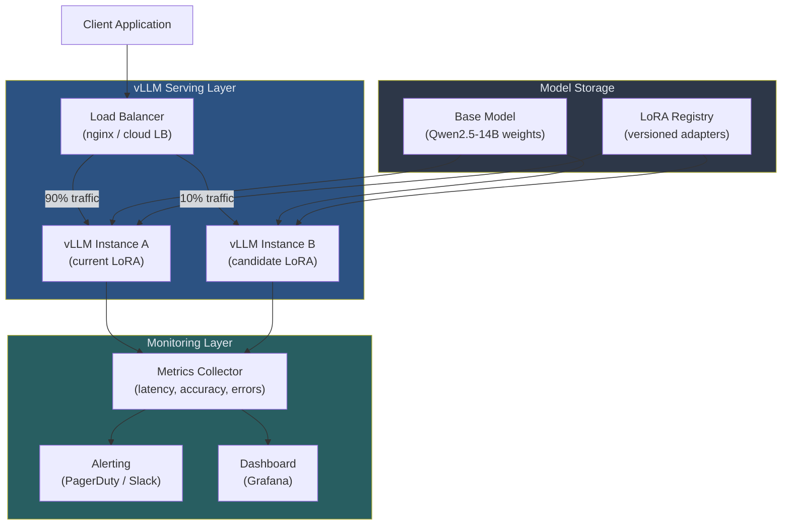
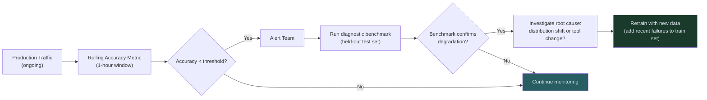

# Guide 03: Deployment Patterns — Running Trained Agents in Production

## Learning Objectives

By the end of this guide you will be able to:

1. Deploy a LoRA-adapted model using vLLM with proper production configuration
2. Monitor agent performance and detect degradation before it affects users
3. Run A/B tests between your trained model and a baseline
4. Version LoRA adapters and execute a clean rollback when needed
5. Identify when to retrain based on performance signals

---

## Production Architecture Overview



This architecture supports:
- **A/B testing** via traffic splitting at the load balancer
- **Zero-downtime rollback** by switching the LoRA adapter without restarting vLLM
- **Continuous monitoring** with automatic alerting on accuracy drops

---

## Deploying Trained LoRA Adapters

### What You Have After Training

After a GRPO training run with Unsloth and ART, you have:

```
training_output/
├── adapter_config.json          # LoRA configuration (rank, alpha, target modules)
├── adapter_model.safetensors    # Trained LoRA weights (~500MB)
├── tokenizer/                   # Tokenizer files (same as base model)
└── training_args.json           # Training configuration used
```

The base model weights are not modified. The LoRA adapter is a small set of correction matrices applied on top of the frozen base model at inference time.

### vLLM Configuration for LoRA Serving

vLLM supports LoRA adapters natively. Load the base model once and dynamically attach adapters per request.

```python
"""
vllm_server_config.py

Production vLLM configuration for serving LoRA-adapted agents.
Run this configuration file with: python vllm_server_config.py
"""

import subprocess
import sys
from pathlib import Path


BASE_MODEL = "Qwen/Qwen2.5-14B-Instruct"
LORA_ADAPTER_PATH = "./training_output/"

# vLLM launch arguments for production serving
VLLM_ARGS = [
    sys.executable, "-m", "vllm.entrypoints.openai.api_server",

    # Model configuration
    "--model", BASE_MODEL,
    "--enable-lora",
    "--lora-modules", f"qwen2.5-14b-rl={LORA_ADAPTER_PATH}",
    "--max-lora-rank", "64",

    # Serving configuration
    "--host", "0.0.0.0",
    "--port", "8000",
    "--served-model-name", "qwen2.5-14b-rl",

    # Performance configuration
    "--gpu-memory-utilization", "0.90",
    "--max-model-len", "8192",
    "--tensor-parallel-size", "1",   # Set to number of GPUs if multi-GPU
    "--max-num-seqs", "256",          # Maximum concurrent requests
    "--enable-prefix-caching",        # Cache KV for repeated system prompts

    # Quantization (optional: reduces VRAM by ~50%)
    "--quantization", "bitsandbytes",

    # Logging
    "--log-level", "info",
]


def launch_server() -> None:
    """Launch the vLLM server with production configuration."""
    print("Starting vLLM server...")
    print(f"Base model: {BASE_MODEL}")
    print(f"LoRA adapter: {LORA_ADAPTER_PATH}")
    print(f"Endpoint: http://0.0.0.0:8000/v1")
    subprocess.run(VLLM_ARGS, check=True)


if __name__ == "__main__":
    launch_server()
```

### Verifying the Deployment

```python
from openai import OpenAI

client = OpenAI(base_url="http://localhost:8000/v1", api_key="token")

# Check that the LoRA adapter is loaded
models = client.models.list()
for model in models.data:
    print(f"Available model: {model.id}")

# Run a health check query
response = client.chat.completions.create(
    model="qwen2.5-14b-rl",
    messages=[{"role": "user", "content": "How many rows are in the orders table?"}],
    max_tokens=256,
    temperature=0.0,
)
print(f"Health check response: {response.choices[0].message.content}")
print(f"Latency: logged by the server")
```

### Supported Model Families

vLLM with LoRA support works across multiple model families:

| Model Family | Recommended Size | VRAM (LoRA) | Notes |
|-------------|-----------------|-------------|-------|
| Qwen 2.5 | 7B, 14B | 24–40GB | Best ART-E results |
| Qwen 3 | 8B, 14B | 24–40GB | Latest generation, strong reasoning |
| Llama 3.x | 8B, 70B | 20–160GB | Strong community support |
| Mistral | 7B | 20GB | Good for resource-constrained deployments |
| Phi-3.5 | 3.8B | 12GB | Fits consumer GPUs |

ART framework officially supports Qwen 2.5 and Qwen 3. Llama and Mistral work via the vLLM backend but may require additional configuration adjustments.

---

## Monitoring Agent Performance in Production

Monitoring an RL-trained agent requires tracking four dimensions:

1. **Accuracy rate** — is the model still getting answers right?
2. **Tool call efficiency** — is turn count increasing (suggests degradation)?
3. **Latency** — is response time within SLA?
4. **Error rate** — are requests failing silently?

### Production Monitoring Implementation

```python
"""
agent_monitor.py

Production monitoring for RL-trained agents.
Collects metrics from live traffic and exposes them for alerting.
"""

import time
import json
import statistics
import threading
from dataclasses import dataclass, field, asdict
from collections import deque
from datetime import datetime, timezone
from pathlib import Path


@dataclass
class RequestMetrics:
    """Metrics for a single production request."""
    request_id: str
    timestamp: str
    model_version: str
    correct: bool | None         # None if not verifiable in real-time
    latency_seconds: float
    tokens_used: int
    tool_call_count: int
    error: str | None = None


class ProductionMonitor:
    """
    Rolling-window metrics collector for production agent traffic.

    Thread-safe: designed to accept concurrent writes from request handlers.
    """

    def __init__(
        self,
        window_minutes: int = 60,
        alert_fn: callable | None = None,
        accuracy_alert_threshold: float = 0.80,
        latency_alert_p95_seconds: float = 5.0,
        error_rate_alert_threshold: float = 0.05,
    ):
        """
        Args:
            window_minutes: Rolling window for metric aggregation
            alert_fn: Called with (metric_name, value, threshold) when alert fires
            accuracy_alert_threshold: Alert if accuracy drops below this
            latency_alert_p95_seconds: Alert if P95 latency exceeds this
            error_rate_alert_threshold: Alert if error rate exceeds this
        """
        self.window_seconds = window_minutes * 60
        self.alert_fn = alert_fn or self._default_alert
        self.accuracy_threshold = accuracy_alert_threshold
        self.latency_threshold = latency_alert_p95_seconds
        self.error_rate_threshold = error_rate_alert_threshold

        # Deque with maxlen provides O(1) append and automatic eviction
        self._requests: deque[RequestMetrics] = deque(maxlen=10_000)
        self._lock = threading.Lock()
        self._log_path: Path | None = None

    def configure_logging(self, log_dir: str) -> None:
        """Write raw metrics to disk for offline analysis."""
        self._log_path = Path(log_dir)
        self._log_path.mkdir(parents=True, exist_ok=True)

    def record(self, metrics: RequestMetrics) -> None:
        """Record a single request's metrics. Thread-safe."""
        with self._lock:
            self._requests.append(metrics)

        if self._log_path:
            log_file = self._log_path / f"metrics_{metrics.timestamp[:10]}.jsonl"
            with open(log_file, "a") as f:
                f.write(json.dumps(asdict(metrics)) + "\n")

        # Check alerts after every write
        self._check_alerts()

    def _recent_requests(self) -> list[RequestMetrics]:
        """Return requests within the rolling window."""
        cutoff = time.time() - self.window_seconds
        with self._lock:
            snapshot = list(self._requests)

        # Filter by timestamp (stored as ISO string)
        def within_window(r: RequestMetrics) -> bool:
            ts = datetime.fromisoformat(r.timestamp).timestamp()
            return ts >= cutoff

        return [r for r in snapshot if within_window(r)]

    def current_stats(self) -> dict:
        """Compute current rolling-window statistics."""
        recent = self._recent_requests()
        if not recent:
            return {"status": "no_data", "window_size": 0}

        total = len(recent)
        errors = [r for r in recent if r.error is not None]
        verified = [r for r in recent if r.correct is not None]
        latencies = [r.latency_seconds for r in recent if r.error is None]
        tool_counts = [r.tool_call_count for r in recent if r.error is None]

        latencies.sort()
        p95_idx = int(len(latencies) * 0.95)

        accuracy = sum(r.correct for r in verified) / len(verified) if verified else None

        return {
            "window_requests": total,
            "error_rate": len(errors) / total,
            "accuracy": accuracy,
            "accuracy_sample_size": len(verified),
            "mean_latency_seconds": round(statistics.mean(latencies), 3) if latencies else None,
            "p95_latency_seconds": round(latencies[p95_idx], 3) if latencies else None,
            "mean_tool_calls": round(statistics.mean(tool_counts), 2) if tool_counts else None,
        }

    def _check_alerts(self) -> None:
        """Check current stats against thresholds and fire alerts if needed."""
        stats = self.current_stats()
        if stats.get("status") == "no_data":
            return

        # Require at least 50 requests before alerting (avoid false alarms on cold start)
        if stats["window_requests"] < 50:
            return

        if stats["accuracy"] is not None and stats["accuracy"] < self.accuracy_threshold:
            self.alert_fn("accuracy", stats["accuracy"], self.accuracy_threshold)

        if stats["p95_latency_seconds"] is not None:
            if stats["p95_latency_seconds"] > self.latency_threshold:
                self.alert_fn("p95_latency", stats["p95_latency_seconds"], self.latency_threshold)

        if stats["error_rate"] > self.error_rate_threshold:
            self.alert_fn("error_rate", stats["error_rate"], self.error_rate_threshold)

    @staticmethod
    def _default_alert(metric: str, value: float, threshold: float) -> None:
        """Default alert: print to stdout. Replace with PagerDuty/Slack in production."""
        timestamp = datetime.now(timezone.utc).isoformat()
        print(
            f"[ALERT {timestamp}] {metric} = {value:.3f} "
            f"(threshold: {threshold:.3f})"
        )
```

### Instrumenting Your Agent

```python
# Wrap your agent calls with monitoring
monitor = ProductionMonitor(
    window_minutes=60,
    accuracy_alert_threshold=0.80,
    latency_alert_p95_seconds=3.0,
)
monitor.configure_logging("./production_logs/")

def monitored_agent_call(query: str, expected: str | None = None) -> str:
    """
    Call the production agent and record metrics.

    expected: If provided, accuracy is measured in real-time.
              Leave None if ground truth is not available at request time.
    """
    import uuid
    request_id = str(uuid.uuid4())[:8]

    start = time.perf_counter()
    tool_calls = 0
    error = None
    response = ""

    try:
        # Your actual agent call
        response, tool_calls = call_agent(query)
        tokens = estimate_tokens(query, response)
    except Exception as exc:
        error = str(exc)
        tokens = 0

    latency = time.perf_counter() - start
    correct = None
    if expected is not None and not error:
        correct = evaluate(expected, response)

    monitor.record(RequestMetrics(
        request_id=request_id,
        timestamp=datetime.now(timezone.utc).isoformat(),
        model_version="qwen2.5-14b-rl-v1",
        correct=correct,
        latency_seconds=round(latency, 3),
        tokens_used=tokens,
        tool_call_count=tool_calls,
        error=error,
    ))

    return response
```

---

## When to Retrain: Detecting Performance Degradation

RL-trained agents can degrade over time when:

1. **Data distribution shifts** — the types of queries change after deployment
2. **Tool environment changes** — schema changes, API updates, new data patterns
3. **Adapter drift** — rare; the model itself does not change, but evaluation criteria may



### Retraining Triggers

| Signal | Threshold | Action |
|--------|-----------|--------|
| Rolling accuracy drop | >5pp below baseline | Run diagnostic benchmark |
| Mean tool calls increase | >50% above post-training baseline | Investigate tool environment |
| Error rate spike | >5% of requests | Check infrastructure first |
| Benchmark accuracy drop | >3pp on held-out test | Queue retraining |

### When Not to Retrain

- **Accuracy drop is temporary** (< 30 minutes): likely a tool or database issue, not the model
- **Only a few query types are affected**: update prompts or tool definitions before retraining
- **Benchmark is stable but production metrics dip**: the production queries may have shifted outside the model's training distribution — consider updating the test set too

---

## A/B Testing: Trained vs Base Model

Before fully committing to a new model version, run an A/B test in production with real traffic.

```python
"""
ab_test_router.py

Traffic-splitting router for A/B testing LoRA adapters.
Tracks per-variant metrics for statistical comparison.
"""

import random
import hashlib
from dataclasses import dataclass


@dataclass
class Variant:
    name: str
    model_id: str          # vLLM model name to route to
    traffic_fraction: float
    endpoint: str


class ABTestRouter:
    """
    Routes requests to model variants based on configurable traffic fractions.

    Uses request-ID-based deterministic routing: the same user/query always
    goes to the same variant within a test, preventing mixing effects.
    """

    def __init__(self, variants: list[Variant], metrics: ProductionMonitor | None = None):
        total = sum(v.traffic_fraction for v in variants)
        assert abs(total - 1.0) < 1e-6, f"Traffic fractions must sum to 1.0, got {total}"
        self.variants = variants
        self.metrics = metrics

    def route(self, request_id: str) -> Variant:
        """
        Deterministically assign a request to a variant.

        Uses consistent hashing so the same request_id always maps
        to the same variant (stable over time within the test).
        """
        # Hash the request ID to a value in [0, 1)
        hash_bytes = hashlib.md5(request_id.encode()).digest()
        hash_value = int.from_bytes(hash_bytes[:4], "big") / (2 ** 32)

        cumulative = 0.0
        for variant in self.variants:
            cumulative += variant.traffic_fraction
            if hash_value < cumulative:
                return variant

        return self.variants[-1]  # Fallback (should never be reached)

    def route_random(self) -> Variant:
        """
        Randomly assign a request to a variant (use when request_id is unavailable).
        Not stable: same caller may get different variants on repeat calls.
        """
        roll = random.random()
        cumulative = 0.0
        for variant in self.variants:
            cumulative += variant.traffic_fraction
            if roll < cumulative:
                return variant
        return self.variants[-1]


# Example: 10% of traffic to new RL-trained adapter, 90% to current production
def build_ab_test() -> ABTestRouter:
    variants = [
        Variant(
            name="control",
            model_id="qwen2.5-14b-base",
            traffic_fraction=0.90,
            endpoint="http://vllm-control:8000/v1",
        ),
        Variant(
            name="treatment",
            model_id="qwen2.5-14b-rl-v2",
            traffic_fraction=0.10,
            endpoint="http://vllm-treatment:8001/v1",
        ),
    ]
    return ABTestRouter(variants)
```

### Determining Statistical Significance

Do not end an A/B test early based on preliminary results. Use this rule of thumb:

- **Minimum runtime:** 7 days (to capture day-of-week effects)
- **Minimum sample size:** 500 requests per variant
- **Effect size:** Only declare a winner if accuracy difference > 3pp (within-window noise is typically ±2pp)

```python
def is_ab_test_conclusive(
    control_correct: int,
    control_total: int,
    treatment_correct: int,
    treatment_total: int,
    min_samples: int = 500,
    min_effect_pp: float = 3.0,
) -> dict:
    """
    Determine if an A/B test has produced a conclusive result.

    Returns a dict with decision and supporting statistics.
    """
    if control_total < min_samples or treatment_total < min_samples:
        return {
            "conclusive": False,
            "reason": f"Need {min_samples} samples per variant; "
                      f"have {control_total} (control) and {treatment_total} (treatment)",
        }

    control_acc = control_correct / control_total
    treatment_acc = treatment_correct / treatment_total
    diff_pp = (treatment_acc - control_acc) * 100

    if abs(diff_pp) < min_effect_pp:
        return {
            "conclusive": False,
            "reason": f"Difference ({diff_pp:.1f}pp) is below minimum detectable effect ({min_effect_pp}pp)",
            "control_accuracy": control_acc,
            "treatment_accuracy": treatment_acc,
        }

    winner = "treatment" if diff_pp > 0 else "control"
    return {
        "conclusive": True,
        "winner": winner,
        "control_accuracy": control_acc,
        "treatment_accuracy": treatment_acc,
        "difference_pp": diff_pp,
        "recommendation": f"Promote {winner} to 100% traffic",
    }
```

---

## Model Versioning and Rollback

### Version Naming Convention

```
{model_family}-{size}-{task}-v{major}.{minor}

Examples:
  qwen2.5-14b-sql-v1.0     # First production release
  qwen2.5-14b-sql-v1.1     # Minor improvement (same base model)
  qwen2.5-14b-sql-v2.0     # New base model or major task change
```

### LoRA Registry Structure

Store adapters in a versioned directory structure:

```
lora_registry/
├── qwen2.5-14b-sql-v1.0/
│   ├── adapter_config.json
│   ├── adapter_model.safetensors
│   ├── metadata.json            # accuracy, training date, dataset version
│   └── PROMOTED                 # Empty file: marks this as promoted to production
├── qwen2.5-14b-sql-v1.1/
│   ├── adapter_config.json
│   ├── adapter_model.safetensors
│   └── metadata.json
└── qwen2.5-14b-sql-v2.0/       # In testing
    ├── adapter_config.json
    ├── adapter_model.safetensors
    └── metadata.json
```

```python
"""
lora_registry.py

Versioned registry for LoRA adapters with promotion and rollback.
"""

import json
import shutil
from pathlib import Path
from datetime import datetime, timezone


class LoRARegistry:
    """Manages versioned LoRA adapters with promotion and rollback."""

    def __init__(self, registry_dir: str):
        self.registry = Path(registry_dir)
        self.registry.mkdir(parents=True, exist_ok=True)

    def register(
        self,
        adapter_path: str,
        version: str,
        accuracy: float,
        dataset_version: str,
        notes: str = "",
    ) -> Path:
        """Register a new adapter version in the registry."""
        dest = self.registry / version
        dest.mkdir(exist_ok=False)  # Fail if version already exists

        # Copy adapter files
        for file in Path(adapter_path).iterdir():
            shutil.copy2(file, dest / file.name)

        # Write metadata
        metadata = {
            "version": version,
            "registered_at": datetime.now(timezone.utc).isoformat(),
            "accuracy": accuracy,
            "dataset_version": dataset_version,
            "notes": notes,
            "status": "candidate",  # candidate → production → retired
        }
        (dest / "metadata.json").write_text(json.dumps(metadata, indent=2))

        print(f"Registered: {version} (accuracy: {accuracy:.1%})")
        return dest

    def promote(self, version: str) -> None:
        """Promote a candidate adapter to production status."""
        adapter_dir = self.registry / version
        if not adapter_dir.exists():
            raise FileNotFoundError(f"Version not found: {version}")

        # Mark previous production as retired
        for existing in self.registry.iterdir():
            if (existing / "PROMOTED").exists():
                metadata_path = existing / "metadata.json"
                metadata = json.loads(metadata_path.read_text())
                metadata["status"] = "retired"
                metadata_path.write_text(json.dumps(metadata, indent=2))
                (existing / "PROMOTED").unlink()

        # Promote new version
        (adapter_dir / "PROMOTED").touch()
        metadata_path = adapter_dir / "metadata.json"
        metadata = json.loads(metadata_path.read_text())
        metadata["status"] = "production"
        metadata["promoted_at"] = datetime.now(timezone.utc).isoformat()
        metadata_path.write_text(json.dumps(metadata, indent=2))

        print(f"Promoted to production: {version}")

    def current_production(self) -> Path | None:
        """Return the path to the currently promoted adapter."""
        for adapter_dir in self.registry.iterdir():
            if (adapter_dir / "PROMOTED").exists():
                return adapter_dir
        return None

    def rollback(self) -> Path | None:
        """
        Roll back to the most recently retired adapter.

        Returns the path to the rolled-back adapter, or None if no retired
        adapter exists.
        """
        retired = []
        for adapter_dir in self.registry.iterdir():
            metadata_path = adapter_dir / "metadata.json"
            if not metadata_path.exists():
                continue
            metadata = json.loads(metadata_path.read_text())
            if metadata.get("status") == "retired":
                promoted_at = metadata.get("promoted_at", "")
                retired.append((promoted_at, adapter_dir, metadata["version"]))

        if not retired:
            print("No retired adapters available for rollback")
            return None

        # Most recently retired = last promoted before current
        retired.sort(reverse=True)
        _, target_dir, version = retired[0]

        self.promote(version)
        print(f"Rollback complete: now running {version}")
        return target_dir

    def list_versions(self) -> None:
        """Print a summary of all registered versions."""
        versions = []
        for adapter_dir in self.registry.iterdir():
            metadata_path = adapter_dir / "metadata.json"
            if not metadata_path.exists():
                continue
            metadata = json.loads(metadata_path.read_text())
            versions.append(metadata)

        versions.sort(key=lambda m: m.get("registered_at", ""))

        print(f"{'Version':<30} {'Status':<12} {'Accuracy':>10} {'Registered':<25}")
        print("-" * 80)
        for m in versions:
            print(
                f"{m['version']:<30} {m['status']:<12} "
                f"{m['accuracy']:>10.1%} {m['registered_at'][:19]:<25}"
            )
```

### Executing a Rollback

```python
# Normal promotion workflow
registry = LoRARegistry("./lora_registry/")

# 1. Register after training
registry.register(
    adapter_path="./training_output/",
    version="qwen2.5-14b-sql-v1.1",
    accuracy=0.96,
    dataset_version="sql_dataset_v3",
    notes="Extended training run, added 500 examples from production failures",
)

# 2. Promote to production (replaces v1.0)
registry.promote("qwen2.5-14b-sql-v1.1")

# 3. If monitoring detects degradation — rollback to v1.0 in one call
if monitor.current_stats()["accuracy"] < 0.80:
    previous = registry.rollback()
    # Then reload vLLM to point to the rolled-back adapter
    # (vLLM supports dynamic adapter loading without restart)
```

---

## Complete Deployment Checklist

Before promoting any new model version to production:

**Pre-deployment:**
- [ ] Benchmark accuracy on held-out test set (target: within 2pp of training best)
- [ ] Benchmark latency P95 (target: < 2.0 seconds)
- [ ] Run error rate check (target: < 1% on test set)
- [ ] Register adapter in LoRARegistry with metadata
- [ ] Verify rollback adapter is in registry and marked `retired`

**Deployment:**
- [ ] Start A/B test at 10% traffic to new adapter
- [ ] Monitor for 24 hours (minimum) before increasing traffic
- [ ] Check accuracy, latency, and tool_call metrics hourly
- [ ] Verify monitoring alerts are firing correctly (test with a synthetic degraded model)

**Post-deployment:**
- [ ] Promote to 100% traffic after 7-day A/B test confirms improvement
- [ ] Update model version in application configuration
- [ ] Mark previous adapter as retired in registry
- [ ] Set up retraining trigger based on production accuracy monitoring

---

## Summary

| Pattern | Purpose | Key Implementation |
|---------|---------|-------------------|
| vLLM LoRA serving | Serve trained adapter without restarting | `--enable-lora --lora-modules` |
| Production monitoring | Detect accuracy drops in real traffic | `ProductionMonitor` rolling window |
| A/B testing | Validate new versions before full rollout | `ABTestRouter` deterministic hashing |
| LoRA registry | Version and rollback adapters | `LoRARegistry.promote()` / `.rollback()` |
| Retraining trigger | Know when to retrain | Accuracy < threshold on rolling window |

---

## Course Complete

You have now built the full RL agent pipeline:

1. **Module 0:** Why SFT fails for agents; RL fundamentals
2. **Module 1:** GRPO algorithm — group sampling, relative advantage, policy updates
3. **Module 2:** ART framework — vLLM backend, Unsloth, LoRA configuration
4. **Module 3:** RULER rewards — LLM-as-judge, automatic reward generation
5. **Module 4:** MCP integration — FastMCP tool servers, agent environments
6. **Module 5:** Training loop — rollouts, trajectories, checkpoint management
7. **Module 6:** Text-to-SQL agent — end-to-end training on a real task
8. **Module 7 (this module):** Production — benchmarking, cost optimization, deployment

See the `/projects/` directory for portfolio capstone specifications.
