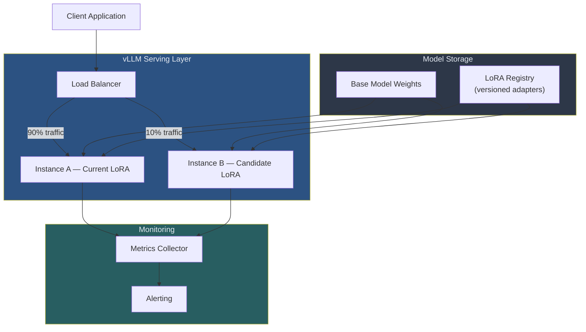
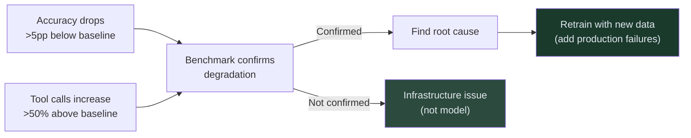

<!-- _class: lead -->

# Deployment Patterns

**Module 07 — Production Considerations**

> Deploying a trained LoRA adapter to production requires three things: a reliable serving layer, a monitoring system that catches degradation before users do, and a rollback path you can execute in under five minutes.

<!--
Speaker notes: Key talking points for this slide
- This is the final guide in the course — you now have a trained model and need to run it reliably
- Three focus areas: serving (how to run it), monitoring (how to know it's working), rollback (how to fix it when it isn't)
- LoRA architecture makes all three easier: adapters are small (500MB), swappable, and versioned independently from the base model
- By the end of this guide you will have working code for all three
-->

---

# Production Architecture



<!--
Speaker notes: Key talking points for this slide
- Traffic splitting at the load balancer enables A/B testing without code changes in the application
- The base model is loaded once; LoRA adapters are attached dynamically per request
- Monitoring feeds both alerting (immediate) and the dashboard (historical trends)
- Key property: if Instance B (candidate) degrades, all traffic falls back to Instance A (current) without user impact
-->

---

# What You Have After Training

```
training_output/
├── adapter_config.json         # LoRA rank, alpha, target modules
├── adapter_model.safetensors   # Trained weights (~500MB)
├── tokenizer/                  # Same as base model
└── training_args.json          # Config used during training
```

**The base model is not modified.** The LoRA adapter is a correction layer applied on top of frozen base model weights at inference time.

> This is why rollback is instant: swap the adapter, not the model.

<!--
Speaker notes: Key talking points for this slide
- 500MB for a 14B model's learned behavior — this is the efficiency of LoRA
- The tokenizer directory is identical to the base model tokenizer — you do not need to store it separately for every adapter
- "Correction layer" is the right mental model: the base model retains all its general capabilities; the adapter specializes its behavior for your task
- Rollback = swap adapter file. The 28GB base model stays loaded in GPU memory. No restart required.
-->

---

# vLLM LoRA Configuration

```python
# Launch vLLM with LoRA adapter
VLLM_ARGS = [
    "python", "-m", "vllm.entrypoints.openai.api_server",

    "--model",           "Qwen/Qwen2.5-14B-Instruct",
    "--enable-lora",
    "--lora-modules",    "qwen2.5-14b-rl=./training_output/",
    "--max-lora-rank",   "64",

    # Performance
    "--gpu-memory-utilization", "0.90",
    "--max-num-seqs",           "256",
    "--enable-prefix-caching",  # Cache KV for repeated system prompts

    # Optional: 4-bit quantization saves ~50% VRAM
    "--quantization",    "bitsandbytes",
]
```

The server exposes an OpenAI-compatible API on port 8000. Your application code does not change — only the `base_url` changes from `api.openai.com` to your vLLM endpoint.

<!--
Speaker notes: Key talking points for this slide
- `--enable-lora` is the key flag — without it, vLLM loads the model without adapter support
- `--lora-modules name=path` maps an adapter name to its file path; you use the name in API requests
- `--enable-prefix-caching` is a free performance win for agents with fixed system prompts — caches the KV state
- `--quantization bitsandbytes` reduces VRAM by ~50%; latency impact is ~10% — usually worth it
-->

---

# Supported Model Families

| Family | Recommended Size | VRAM (LoRA) | Strength |
|--------|-----------------|-------------|----------|
| Qwen 2.5 | 7B, **14B** | 24–40GB | Best ART-E results |
| Qwen 3 | 8B, 14B | 24–40GB | Strongest reasoning |
| Llama 3.x | 8B, 70B | 20–160GB | Broad community support |
| Mistral | 7B | 20GB | Resource-constrained |
| Phi-3.5 | 3.8B | 12GB | Consumer GPU deployable |

> ART framework is officially validated on **Qwen 2.5** and **Qwen 3**. Other families work via the vLLM backend.

<!--
Speaker notes: Key talking points for this slide
- Qwen 2.5-14B is the sweet spot: best benchmark results, fits on a single A100 40GB with LoRA+quantization
- Qwen 3 is the successor to Qwen 2.5 — if you're starting a new project in 2025+, consider Qwen 3
- Llama is the most portable choice if you need broad community tooling support or need to stay within Meta's ecosystem
- Phi-3.5 at 3.8B is remarkable: fits on a consumer RTX 3090 (24GB), viable for edge deployment
-->

---

<!-- _class: lead -->

# Monitoring in Production

<!--
Speaker notes: Key talking points for this slide
- Training gives you a benchmark number at a point in time
- Production monitoring tells you if that number holds over time
- Four dimensions: accuracy, tool efficiency, latency, error rate
- The tricky part: accuracy is often not measurable in real-time (you don't always know the right answer)
-->

---

# The Four Monitoring Dimensions

<div class="columns">
<div>

**Accuracy (when verifiable)**
- Compare model output to ground truth
- Only measurable for tasks with deterministic answers
- Track as rolling % over 60-minute windows

**Tool call efficiency**
- Mean tool calls per query
- Increasing tool calls = degrading strategy
- RL-trained: baseline 2–3 calls per query

</div>
<div>

**Latency**
- Track P95, not mean
- Alert if P95 > 3x baseline
- Sudden spike = infrastructure issue
- Gradual increase = increased context length

**Error rate**
- Silent failures are the worst kind
- Track model errors separate from infra errors
- Alert at >5% error rate

</div>
</div>

<!--
Speaker notes: Key talking points for this slide
- Tool call count is a proxy for model health when direct accuracy measurement is unavailable
- A model that trained to use 2–3 tool calls suddenly using 5–6 is showing signs of strategy degradation
- P95 latency matters: the mean can be fine while 5% of users experience 10-second timeouts
- Silent failures: the model returns a response but it is wrong in a way that does not trigger an exception — this is why you need periodic benchmark runs
-->

---

# Rolling Window Monitoring

```python
monitor = ProductionMonitor(
    window_minutes=60,
    accuracy_alert_threshold=0.80,    # Alert if accuracy < 80%
    latency_alert_p95_seconds=3.0,    # Alert if P95 > 3s
    error_rate_alert_threshold=0.05,  # Alert if >5% fail
)

# Record each production request
monitor.record(RequestMetrics(
    request_id="abc123",
    model_version="qwen2.5-14b-rl-v1",
    correct=True,             # None if not verifiable
    latency_seconds=1.1,
    tokens_used=487,
    tool_call_count=2,
))

# Check current state
stats = monitor.current_stats()
# {
#   "accuracy": 0.94,
#   "mean_latency_seconds": 1.12,
#   "p95_latency_seconds": 1.87,
#   "error_rate": 0.008,
#   "mean_tool_calls": 2.3,
# }
```

<!--
Speaker notes: Key talking points for this slide
- 60-minute rolling window: short enough to catch acute problems, long enough to smooth over noise
- The monitor is thread-safe — multiple request handlers can write to it concurrently
- Alert threshold of 0.80 for accuracy means you fire an alert if you drop from 96% to below 80% — that is a meaningful degradation, not noise
- The `correct=None` option is key: most production systems cannot verify correctness in real-time, so monitoring focuses on latency and error rate, with periodic offline accuracy checks
-->

---

# When to Retrain



**Root causes of degradation:**
- Query distribution shifted (different types of questions)
- Tool environment changed (schema updates, API changes)
- New data patterns not seen during training

> Always run a diagnostic benchmark on the held-out test set before deciding to retrain. Production metric dips can be infrastructure, not model quality.

<!--
Speaker notes: Key talking points for this slide
- Do not retrain reflexively: a brief accuracy dip is often a database issue, not the model
- The diagnostic benchmark is your ground truth: if the held-out test set shows degradation, the model has degraded
- If the benchmark is stable but production metrics are down, investigate the environment: database connection, tool timeouts, changed schemas
- When you do retrain: add the production failures to the training set — this is the flywheel that keeps the model improving over time
-->

---

<!-- _class: lead -->

# A/B Testing and Versioning

<!--
Speaker notes: Key talking points for this slide
- Never promote a new model version to 100% traffic without an A/B test
- A/B testing with LoRA is cheap: the base model stays loaded, you just swap the adapter for 10% of traffic
- Versioning is the safety net: a clean registry means rollback is a one-line function call
-->

---

# A/B Test Router

```python
router = ABTestRouter(variants=[
    Variant(
        name="control",
        model_id="qwen2.5-14b-rl-v1.0",
        traffic_fraction=0.90,
        endpoint="http://vllm-a:8000/v1",
    ),
    Variant(
        name="treatment",
        model_id="qwen2.5-14b-rl-v1.1",
        traffic_fraction=0.10,
        endpoint="http://vllm-b:8001/v1",
    ),
])

# Deterministic routing: same request_id → same variant
variant = router.route(request_id="user-session-xyz")
client = OpenAI(base_url=variant.endpoint, api_key="token")
```

**Deterministic routing** prevents the same user from seeing different model behavior on different requests during the test period.

<!--
Speaker notes: Key talking points for this slide
- 90/10 split means new model gets real traffic but failure blast radius is small
- Deterministic routing via consistent hashing: the same session always hits the same variant
- Why does determinism matter? If user A hits v1.0 for query 1 and v1.1 for query 2, and v1.1 is wrong, they experience inconsistency — this is worse than a clean A/B split
- After 7 days with 500+ samples per variant, run is_ab_test_conclusive() to decide
-->

---

# A/B Test Decision Criteria

```python
result = is_ab_test_conclusive(
    control_correct=432,    control_total=500,   # 86.4% accuracy
    treatment_correct=478,  treatment_total=500, # 95.6% accuracy
)

# {
#   "conclusive": True,
#   "winner": "treatment",
#   "control_accuracy": 0.864,
#   "treatment_accuracy": 0.956,
#   "difference_pp": 9.2,
#   "recommendation": "Promote treatment to 100% traffic",
# }
```

**Decision rules:**
- Minimum 500 samples per variant
- Minimum 7-day runtime
- Minimum 3pp difference to declare winner

<!--
Speaker notes: Key talking points for this slide
- 500 samples per variant gives you ±4.4pp at 95% confidence — enough to detect a 3pp effect reliably
- 7-day minimum captures day-of-week effects: some query types are more common on weekdays, others on weekends
- The 3pp minimum effect size prevents you from chasing noise: a 1pp difference is within measurement error at this sample size
- Do not peek at results early: peeking and stopping when you see a significant result inflates false positive rate to ~30%
-->

---

# LoRA Registry and Rollback

```python
registry = LoRARegistry("./lora_registry/")

# Register new version after training
registry.register(
    adapter_path="./training_output/",
    version="qwen2.5-14b-sql-v1.1",
    accuracy=0.96,
    dataset_version="sql_v3",
    notes="500 production failure examples added",
)

# Promote to production (marks previous as retired)
registry.promote("qwen2.5-14b-sql-v1.1")

# Rollback: one call, < 5 minutes to restore previous behavior
if monitor.current_stats()["accuracy"] < 0.80:
    registry.rollback()
    # Then hot-swap the adapter in vLLM — no server restart needed
```

<!--
Speaker notes: Key talking points for this slide
- The registry is a directory structure with metadata JSON files — no database required
- promote() automatically marks the previous version as "retired" so rollback() can find it
- Hot-swap in vLLM: vLLM supports dynamic LoRA loading at runtime; you can swap adapters without a server restart
- < 5 minutes to rollback: register the old adapter path in vLLM's config and reload — the 28GB base model stays in memory
-->

---

# Deployment Checklist

<div class="columns">
<div>

**Pre-deployment:**
- [ ] Benchmark accuracy on held-out set
- [ ] Verify P95 latency < 2.0s
- [ ] Register adapter in LoRARegistry
- [ ] Confirm rollback adapter exists

**Deployment:**
- [ ] Start A/B test at 10% traffic
- [ ] Monitor hourly for 24 hours
- [ ] Verify alerts are configured

</div>
<div>

**Post-deployment (after 7 days):**
- [ ] Run `is_ab_test_conclusive()`
- [ ] Promote winner to 100% traffic
- [ ] Mark previous adapter as retired
- [ ] Update application model config
- [ ] Set retraining trigger in monitor

</div>
</div>

<!--
Speaker notes: Key talking points for this slide
- This checklist is the difference between a model that occasionally breaks production and one that has a clear upgrade/rollback path
- The most commonly skipped item: confirming rollback adapter exists BEFORE promoting the new version. If you need to roll back and have nothing to roll back to, you are starting a cold deployment.
- Retraining trigger: set the monitor's accuracy_alert_threshold to 85% (below your trained model's 96% baseline) so you have warning before accuracy degrades to frontier API levels
-->

---

# Course Complete

<div class="columns">
<div>

**What you built:**

1. GRPO training pipeline
2. ART framework integration
3. RULER reward functions
4. MCP tool servers
5. Full training loop
6. Text-to-SQL agent
7. Production deployment

</div>
<div>

**What you can do now:**

- Train custom RL agents on any narrow task
- Measure accuracy against frontier APIs
- Calculate break-even and ROI
- Deploy with monitoring and rollback
- Retrain when distribution shifts

</div>
</div>

> A 14B open-source model trained for $15–50 can outperform o3 on your specific task and run 5x faster at 64x lower cost. You now have the complete toolkit to build it.

<!--
Speaker notes: Key talking points for this slide
- Summarize the full course arc: from "why RL?" to "running in production"
- The central claim of the course is now fully substantiated: RL training on a narrow task with automatic rewards produces models that beat frontier APIs on that task
- Next steps: apply this to your own task. The framework is general; swap the reward function and dataset.
- Portfolio projects are in /projects/ — pick one and build your capstone
-->
