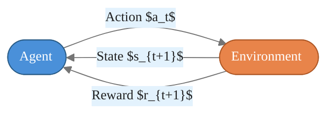

# The Reinforcement Learning Landscape

> **Reading time:** ~8 min | **Module:** 0 — Foundations | **Prerequisites:** Probability, linear algebra

## In Brief

Reinforcement learning (RL) is a computational framework for sequential decision-making: an agent learns a behavior policy by interacting with an environment and receiving scalar reward signals. Unlike supervised learning, no labeled data is provided; unlike unsupervised learning, a performance objective is explicit.

<div class="callout-key">

<strong>Key Concept:</strong> Reinforcement learning (RL) is a computational framework for sequential decision-making: an agent learns a behavior policy by interacting with an environment and receiving scalar reward signals. Unlike supervised learning, no labeled data is provided; unlike unsupervised learning, a performance objective is explicit.

</div>


## Key Insight

The agent-environment interaction loop is the organizing idea of all RL. At every time step the agent observes the world, picks an action, and receives a consequence — a new observation and a reward. The goal is to discover the policy that maximizes cumulative reward over time.

---


<div class="callout-key">

<strong>Key Point:</strong> The agent-environment interaction loop is the organizing idea of all RL.

</div>

## Intuitive Explanation

Think of a chess player learning to improve. The board position is the **state**, the chosen move is the **action**, winning or losing a piece is part of the **reward** (or the game outcome is the terminal reward), and the player's decision strategy is the **policy**.

<div class="callout-key">

<strong>Key Point:</strong> Think of a chess player learning to improve.

</div>


The player does not have a teacher telling them the correct move for every position (that would be supervised learning). They learn by playing many games and observing which sequences of moves lead to wins.

---


## Formal Definition

A reinforcement learning problem is defined by:

<div class="callout-info">

<strong>Info:</strong> A reinforcement learning problem is defined by:

- An **agent** that selects actions
- An **environment** that responds to those actions with new states and rewards
- A **policy** $\pi$ mapping states...

</div>


- An **agent** that selects actions
- An **environment** that responds to those actions with new states and rewards
- A **policy** $\pi$ mapping states to actions (or distributions over actions)
- A **reward signal** $R_t \in \mathbb{R}$ received at each step
- A **return** $G_t$ that aggregates rewards the agent seeks to maximize

The agent-environment interaction proceeds as a discrete-time loop:

$$S_0, A_0, R_1, S_1, A_1, R_2, S_2, A_2, R_3, \ldots$$

---

## Terminology Reference

| Term | Symbol | Definition |
|------|--------|------------|
| State | $s \in \mathcal{S}$ | A representation of the environment at a point in time |
| Action | $a \in \mathcal{A}$ | A choice made by the agent |
| Reward | $r \in \mathbb{R}$ | Scalar feedback signal received after each action |
| Policy | $\pi(a \mid s)$ | Probability of selecting action $a$ in state $s$ |
| Return | $G_t$ | Discounted sum of future rewards from time $t$ |
| Episode | — | A complete sequence from initial state to terminal state |
| Trajectory | $\tau$ | A sequence $(S_0, A_0, R_1, S_1, A_1, R_2, \ldots)$ |
| Discount factor | $\gamma \in [0, 1)$ | Controls how much future rewards are down-weighted |

---

## Comparison: RL vs Supervised vs Unsupervised Learning

| Dimension | Supervised Learning | Unsupervised Learning | Reinforcement Learning |
|-----------|--------------------|-----------------------|----------------------|
| **Data** | Labeled $(x, y)$ pairs | Unlabeled $x$ | Interaction trajectories $(s, a, r, s')$ |
| **Signal** | Ground-truth label | No explicit signal | Scalar reward (delayed, noisy) |
| **Goal** | Predict $y$ from $x$ | Find structure in $x$ | Maximize cumulative reward |
| **Feedback timing** | Immediate, per sample | None | Delayed; credit assignment is hard |
| **Agent acts?** | No | No | Yes — actions change the data distribution |
| **Stationarity** | Data distribution fixed | Data distribution fixed | Distribution shifts as policy changes |
| **Primary challenge** | Generalization | Representation | Exploration vs exploitation |

**Critical distinction:** In RL the agent's actions affect what data it sees next. This non-stationarity makes RL fundamentally harder than standard statistical learning.

---


<div class="compare">
<div class="compare-card">
<div class="header before">Comparison: RL</div>
<div class="body">

See detailed comparison in the table above.

</div>
</div>
<div class="compare-card">
<div class="header after">Supervised vs Unsupervised Learning</div>
<div class="body">

See detailed comparison in the table above.

</div>
</div>
</div>

## The Agent-Environment Interaction Loop

<div class="code-window">
<div class="code-header">
<div class="dots"><span class="dot-red"></span><span class="dot-yellow"></span><span class="dot-green"></span></div>
<span class="filename">example.py</span>
</div>

The following implementation builds on the approach above:



</div>

At each discrete time step $t$:

1. Agent observes state $S_t$
2. Agent selects action $A_t \sim \pi(\cdot \mid S_t)$
3. Environment transitions to $S_{t+1}$ and emits reward $R_{t+1}$
4. Repeat until a terminal condition is reached (episodic) or indefinitely (continuing)

---


## Real-World Examples

### Game Playing
- **State:** pixel image or board representation
- **Action:** joystick direction, button press, or chess move
- **Reward:** +1 for win, -1 for loss, 0 otherwise (or per-step score)
- **Examples:** AlphaGo, Atari DQN, OpenAI Five

### Robotics and Control
- **State:** joint angles, velocities, sensor readings
- **Action:** motor torques
- **Reward:** forward locomotion speed minus energy consumption
- **Examples:** locomotion policies, robotic arm manipulation

### Algorithmic Trading
- **State:** order book, price history, portfolio positions, macro indicators
- **Action:** buy, sell, hold with position sizing
- **Reward:** risk-adjusted returns (Sharpe ratio increment or P&L)
- **Examples:** execution optimization, portfolio rebalancing

### Recommendation Systems
- **State:** user history, context, available items
- **Action:** which item to show next
- **Reward:** click, purchase, long-session engagement
- **Examples:** YouTube, Netflix, news feed ranking

---

## Code Snippet: The Interaction Loop

<div class="code-window">
<div class="code-header">
<div class="dots"><span class="dot-red"></span><span class="dot-yellow"></span><span class="dot-green"></span></div>
<span class="filename">example.py</span>
</div>

The following implementation builds on the approach above:

```python
import gymnasium as gym

def run_episode(env: gym.Env, policy) -> float:
    """
    Execute one episode under a given policy.

    Parameters
    ----------
    env    : A Gymnasium environment
    policy : Callable[[observation], action]

    Returns
    -------
    total_reward : float
        Undiscounted sum of rewards over the episode.
    """
    observation, info = env.reset()
    total_reward = 0.0
    terminated = False
    truncated = False

    while not (terminated or truncated):
        # Policy selects an action from the current observation
        action = policy(observation)

        # Environment transitions and returns feedback
        observation, reward, terminated, truncated, info = env.step(action)

        total_reward += reward

    return total_reward


# Random policy baseline: select uniformly from the action space
env = gym.make("CartPole-v1")
random_policy = lambda obs: env.action_space.sample()

episode_rewards = [run_episode(env, random_policy) for _ in range(100)]
print(f"Random policy mean return: {sum(episode_rewards) / len(episode_rewards):.1f}")
env.close()
```

</div>

---

## Common Pitfalls

<div class="callout-danger">

<strong>Danger:</strong> The pitfalls below are the most common mistakes practitioners make. Each one can silently degrade your results without obvious errors.

</div>

**Pitfall 1 — Reward shaping without domain understanding.**
Manually engineering reward functions often introduces unintended behavior. An agent given +1 reward for staying alive in a game may learn never to take risks required to win. Always test whether the shaped reward actually aligns with the intended goal.

<div class="callout-warning">

<strong>Warning:</strong> **Pitfall 1 — Reward shaping without domain understanding.**
Manually engineering reward functions often introduces unintended behavior.

</div>

**Pitfall 2 — Confusing observation with state.**
The agent receives an *observation* $O_t$ which may be a partial or noisy view of the true state $S_t$. Treating a partial observation as the full state violates the Markov property and makes value estimates incorrect. Partially observable problems require POMDPs or memory-augmented agents.

**Pitfall 3 — Ignoring the exploration-exploitation tradeoff.**
An agent that always exploits its current best action never discovers better strategies. An agent that always explores never converts knowledge into reward. Every RL algorithm must manage this tension explicitly.

**Pitfall 4 — Comparing RL with supervised learning benchmarks.**
RL agents trained on interaction data are not comparable to supervised models trained on fixed datasets. Data efficiency, wall-clock time, and sample complexity differ by orders of magnitude. Report environment steps, not epochs.

**Pitfall 5 — Not defining episode boundaries clearly.**
Many bugs arise from failing to reset environments correctly between episodes or from allowing terminal states to bootstrap value estimates. Always verify your environment's `terminated` vs `truncated` semantics.

---

## Connections


<div class="callout-info">

<strong>Info:</strong> This section maps how this guide connects to the broader course. Use these links to navigate related material.

</div>

- **Builds on:** probability theory, Markov chains, dynamic programming basics
- **Leads to:** Markov Decision Processes (Guide 02), Bellman equations (Guide 03), tabular methods, function approximation, deep RL
- **Related to:** optimal control theory, multi-armed bandits (a special single-state RL problem), game theory

---


## Practice Questions

**Question 1 — Conceptual:** Based on the concepts in this guide, explain in your own words why the core technique matters and when you would choose it over alternatives.

**Question 2 — Application:** Sketch out how you would apply the main concept from this guide to a real-world dataset or problem you have encountered. What would you need to watch out for?


## Further Reading

- Sutton & Barto, *Reinforcement Learning: An Introduction* (2nd ed.), Chapter 1 — the canonical introduction to the agent-environment framework
- Silver, D. (2015). *Lecture 1: Introduction to Reinforcement Learning* — concise framing of the RL problem and its relationship to other learning paradigms
- Gymnasium documentation (https://gymnasium.farama.org) — standard environment interface used throughout this course


---

## Cross-References

<a class="link-card" href="./01_rl_landscape_slides.md">
  <div class="link-card-title">Companion Slides</div>
  <div class="link-card-description">Interactive slide deck covering the key concepts with visual examples.</div>
</a>

<a class="link-card" href="../notebooks/01_agent_environment_loop.ipynb">
  <div class="link-card-title">Hands-on Notebook</div>
  <div class="link-card-description">15-minute micro-notebook with guided exercises and real data.</div>
</a>
