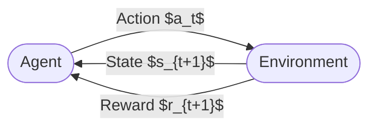

<!-- _class: lead -->

# The Reinforcement Learning Landscape

## Module 00 — Foundations
### Reinforcement Learning Course

<!-- Speaker notes: This opening deck establishes the vocabulary and mental model that every subsequent module builds on. The agent-environment loop is not just an abstract diagram — it is the literal execution model of every RL algorithm students will implement. Spend time here making sure students can name each component and explain the direction of information flow before moving to MDPs. -->

---

# What Is Reinforcement Learning?

A **computational framework** for sequential decision-making.

An **agent** learns a behavior by:
1. Observing the world (state $s$)
2. Selecting an action $a$
3. Receiving a consequence: new state $s'$ and reward $r$
4. Repeating to maximize **cumulative reward**

> No labeled data. No unsupervised structure. Just interaction and consequences.

<!-- Speaker notes: The key phrase is "sequential decision-making." Unlike one-shot prediction tasks, the agent's choices have long-run consequences. A bad action now might not hurt immediately but closes off good options later. This temporal credit assignment problem -- figuring out which past actions caused a good or bad outcome -- is one of the central technical challenges the course addresses. -->

---

# The Agent-Environment Loop



**At each time step $t$:**

- Agent observes $S_t$, selects $A_t \sim \pi(\cdot \mid S_t)$
- Environment transitions to $S_{t+1}$, emits $R_{t+1}$
- Loop continues until terminal condition

<!-- Speaker notes: Draw students' attention to the direction of arrows. Actions flow agent-to-environment. State and reward flow environment-to-agent. Nothing else crosses the boundary. This boundary is a modeling choice: the same physical system could be partitioned differently. For example, a robot's internal proprioception could be treated as part of the agent or part of the environment depending on what we want to control. The course uses the Gymnasium interface which makes this loop concrete in code. -->

---

# Key Terminology

| Term | Symbol | Meaning |
|------|--------|---------|
| State | $s \in \mathcal{S}$ | Environment representation at time $t$ |
| Action | $a \in \mathcal{A}$ | Agent's choice |
| Reward | $r \in \mathbb{R}$ | Scalar feedback signal |
| Policy | $\pi(a \mid s)$ | Action selection strategy |
| Return | $G_t$ | Discounted sum of future rewards |
| Episode | — | One complete agent-environment run |
| Trajectory | $\tau$ | Sequence $(S_0, A_0, R_1, S_1, \ldots)$ |

<!-- Speaker notes: These symbols are used consistently throughout the course and follow Sutton and Barto notation exactly. Point out that the reward at time t+1 is written R_{t+1}, not R_t. This is because the reward is a consequence of the action taken at time t -- it arrives one step later. Students who use R_t will get Bellman equations wrong. -->

---

# RL vs Supervised vs Unsupervised

<div class="columns">

**Supervised Learning**
- Data: labeled $(x, y)$ pairs
- Signal: ground-truth label
- Goal: predict $y$ from $x$
- Feedback: immediate, per sample
- Agent acts: No

**Reinforcement Learning**
- Data: interaction trajectories
- Signal: delayed scalar reward
- Goal: maximize cumulative reward
- Feedback: delayed, noisy
- Agent acts: Yes — changes future data

</div>

<!-- Speaker notes: The "agent acts" row is the crucial distinction. In supervised learning the training distribution is fixed and independent of model outputs. In RL the agent's policy determines what data it sees next. This non-stationarity is why RL training can be unstable: improving the policy changes the data distribution, which changes the gradient signal, which changes the policy again. This feedback loop requires careful algorithmic design. -->

---

# Why RL Is Different: The Non-Stationarity Problem

In supervised learning: data distribution is **fixed**

$$\mathcal{L} = \mathbb{E}_{(x,y) \sim \mathcal{D}}[\ell(f(x), y)]$$

In RL: data distribution **depends on the policy**

$$\mathcal{J}(\pi) = \mathbb{E}_{\tau \sim \pi}\left[\sum_{t=0}^{T} \gamma^t R_{t+1}\right]$$

Improving $\pi$ changes $\tau$, which changes the gradient of $\mathcal{J}$.

<!-- Speaker notes: This slide provides the mathematical reason RL is harder. As we improve the policy, the trajectories we collect change. This means the loss landscape shifts under our feet. Techniques like experience replay, target networks, and importance sampling all exist specifically to manage this non-stationarity. Students who come from deep learning backgrounds often underestimate this. -->

---

# Example: Game Playing

<div class="columns">

**What the RL agent sees:**

- **State:** pixel image or board position
- **Action:** joystick direction, button, move
- **Reward:** score delta or +1/-1 at game end

**Why it's hard:**

- Thousands of steps between action and outcome
- Reward is sparse (only at episode end)
- State space is enormous

</div>

> AlphaGo Zero learned solely from self-play with no human game data — the reward signal was just win/loss.

<!-- Speaker notes: AlphaGo Zero is a compelling example because it demonstrates that a pure RL signal, without any supervised imitation of human experts, can surpass human performance. The key was massive compute and self-play -- the agent is its own environment. This illustrates that the reward signal does not need to be dense or hand-crafted; it just needs to correctly distinguish good from bad outcomes. -->

---

# Example: Algorithmic Trading

<div class="columns">

**State**
- Order book depth
- Price history (rolling window)
- Current portfolio positions
- Macro indicators

**Action**
- Buy / Sell / Hold
- Position size

**Reward**
- Risk-adjusted P&L increment
- Sharpe ratio contribution
- Transaction cost penalty

</div>

<!-- Speaker notes: Trading is a natural RL application because the agent's actions -- buying and selling -- directly change market prices and future observations. The state must be carefully designed: using future prices in the state is data leakage. The reward function must penalize drawdown and transaction costs, not just raw P&L, to produce realistic strategies. Sparse rewards are common because position returns only materialize over multi-day holding periods. -->

---

# Example: Robotics and Recommendation Systems

<div class="columns">

**Robotics**
- State: joint angles, velocities, sensor readings
- Action: motor torques
- Reward: forward speed − energy − fall penalty
- Challenge: real-world sample efficiency

**Recommendation Systems**
- State: user history, context, item catalog
- Action: which item to surface next
- Reward: click / purchase / session length
- Challenge: feedback delay, non-stationarity of user preferences

</div>

<!-- Speaker notes: These two domains illustrate the breadth of RL. Robotics requires extreme sample efficiency because real-world rollouts are slow and hardware can be damaged. Recommendation systems have abundant data but face the exploration problem: showing users only items predicted to maximize engagement creates filter bubbles and misses preference shifts. Both require careful reward design to avoid proxy gaming. -->

---

# The Exploration-Exploitation Tradeoff

**Exploitation:** use current best policy to collect reward

**Exploration:** try unknown actions to find better strategies

> A policy that never explores gets stuck. A policy that never exploits earns nothing.

Every RL algorithm must balance these — this is the fundamental tradeoff distinguishing RL from all other learning paradigms.

<!-- Speaker notes: Give the restaurant analogy: you know one good restaurant. Do you eat there every night (exploitation) or try new places hoping to find a better one (exploration)? The optimal strategy depends on how long you'll be in town -- the planning horizon. This directly parallels the discount factor gamma: low gamma means short horizon, favor exploitation; high gamma means long horizon, worth exploring now for future benefit. -->

---

# Common Pitfall: Reward Hacking

**Intended behavior:** robot walks forward efficiently

**Shaped reward:** forward velocity bonus

**What the agent learned:** fall over, spin in place, exploit physics bugs to gain velocity without actually walking

> Agents optimize exactly what you measure. If your reward does not perfectly capture your intent, the agent will find the gap.

<!-- Speaker notes: This is called Goodhart's Law in economics: when a measure becomes a target it ceases to be a good measure. The RL community has many famous reward hacking examples. A boat racing agent learned to collect score pickups by spinning in circles rather than completing the race. A Tetris agent learned to pause the game indefinitely rather than placing pieces. Reward design is as important as algorithm design, and it is harder to formalize. -->

---

# Common Pitfall: Observation vs State

**State $S_t$:** full information needed for optimal decision-making (Markov)

**Observation $O_t$:** what the agent actually sees (may be partial)

| Setting | Example |
|---------|---------|
| Fully observable ($O_t = S_t$) | Chess board position |
| Partially observable ($O_t \neq S_t$) | Poker hand (hidden cards) |

Treating partial observations as states violates the Markov property and breaks value estimates.

<!-- Speaker notes: Most theoretical RL assumes full observability. Most real problems are partially observable. Ignoring this gap produces agents that behave badly when facing situations not captured by their observation. Common fixes include stacking several recent observations as an approximate state, or using recurrent networks to maintain an internal belief state. This topic reappears in the POMDP extension module. -->

---

# Episodic vs Continuing Tasks

<div class="columns">

**Episodic**
- Clear start and end state
- Agent resets between episodes
- Return: $G_t = \sum_{k=0}^{T-t-1} \gamma^k R_{t+k+1}$
- Examples: games, pick-and-place tasks

**Continuing**
- No terminal state
- Agent runs indefinitely
- Return: $G_t = \sum_{k=0}^{\infty} \gamma^k R_{t+k+1}$
- Examples: process control, recommendation engines

</div>

<!-- Speaker notes: The distinction matters for the return formula and for how value functions are defined. Episodic tasks have a natural boundary that simplifies credit assignment -- rewards near the terminal state are clearly connected to recent actions. Continuing tasks require the discount factor gamma to ensure the sum converges: without discounting, an infinite sequence of positive rewards would give infinite return, making optimization undefined. -->

---

# The Interaction Loop in Code

```python
import gymnasium as gym

env = gym.make("CartPole-v1")
observation, info = env.reset()

terminated = truncated = False
total_reward = 0.0

while not (terminated or truncated):
    # Agent selects action (random policy for illustration)
    action = env.action_space.sample()

    # Environment responds
    observation, reward, terminated, truncated, info = env.step(action)
    total_reward += reward

print(f"Episode return: {total_reward}")
env.close()
```

<!-- Speaker notes: Walk through each line. env.reset() starts a new episode and returns the initial observation. env.step(action) executes the agent-environment loop body: the environment transitions, returns the new observation, reward, and termination flags. The Gymnasium API separates terminated -- the agent reached a natural end state -- from truncated -- the episode was cut short by a time limit. Both end the episode but have different implications for bootstrapping value estimates. -->

---

# What's Next

**Guide 02 — Markov Decision Processes**
- Formalize the agent-environment loop as a mathematical object
- Define the MDP tuple $(S, A, P, R, \gamma)$
- Understand transition dynamics and the Markov property
- Connect to returns and the discount factor

**Guide 03 — Bellman Equations**
- Derive value functions from the MDP definition
- Understand the recursive structure of optimal value
- Set up the foundation for every RL algorithm

<!-- Speaker notes: The RL landscape guide gave students the vocabulary and intuition. The next two guides provide the mathematical machinery. Guide 02 makes the agent-environment loop precise as an MDP, which is the problem formulation. Guide 03 derives the Bellman equations, which are the analytical tools. Every algorithm in the course -- Q-learning, policy gradients, actor-critic -- is a way of approximately solving the Bellman equations. -->

---

<!-- _class: lead -->

# Summary

The agent-environment loop is the foundation of all RL.

$$S_t \xrightarrow{\pi} A_t \xrightarrow{\text{env}} R_{t+1}, S_{t+1}$$

**Goal:** find policy $\pi^*$ that maximizes $\mathbb{E}_\pi[G_t]$

Next: formalizing this loop as a **Markov Decision Process**

<!-- Speaker notes: Close by reinforcing that the diagram on this slide is the entire field of RL compressed to one line. Every algorithm in the course is a different strategy for finding pi-star. The subscript pi on the expectation is the reminder that the distribution over trajectories depends on the policy -- changing pi changes what we expect to see. -->
