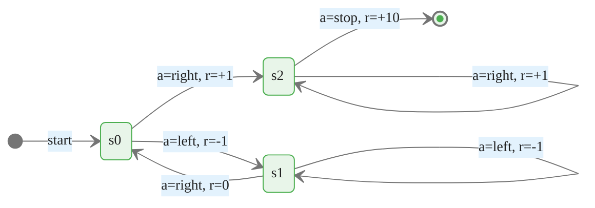

# Markov Decision Processes

> **Reading time:** ~10 min | **Module:** 0 — Foundations | **Prerequisites:** Probability, linear algebra

## In Brief

A Markov Decision Process (MDP) is the mathematical formalization of the reinforcement learning problem. It provides a precise language for specifying environments, reasoning about policies, and deriving algorithms. Every RL algorithm is implicitly a method for solving an MDP.

<div class="callout-key">

<strong>Key Concept:</strong> A Markov Decision Process (MDP) is the mathematical formalization of the reinforcement learning problem. It provides a precise language for specifying environments, reasoning about policies, and deriving algorithms.

</div>


## Key Insight

The MDP encodes two ideas simultaneously: the world transitions stochastically based only on the current state and action (the Markov property), and the agent's goal is captured entirely by the reward function. These two assumptions transform an open-ended decision problem into a well-defined optimization problem.

---


<div class="callout-key">

<strong>Key Point:</strong> The MDP encodes two ideas simultaneously: the world transitions stochastically based only on the current state and action (the Markov property), and the agent's goal is captured entirely by the reward...

</div>

## Formal Definition

A finite MDP is a tuple $(\mathcal{S}, \mathcal{A}, p, R, \gamma)$ where:

<div class="callout-key">

<strong>Key Point:</strong> A finite MDP is a tuple $(\mathcal{S}, \mathcal{A}, p, R, \gamma)$ where:

| Component | Symbol | Description |
|-----------|--------|-------------|
| State space | $\mathcal{S}$ | Set of all possible...

</div>


| Component | Symbol | Description |
|-----------|--------|-------------|
| State space | $\mathcal{S}$ | Set of all possible states |
| Action space | $\mathcal{A}$ | Set of all possible actions |
| Transition dynamics | $p(s', r \mid s, a)$ | Joint probability of next state $s'$ and reward $r$ given state $s$ and action $a$ |
| Reward function | $R$ | Implied by $p$; often written as $r(s, a)$ or $r(s, a, s')$ |
| Discount factor | $\gamma \in [0, 1)$ | Down-weights future rewards |

The transition dynamics function $p: \mathcal{S} \times \mathcal{R} \times \mathcal{S} \times \mathcal{A} \rightarrow [0, 1]$ satisfies:

$$\sum_{s' \in \mathcal{S}} \sum_{r \in \mathcal{R}} p(s', r \mid s, a) = 1 \quad \forall s \in \mathcal{S}, a \in \mathcal{A}$$

---

## The Markov Property

The MDP assumes that the transition dynamics depend only on the current state and action — not on the full history:

<div class="callout-info">

<strong>Info:</strong> The MDP assumes that the transition dynamics depend only on the current state and action — not on the full history:

$$p(s_{t+1}, r_{t+1} \mid s_t, a_t) = p(s_{t+1}, r_{t+1} \mid s_1, a_1, s_2, a_2, \...

</div>


$$p(s_{t+1}, r_{t+1} \mid s_t, a_t) = p(s_{t+1}, r_{t+1} \mid s_1, a_1, s_2, a_2, \ldots, s_t, a_t)$$

Equivalently, the state $S_t$ is a **sufficient statistic** for all past interactions. Knowing $S_t$ gives you everything you need to predict future states and rewards — the past adds no further information.

### Why This Matters

The Markov property makes the MDP tractable. Without it, the agent would need to condition on an ever-growing history, making value functions infinitely complex. With it, a single vector $s \in \mathcal{S}$ encodes everything relevant.

**Practical note:** In many real applications, the agent's observation $O_t$ does not satisfy the Markov property. The RL practitioner either enriches the state representation (e.g., stacking frames in Atari) or uses a memory-augmented architecture (e.g., LSTM). The theoretical framework still assumes the MDP structure holds at some level of the state representation.

---

## Transition Dynamics

The four-argument function $p(s', r \mid s, a)$ is the complete specification of environment dynamics. Useful derived quantities are:

<div class="callout-warning">

<strong>Warning:</strong> The four-argument function $p(s', r \mid s, a)$ is the complete specification of environment dynamics.

</div>


**State-transition probabilities** (marginalizing out reward):

$$p(s' \mid s, a) = \sum_{r \in \mathcal{R}} p(s', r \mid s, a)$$

**Expected reward for state-action pair:**

$$r(s, a) = \mathbb{E}[R_{t+1} \mid S_t = s, A_t = a] = \sum_{r \in \mathcal{R}} r \sum_{s' \in \mathcal{S}} p(s', r \mid s, a)$$

**Expected reward for state-action-next-state triple:**

$$r(s, a, s') = \mathbb{E}[R_{t+1} \mid S_t = s, A_t = a, S_{t+1} = s'] = \frac{\sum_{r \in \mathcal{R}} r \cdot p(s', r \mid s, a)}{p(s' \mid s, a)}$$

---

## The Reward Hypothesis

All goals can be described as the maximization of the expected value of the cumulative sum of a scalar reward signal.

This is a **hypothesis**, not a theorem. It is falsifiable, and many researchers debate its adequacy for complex goals involving safety constraints, human preferences, or multi-objective optimization. For this course, we accept the reward hypothesis as the working assumption underlying standard RL.

**Implications:**
- The reward function must be designed carefully — it is the complete specification of what the agent should learn to do
- Reward shaping, potential-based modifications, and reward learning are active research areas precisely because designing the right scalar reward is hard

---

## Returns and Discounting

The **return** $G_t$ is the quantity the agent seeks to maximize. For a continuing task:

$$G_t = \sum_{k=0}^{\infty} \gamma^k R_{t+k+1} = R_{t+1} + \gamma R_{t+2} + \gamma^2 R_{t+3} + \cdots$$

For an episodic task with terminal time $T$:

$$G_t = \sum_{k=0}^{T-t-1} \gamma^k R_{t+k+1}$$

The return has a useful recursive structure:

$$G_t = R_{t+1} + \gamma G_{t+1}$$

This recursion is the foundation of the Bellman equations.

---

## The Discount Factor $\gamma$

| Value | Behavior | Interpretation |
|-------|----------|----------------|
| $\gamma = 0$ | Completely myopic | Agent cares only about immediate reward |
| $\gamma \to 1$ | Far-sighted | Agent cares equally about all future rewards |
| $\gamma = 0.99$ | Practical far-sighted | Rewards 100 steps away weighted at $\approx 0.37$ |
| $\gamma = 0.9$ | Moderate horizon | Rewards 10 steps away weighted at $\approx 0.35$ |

**Why discount at all?**
1. Mathematical convergence: ensures $G_t < \infty$ for continuing tasks
2. Economic justification: a dollar today is worth more than a dollar tomorrow
3. Uncertainty: the further into the future, the less certain we are of achieving that reward
4. Computational: smaller $\gamma$ creates softer optimization landscapes

**Choosing $\gamma$:** episodic tasks can use $\gamma = 1$ safely because the sum is finite. Continuing tasks require $\gamma < 1$.

---

## Episodic vs Continuing Tasks

**Episodic tasks** have natural terminal states $\mathcal{S}^+$ (absorbing states that end the episode). After termination, the environment resets.

- Examples: chess game, pole-balancing trial, one trading day
- Return is a finite sum; $\gamma < 1$ is optional
- Value function is well-defined at terminal states: $V(s_{\text{terminal}}) = 0$

**Continuing tasks** run without interruption indefinitely.

- Examples: process control, recommendation engine, portfolio management
- Return must use $\gamma < 1$ to be finite
- There is no natural episode boundary for bootstrapping

**Unified notation (Sutton & Barto convention):** treat episodic tasks as continuing tasks with an absorbing terminal state that emits zero reward forever. This lets us write a single set of equations covering both cases.

---

## MDP State Transition Diagram


<span class="filename">example.py</span>
</div>
The following implementation builds on the approach above:



*A 3-state MDP: states $\{s_0, s_1, s_2\}$, actions $\{$left, right, stop$\}$. Transitions shown with associated action and immediate reward.*

---

## Python Code: MDP as a Dictionary


<span class="filename">example.py</span>
</div>
The following implementation builds on the approach above:

<div class="code-window">
<div class="code-header">
<div class="dots"><span class="dot-red"></span><span class="dot-yellow"></span><span class="dot-green"></span></div>

```python
from typing import Dict, Tuple, List
import numpy as np

# MDP defined as p(s', r | s, a)
# Format: mdp[state][action] = list of (probability, next_state, reward) tuples
MDP = Dict[str, Dict[str, List[Tuple[float, str, float]]]]

def build_simple_mdp() -> MDP:
    """
    Three-state MDP: s0 (start), s1 (left), s2 (right/goal).
    Actions: 'left', 'right', 'stop'.
    Stopping is only productive from s2.
    """
    return {
        "s0": {
            "left":  [(1.0, "s1", -1.0)],       # deterministic transition
            "right": [(1.0, "s2",  1.0)],
            "stop":  [(1.0, "s0",  0.0)],        # stopping in s0 does nothing
        },
        "s1": {
            "left":  [(1.0, "s1", -1.0)],        # staying left incurs cost
            "right": [(1.0, "s0",  0.0)],
            "stop":  [(1.0, "s1",  0.0)],
        },
        "s2": {
            "left":  [(1.0, "s0",  0.0)],
            "right": [(1.0, "s2",  1.0)],
            "stop":  [(1.0, "terminal", 10.0)],  # reaching goal gives +10
        },
        "terminal": {},  # absorbing state
    }


def expected_reward(mdp: MDP, state: str, action: str) -> float:
    """Compute r(s, a) = E[R | S=s, A=a]."""
    transitions = mdp[state][action]
    return sum(prob * reward for prob, _, reward in transitions)


def transition_prob(mdp: MDP, state: str, action: str, next_state: str) -> float:
    """Compute p(s' | s, a) by marginalizing over rewards."""
    transitions = mdp[state][action]
    return sum(prob for prob, ns, _ in transitions if ns == next_state)


# Example usage
mdp = build_simple_mdp()

print("Expected reward from s0 taking 'right':",
      expected_reward(mdp, "s0", "right"))  # 1.0

print("Probability of reaching s2 from s0 with 'right':",
      transition_prob(mdp, "s0", "right", "s2"))  # 1.0

print("Expected reward from s1 taking 'left':",
      expected_reward(mdp, "s1", "left"))   # -1.0
```

</div>
</div>

---

## Common Pitfalls

<div class="callout-danger">

<strong>Danger:</strong> The pitfalls below are the most common mistakes practitioners make. Each one can silently degrade your results without obvious errors.

</div>

**Pitfall 1 — Conflating state and observation.**
The MDP's state $S_t$ must satisfy the Markov property. If your representation does not capture all relevant history (e.g., an agent that sees only the current price but not trend), the process is not Markovian. You must either enrich the state or switch to a POMDP formulation.

<div class="callout-warning">

<strong>Warning:</strong> **Pitfall 1 — Conflating state and observation.**
The MDP's state $S_t$ must satisfy the Markov property.

</div>

**Pitfall 2 — Forgetting that $p$ is a joint distribution.**
The function $p(s', r \mid s, a)$ is defined over $(s', r)$ pairs. Many treatments split this into separate transition and reward functions. The unified form is important: the reward can depend on both $s$ and $s'$, not just $s$ and $a$.

**Pitfall 3 — Using $\gamma = 1$ in continuing tasks.**
With $\gamma = 1$ and a non-terminating task, $G_t = \sum_{k=0}^{\infty} R_{t+k+1}$ may diverge if any reward is non-zero. This makes value functions undefined. Always use $\gamma < 1$ for continuing tasks.

**Pitfall 4 — Treating the action space as continuous when it is discrete.**
Many environments have discrete actions but practitioners incorrectly apply continuous-action algorithms (e.g., DDPG on a discrete action space). Verify the action space type before selecting an algorithm family.

**Pitfall 5 — Designing rewards that are a function of the policy.**
Rewards must be a property of the environment, not the agent. If the reward you plan to use depends on how often the agent visits a state, you have a non-stationary reward that breaks the MDP formulation. Use intrinsic motivation or count-based exploration bonuses carefully.

---

## Connections


<div class="callout-info">

<strong>Info:</strong> This section maps how this guide connects to the broader course. Use these links to navigate related material.

</div>

- **Builds on:** agent-environment loop (Guide 01), probability theory, Markov chains
- **Leads to:** Bellman equations (Guide 03), policy evaluation, dynamic programming, Q-learning
- **Related to:** optimal control (continuous-time analog), game theory (multi-agent MDPs), POMDPs (partially observable extension)

---


## Practice Questions

**Question 1 — Conceptual:** Based on the concepts in this guide, explain in your own words why the core technique matters and when you would choose it over alternatives.

**Question 2 — Application:** Sketch out how you would apply the main concept from this guide to a real-world dataset or problem you have encountered. What would you need to watch out for?


## Further Reading

- Sutton & Barto, *Reinforcement Learning* (2nd ed.), Chapter 3 — the primary reference for MDP formalism used in this course
- Puterman, M.L., *Markov Decision Processes* (1994) — the mathematical treatment for readers who want full measure-theoretic rigor
- Bertsekas, D., *Dynamic Programming and Optimal Control* — connects MDPs to classical control theory


---

## Cross-References

<a class="link-card" href="./02_mdp_formalism_slides.md">
  <div class="link-card-title">Companion Slides</div>
  <div class="link-card-description">Interactive slide deck covering the key concepts with visual examples.</div>
</a>

<a class="link-card" href="../notebooks/01_agent_environment_loop.ipynb">
  <div class="link-card-title">Hands-on Notebook</div>
  <div class="link-card-description">15-minute micro-notebook with guided exercises and real data.</div>
</a>
