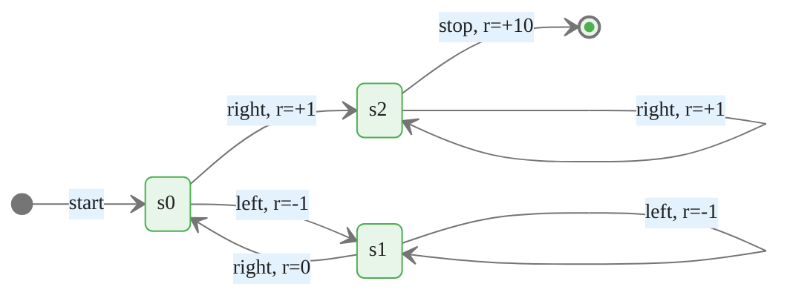
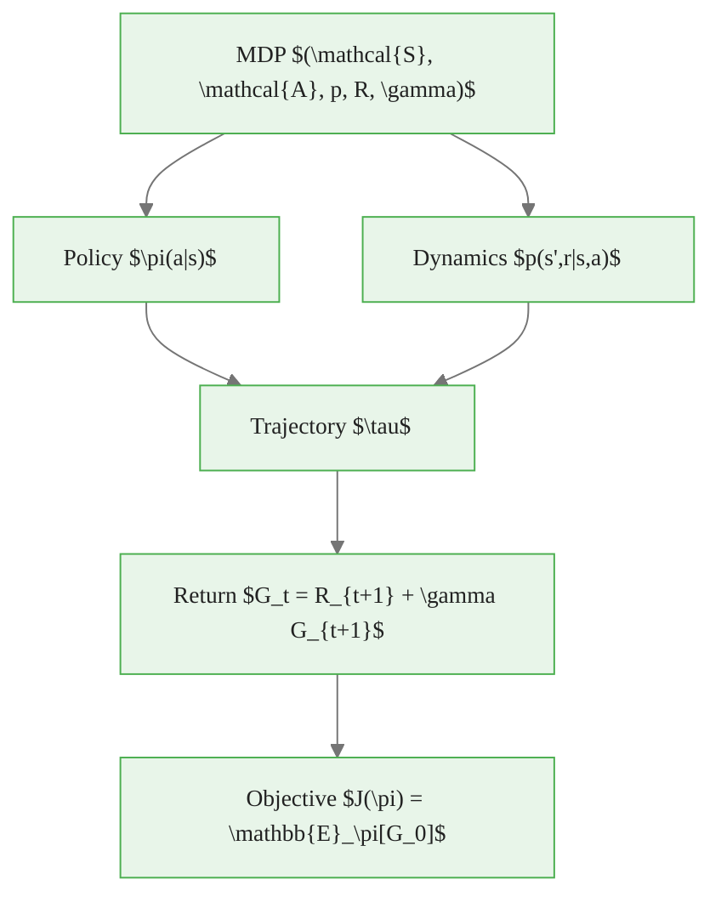

<!-- _class: lead -->

# Markov Decision Processes

## Module 00 — Foundations
### Reinforcement Learning Course

<!-- Speaker notes: This deck formalizes the intuitive agent-environment loop from Guide 01 into a precise mathematical object. The MDP is the problem formulation -- every algorithm in the course is a solution method for this problem. Emphasize that the MDP tuple is memorized early and referenced constantly: students who cannot write it from memory will struggle with the later theory. -->

---

# The MDP Tuple

A **Markov Decision Process** is a 5-tuple:

$$(\mathcal{S},\ \mathcal{A},\ p,\ R,\ \gamma)$$

| Symbol | Name | Role |
|--------|------|------|
| $\mathcal{S}$ | State space | All possible world states |
| $\mathcal{A}$ | Action space | All possible agent choices |
| $p(s',r \mid s,a)$ | Transition dynamics | How the world responds |
| $R$ | Reward function | What the agent optimizes |
| $\gamma \in [0,1)$ | Discount factor | How much future matters |


<div class="callout-insight">
<strong>Insight:</strong> This is a key takeaway from this section that connects to the broader course themes.
</div>

<!-- Speaker notes: Every quantity in RL -- value functions, policies, Bellman equations, algorithms -- is defined relative to this tuple. When students encounter a new algorithm, the first question should be: which components of the MDP does it require access to? Model-based methods need p. Model-free methods only need samples from p. The reward function R is implied by p and is often treated separately for clarity. -->

---

# The Transition Dynamics Function

$$p(s', r \mid s, a): \mathcal{S} \times \mathcal{R} \times \mathcal{S} \times \mathcal{A} \rightarrow [0, 1]$$

**Valid probability distribution** over $(s', r)$ for each $(s, a)$:

$$\sum_{s' \in \mathcal{S}} \sum_{r \in \mathcal{R}} p(s', r \mid s, a) = 1 \quad \forall s, a$$

**Derived quantities:**

$$p(s' \mid s, a) = \sum_{r} p(s', r \mid s, a) \qquad r(s,a) = \sum_{r} r \sum_{s'} p(s', r \mid s, a)$$


<div class="callout-key">
<strong>Key Point:</strong> Remember this concept — it appears repeatedly in later modules.
</div>

<!-- Speaker notes: The joint distribution p(s', r | s, a) is the complete model of the environment. Notice that the reward can depend on the next state s' as well as the current s and a. This matters in cliff-walking problems where the reward for stepping off a cliff depends on where you land. Many simplified presentations write r(s,a) directly, losing this generality. The two derived quantities -- marginal transition probabilities and expected reward -- are what the Bellman equations actually use. -->

---

# The Markov Property

$$\boxed{p(s_{t+1}, r_{t+1} \mid s_t, a_t) = p(s_{t+1}, r_{t+1} \mid s_1, a_1, \ldots, s_t, a_t)}$$

**The future is independent of the past, given the present.**

$S_t$ is a **sufficient statistic** for all past interactions.

> Without the Markov property: value functions depend on infinite history — computationally intractable.

> With the Markov property: a single state vector $s \in \mathcal{S}$ encodes everything needed.


<div class="callout-warning">
<strong>Warning:</strong> This is a common source of confusion. Pay close attention to the distinction here.
</div>

<!-- Speaker notes: This is the most important assumption in the entire course. It is also the most frequently violated in practice. When a problem is not Markovian, standard RL algorithms still run but they converge to suboptimal policies. The fix is always the same: enrich the state representation until the Markov property is approximately satisfied. In Atari games, stacking four consecutive frames creates a state where velocity is observable, making the process approximately Markovian. -->

---

# State Transition Diagram



Each arrow: one $(s, a, r, s')$ transition — the atomic unit of RL experience.


<div class="callout-info">
<strong>Info:</strong> This detail is useful context but not required to memorize.
</div>

<!-- Speaker notes: This diagram shows a deterministic 3-state MDP. In the real world most transitions are stochastic: from state s0 taking action right might lead to s2 with probability 0.9 and stay in s0 with probability 0.1 due to wind or noise. The diagram would then show multiple arrows from the same state-action pair, each labeled with its probability and reward. Stochastic transitions are what motivates the expectation operators in value functions. -->

---

# MDP as Python Dictionary

<div class="code-window">
<div class="code-header">
<div class="dots"><span class="dot-red"></span><span class="dot-yellow"></span><span class="dot-green"></span></div>
<span class="filename">example.py</span>
</div>

```python
# mdp[state][action] = [(probability, next_state, reward), ...]
mdp = {
    "s0": {
        "left":  [(1.0, "s1", -1.0)],
        "right": [(1.0, "s2",  1.0)],
    },
    "s1": {
        "left":  [(1.0, "s1", -1.0)],
        "right": [(1.0, "s0",  0.0)],
    },
    "s2": {
        "left":  [(1.0, "s0",  0.0)],
        "right": [(1.0, "s2",  1.0)],
        "stop":  [(1.0, "terminal", 10.0)],
    },
}

def expected_reward(mdp, s, a):
    return sum(p * r for p, _, r in mdp[s][a])
```
</div>

<!-- Speaker notes: This dictionary representation is a direct encoding of the p(s', r | s, a) function. The outer key is the current state s, the middle key is the action a, and each entry in the list is a (probability, next_state, reward) triple corresponding to one possible outcome. For stochastic transitions, the list would have multiple entries summing to probability 1. This is the exact data structure used in small tabular MDPs for dynamic programming. -->

---

# The Reward Hypothesis

> **All goals can be described as the maximization of the expected value of the cumulative sum of a scalar reward signal.**
>
> — Sutton & Barto

This is a **hypothesis**, not a theorem.

| What it gives us | What it omits |
|-----------------|---------------|
| Single optimization objective | Safety constraints |
| Clean mathematical formulation | Multi-objective tradeoffs |
| Provably solvable problem | Human preference alignment |

<!-- Speaker notes: The reward hypothesis is what makes RL a well-defined optimization problem. Without it, we would need a much more complex objective. The hypothesis is contested in the alignment literature: reward functions that perfectly capture human intent are hard to specify. The course proceeds under this hypothesis but the critiques are worth knowing. Reward hacking, Goodhart's Law, and reward misspecification are active research areas. -->

---

# Returns: Accumulating Reward Over Time

**General discounted return:**

$$G_t = \sum_{k=0}^{\infty} \gamma^k R_{t+k+1} = R_{t+1} + \gamma R_{t+2} + \gamma^2 R_{t+3} + \cdots$$

**Recursive decomposition** — used in every Bellman equation:

$$\boxed{G_t = R_{t+1} + \gamma G_{t+1}}$$

**For episodic tasks** (terminal time $T$):

$$G_t = \sum_{k=0}^{T-t-1} \gamma^k R_{t+k+1}$$

<!-- Speaker notes: The recursive decomposition G_t = R_{t+1} + gamma G_{t+1} is the single most important equation in the foundations. Every Bellman equation is derived from this identity. The current return equals immediate reward plus discounted future return. When we take expectations under a policy and substitute value functions, this becomes the Bellman expectation equation. When we take the max over actions, it becomes the Bellman optimality equation. Write this identity on the board and leave it there for the entire foundations module. -->

---

# The Discount Factor $\gamma$

<div class="columns">

**What $\gamma$ controls:**

| $\gamma$ | Effect |
|----------|--------|
| 0 | Only immediate reward matters |
| 0.5 | Reward 10 steps out weighted at $0.1\%$ |
| 0.9 | Reward 10 steps out weighted at $35\%$ |
| 0.99 | Reward 100 steps out weighted at $37\%$ |
| 1.0 | All rewards equal weight (episodic only) |

**Why not $\gamma = 1$ always?**
- Continuing tasks: sum may diverge
- Harder optimization landscape
- Less stable training

</div>

<!-- Speaker notes: The effect of gamma is often underappreciated. With gamma = 0.99, even 100 steps away rewards still contribute meaningfully (e^{-1} ≈ 0.37). But with gamma = 0.9, rewards 50 steps away are weighted at 0.9^50 ≈ 0.005, essentially negligible. This dramatically affects what the agent learns to optimize. In financial applications with daily data, gamma = 0.99 corresponds to caring about rewards roughly 100 days out, which is a reasonable portfolio horizon. -->

---

# Episodic vs Continuing Tasks

<div class="columns">

**Episodic**
- Terminal states exist: $\mathcal{S}^+$
- Return is finite sum
- $\gamma = 1$ is valid
- Example: one game of chess, one trading day

**Continuing**
- No terminal state
- Return must use $\gamma < 1$
- Runs indefinitely
- Example: portfolio management, process control

</div>

**Unified view:** treat terminal states as absorbing states emitting reward 0 forever. Both cases use the same return formula.

<!-- Speaker notes: The unified view is pedagogically important because the Bellman equations we derive in Guide 03 look identical for both task types when written in terms of the discounted return. The only operational difference is whether the environment calls reset() after a terminal state. In code, terminated=True signals the agent reached a natural end (value of next state is 0), while truncated=True means a time limit cut the episode (value of next state should be bootstrapped). -->

---

# Policies: Agent Behavior

A **policy** $\pi$ specifies the agent's behavior:

**Deterministic policy:** $\pi(s) = a$ — always pick the same action in state $s$

**Stochastic policy:** $\pi(a \mid s)$ — probability distribution over actions given state

$$\sum_{a \in \mathcal{A}} \pi(a \mid s) = 1 \quad \forall s \in \mathcal{S}$$

> An MDP + policy = fully specified stochastic process. Value functions are defined relative to a policy.

<!-- Speaker notes: Stochastic policies are more general than deterministic ones. Every deterministic policy is a degenerate stochastic policy (point mass on one action). Policy gradient methods work directly with stochastic policies by treating the policy as a parameterized distribution. The reason we care about stochastic policies is twofold: they enable exploration (sampling different actions) and in partially observable settings the optimal policy may genuinely be stochastic. -->

---

# Trajectories and Distributions

A **trajectory** under policy $\pi$ in MDP $M$:

$$\tau = (S_0, A_0, R_1, S_1, A_1, R_2, S_2, \ldots)$$

The probability of a trajectory is:

$$P(\tau \mid \pi) = p(S_0) \prod_{t=0}^{T-1} \pi(A_t \mid S_t) \cdot p(S_{t+1}, R_{t+1} \mid S_t, A_t)$$

The RL objective:

$$J(\pi) = \mathbb{E}_{\tau \sim \pi}[G_0] = \mathbb{E}_{\tau \sim \pi}\left[\sum_{t=0}^{\infty} \gamma^t R_{t+1}\right]$$

<!-- Speaker notes: This slide makes the optimization problem precise. We want to find the policy pi that maximizes J(pi). The trajectory probability factorizes cleanly because of the Markov property: each transition depends only on the current state and action. Policy gradient methods differentiate J(pi) with respect to the policy parameters using the log-derivative trick on this product. Model-based methods instead optimize by planning through the learned model p. -->

---

# Common Pitfalls

<div class="columns">

**Markov violation**
State must encode all relevant history.
Fix: enrich state representation or use RNNs.

**$\gamma = 1$ in continuing tasks**
Infinite sum may diverge.
Fix: always use $\gamma < 1$ unless the task is episodic.

**Conflating terminated vs truncated**
- `terminated`: natural episode end, bootstrap from 0
- `truncated`: time limit, bootstrap from $V(s)$

**Non-stationary rewards**
Rewards must be an environment property, not policy-dependent.

</div>

<!-- Speaker notes: The terminated vs truncated distinction is a common source of bugs. If a time limit ends the episode but the agent treats the last state as terminal, it incorrectly learns that the value of that state is zero. This is wrong: if the game were allowed to continue, future rewards would accrue. Modern RL libraries expose both flags separately so agents can handle them correctly. Always verify this in your environment wrapper code. -->

---

# What's Next

**Guide 03 — Bellman Equations**

Given the MDP $(\mathcal{S}, \mathcal{A}, p, R, \gamma)$ and a policy $\pi$:

- Define $V^\pi(s)$ and $Q^\pi(s, a)$ — value functions
- Derive the **Bellman expectation equations** — evaluation tool
- Derive the **Bellman optimality equations** — optimization tool
- Implement value computation for the 3-state MDP

Every RL algorithm is a method for solving or approximating these equations.

<!-- Speaker notes: The transition from this guide to Guide 03 is the transition from "what is the problem" to "how do we measure solution quality." Value functions are the answer: they assign a number to every state (or state-action pair) representing expected cumulative reward. The Bellman equations are functional equations that value functions must satisfy, and solving them yields the optimal policy. This is the theoretical core of the entire course. -->

---

<!-- _class: lead -->

# The MDP in One Diagram



<!-- Speaker notes: This diagram summarizes the entire MDP framework. The MDP specifies the problem. The policy specifies agent behavior. Together they generate trajectories. Trajectories produce returns via the recursive formula. The objective we optimize is the expected return under the policy. Every algorithm in the course is a different method for maximizing J(pi), differing in what they assume access to and how they estimate or approximate the value of J. -->
