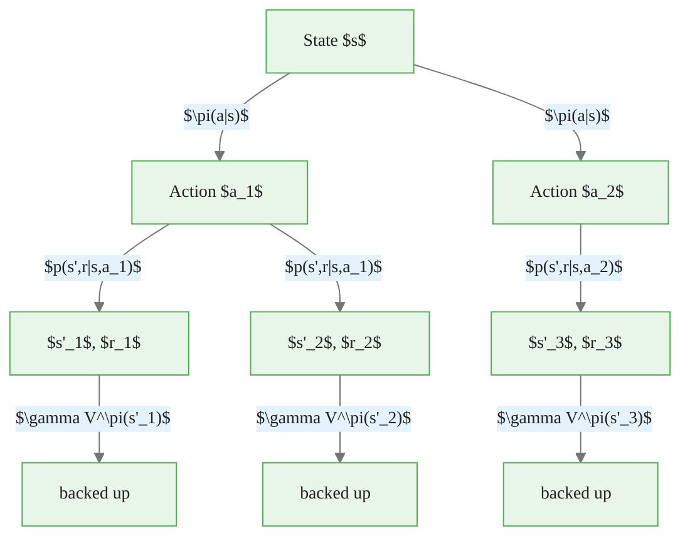

# Bellman Equations

> **Reading time:** ~10 min | **Module:** 0 — Foundations | **Prerequisites:** Probability, linear algebra

## In Brief

Bellman equations are recursive functional equations that define value functions — the expected cumulative reward an agent can obtain from any state or state-action pair. They are the analytical core of reinforcement learning: every RL algorithm is either an exact or approximate method for solving them.

<div class="callout-key">

<strong>Key Concept:</strong> Bellman equations are recursive functional equations that define value functions — the expected cumulative reward an agent can obtain from any state or state-action pair. They are the analytical core of reinforcement learning: every RL algorithm is either an exact or approximate method for solving them.

</div>


## Key Insight

The value of a state equals the immediate reward plus the discounted value of the states you land in next. This one-step recursive structure collapses an infinite-horizon problem into a set of simultaneous equations that can be solved exactly (for small MDPs) or approximated (for large ones).

---


<div class="callout-key">

<strong>Key Point:</strong> The value of a state equals the immediate reward plus the discounted value of the states you land in next.

</div>

## State-Value Function

The **state-value function** $V^\pi(s)$ under policy $\pi$ is the expected return when starting in state $s$ and following $\pi$ thereafter:

<div class="callout-key">

<strong>Key Point:</strong> The **state-value function** $V^\pi(s)$ under policy $\pi$ is the expected return when starting in state $s$ and following $\pi$ thereafter:

$$V^\pi(s) = \mathbb{E}_\pi[G_t \mid S_t = s]$$

Expanding...

</div>


$$V^\pi(s) = \mathbb{E}_\pi[G_t \mid S_t = s]$$

Expanding using $G_t = R_{t+1} + \gamma G_{t+1}$:

$$V^\pi(s) = \mathbb{E}_\pi[R_{t+1} + \gamma G_{t+1} \mid S_t = s]$$

**Interpretation:** $V^\pi(s)$ answers "how good is it to be in state $s$ when following policy $\pi$?" Good means high expected cumulative reward.

---

## Action-Value Function

The **action-value function** $Q^\pi(s, a)$ under policy $\pi$ is the expected return when starting in state $s$, taking action $a$, and following $\pi$ thereafter:

<div class="callout-info">

<strong>Info:</strong> The **action-value function** $Q^\pi(s, a)$ under policy $\pi$ is the expected return when starting in state $s$, taking action $a$, and following $\pi$ thereafter:

$$Q^\pi(s, a) = \mathbb{E}_\pi[G_t...

</div>


$$Q^\pi(s, a) = \mathbb{E}_\pi[G_t \mid S_t = s, A_t = a]$$

**Interpretation:** $Q^\pi(s, a)$ answers "how good is it to take action $a$ in state $s$ and then follow $\pi$?" This is the function Q-learning directly estimates.

**Relationship between $V^\pi$ and $Q^\pi$:**

$$V^\pi(s) = \sum_{a \in \mathcal{A}} \pi(a \mid s)\, Q^\pi(s, a)$$

The state-value is a policy-weighted average of action-values.

---

## Bellman Expectation Equation for $V^\pi$

Starting from the recursive return definition:

<div class="callout-warning">

<strong>Warning:</strong> Starting from the recursive return definition:

$$V^\pi(s) = \mathbb{E}_\pi\left[R_{t+1} + \gamma V^\pi(S_{t+1}) \mid S_t = s\right]$$

Writing out the expectations explicitly:

$$\boxed{V^\pi(s) = \s...

</div>


$$V^\pi(s) = \mathbb{E}_\pi\left[R_{t+1} + \gamma V^\pi(S_{t+1}) \mid S_t = s\right]$$

Writing out the expectations explicitly:

$$\boxed{V^\pi(s) = \sum_{a} \pi(a \mid s) \sum_{s', r} p(s', r \mid s, a)\left[r + \gamma V^\pi(s')\right]}$$

**Reading the equation:**
- $\sum_a \pi(a \mid s)$: average over actions according to the policy
- $\sum_{s', r} p(s', r \mid s, a)$: average over stochastic environment outcomes
- $r + \gamma V^\pi(s')$: immediate reward plus discounted value of next state

This is a **linear system** in $V^\pi$ — solvable exactly for finite MDPs.

---

## Bellman Expectation Equation for $Q^\pi$

$$\boxed{Q^\pi(s, a) = \sum_{s', r} p(s', r \mid s, a)\left[r + \gamma \sum_{a'} \pi(a' \mid s')\, Q^\pi(s', a')\right]}$$

**Reading the equation:**
- $\sum_{s', r} p(s', r \mid s, a)$: average over stochastic next states and rewards
- $r$: immediate reward
- $\gamma \sum_{a'} \pi(a' \mid s') Q^\pi(s', a')$: discounted value of next state under policy $\pi$ (i.e., $\gamma V^\pi(s')$)

The two Bellman expectation equations are equivalent — they encode the same information in different representations.

---

## Bellman Optimality Equations

The **optimal value functions** are:

$$V^*(s) = \max_\pi V^\pi(s) \quad \text{and} \quad Q^*(s, a) = \max_\pi Q^\pi(s, a)$$

These satisfy the **Bellman optimality equations**:

$$\boxed{V^*(s) = \max_{a} \sum_{s', r} p(s', r \mid s, a)\left[r + \gamma V^*(s')\right]}$$

$$\boxed{Q^*(s, a) = \sum_{s', r} p(s', r \mid s, a)\left[r + \gamma \max_{a'} Q^*(s', a')\right]}$$

**Critical difference from the expectation equations:** the $\sum_a \pi(a \mid s)$ is replaced by $\max_a$. The optimal agent selects the best action at every step, not a random action according to $\pi$.

---

## Optimal Policy Recovery

Once $Q^*$ is known, the optimal deterministic policy is recovered by:

$$\pi^*(s) = \arg\max_{a} Q^*(s, a)$$

Once $V^*$ is known, recovering the optimal policy requires also knowing $p$:

$$\pi^*(s) = \arg\max_{a} \sum_{s', r} p(s', r \mid s, a)\left[r + \gamma V^*(s')\right]$$

**This is why $Q^*$ is more useful than $V^*$ for model-free methods:** extracting the optimal policy from $Q^*$ requires no model of the environment; from $V^*$ it does.

---

## Backup Diagram

The Bellman equations have a natural graphical representation: the **backup diagram**.


The following implementation builds on the approach above:



The diagram shows: from state $s$, the policy branches over actions; each action branches over stochastic next states. The value of $s$ is the result of averaging over all branches and adding immediate rewards.

---

## Python Code: Value Function Computation


The following implementation builds on the approach above:

<div class="code-window">
<div class="code-header">
<div class="dots"><span class="dot-red"></span><span class="dot-yellow"></span><span class="dot-green"></span></div>

```python
import numpy as np
from typing import Dict, List, Tuple

# Type alias for MDP representation
Transitions = Dict[str, Dict[str, List[Tuple[float, str, float]]]]


def policy_evaluation(
    mdp: Transitions,
    policy: Dict[str, Dict[str, float]],
    gamma: float = 0.9,
    theta: float = 1e-8,
) -> Dict[str, float]:
    """
    Compute V^pi for a given policy via iterative policy evaluation.

    Applies the Bellman expectation equation as an update rule until
    the value function converges (max change < theta).

    Parameters
    ----------
    mdp    : MDP transition function as nested dict
    policy : policy[s][a] = probability of taking action a in state s
    gamma  : discount factor
    theta  : convergence threshold

    Returns
    -------
    V : state-value function dict mapping state -> value
    """
    # Initialize value function to zero everywhere
    V = {s: 0.0 for s in mdp}

    while True:
        delta = 0.0  # Track largest change across all states

        for s in mdp:
            if not mdp[s]:          # Skip absorbing (terminal) states
                continue

            v_old = V[s]
            v_new = 0.0

            # Bellman expectation update: V(s) = sum_a pi(a|s) sum_{s',r} p(s',r|s,a)[r + gamma*V(s')]
            for a, pi_a in policy[s].items():
                for prob, s_next, reward in mdp[s][a]:
                    v_new += pi_a * prob * (reward + gamma * V[s_next])

            V[s] = v_new
            delta = max(delta, abs(v_old - v_new))

        if delta < theta:
            break

    return V


def value_iteration(
    mdp: Transitions,
    gamma: float = 0.9,
    theta: float = 1e-8,
) -> Tuple[Dict[str, float], Dict[str, str]]:
    """
    Compute V* and pi* via value iteration.

    Applies the Bellman optimality equation as an update rule:
    V*(s) = max_a sum_{s',r} p(s',r|s,a)[r + gamma * V*(s')]

    Returns
    -------
    V_star  : optimal state-value function
    pi_star : greedy optimal policy (deterministic)
    """
    V = {s: 0.0 for s in mdp}

    while True:
        delta = 0.0

        for s in mdp:
            if not mdp[s]:
                continue

            v_old = V[s]

            # Bellman optimality update: take max over actions
            action_values = []
            for a in mdp[s]:
                q_sa = sum(
                    prob * (reward + gamma * V[s_next])
                    for prob, s_next, reward in mdp[s][a]
                )
                action_values.append((q_sa, a))

            V[s] = max(q for q, _ in action_values)
            delta = max(delta, abs(v_old - V[s]))

        if delta < theta:
            break

    # Extract greedy policy from V*
    pi_star = {}
    for s in mdp:
        if not mdp[s]:
            pi_star[s] = None
            continue
        pi_star[s] = max(
            mdp[s],
            key=lambda a: sum(
                prob * (reward + gamma * V[s_next])
                for prob, s_next, reward in mdp[s][a]
            ),
        )

    return V, pi_star


# --- Example: 3-state MDP ---

mdp = {
    "s0": {
        "left":  [(1.0, "s1", -1.0)],
        "right": [(1.0, "s2",  1.0)],
    },
    "s1": {
        "left":  [(1.0, "s1", -1.0)],
        "right": [(1.0, "s0",  0.0)],
    },
    "s2": {
        "left":  [(1.0, "s0",  0.0)],
        "right": [(1.0, "s2",  1.0)],
        "stop":  [(1.0, "terminal", 10.0)],
    },
    "terminal": {},
}

# Uniform random policy
random_policy = {
    "s0": {"left": 0.5, "right": 0.5},
    "s1": {"left": 0.5, "right": 0.5},
    "s2": {"left": 1/3, "right": 1/3, "stop": 1/3},
    "terminal": {},
}

# Evaluate random policy
V_random = policy_evaluation(mdp, random_policy, gamma=0.9)
print("V^random:")
for s, v in V_random.items():
    print(f"  V({s}) = {v:.4f}")

# Compute optimal value function and policy
V_star, pi_star = value_iteration(mdp, gamma=0.9)
print("\nV*:")
for s, v in V_star.items():
    print(f"  V*({s}) = {v:.4f}")

print("\nOptimal policy:")
for s, a in pi_star.items():
    print(f"  pi*({s}) = {a}")
```

</div>
</div>

Expected output pattern:
- $V^*(s_2) > V^*(s_0) > V^*(s_1)$: state $s_2$ is closest to the +10 goal
- $\pi^*(s_0)$ = right: moving toward $s_2$ is optimal
- $\pi^*(s_2)$ = stop: claiming the +10 reward immediately is optimal

---

## Intuitive Explanation

Think of $V^\pi(s)$ as a **score** for each square on a map, computed by imagining you stand there and execute the policy indefinitely, adding up all future rewards you collect (discounted by distance in time). States near rich rewards receive high values; states far away or near penalties receive low values.

The **Bellman equation** says: the score of where you stand equals the reward you get right now plus the discounted score of where you move next (averaged over randomness in the environment and your policy). This one-step lookahead structure means you can compute all scores simultaneously by solving a linear system.

The **optimality equation** says the same thing but replaces "where you move according to $\pi$" with "where you would move if you always chose the best available option." Solving this gives you $V^*$ — the highest achievable score from every state — and thus reveals the optimal policy.

---

## Common Pitfalls

<div class="callout-danger">

<strong>Danger:</strong> The pitfalls below are the most common mistakes practitioners make. Each one can silently degrade your results without obvious errors.

</div>

**Pitfall 1 — Bootstrapping from terminal states.**
Terminal states have $V(s_{\text{terminal}}) = 0$ by definition. Using the Bellman update to bootstrap from a terminal state value that was not explicitly zeroed causes incorrect value estimates to propagate backward through all preceding states.

<div class="callout-warning">

<strong>Warning:</strong> **Pitfall 1 — Bootstrapping from terminal states.**
Terminal states have $V(s_{\text{terminal}}) = 0$ by definition.

</div>

**Pitfall 2 — Confusing on-policy and off-policy.**
The Bellman expectation equation for $Q^\pi$ uses $\pi$ to compute the next state's value: $\sum_{a'} \pi(a' \mid s') Q^\pi(s', a')$. This is on-policy. Q-learning uses $\max_{a'} Q^*(s', a')$ — an off-policy update targeting the optimal value regardless of what the behavior policy does. Mixing these produces incorrect results.

**Pitfall 3 — Convergence of iterative policy evaluation.**
Iterative policy evaluation converges geometrically at rate $\gamma$. With $\gamma$ close to 1, convergence is very slow. A common mistake is terminating too early (large $\theta$), producing an inaccurate value function that degrades policy improvement.

**Pitfall 4 — Forgetting the expectation over both $s'$ and $r$.**
The Bellman equation averages over the joint distribution $p(s', r \mid s, a)$, not just $p(s' \mid s, a)$. If rewards are stochastic and correlated with next states, the two-argument marginalization is necessary. Separating $r$ and $s'$ as independent leads to incorrect expected reward computation.

**Pitfall 5 — Treating $Q^*$ and $V^*$ as equivalent.**
$V^*(s) = \max_a Q^*(s, a)$ holds, but $V^*$ requires knowing $p$ to extract a policy while $Q^*$ does not. Model-free methods (Q-learning, DQN) estimate $Q^*$ directly for this reason. Students who learn only $V^*$ are left with an unusable function in model-free settings.

---

## Connections


<div class="callout-info">

<strong>Info:</strong> This section maps how this guide connects to the broader course. Use these links to navigate related material.

</div>

- **Builds on:** MDP formalism (Guide 02), return definition, policy definition
- **Leads to:** Dynamic programming (policy iteration, value iteration), Monte Carlo methods, temporal-difference learning, Q-learning, policy gradients
- **Related to:** Hamilton-Jacobi-Bellman equation (continuous-time analog), linear programming formulation of MDPs

---


## Practice Questions

**Question 1 — Conceptual:** Based on the concepts in this guide, explain in your own words why the core technique matters and when you would choose it over alternatives.

**Question 2 — Application:** Sketch out how you would apply the main concept from this guide to a real-world dataset or problem you have encountered. What would you need to watch out for?


## Further Reading

- Sutton & Barto, *Reinforcement Learning* (2nd ed.), Chapter 3.5–3.8 — the definitive treatment of value functions and Bellman equations
- Bellman, R. (1957). *Dynamic Programming* — the original work; the recursive decomposition of optimal control problems
- Silver, D. (2015). *Lecture 2: Markov Decision Processes* — compact, clean derivation of both expectation and optimality equations


---

## Cross-References

<a class="link-card" href="./03_bellman_equations_slides.md">
  <div class="link-card-title">Companion Slides</div>
  <div class="link-card-description">Interactive slide deck covering the key concepts with visual examples.</div>
</a>

<a class="link-card" href="../notebooks/01_agent_environment_loop.ipynb">
  <div class="link-card-title">Hands-on Notebook</div>
  <div class="link-card-description">15-minute micro-notebook with guided exercises and real data.</div>
</a>
