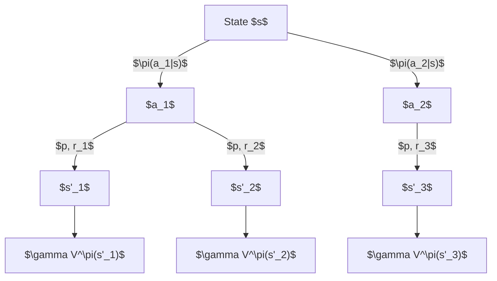
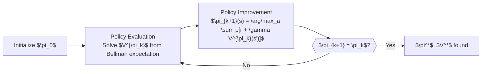
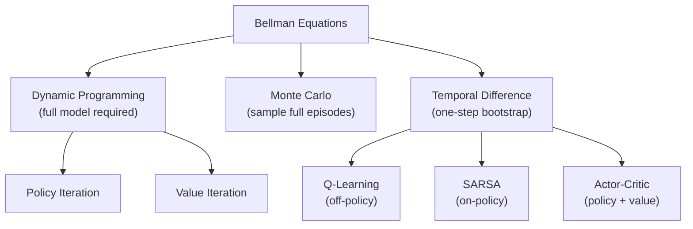

<!-- _class: lead -->

# Bellman Equations

## Module 00 — Foundations
### Reinforcement Learning Course

<!-- Speaker notes: The Bellman equations are the analytical heart of reinforcement learning. Every algorithm students will implement -- policy evaluation, Q-learning, actor-critic, PPO -- is either an exact or approximate method for solving one of the four equations on this deck. Invest time here: a student who can derive the Bellman expectation equation from scratch can reconstruct most of RL theory independently. -->

---

# Two Value Functions

**State-value function** — how good is it to be in state $s$?

$$V^\pi(s) = \mathbb{E}_\pi[G_t \mid S_t = s]$$

**Action-value function** — how good is it to take action $a$ in state $s$?

$$Q^\pi(s, a) = \mathbb{E}_\pi[G_t \mid S_t = s, A_t = a]$$

**Relationship:**

$$V^\pi(s) = \sum_{a} \pi(a \mid s)\, Q^\pi(s, a)$$

<!-- Speaker notes: The state-value function V answers "what is the expected return from this state?" The action-value function Q answers "what is the expected return from this state if I first take this specific action?" Q is strictly more informative than V -- it tells you both the value of the state and which action is responsible. This is why Q-learning is so powerful: knowing Q* immediately tells you the optimal action without needing a model of the environment. -->

---

# Deriving the Bellman Expectation Equation

Start from $G_t = R_{t+1} + \gamma G_{t+1}$:

$$V^\pi(s) = \mathbb{E}_\pi[R_{t+1} + \gamma G_{t+1} \mid S_t = s]$$

Split the expectation and substitute $V^\pi(s') = \mathbb{E}_\pi[G_{t+1} \mid S_{t+1} = s']$:

$$V^\pi(s) = \mathbb{E}_\pi[R_{t+1} + \gamma V^\pi(S_{t+1}) \mid S_t = s]$$

Write out expectations explicitly (using MDP dynamics and policy):

$$\boxed{V^\pi(s) = \sum_{a} \pi(a \mid s) \sum_{s', r} p(s', r \mid s, a)\left[r + \gamma V^\pi(s')\right]}$$

<!-- Speaker notes: Walk through each step slowly. The key substitution is replacing E_pi[G_{t+1} | S_{t+1} = s'] with V^pi(s'). This is valid because G_{t+1} under policy pi, conditioned on being in state s' at time t+1, has the same distribution as G_t conditioned on S_t = s'. This is the Markov property doing the heavy lifting. The final equation is linear in V^pi -- the unknowns V^pi(s) appear on both sides. For |S| states this gives |S| linear equations in |S| unknowns. -->

---

# Bellman Expectation: $V^\pi$ Unpacked

$$V^\pi(s) = \underbrace{\sum_{a} \pi(a \mid s)}_{\text{average over policy}} \underbrace{\sum_{s', r} p(s', r \mid s, a)}_{\text{average over dynamics}} \underbrace{\left[r + \gamma V^\pi(s')\right]}_{\text{immediate + future}}$$

Three layers of averaging:
1. **Policy** $\pi(a \mid s)$: which action does the agent take?
2. **Dynamics** $p(s', r \mid s, a)$: where does the environment send us?
3. **Recursion** $r + \gamma V^\pi(s')$: immediate reward plus future value

<!-- Speaker notes: This decomposition maps directly to the backup diagram. The first average is the agent's choice -- stochastic if using a stochastic policy. The second average is environmental stochasticity -- even deterministic actions may have uncertain outcomes. The third term is the Bellman recursion that connects the value of s to the values of successor states. In deterministic environments with deterministic policies, both sums collapse to single terms and the equation simplifies to V^pi(s) = r(s, pi(s)) + gamma V^pi(s'). -->

---

# Bellman Expectation: $Q^\pi$

$$\boxed{Q^\pi(s, a) = \sum_{s', r} p(s', r \mid s, a)\left[r + \gamma \sum_{a'} \pi(a' \mid s')\, Q^\pi(s', a')\right]}$$

Note: $\sum_{a'} \pi(a' \mid s') Q^\pi(s', a') = V^\pi(s')$

So equivalently:

$$Q^\pi(s, a) = \sum_{s', r} p(s', r \mid s, a)\left[r + \gamma V^\pi(s')\right]$$

<!-- Speaker notes: The Q^pi Bellman equation differs from V^pi in that the first sum over actions is gone -- the action a is given (we condition on it). The remaining sum averages over stochastic next states and rewards. The inner sum over a-prime brings in the policy again for the next-step action selection. This equation is what SARSA uses as its target: it evaluates Q under the current policy by bootstrapping from the current Q estimates. -->

---

# Backup Diagram



The value of $s$ is the **backed-up** value from all successor states.

<!-- Speaker notes: The backup diagram is named because information flows backward (upward in this diagram) from future states to the current state. In dynamic programming, we compute values for all states and then back up those values to compute values for predecessor states. This backward information flow is what makes Bellman equations solvable: we can work from terminal states backward through the state space. In model-free RL, we do one-step backups using sampled transitions rather than the full sum over all successors. -->

---

# Bellman Optimality: $V^*$

The **optimal state-value function**:

$$V^*(s) = \max_\pi V^\pi(s) = \max_a \mathbb{E}\left[R_{t+1} + \gamma V^*(S_{t+1}) \mid S_t=s, A_t=a\right]$$

Writing out explicitly:

$$\boxed{V^*(s) = \max_{a} \sum_{s', r} p(s', r \mid s, a)\left[r + \gamma V^*(s')\right]}$$

**Key change:** $\sum_a \pi(a \mid s)$ becomes $\max_a$ — no averaging over actions, take the best one.

<!-- Speaker notes: The Bellman optimality equation is a nonlinear equation because of the max operator. Unlike the linear expectation equations, it cannot be solved by direct matrix inversion. Value iteration solves it by iterating the Bellman operator as a contraction mapping: starting from any bounded value function, repeated application of the operator converges to V* at rate gamma. This convergence proof relies on the Banach fixed-point theorem. -->

---

# Bellman Optimality: $Q^*$

The **optimal action-value function**:

$$\boxed{Q^*(s, a) = \sum_{s', r} p(s', r \mid s, a)\left[r + \gamma \max_{a'} Q^*(s', a')\right]}$$

**Optimal policy recovery** — no model needed:

$$\pi^*(s) = \arg\max_{a} Q^*(s, a)$$

This is the equation **Q-learning** (and DQN) directly targets.

<!-- Speaker notes: The Q* equation is the most practically important equation in model-free RL. Every model-free RL algorithm that learns a Q-function -- Q-learning, SARSA, DQN, C51, Rainbow -- is approximating Q* by repeatedly applying a version of this equation to sampled transitions. The max over a-prime in the target is the "off-policy" character of Q-learning: we always target the greedy action regardless of what the behavior policy did. This off-policy nature enables experience replay, which is crucial for DQN's stability. -->

---

# Expectation vs Optimality: Side by Side

<div class="columns">

**Bellman Expectation (on-policy)**

$$V^\pi(s) = \sum_a \pi(a|s) \sum_{s',r} p(s',r|s,a)$$
$$\quad \times \left[r + \gamma V^\pi(s')\right]$$

Evaluates a given policy $\pi$

Linear system — solve by matrix inversion or iteration

Used by: policy evaluation, SARSA

**Bellman Optimality (off-policy)**

$$V^*(s) = \max_a \sum_{s',r} p(s',r|s,a)$$
$$\quad \times \left[r + \gamma V^*(s')\right]$$

Finds the best possible policy

Nonlinear — solve by value iteration or model-free methods

Used by: value iteration, Q-learning, DQN

</div>

<!-- Speaker notes: The expectation equations evaluate a specific policy -- they answer "if I follow policy pi forever, what return do I get from each state?" The optimality equations find the best possible policy -- they answer "what is the maximum return achievable from each state over all possible policies?" Policy iteration alternates between solving the expectation equation (policy evaluation) and improving the policy greedily (policy improvement). Value iteration solves the optimality equation directly. -->

---

# Policy Iteration: Using Both Equations



Policy iteration converges in **finite steps** for finite MDPs.

<!-- Speaker notes: Policy iteration is provably convergent and typically converges in far fewer iterations than value iteration, even though each iteration is more expensive (requires full policy evaluation). The intuition is that the policy space is finite for finite MDPs, so the sequence of improving policies must terminate. Each policy improvement step strictly improves the policy (or confirms it is already optimal), and there are only finitely many policies to consider. In practice, approximate policy iteration (with early stopping of evaluation) is used in large-scale settings. -->

---

# Value Iteration in Code

```python
def value_iteration(mdp, gamma=0.9, theta=1e-8):
    """Apply Bellman optimality equation as update rule."""
    V = {s: 0.0 for s in mdp}

    while True:
        delta = 0.0
        for s in mdp:
            if not mdp[s]:          # terminal state
                continue

            # Bellman optimality update: V(s) = max_a Q(s,a)
            v_new = max(
                sum(prob * (r + gamma * V[s_next])
                    for prob, s_next, r in mdp[s][a])
                for a in mdp[s]
            )
            delta = max(delta, abs(V[s] - v_new))
            V[s] = v_new

        if delta < theta:   # converged
            break
    return V
```

<!-- Speaker notes: Value iteration applies the Bellman optimality operator T* repeatedly: V_{k+1} = T* V_k. Each application brings V_k one step closer to V* because T* is a contraction mapping with contraction factor gamma. After k iterations, the error satisfies ||V_k - V*|| <= gamma^k ||V_0 - V*||. With gamma = 0.99 and starting from zero, you need about 460 iterations to get within 0.01 of V*. With gamma = 0.9, only 44 iterations are needed. This is another reason to prefer smaller gamma in practice. -->

---

# Iterative Policy Evaluation in Code

```python
def policy_evaluation(mdp, policy, gamma=0.9, theta=1e-8):
    """Apply Bellman expectation equation as update rule."""
    V = {s: 0.0 for s in mdp}

    while True:
        delta = 0.0
        for s in mdp:
            if not mdp[s]:
                continue

            # Bellman expectation update: V(s) = sum_a pi(a|s) Q(s,a)
            v_new = sum(
                policy[s][a] * sum(
                    prob * (r + gamma * V[s_next])
                    for prob, s_next, r in mdp[s][a]
                )
                for a in policy[s]
            )
            delta = max(delta, abs(V[s] - v_new))
            V[s] = v_new

        if delta < theta:
            break
    return V
```

<!-- Speaker notes: Policy evaluation is a linear fixed-point iteration. The Bellman expectation operator T^pi is a contraction mapping with factor gamma, so iterating V_{k+1} = T^pi V_k converges to V^pi regardless of the starting value function. The convergence is in the sup norm: ||V_k - V^pi||_infinity <= gamma^k ||V_0 - V^pi||_infinity. This linear convergence rate is slower than the quadratic convergence of Newton's method but guaranteed to work. The stopping condition delta < theta controls accuracy of the final approximation. -->

---

# Common Pitfalls

<div class="columns">

**Bootstrap from terminal states**
Set $V(\text{terminal}) = 0$ explicitly.
Forgetting this propagates errors backward through all states.

**On-policy vs off-policy confusion**
SARSA: targets $Q^\pi$ using next action from $\pi$
Q-learning: targets $Q^*$ using $\max_{a'}$
Mixing them gives neither — and incorrect values.

**Early termination of policy evaluation**
Large $\theta$ gives inaccurate $V^{\pi_k}$.
Inaccurate $V$ produces wrong policy improvement.

**Stochastic rewards**
$\sum_{s',r} p(s',r|s,a)[\cdot]$ averages over reward randomness.
Using only $p(s'|s,a)$ with $r(s,a)$ is an approximation — valid only for deterministic rewards.

</div>

<!-- Speaker notes: The on-policy vs off-policy pitfall is particularly important because it affects which Bellman equation to use. SARSA is on-policy: it evaluates the policy being used for behavior. Q-learning is off-policy: it evaluates the greedy policy regardless of behavior. Both can converge to Q*, but Q-learning is more sample efficient because it learns from any behavior policy (enabling experience replay). SARSA is safer in environments where off-policy exploration can lead to catastrophic states. -->

---

# From Bellman to RL Algorithms



<!-- Speaker notes: Every algorithm in the course is a node on this diagram. Dynamic programming methods solve the Bellman equations exactly using the full model p. Monte Carlo methods estimate value functions by averaging complete episode returns -- no bootstrapping, no model needed. TD methods are the middle ground: they use one-step samples (no complete episodes) and bootstrap from current value estimates. Most modern deep RL (DQN, PPO, SAC) uses TD methods because they work in continuing tasks, are online, and are sample efficient. -->

---

# What's Next

**Module 01 — Tabular Methods**
- Policy evaluation with exact dynamic programming
- Policy iteration: alternating evaluation and improvement
- Q-learning and SARSA on small grid worlds
- Proven to find $\pi^*$ for finite MDPs

**Module 02 — Function Approximation**
- Value functions parametrized as neural networks
- Stochastic gradient descent on Bellman error
- Deep Q-Network (DQN): extending Q-learning to large state spaces

The Bellman equations you learned here are the **target** every algorithm tries to satisfy.

<!-- Speaker notes: The remainder of the course can be summarized as: how do we solve the Bellman optimality equations when the state space is too large for exact computation? Module 01 solves them exactly for small MDPs using dynamic programming. Module 02 approximates them using neural networks. Modules 03 and 04 cover policy gradient methods which optimize J(pi) directly rather than solving Bellman equations, but still rely on Bellman bootstrapping for the critic component in actor-critic architectures. -->

---

<!-- _class: lead -->

# The Four Bellman Equations

$$V^\pi(s) = \sum_a \pi(a|s) \sum_{s',r} p(s',r|s,a)\left[r + \gamma V^\pi(s')\right]$$

$$Q^\pi(s,a) = \sum_{s',r} p(s',r|s,a)\left[r + \gamma \sum_{a'} \pi(a'|s') Q^\pi(s',a')\right]$$

$$V^*(s) = \max_a \sum_{s',r} p(s',r|s,a)\left[r + \gamma V^*(s')\right]$$

$$Q^*(s,a) = \sum_{s',r} p(s',r|s,a)\left[r + \gamma \max_{a'} Q^*(s',a')\right]$$

<!-- Speaker notes: These four equations are the foundation of all RL theory. The first two evaluate a given policy. The last two find the optimal policy. The difference between rows 1 and 3, and between rows 2 and 4, is exactly the replacement of the policy average with a maximum. Every subsequent algorithm is an approximation to one of these four equations, tailored to specific constraints on compute, model access, and sample availability. Students should be able to write all four from memory by end of this module. -->
