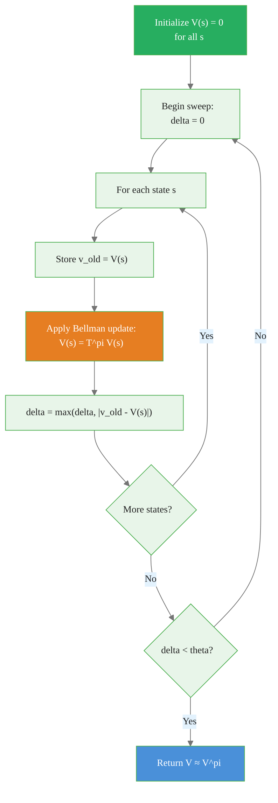

# Policy Evaluation: Computing Value Under a Fixed Policy

> **Reading time:** ~9 min | **Module:** 1 — Dynamic Programming | **Prerequisites:** Module 0

## In Brief

Policy evaluation answers the question: "How good is this policy?" Given a fixed policy $\pi$, iterative policy evaluation computes the state-value function $V^\pi$ by repeatedly applying the Bellman expectation equation until convergence. It is the foundation on which policy improvement and policy iteration are built.

<div class="callout-insight">
<strong>Insight:</strong> We cannot solve the Bellman equation in closed form for large state spaces, but we can solve it iteratively. Each sweep of all states brings $V_k$ closer to the true $V^\pi$ — and the contraction mapping theorem guarantees we arrive.
</div>

<div class="callout-key">
<strong>Key Concept:</strong> Policy evaluation answers the question: "How good is this policy?" Given a fixed policy $\pi$, iterative policy evaluation computes the state-value function $V^\pi$ by repeatedly applying the Bellman expectation equation until convergence. It is the foundation on which policy improvement and policy iteration are built.
</div>


---

## Intuitive Explanation

Think of the value function as a consensus estimate of long-run reward starting from each state. At initialization, every state's value is zero — we have no information. After the first sweep, states adjacent to high-reward transitions get a small positive signal. After the second sweep, states two steps away pick up that signal, discounted by $\gamma$. This propagation continues outward like ripples in a pond until the estimates stop changing — that fixed point is $V^\pi$.

<div class="callout-insight">
<strong>Insight:</strong> Think of the value function as a consensus estimate of long-run reward starting from each state.
</div>


The analogy: estimating average commute times in a city. On day 1 you have no data. You start measuring. Each day your estimates improve. Eventually, with enough data, the estimates stabilize. The Bellman update is the formal version of this incremental refinement.

---


## Formal Definition

### The Bellman Expectation Equation

<div class="callout-key">
<strong>Key Point:</strong> ### The Bellman Expectation Equation

For a policy $\pi$ and discount factor $\gamma \in [0, 1)$, the true value function $V^\pi$ satisfies:

$$V^\pi(s) = \sum_a \pi(a|s) \sum_{s', r} p(s', r | s, a)\...
</div>


For a policy $\pi$ and discount factor $\gamma \in [0, 1)$, the true value function $V^\pi$ satisfies:

$$V^\pi(s) = \sum_a \pi(a|s) \sum_{s', r} p(s', r | s, a)\bigl[r + \gamma V^\pi(s')\bigr] \quad \forall s \in \mathcal{S}$$

where:
- $s$ — current state
- $a$ — action taken
- $\pi(a|s)$ — probability of choosing action $a$ in state $s$ under policy $\pi$
- $p(s', r | s, a)$ — environment dynamics: probability of transitioning to $s'$ and receiving reward $r$
- $\gamma$ — discount factor weighting future rewards
- $V^\pi(s')$ — value of the successor state

This is a system of $|\mathcal{S}|$ linear equations in $|\mathcal{S}|$ unknowns. Iterative policy evaluation solves it without matrix inversion.

### The Iterative Update Rule

Starting from an arbitrary initialization $V_0$ (commonly all zeros), apply the update:

$$\boxed{V_{k+1}(s) = \sum_a \pi(a|s) \sum_{s', r} p(s', r | s, a)\bigl[r + \gamma V_k(s')\bigr]}$$

Each application of this rule is called a **sweep** through the state space.

---


## Convergence: The Contraction Mapping Theorem

The update operator $\mathcal{T}^\pi$ defined by the right-hand side of the Bellman equation is a **contraction mapping** on the space of bounded functions under the $\sup$-norm:

$$\|\mathcal{T}^\pi V - \mathcal{T}^\pi U\|_\infty \leq \gamma \|V - U\|_\infty$$

Because $\gamma < 1$, repeated application of $\mathcal{T}^\pi$ shrinks the distance between any two candidate value functions by factor $\gamma$ per sweep. By the Banach fixed-point theorem, iterating from any starting point $V_0$ converges to the unique fixed point $V^\pi$.

**Practical consequence:** After $k$ sweeps, the error satisfies:

$$\|V_k - V^\pi\|_\infty \leq \frac{\gamma^k}{1 - \gamma} \|V_1 - V_0\|_\infty$$

We stop when $\|V_{k+1} - V_k\|_\infty < \theta$ for a small threshold $\theta$.

---

## Synchronous vs Asynchronous Updates

### Synchronous (Standard)

All state values are updated simultaneously using $V_k$ to compute $V_{k+1}$. Two arrays are maintained:

- Read from $V_k$ to compute all new values
- Write into $V_{k+1}$

This is the textbook version. Every sweep uses a consistent snapshot.

### Asynchronous

States are updated in any order, and each update immediately uses the latest available values (in-place). Only one array is needed.

| Property | Synchronous | Asynchronous |
|---|---|---|
| Memory | Two arrays of size $|\mathcal{S}|$ | One array |
| Convergence speed | Slower (stale reads) | Often faster (fresh reads) |
| Parallelism | Easy to parallelize | Requires care |
| Convergence guarantee | Yes (if $\gamma < 1$) | Yes (with appropriate ordering) |

In-place asynchronous updates typically converge faster in practice because new information propagates immediately rather than waiting for the next sweep.

---


<div class="compare">
<div class="compare-card">
<div class="header before">Synchronous</div>
<div class="body">

See detailed comparison in the table above.

</div>
</div>
<div class="compare-card">
<div class="header after">Asynchronous Updates</div>
<div class="body">

See detailed comparison in the table above.

</div>
</div>
</div>

## Algorithm

### Pseudocode

```
Initialize V(s) = 0 for all s in S (or any bounded values)
Set threshold theta > 0 (e.g., 1e-6)

Repeat:
    delta = 0
    For each s in S:
        v_old = V(s)
        V(s) = sum over a of [
            pi(a|s) * sum over (s', r) of [
                p(s', r | s, a) * (r + gamma * V(s'))
            ]
        ]
        delta = max(delta, |v_old - V(s)|)
Until delta < theta

Return V (approximately V^pi)
```

### Mermaid Flowchart

<div class="code-window">
<div class="code-header">
<div class="dots"><span class="dot-red"></span><span class="dot-yellow"></span><span class="dot-green"></span></div>
<span class="filename">example.py</span>
</div>

The following implementation builds on the approach above:


</div>

---

## Code Implementation

<div class="code-window">
<div class="code-header">
<div class="dots"><span class="dot-red"></span><span class="dot-yellow"></span><span class="dot-green"></span></div>
<span class="filename">example.py</span>
</div>

The following implementation builds on the approach above:

```python
import numpy as np


def policy_evaluation(
    pi,          # pi[s, a] = probability of action a in state s
    P,           # P[s, a, s_next] = transition probability
    R,           # R[s, a, s_next] = reward received
    gamma=0.99,
    theta=1e-6,
    in_place=True,
):
    """
    Iterative policy evaluation (Sutton & Barto, Chapter 4).

    Parameters
    ----------
    pi    : ndarray of shape (n_states, n_actions)
    P     : ndarray of shape (n_states, n_actions, n_states)
    R     : ndarray of shape (n_states, n_actions, n_states)
    gamma : discount factor in [0, 1)
    theta : convergence threshold
    in_place : if True, update V in-place (asynchronous); else synchronous

    Returns
    -------
    V : ndarray of shape (n_states,) — V^pi
    """
    n_states = pi.shape[0]
    V = np.zeros(n_states)

    sweep = 0
    while True:
        delta = 0.0
        V_new = V if in_place else np.zeros(n_states)

        for s in range(n_states):
            v_old = V[s]
            # Bellman expectation: sum_a pi(a|s) * sum_s' P(s'|s,a)[R + gamma*V(s')]
            v_new = np.sum(
                pi[s, :, None] * P[s] * (R[s] + gamma * V[None, :]),
            )
            V_new[s] = v_new
            delta = max(delta, abs(v_old - v_new))

        if not in_place:
            V = V_new

        sweep += 1
        if delta < theta:
            break

    print(f"Converged in {sweep} sweeps (delta={delta:.2e})")
    return V


# --- Simple 4-state chain example ---
# States: 0, 1, 2, 3 (terminal)
# Actions: 0=left, 1=right (deterministic)
# Policy: always go right (pi[s,1]=1)

n_s, n_a = 4, 2
pi = np.zeros((n_s, n_a))
pi[:, 1] = 1.0  # always right

P = np.zeros((n_s, n_a, n_s))
R = np.zeros((n_s, n_a, n_s))

# Transitions: right moves s -> s+1 (clamped at terminal)
for s in range(n_s - 1):
    P[s, 1, s + 1] = 1.0
    R[s, 1, s + 1] = -1.0  # step cost
P[n_s - 1, 1, n_s - 1] = 1.0  # terminal self-loop

# Left is treated as staying in place for simplicity
for s in range(n_s):
    P[s, 0, s] = 1.0

V_pi = policy_evaluation(pi, P, R, gamma=0.9)
print("V^pi:", V_pi.round(3))
# Expected: values decrease toward terminal state
```
</div>

---

## Common Pitfalls

<div class="callout-danger">
<strong>Danger:</strong> The pitfalls below are the most common mistakes practitioners make. Each one can silently degrade your results without obvious errors.
</div>

### 1. Forgetting to discount future values

<div class="callout-warning">
<strong>Warning:</strong> ### 1.
</div>

The update must include $\gamma V_k(s')$, not just $V_k(s')$. Omitting $\gamma$ causes divergence when the environment has long cycles.

### 2. Stopping too early

If $\theta$ is too large, the returned $V$ may be a poor approximation of $V^\pi$. For policy iteration to work correctly, policy evaluation must run until the values are sufficiently accurate. A rule of thumb: use $\theta \leq 10^{-6}$ for small MDPs.

### 3. Using synchronous updates but a single array

Reading from and writing to the same array during a sweep mixes old and new values unpredictably. Either maintain two arrays (synchronous) or explicitly commit to in-place (asynchronous).

### 4. Not handling terminal states

Terminal states have $V^\pi(s_\text{terminal}) = 0$ by definition. Ensure they are excluded from the update (or that their self-loop transition gives zero reward).

### 5. Wrong indexing of the dynamics

The dynamics $p(s', r | s, a)$ are indexed by $(s, a, s')$. A transposed array silently produces wrong results.

---

## Connections


<div class="callout-info">
<strong>Info:</strong> This section maps how this guide connects to the broader course. Use these links to navigate related material.
</div>

- **Builds on:** Markov Decision Processes (MDP formulation), Bellman equations, discount factors
- **Leads to:** Policy improvement (Guide 02), policy iteration (Guide 02), value iteration (Guide 03)
- **Related to:** Temporal-difference learning (TD(0) is the model-free online version of policy evaluation)

---


## Practice Questions

**Question 1 — Conceptual:** Based on the concepts in this guide, explain in your own words why the core technique matters and when you would choose it over alternatives.

**Question 2 — Application:** Sketch out how you would apply the main concept from this guide to a real-world dataset or problem you have encountered. What would you need to watch out for?


## Further Reading

- Sutton & Barto (2018), *Reinforcement Learning: An Introduction*, 2nd ed., Section 4.1
- Puterman (1994), *Markov Decision Processes*, Chapter 6 — rigorous contraction proofs
- Bertsekas (2012), *Dynamic Programming and Optimal Control*, Vol. 1 — general treatment


---

## Cross-References

<a class="link-card" href="./01_policy_evaluation_slides.md">
  <div class="link-card-title">Companion Slides</div>
  <div class="link-card-description">Interactive slide deck covering the key concepts with visual examples.</div>
</a>

<a class="link-card" href="../notebooks/01_policy_evaluation.ipynb">
  <div class="link-card-title">Hands-on Notebook</div>
  <div class="link-card-description">15-minute micro-notebook with guided exercises and real data.</div>
</a>
