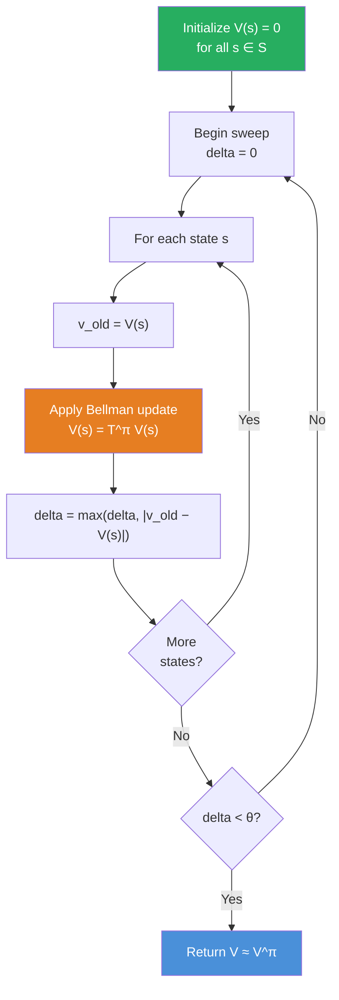
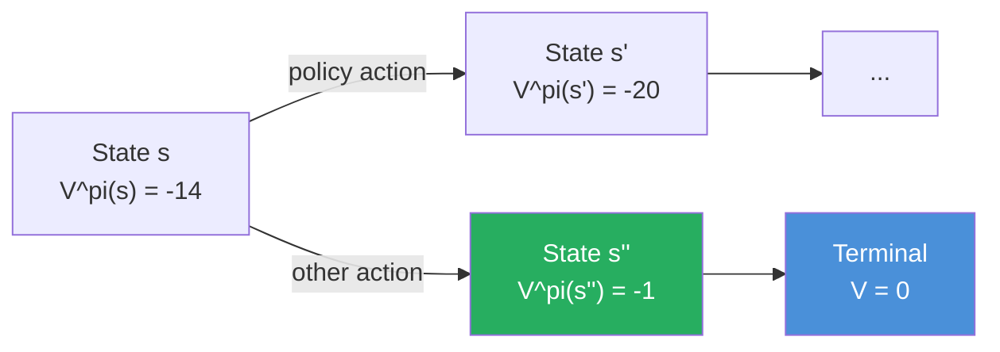
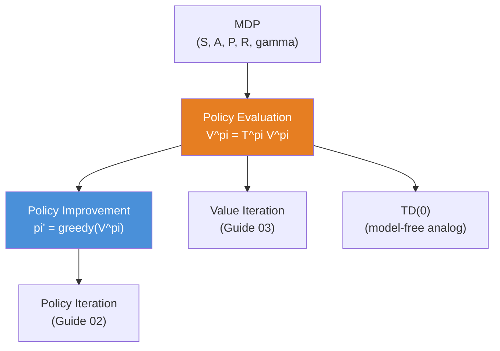

<!-- _class: lead -->

# Policy Evaluation
## Computing $V^\pi$ Iteratively

**Module 1 — Dynamic Programming**

<!-- Speaker notes: Welcome to Policy Evaluation. This is the first of three DP algorithms we will study. The goal is to compute how good a fixed policy is — assigning a numerical value to every state. Estimated time: 35-40 minutes. -->

---

## Why We Need Policy Evaluation

Before we can improve a policy, we need to measure it.

> **Core question:** Given a policy $\pi$, how much long-run reward does the agent expect from each state?

The answer is the **state-value function** $V^\pi(s)$ — the expected cumulative discounted reward starting from state $s$ and following $\pi$ thereafter.

$$V^\pi(s) = \mathbb{E}_\pi\!\left[\sum_{t=0}^\infty \gamma^t R_t \;\Big|\; S_0 = s\right]$$

<!-- Speaker notes: Emphasize that policy evaluation is not about finding the best policy — it is about evaluating a given one. We must be able to measure quality before we can improve it. Ask students: "How would you estimate V^pi without a model?" to foreshadow model-free methods later in the course. -->

---

## The Bellman Expectation Equation

$V^\pi$ is the unique solution to this system of linear equations:

$$V^\pi(s) = \sum_a \pi(a|s) \sum_{s', r} p(s', r \mid s, a)\bigl[r + \gamma V^\pi(s')\bigr]$$

| Symbol | Meaning |
|--------|---------|
| $\pi(a\|s)$ | Probability of action $a$ in state $s$ |
| $p(s', r \mid s, a)$ | Transition dynamics |
| $r$ | Immediate reward |
| $\gamma$ | Discount factor |
| $V^\pi(s')$ | Value of successor state |

<!-- Speaker notes: Walk through the equation term by term. The double sum says: for every action the policy might take, for every outcome the environment might produce, weight the value by both probabilities. Point out that this is a self-referential equation — V appears on both sides — which is why we need iteration. -->

---

## The Iterative Update Rule

We cannot solve the Bellman equation analytically for large state spaces. Instead, iterate:

$$\boxed{V_{k+1}(s) = \sum_a \pi(a|s) \sum_{s', r} p(s', r \mid s, a)\bigl[r + \gamma V_k(s')\bigr]}$$

- Start: $V_0(s) = 0$ for all $s$
- Each pass through all states is a **sweep**
- Repeat sweeps until $\max_s |V_{k+1}(s) - V_k(s)| < \theta$

<!-- Speaker notes: This update rule is the heart of the algorithm. The key insight is that even though we don't know V^pi, we can use our current best guess V_k in place of it. The error shrinks with each sweep because of the contraction property — coming up on the next slide. -->

---

## Convergence: Contraction Mapping

The Bellman operator $\mathcal{T}^\pi$ is a **$\gamma$-contraction** in the sup-norm:

$$\|\mathcal{T}^\pi V - \mathcal{T}^\pi U\|_\infty \leq \gamma \|V - U\|_\infty$$

Because $\gamma < 1$:
- Any two value estimates move closer together each sweep
- The unique fixed point $V^\pi$ is the limit
- Error bound after $k$ sweeps: $\|V_k - V^\pi\|_\infty \leq \dfrac{\gamma^k}{1-\gamma}\|V_1 - V_0\|_\infty$

> Initialization does not matter — convergence is guaranteed.

<!-- Speaker notes: This is the mathematical guarantee that the algorithm works. The contraction factor gamma means each sweep multiplies the remaining error by gamma. If gamma=0.9, after 100 sweeps the error is 0.9^100 ≈ 2.6e-5 times the initial error. Students who have seen fixed-point iteration in numerical methods will recognize this structure. -->

---

## Algorithm: Policy Evaluation



<!-- Speaker notes: Trace through the flowchart step by step. delta tracks the largest change seen in the current sweep. The outer loop (sweep) continues until no state changes by more than theta. In-place updates — writing to V immediately — are the asynchronous variant shown here. -->

---

## Synchronous vs Asynchronous Updates

<div class="columns">

**Synchronous**
- Maintain two arrays: $V_k$ and $V_{k+1}$
- Read from $V_k$, write to $V_{k+1}$
- Swap after each full sweep
- Consistent snapshot per sweep

**Asynchronous (in-place)**
- Single array $V$
- New value immediately available to later states in same sweep
- Typically converges in fewer sweeps
- Sufficient for correctness with any ordering

</div>

| Property | Synchronous | Asynchronous |
|---|---|---|
| Memory | $2\|\mathcal{S}\|$ | $\|\mathcal{S}\|$ |
| Speed | Slower | Faster in practice |
| Parallelism | Simple | Requires coordination |

<!-- Speaker notes: Both variants converge to V^pi. The synchronous version is easier to reason about theoretically. The asynchronous version is preferred in practice because fresh values propagate immediately. For example, if state 5 updates and state 6 depends on state 5, state 6 gets the new value within the same sweep rather than waiting for the next one. -->

---

## Code: Core Update Loop

```python
import numpy as np

def policy_evaluation(pi, P, R, gamma=0.99, theta=1e-6):
    """
    pi[s, a]       = probability of action a in state s
    P[s, a, s']    = transition probability
    R[s, a, s']    = reward for that transition
    """
    n_states = pi.shape[0]
    V = np.zeros(n_states)

    while True:
        delta = 0.0
        for s in range(n_states):
            v_old = V[s]
            # Bellman expectation operator T^pi applied to V
            V[s] = np.sum(
                pi[s, :, None] * P[s] * (R[s] + gamma * V)
            )
            delta = max(delta, abs(v_old - V[s]))
        if delta < theta:
            break

    return V
```

<!-- Speaker notes: Walk through the code line by line. The critical line is the numpy expression for V[s]: pi[s, :, None] broadcasts action probabilities across successor states, P[s] provides transition probs, and R[s] + gamma * V gives the one-step backup target. Ask students to verify the indexing matches the Bellman equation. -->

---

## Worked Example: 4x4 Gridworld

States 0-14 (non-terminal), state 15 (terminal). Policy: equal probability on all four actions. $\gamma = 1$.

```python
# 4x4 gridworld with uniform random policy
# Reward = -1 on every step until terminal
# After ~300 sweeps, V^pi converges

# Approximate values (from Sutton & Barto Fig. 4.1):
# Corner states: V ≈ -14  (far from terminal)
# States adjacent to terminal: V ≈ -1
```

```
 -14  -20  -22  -14
 -20  -22  -22  -14    <- V^pi for each state
 -22  -22  -20  -14
 -14  -14  -14    0    <- terminal (bottom-right)
```

The values reflect expected steps to reach the terminal state.

<!-- Speaker notes: The 4x4 gridworld is the canonical example from Sutton & Barto Figure 4.1. Under the uniform random policy, corner states far from the terminal get very negative values because the random walk takes many steps to reach the goal. This example builds intuition for what the value function means geometrically. -->

---

## What the Values Tell Us



$V^\pi(s)$ encodes long-run quality, not just immediate reward.

- Higher (less negative) value = better position under $\pi$
- The **difference** between values drives policy improvement (next guide)

<!-- Speaker notes: This slide bridges policy evaluation to policy improvement. The values are not interesting by themselves — what matters is how they compare across states and actions. If following action a leads to a state with higher V, we should take action a more often. That is exactly policy improvement. -->

---

## Convergence in Practice

```python
# Track max delta per sweep to visualize convergence
deltas = []
V = np.zeros(n_states)
for sweep in range(500):
    delta = 0.0
    for s in range(n_states):
        v_old = V[s]
        V[s] = bellman_update(s, V, pi, P, R, gamma)
        delta = max(delta, abs(v_old - V[s]))
    deltas.append(delta)
    if delta < 1e-6:
        print(f"Converged at sweep {sweep}")
        break

import matplotlib.pyplot as plt
plt.semilogy(deltas)
plt.xlabel("Sweep")
plt.ylabel("Max |V_{k+1} - V_k|")
plt.title("Policy Evaluation Convergence")
```

The log-linear decay confirms geometric convergence at rate $\gamma$.

<!-- Speaker notes: Encourage students to run this and observe that the convergence curve is approximately a straight line on the log scale. The slope is log(gamma). This is a direct visual confirmation of the contraction mapping theorem. Deviations from linearity in the early sweeps are due to the transient before the asymptotic regime. -->

---

## Common Pitfalls

**Pitfall 1: Missing $\gamma$ in the update**
$V_{k+1}(s) = \sum_a \pi(a|s) \sum_{s',r} p(s',r|s,a)[r + V_k(s')]$ diverges when the chain has cycles. Always include $\gamma$.

**Pitfall 2: Threshold $\theta$ too large**
If $\theta = 0.1$, policy evaluation stops early and policy iteration may cycle or converge to a suboptimal policy.

**Pitfall 3: Terminal states not handled**
Terminal states must have $V = 0$ and be excluded from updates (or have self-loops with zero reward).

**Pitfall 4: Transposed dynamics array**
$p[s, a, s']$ vs $p[s', a, s]$ — a silent bug that produces plausible-looking but wrong values.

<!-- Speaker notes: These four pitfalls come from real implementation errors. Pitfall 1 is the most dangerous because it causes unbounded growth rather than a crash, making it hard to detect. Pitfall 4 is subtle because the code runs without error — the values just converge to the wrong answer. Recommend always verifying on a 2-3 state MDP with known analytical solution. -->

---

## Key Takeaways

1. **Bellman expectation** — $V^\pi$ satisfies $V^\pi = \mathcal{T}^\pi V^\pi$; iteration solves it
2. **Contraction mapping** — convergence is guaranteed for any $\gamma < 1$, any initialization
3. **Sweep = one pass** through all states applying the Bellman update
4. **Synchronous vs asynchronous** — both correct; asynchronous typically faster
5. **Stop at $\delta < \theta$** — not at a fixed number of sweeps

> Policy evaluation alone is not useful. Its value comes from combining it with **policy improvement** — which is exactly what we cover next.

<!-- Speaker notes: Summarize the five key ideas. Emphasize the last point: policy evaluation is a subroutine, not an end goal. The real DP algorithms — policy iteration and value iteration — use policy evaluation as a building block. Preview that in policy iteration we will alternate between evaluation and improvement until the policy stabilizes. -->

---

## Connections



**References:** Sutton & Barto (2018), Section 4.1 — Bertsekas (2012), Chapter 1

<!-- Speaker notes: The connections diagram shows where policy evaluation sits in the broader RL landscape. Everything in this module builds on policy evaluation. Model-free methods like TD(0) are the sample-based analog — instead of summing over all (s', r) pairs using the model, TD uses a single observed transition. That connection will be revisited in the TD learning module. -->

---

<!-- _class: lead -->

# Up Next: Policy Improvement

Given $V^\pi$, how do we find a better policy?

**Guide 02 — Policy Iteration**

<!-- Speaker notes: Transition slide. We have computed V^pi. The natural question is: can we use those values to find a better policy? Yes — and the mechanism is the policy improvement theorem, which guarantees that acting greedily with respect to V^pi never makes things worse. -->
