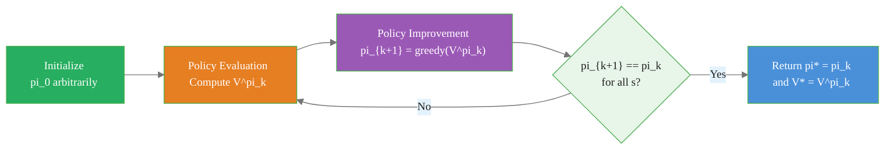

# Policy Iteration: Alternating Evaluation and Improvement

> **Reading time:** ~9 min | **Module:** 1 — Dynamic Programming | **Prerequisites:** Module 0

## In Brief

Policy iteration finds an optimal policy by repeatedly alternating two steps: (1) evaluate the current policy to get $V^\pi$, and (2) improve the policy greedily with respect to $V^\pi$. The algorithm is guaranteed to converge to an optimal policy $\pi^*$ in a finite number of iterations because the state space is finite and policy quality is monotonically non-decreasing.

<div class="callout-insight">

<strong>Insight:</strong> Each improvement step produces a policy that is at least as good as the current one — and strictly better unless the current policy is already optimal. Because there are only finitely many deterministic policies, the sequence must terminate.

</div>

<div class="callout-key">

<strong>Key Concept:</strong> Policy iteration finds an optimal policy by repeatedly alternating two steps: (1) evaluate the current policy to get $V^\pi$, and (2) improve the policy greedily with respect to $V^\pi$. The algorithm is guaranteed to converge to an optimal policy $\pi^*$ in a finite number of iterations because the state space is finite and policy quality is monotonically non-decreasing.

</div>


---

## Intuitive Explanation

Imagine you manage a logistics fleet and need to assign routes to drivers. Today you tell every driver: "follow route plan $\pi$." After a week, you measure the average fuel cost from each starting depot — that is $V^\pi$. Now you ask: "Given these measurements, is there a better route from depot $s$?" For each depot, you compute which route leads to lower total fuel cost (immediate cost plus future costs). You tell drivers to switch to the better route wherever one exists. This is the improvement step. Next week you measure again. You keep iterating until no driver switches.

<div class="callout-insight">

<strong>Insight:</strong> Imagine you manage a logistics fleet and need to assign routes to drivers.

</div>


The key guarantee: each week's measurement is honest (we compute $V^\pi$ to convergence) and each switch is beneficial (the policy improvement theorem ensures no route gets worse). So the process must terminate.

---


## Formal Definition

### The Policy Iteration Loop

<div class="callout-key">

<strong>Key Point:</strong> ### The Policy Iteration Loop

Starting from any initial policy $\pi_0$:

1.

</div>


Starting from any initial policy $\pi_0$:

1. **Policy Evaluation:** Compute $V^{\pi_k}$ by running iterative policy evaluation to convergence.
2. **Policy Improvement:** Compute a new policy $\pi_{k+1}$ by acting greedily with respect to $V^{\pi_k}$:

$$\pi_{k+1}(s) = \arg\max_a \sum_{s', r} p(s', r \mid s, a)\bigl[r + \gamma V^{\pi_k}(s')\bigr]$$

Or equivalently:

$$\pi_{k+1}(s) = \arg\max_a Q^{\pi_k}(s, a)$$

where the action-value function is:

$$Q^{\pi_k}(s, a) = \sum_{s', r} p(s', r \mid s, a)\bigl[r + \gamma V^{\pi_k}(s')\bigr]$$

Repeat until $\pi_{k+1} = \pi_k$ (the policy is stable).

---


## The Policy Improvement Theorem

**Theorem (Sutton & Barto, Theorem 4.2).** Let $\pi$ and $\pi'$ be any pair of deterministic policies such that for all $s \in \mathcal{S}$:

<div class="callout-info">

<strong>Info:</strong> **Theorem (Sutton & Barto, Theorem 4.2).** Let $\pi$ and $\pi'$ be any pair of deterministic policies such that for all $s \in \mathcal{S}$:

$$Q^\pi(s, \pi'(s)) \geq V^\pi(s)$$

Then $\pi'$ is at lea...

</div>


$$Q^\pi(s, \pi'(s)) \geq V^\pi(s)$$

Then $\pi'$ is at least as good as $\pi$: $V^{\pi'}(s) \geq V^\pi(s)$ for all $s$.

### Proof Sketch

By the assumption:

$$V^\pi(s) \leq Q^\pi(s, \pi'(s)) = \sum_{s',r} p(s',r|s,\pi'(s))[r + \gamma V^\pi(s')]$$

Applying this inequality recursively to the right-hand side (substituting $s' \to s$):

$$\leq \sum_{s',r} p(s',r|s,\pi'(s))\left[r + \gamma \sum_{s'',r'} p(s'',r'|s',\pi'(s'))[r' + \gamma^2 V^\pi(s'')]\right]$$

Continuing indefinitely (using $\gamma < 1$ to ensure the geometric sum converges):

$$\leq \mathbb{E}_{\pi'}\left[\sum_{t=0}^\infty \gamma^t R_t \,\Big|\, S_0 = s\right] = V^{\pi'}(s)$$

### Corollary: Optimality Condition

If $Q^\pi(s, \pi'(s)) = V^\pi(s)$ for all $s$ (i.e., the greedy policy $\pi'$ equals the current policy $\pi$), then $V^\pi = V^*$ and $\pi$ is optimal.

---

## Greedy Policy Improvement

The greedy improvement step selects the action with the highest $Q$-value:

$$\pi'(s) = \arg\max_a Q^\pi(s, a) = \arg\max_a \sum_{s', r} p(s', r \mid s, a)\bigl[r + \gamma V^\pi(s')\bigr]$$

This is guaranteed to satisfy the hypothesis of the policy improvement theorem, because:

$$Q^\pi(s, \pi'(s)) = \max_a Q^\pi(s, a) \geq Q^\pi(s, \pi(s)) = V^\pi(s)$$

The last equality holds because $V^\pi(s) = Q^\pi(s, \pi(s))$ for deterministic $\pi$.

---

## Convergence to the Optimal Policy

**Finite convergence.** A deterministic policy maps $\mathcal{S} \to \mathcal{A}$. There are at most $|\mathcal{A}|^{|\mathcal{S}|}$ distinct deterministic policies. Since:
1. Each iteration produces a policy $\pi_{k+1}$ with $V^{\pi_{k+1}}(s) \geq V^{\pi_k}(s)$ for all $s$
2. The value function can only take finitely many distinct values
3. The same policy cannot appear twice (that would require re-evaluation to the same values followed by the same greedy step, which would mean the improvement step found no improvement — the stopping condition)

The sequence $\pi_0, \pi_1, \ldots$ must terminate in a finite number of steps at an optimal policy $\pi^*$.

---

## The Policy Iteration Cycle


The following implementation builds on the approach above:



The two phases alternate until stability. Stability implies optimality by the policy improvement theorem.

---

## Algorithm

### Pseudocode

```
Initialize pi(s) arbitrarily for all s in S

Repeat:
    # --- Policy Evaluation ---
    Run iterative policy evaluation to get V ≈ V^pi
    (to convergence: max_s |V_{k+1}(s) - V_k(s)| < theta)

    # --- Policy Improvement ---
    policy_stable = True
    For each s in S:
        old_action = pi(s)
        pi(s) = argmax_a sum_{s',r} p(s',r|s,a) * [r + gamma * V(s')]
        if old_action != pi(s):
            policy_stable = False

Until policy_stable

Return pi, V
```

---

## Code Implementation


The following implementation builds on the approach above:

<div class="code-window">
<div class="code-header">
<div class="dots"><span class="dot-red"></span><span class="dot-yellow"></span><span class="dot-green"></span></div>

```python
import numpy as np


def policy_evaluation(pi, P, R, gamma, theta=1e-8):
    """Compute V^pi for deterministic policy pi (pi[s] = action index)."""
    n_states = P.shape[0]
    V = np.zeros(n_states)
    while True:
        delta = 0.0
        for s in range(n_states):
            a = pi[s]
            # Single-action Bellman update for deterministic policy
            v_new = np.sum(P[s, a] * (R[s, a] + gamma * V))
            delta = max(delta, abs(V[s] - v_new))
            V[s] = v_new
        if delta < theta:
            break
    return V


def policy_improvement(V, P, R, gamma):
    """Return greedy policy with respect to V."""
    n_states, n_actions = P.shape[:2]
    # Q(s, a) = sum_{s'} P[s,a,s'] * (R[s,a,s'] + gamma * V[s'])
    Q = np.sum(P * (R + gamma * V[None, None, :]), axis=2)  # (n_states, n_actions)
    return np.argmax(Q, axis=1)  # deterministic greedy policy


def policy_iteration(P, R, gamma=0.99, theta=1e-8):
    """
    Full policy iteration algorithm (Sutton & Barto, Chapter 4).

    Parameters
    ----------
    P : ndarray of shape (n_states, n_actions, n_states)
    R : ndarray of shape (n_states, n_actions, n_states)
    gamma : discount factor
    theta : policy evaluation convergence threshold

    Returns
    -------
    pi_star : optimal deterministic policy, shape (n_states,)
    V_star  : optimal value function, shape (n_states,)
    """
    n_states = P.shape[0]
    # Initialize with arbitrary policy (action 0 everywhere)
    pi = np.zeros(n_states, dtype=int)

    iteration = 0
    while True:
        # Step 1: Policy Evaluation
        V = policy_evaluation(pi, P, R, gamma, theta)

        # Step 2: Policy Improvement
        pi_new = policy_improvement(V, P, R, gamma)

        iteration += 1
        if np.all(pi_new == pi):
            print(f"Policy iteration converged in {iteration} iterations.")
            return pi, V

        pi = pi_new


# --- Frozen Lake 4x4 example (simplified, no slippage) ---

# Build a small deterministic gridworld to demonstrate
n_states, n_actions = 16, 4  # 4x4 grid, actions: 0=up,1=down,2=left,3=right

# (Transition and reward matrices would be defined based on grid structure)

# pi_star, V_star = policy_iteration(P, R, gamma=0.99)
```

</div>
</div>

---

## Complexity and Practical Notes

### Per-Iteration Cost

| Step | Complexity |
|---|---|
| Policy Evaluation | $O(|\mathcal{S}|^2 |\mathcal{A}|)$ per sweep × number of sweeps |
| Policy Improvement | $O(|\mathcal{S}|^2 |\mathcal{A}|)$ — single pass |

### Modified Policy Iteration

Full policy evaluation (running to convergence) is expensive. **Modified policy iteration** stops evaluation after $m$ sweeps instead of waiting for convergence:

- $m = 1$ sweep recovers value iteration exactly
- $m = \infty$ sweeps is standard policy iteration
- $m$ in between often works well in practice

The guarantee: policy quality still monotonically improves, and convergence to $\pi^*$ is preserved.

---

## Common Pitfalls

<div class="callout-danger">

<strong>Danger:</strong> The pitfalls below are the most common mistakes practitioners make. Each one can silently degrade your results without obvious errors.

</div>

### 1. Evaluating the policy only partially

<div class="callout-warning">

<strong>Warning:</strong> ### 1.

</div>

If evaluation stops too early (large $\theta$ or few sweeps), the improvement step gets inaccurate $Q$-values and may make bad greedy choices, slowing or disrupting convergence.

### 2. Comparing policies by value, not action

The stopping condition is $\pi_{k+1}(s) = \pi_k(s)$ for all $s$ — not that $V^{\pi_{k+1}} \approx V^{\pi_k}$. Two different policies can produce similar values but still not be the same policy; checking value convergence can falsely stop too early.

### 3. Ties in the argmax

When multiple actions achieve the maximum $Q$-value, any consistent tie-breaking rule works. Breaking ties randomly is fine — just be consistent within the run.

### 4. Conflating policy iteration with value iteration

Policy iteration requires complete policy evaluation between improvements. Value iteration does a single Bellman optimality step. They are not the same algorithm.

### 5. Assuming convergence in one iteration

On small MDPs you may see policy iteration converge in 2-5 iterations, creating the impression it is always that fast. On larger MDPs with long planning horizons and $\gamma$ close to 1, it may require dozens of iterations.

---

## Connections


<div class="callout-info">

<strong>Info:</strong> This section maps how this guide connects to the broader course. Use these links to navigate related material.

</div>

- **Builds on:** Iterative policy evaluation (Guide 01), Bellman equations, MDP formulation
- **Leads to:** Value iteration (Guide 03, which collapses the two steps into one), modified policy iteration
- **Related to:** Howard's policy improvement (the original formulation in operations research), linear programming for MDPs

---


## Practice Questions

**Question 1 — Conceptual:** Based on the concepts in this guide, explain in your own words why the core technique matters and when you would choose it over alternatives.

**Question 2 — Application:** Sketch out how you would apply the main concept from this guide to a real-world dataset or problem you have encountered. What would you need to watch out for?


## Further Reading

- Sutton & Barto (2018), *Reinforcement Learning: An Introduction*, 2nd ed., Section 4.3
- Howard (1960), *Dynamic Programming and Markov Processes* — the original algorithm
- Puterman (1994), *Markov Decision Processes*, Chapter 6 — complete convergence proofs
- Bertsekas & Tsitsiklis (1996), *Neuro-Dynamic Programming*, Chapter 2


---

## Cross-References

<a class="link-card" href="./02_policy_iteration_slides.md">
  <div class="link-card-title">Companion Slides</div>
  <div class="link-card-description">Interactive slide deck covering the key concepts with visual examples.</div>
</a>

<a class="link-card" href="../notebooks/01_policy_evaluation.ipynb">
  <div class="link-card-title">Hands-on Notebook</div>
  <div class="link-card-description">15-minute micro-notebook with guided exercises and real data.</div>
</a>
