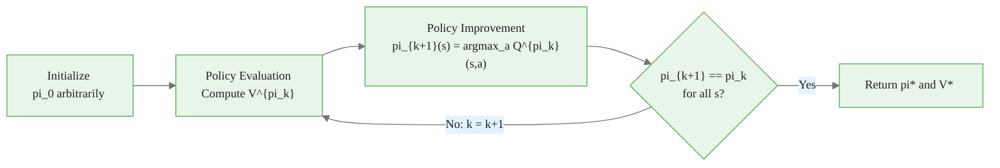
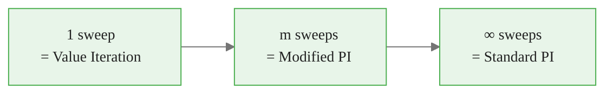
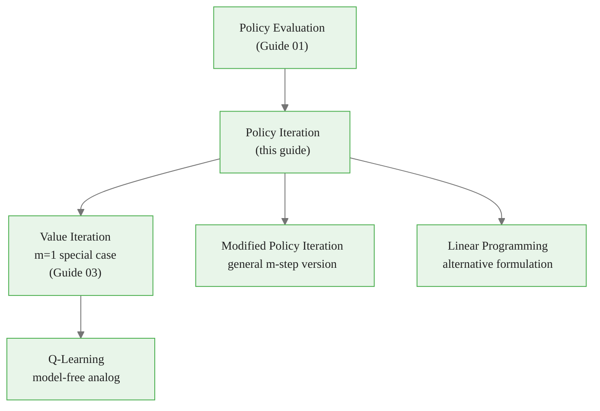

<!-- _class: lead -->

# Policy Iteration
## Alternating Evaluation and Improvement

**Module 1 — Dynamic Programming**

<!-- Speaker notes: Welcome to Policy Iteration. This guide builds directly on policy evaluation. The key idea is simple: evaluate your current policy honestly, then greedily improve it. Alternate until no improvement is possible. The policy improvement theorem guarantees this terminates at the optimal policy. Estimated time: 40 minutes. -->

---

## The Central Question

Policy evaluation gives us $V^\pi$ — but that is not the goal. The goal is:

$$\pi^* = \arg\max_\pi V^\pi(s) \quad \forall s$$

**Policy iteration** finds $\pi^*$ by alternating:

1. **Evaluate** — compute $V^{\pi_k}$ (how good is the current policy?)
2. **Improve** — compute $\pi_{k+1} = \text{greedy}(V^{\pi_k})$ (act greedily on what we learned)

Repeat until the policy stops changing.


<div class="callout-insight">
<strong>Insight:</strong> This is a key takeaway from this section that connects to the broader course themes.
</div>

<!-- Speaker notes: Policy evaluation answered "how good is this policy?" Policy iteration answers "what is the best policy?" The algorithm is conceptually simple: measure, improve, repeat. The mathematical content of this guide is the policy improvement theorem, which proves this procedure can only get better. -->

---

## The Policy Improvement Step

Given $V^\pi$, define the action-value function:

$$Q^\pi(s, a) = \sum_{s', r} p(s', r \mid s, a)\bigl[r + \gamma V^\pi(s')\bigr]$$

The greedy improved policy is:

$$\boxed{\pi'(s) = \arg\max_a Q^\pi(s, a)}$$

$Q^\pi(s, a)$ answers: "What is the value of taking action $a$ in state $s$, then following $\pi$ thereafter?"


<div class="callout-key">
<strong>Key Point:</strong> Remember this concept — it appears repeatedly in later modules.
</div>

<!-- Speaker notes: The Q-function is the bridge between V^pi and the improvement step. It asks: what happens if I deviate from pi for exactly one step, then return to following pi? If any such deviation looks better than V^pi(s), we should make that deviation permanent — which is exactly what the greedy step does. -->

---

## Policy Improvement Theorem

**Theorem.** If for all $s \in \mathcal{S}$:

$$Q^\pi(s, \pi'(s)) \geq V^\pi(s)$$

then $V^{\pi'}(s) \geq V^\pi(s)$ for all $s$. That is, $\pi'$ is at least as good as $\pi$.

### Why the greedy policy satisfies this

$$Q^\pi(s, \pi'(s)) = \max_a Q^\pi(s, a) \geq Q^\pi(s, \pi(s)) = V^\pi(s)$$

The first inequality holds because we take the max. The final equality holds because $V^\pi(s) = Q^\pi(s, \pi(s))$ for deterministic $\pi$.


<div class="callout-warning">
<strong>Warning:</strong> This is a common source of confusion. Pay close attention to the distinction here.
</div>

<!-- Speaker notes: The theorem says: if a new policy does at least as well as the old policy at every state for one step, then it does at least as well everywhere over the infinite horizon. The proof extends the one-step advantage recursively using the Bellman equations. The key consequence: the greedy policy always satisfies the theorem's hypothesis, so improvement never makes things worse. -->

---

## Proof Sketch: One Step to Infinite Horizon

$$V^\pi(s) \leq Q^\pi(s, \pi'(s))$$
$$= \mathbb{E}\bigl[R_{t+1} + \gamma V^\pi(S_{t+1}) \mid S_t=s, A_t=\pi'(s)\bigr]$$
$$\leq \mathbb{E}\bigl[R_{t+1} + \gamma Q^\pi(S_{t+1}, \pi'(S_{t+1})) \mid S_t=s, A_t=\pi'(s)\bigr]$$
$$\leq \mathbb{E}_{\pi'}\bigl[R_{t+1} + \gamma R_{t+2} + \gamma^2 Q^\pi(S_{t+2}, \pi'(S_{t+2})) \mid S_t=s\bigr]$$
$$\vdots$$
$$\leq \mathbb{E}_{\pi'}\!\left[\sum_{k=0}^\infty \gamma^k R_{t+k+1} \;\Big|\; S_t = s\right] = V^{\pi'}(s)$$

Each row applies the hypothesis one step further into the future.


<div class="callout-info">
<strong>Info:</strong> This detail is useful context but not required to memorize.
</div>

<!-- Speaker notes: This is the telescoping argument. At each step we apply the hypothesis Q^pi(s, pi'(s)) >= V^pi(s) one step further. Because gamma < 1, the series converges and we get V^{pi'}(s) on the right. Walk through this slowly — students who have not seen this before often find it surprising that a one-step condition implies an infinite-horizon result. -->

---

## Optimality Condition

**When does improvement stop?**

If $\pi'(s) = \pi(s)$ for all $s$ (no action changed), then:

$$V^\pi(s) = \max_a Q^\pi(s, a) = \max_a \sum_{s',r} p(s',r|s,a)[r + \gamma V^\pi(s')]$$

This is the **Bellman optimality equation**. Its solution is $V^* = V^\pi$ and $\pi = \pi^*$.

> Policy stability implies optimality — we have found $\pi^*$.

<!-- Speaker notes: This is the elegance of policy iteration: the stopping condition is not just a heuristic — it is a proof of optimality. If the greedy step produces the same policy we started with, we have verified that the current policy satisfies the Bellman optimality equation, which characterizes the unique optimal value function. -->

---

## The Full Cycle



<!-- Speaker notes: Trace through the cycle. The key property is the arrow from "No" back to evaluation — we go back and evaluate the NEW policy, not the old one. This is critical: after improvement, the current policy has changed, so the old V^pi is no longer valid and must be recomputed. -->

---

## Finite Convergence Guarantee

Why must the sequence $\pi_0, \pi_1, \pi_2, \ldots$ terminate?

- There are at most $|\mathcal{A}|^{|\mathcal{S}|}$ deterministic policies (finite)
- Each iteration: $V^{\pi_{k+1}} \geq V^{\pi_k}$ (monotone non-decreasing)
- If $\pi_{k+1} \neq \pi_k$: strict improvement in at least one state
- The same policy cannot repeat (that would violate strict improvement)
- Therefore the sequence must terminate

**In practice:** converges in far fewer than $|\mathcal{A}|^{|\mathcal{S}|}$ iterations — often 5-20 on moderate MDPs.

<!-- Speaker notes: The combinatorial bound is loose. In practice, the number of policy iteration steps is much smaller — often O(n log n) empirically, though the exact complexity depends on the MDP structure. The important point is that finite convergence is guaranteed, not just convergence in the limit. This is different from value iteration, which converges asymptotically. -->

---

## Code: Policy Evaluation (Deterministic Policy)

<div class="code-window">
<div class="code-header">
<div class="dots"><span class="dot-red"></span><span class="dot-yellow"></span><span class="dot-green"></span></div>
<span class="filename">example.py</span>
</div>

```python
import numpy as np

def policy_evaluation(pi, P, R, gamma, theta=1e-8):
    """
    pi[s]       = action taken in state s (deterministic)
    P[s, a, s'] = transition probability
    R[s, a, s'] = reward for that transition
    """
    n_states = P.shape[0]
    V = np.zeros(n_states)
    while True:
        delta = 0.0
        for s in range(n_states):
            a = pi[s]
            # V(s) = sum_{s'} P(s'|s,a) * [R(s,a,s') + gamma * V(s')]
            v_new = np.sum(P[s, a] * (R[s, a] + gamma * V))
            delta = max(delta, abs(V[s] - v_new))
            V[s] = v_new
        if delta < theta:
            return V
```
</div>

<!-- Speaker notes: For a deterministic policy, the Bellman expectation simplifies: the sum over actions collapses to a single term (the action the policy selects). Point out that pi[s] indexes directly into the action dimension of P and R, making the inner computation a simple dot product. -->

---

## Code: Policy Improvement

<div class="code-window">
<div class="code-header">
<div class="dots"><span class="dot-red"></span><span class="dot-yellow"></span><span class="dot-green"></span></div>
<span class="filename">example.py</span>
</div>

```python
def policy_improvement(V, P, R, gamma):
    """Return greedy deterministic policy with respect to V."""
    # Q[s, a] = sum_{s'} P[s,a,s'] * (R[s,a,s'] + gamma * V[s'])
    Q = np.sum(P * (R + gamma * V[None, None, :]), axis=2)
    return np.argmax(Q, axis=1)  # shape: (n_states,)


def policy_iteration(P, R, gamma=0.99):
    """Full policy iteration."""
    n_states = P.shape[0]
    pi = np.zeros(n_states, dtype=int)   # start with action 0 everywhere

    for iteration in range(1000):
        V = policy_evaluation(pi, P, R, gamma)
        pi_new = policy_improvement(V, P, R, gamma)
        if np.all(pi_new == pi):
            print(f"Converged in {iteration + 1} iterations.")
            return pi, V
        pi = pi_new

    raise RuntimeError("Did not converge")
```
</div>

<!-- Speaker notes: The policy_improvement function computes the full Q-table in one vectorized numpy operation. The broadcasting: V[None, None, :] expands V to shape (1, 1, n_states) so it can be added to R of shape (n_states, n_actions, n_states). The sum over axis=2 marginalizes over s'. Ask students to verify the shapes. -->

---

## Worked Example: Recycling Robot

States: High battery (H), Low battery (L)
Actions: Search, Wait, Recharge

After running policy iteration on the Sutton & Barto recycling robot example ($\gamma = 0.9$):

| Iteration | $\pi(H)$ | $\pi(L)$ | $V(H)$ | $V(L)$ |
|---|---|---|---|---|
| 0 | Wait | Wait | 1.0 | 1.0 |
| 1 | Search | Recharge | 11.3 | 7.1 |
| 2 | Search | Search | 14.2 | 8.9 |
| 3 | Search | Search | 14.2 | 8.9 |

Iteration 3: policy unchanged $\to$ optimal policy found.

<!-- Speaker notes: The recycling robot is a classic 2-state example from S&B Section 3.7. Walk through each iteration: starting from the trivially bad "always wait" policy, one improvement step discovers that searching is better from the high-battery state. The second improvement discovers that searching (not recharging) is better from low battery too. The third confirms stability. This shows why policy iteration often converges in very few steps. -->

---

## Modified Policy Iteration

Full evaluation (to convergence) is expensive. What if we stop after $m$ sweeps?



| $m$ sweeps | Algorithm | Convergence |
|---|---|---|
| 1 | Value iteration | Asymptotic (not finite) |
| Moderate | Modified policy iteration | Asymptotic, often fast |
| $\infty$ | Standard policy iteration | Finite (exact) |

All variants converge to $V^*$ and $\pi^*$.

<!-- Speaker notes: Modified policy iteration is an important practical insight: you don't need to run evaluation all the way to convergence. Even a handful of sweeps between improvement steps often works well. At the extreme of m=1, you get value iteration — which we study in Guide 03. This unifies the three algorithms: they are all special cases of the same general scheme. -->

---

## Common Pitfalls

**Pitfall 1: Checking value convergence instead of policy stability**
$V^{\pi_{k+1}} \approx V^{\pi_k}$ does not mean $\pi_{k+1} = \pi_k$. The stopping condition must check actions.

**Pitfall 2: Reusing the old value function after improvement**
After the policy changes, the old $V^\pi$ is invalid. Always re-evaluate the new policy.

**Pitfall 3: Assuming "more evaluation = better"**
Truncating evaluation (modified policy iteration) can converge faster in practice. Full evaluation is a design choice, not a necessity.

**Pitfall 4: Forgetting that argmax may not be unique**
Any tie-breaking rule works — but be consistent. Random tie-breaking between sweeps can cause the policy stability check to oscillate.

<!-- Speaker notes: Pitfall 2 is the most conceptually important. A common mistake is to run one sweep of evaluation, then improve, then run one more sweep — but using the stale values from the previous policy. The correct structure is: evaluate to convergence, improve, evaluate the NEW policy to convergence, improve again. -->

---

## Policy vs Value Iteration: Preview

| Property | Policy Iteration | Value Iteration |
|---|---|---|
| Per-iteration cost | High (full evaluation) | Low (one Bellman step) |
| Iterations to converge | Few (typically < 20) | Many (can be hundreds) |
| Convergence type | Finite (exact) | Asymptotic |
| Implementation complexity | Moderate | Simple |
| Best when | $\|\mathcal{S}\|$ small, $\gamma$ close to 1 | $\|\mathcal{S}\|$ large |

We study value iteration in Guide 03.

<!-- Speaker notes: This preview table helps students understand why both algorithms exist. Policy iteration converges in fewer iterations but each iteration is expensive because of the full evaluation step. Value iteration iterates more times but each iteration is cheap. On large state spaces, value iteration's lower per-iteration cost wins out. -->

---

## Key Takeaways

1. **Alternation:** Evaluate $V^{\pi_k}$, then improve greedily to get $\pi_{k+1}$
2. **Policy improvement theorem:** Greedy improvement never makes things worse
3. **Optimality at convergence:** Policy stability $\Rightarrow$ Bellman optimality $\Rightarrow$ $\pi^*$ found
4. **Finite convergence:** At most $|\mathcal{A}|^{|\mathcal{S}|}$ iterations; in practice far fewer
5. **Modified PI:** Truncating evaluation to $m$ sweeps still converges — value iteration is $m=1$

<!-- Speaker notes: Summarize the five key ideas. Stress point 3: policy stability is not just a convenient stopping rule, it is a proof of optimality. This is one of the elegant results in reinforcement learning theory. Preview that value iteration, covered next, is the limiting case of modified policy iteration with m=1. -->

<div class="flow">
<div class="flow-step mint">Alternation:</div>
<div class="flow-arrow">&#8594;</div>
<div class="flow-step amber">Policy improvement theore...</div>
<div class="flow-arrow">&#8594;</div>
<div class="flow-step blue">Optimality at convergence...</div>
<div class="flow-arrow">&#8594;</div>
<div class="flow-step lavender">Finite convergence:</div>
<div class="flow-arrow">&#8594;</div>
<div class="flow-step rose">Modified PI:</div>
</div>

---

## Connections



**References:** Sutton & Barto (2018), Section 4.3 — Howard (1960), *Dynamic Programming and Markov Processes*

<!-- Speaker notes: The connections diagram shows policy iteration's central role. It sits between policy evaluation (which it calls as a subroutine) and value iteration (which is its limiting case). The connection to Q-learning is important: Q-learning is the model-free, sample-based analog of policy iteration, and understanding policy iteration deeply makes Q-learning much more intuitive. -->

---

<!-- _class: lead -->

# Up Next: Value Iteration

Can we skip the full evaluation step entirely?

**Guide 03 — Value Iteration**

<!-- Speaker notes: Transition slide. Policy iteration requires full evaluation between improvement steps. Value iteration asks: what if we do a single Bellman optimality update instead of a full evaluation? The answer is a simpler algorithm that converges asymptotically to V* without ever explicitly representing a policy during iteration. -->
