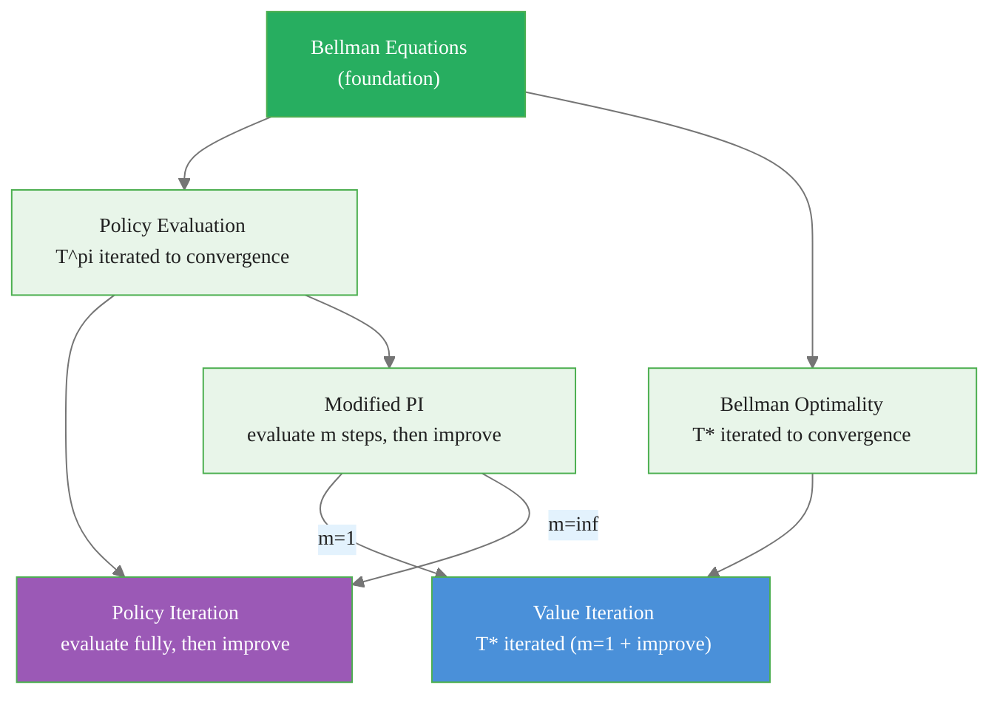

# Value Iteration: Truncated Policy Iteration to the Limit

> **Reading time:** ~10 min | **Module:** 1 — Dynamic Programming | **Prerequisites:** Module 0

## In Brief

Value iteration computes the optimal value function $V^*$ by repeatedly applying the Bellman optimality operator, collapsing policy evaluation and improvement into a single update. It can be understood as policy iteration where evaluation is truncated to exactly one sweep before improvement. The algorithm converges asymptotically (not in finite steps like policy iteration), but each iteration is cheap and the error bound after $k$ sweeps is tight.

<div class="callout-insight">

<strong>Insight:</strong> The Bellman optimality operator $\mathcal{T}^*$ is also a contraction. Iterating it from any starting point drives $V_k$ to $V^*$ geometrically fast. Once convergence is declared, extracting $\pi^*$ requires only a single greedy step.

</div>

<div class="callout-key">

<strong>Key Concept:</strong> Value iteration computes the optimal value function $V^*$ by repeatedly applying the Bellman optimality operator, collapsing policy evaluation and improvement into a single update. It can be understood as policy iteration where evaluation is truncated to exactly one sweep before improvement.

</div>


---

## Intuitive Explanation

Value iteration works backward from the horizon. Imagine a finite-horizon problem: at the last step, the value of each state is just its immediate reward. One step from the end, the value is the reward plus the discounted terminal value. Two steps from the end, the value propagates back another step. Value iteration applies this backward induction repeatedly until the finite-horizon estimates stop changing — which happens because the discount factor makes distant futures irrelevant.

<div class="callout-insight">

<strong>Insight:</strong> Value iteration works backward from the horizon.

</div>


The $\max$ in the update is the crucial difference from policy evaluation. Instead of averaging over a fixed policy's actions, we take the best action. This ensures the value function converges to $V^*$ rather than $V^\pi$ for some arbitrary $\pi$.

---


## Formal Definition

### The Bellman Optimality Equation

<div class="callout-key">

<strong>Key Point:</strong> ### The Bellman Optimality Equation

The optimal value function $V^*$ is the unique solution to:

$$V^*(s) = \max_a \sum_{s', r} p(s', r \mid s, a)\bigl[r + \gamma V^*(s')\bigr] \quad \forall s \in \m...

</div>


The optimal value function $V^*$ is the unique solution to:

$$V^*(s) = \max_a \sum_{s', r} p(s', r \mid s, a)\bigl[r + \gamma V^*(s')\bigr] \quad \forall s \in \mathcal{S}$$

This can be written as the fixed-point equation $V^* = \mathcal{T}^* V^*$, where the Bellman optimality operator is:

$$(\mathcal{T}^* V)(s) \;=\; \max_a \sum_{s', r} p(s', r \mid s, a)\bigl[r + \gamma V(s')\bigr]$$

### The Value Iteration Update Rule

Starting from any $V_0$, apply:

$$\boxed{V_{k+1}(s) = \max_a \sum_{s', r} p(s', r \mid s, a)\bigl[r + \gamma V_k(s')\bigr]}$$

Stop when $\|V_{k+1} - V_k\|_\infty < \theta(1-\gamma)/(2\gamma)$ to guarantee $\|V_k - V^*\|_\infty < \theta/2$.

### Extracting the Optimal Policy

After convergence, compute $\pi^*$ in a single pass:

$$\pi^*(s) = \arg\max_a \sum_{s', r} p(s', r \mid s, a)\bigl[r + \gamma V(s')\bigr]$$

---


## Value Iteration as Truncated Policy Iteration

Policy iteration alternates:
- **Full** policy evaluation (iterate until convergence): $V^{\pi_k}$
- Greedy improvement: $\pi_{k+1} = \text{greedy}(V^{\pi_k})$

<div class="callout-info">

<strong>Info:</strong> Policy iteration alternates:
- **Full** policy evaluation (iterate until convergence): $V^{\pi_k}$
- Greedy improvement: $\pi_{k+1} = \text{greedy}(V^{\pi_k})$

What if we truncate evaluation to a sin...

</div>


What if we truncate evaluation to a single sweep (modified policy iteration with $m=1$)?

The single-sweep update becomes:

$$V_{k+1}(s) = \sum_a \pi_k(a|s) \sum_{s',r} p(s',r|s,a)[r + \gamma V_k(s')]$$

But since $\pi_k$ is greedy with respect to $V_k$, this reduces exactly to:

$$V_{k+1}(s) = \max_a \sum_{s',r} p(s',r|s,a)[r + \gamma V_k(s')]$$

This is the value iteration update. Value iteration implicitly maintains the optimal policy but never explicitly stores it during iteration — only the value function matters until convergence.

---

## Convergence via Contraction Mapping

### The Bellman Optimality Operator is a Contraction

$$\|\mathcal{T}^* V - \mathcal{T}^* U\|_\infty \leq \gamma \|V - U\|_\infty$$

**Proof.** For any state $s$:

$$|(\mathcal{T}^* V)(s) - (\mathcal{T}^* U)(s)| = \left|\max_a \sum_{s',r} p(s',r|s,a)\gamma V(s') - \max_a \sum_{s',r} p(s',r|s,a)\gamma U(s')\right|$$

Using $|\max_a f(a) - \max_a g(a)| \leq \max_a |f(a) - g(a)|$:

$$\leq \max_a \left|\gamma \sum_{s'} p(s'|s,a)[V(s') - U(s')]\right| \leq \gamma \max_{s'} |V(s') - U(s')| = \gamma \|V - U\|_\infty$$

Since $\gamma < 1$, the Banach fixed-point theorem guarantees convergence from any $V_0$ to the unique fixed point $V^*$.

### Error Bound After $k$ Sweeps

$$\|V_k - V^*\|_\infty \leq \frac{\gamma^k}{1 - \gamma} \|V_1 - V_0\|_\infty$$

**Practical stopping rule:** Stop when $\|V_{k+1} - V_k\|_\infty < \theta$ and use $\theta < \epsilon(1-\gamma)/\gamma$ to guarantee $\|V_k - V^*\|_\infty < \epsilon/2$.

---

## Computational Complexity

### Per-Sweep Cost

Each sweep processes all $|\mathcal{S}|$ states. For each state, computing the Bellman optimality update requires summing over all actions and successor states:

$$\text{Cost per sweep} = O(|\mathcal{S}|^2 |\mathcal{A}|)$$

with a sparse dynamics matrix, this reduces to $O(|\mathcal{S}| \cdot |\mathcal{A}| \cdot \bar{b})$ where $\bar{b}$ is the average branching factor.

### Number of Sweeps

The error decreases geometrically at rate $\gamma$. To achieve $\epsilon$-accuracy:

$$k \geq \frac{\log(\epsilon(1-\gamma) / \|V_1 - V_0\|_\infty)}{\log \gamma}$$

When $\gamma$ is close to 1, this can be large. For example, $\gamma = 0.99$ and $\epsilon = 10^{-4}$: approximately 2000 sweeps are needed.

---

## Algorithm

### Pseudocode

```
Initialize V(s) = 0 for all s in S
Set threshold theta > 0

Repeat:
    delta = 0
    For each s in S:
        v_old = V(s)
        V(s) = max over a of [
            sum over (s', r) of [
                p(s', r | s, a) * (r + gamma * V(s'))
            ]
        ]
        delta = max(delta, |v_old - V(s)|)
Until delta < theta

# Extract optimal policy
For each s in S:
    pi*(s) = argmax over a of [
        sum over (s', r) of [
            p(s', r | s, a) * (r + gamma * V(s'))
        ]
    ]

Return V, pi*
```

---

## Code Implementation


<span class="filename">example.py</span>
</div>
The following implementation builds on the approach above:

<div class="code-window">
<div class="code-header">
<div class="dots"><span class="dot-red"></span><span class="dot-yellow"></span><span class="dot-green"></span></div>

```python
import numpy as np


def value_iteration(P, R, gamma=0.99, theta=1e-8):
    """
    Value iteration algorithm (Sutton & Barto, Chapter 4).

    Parameters
    ----------
    P     : ndarray of shape (n_states, n_actions, n_states)
    R     : ndarray of shape (n_states, n_actions, n_states)
    gamma : discount factor in [0, 1)
    theta : convergence threshold

    Returns
    -------
    V     : optimal value function, shape (n_states,)
    pi    : optimal deterministic policy, shape (n_states,)
    """
    n_states, n_actions, _ = P.shape
    V = np.zeros(n_states)

    sweep = 0
    while True:
        delta = 0.0
        for s in range(n_states):
            v_old = V[s]
            # Q(s, a) = sum_{s'} P[s,a,s'] * (R[s,a,s'] + gamma * V[s'])
            q_vals = np.sum(P[s] * (R[s] + gamma * V[None, :]), axis=1)
            V[s] = np.max(q_vals)        # Bellman optimality update
            delta = max(delta, abs(v_old - V[s]))
        sweep += 1
        if delta < theta:
            break

    print(f"Value iteration converged in {sweep} sweeps.")

    # Extract optimal policy (single greedy pass after convergence)
    Q = np.sum(P * (R + gamma * V[None, None, :]), axis=2)
    pi = np.argmax(Q, axis=1)

    return V, pi


# --- Vectorized version (faster for large state spaces) ---
def value_iteration_vectorized(P, R, gamma=0.99, theta=1e-8):
    """Vectorized value iteration — avoids Python for-loop over states."""
    n_states = P.shape[0]
    V = np.zeros(n_states)

    for sweep in range(10_000):
        # Q[s, a] = sum_{s'} P[s,a,s'] * (R[s,a,s'] + gamma * V[s'])
        Q = np.einsum('ijk,ijk->ij', P, R + gamma * V[None, None, :])
        V_new = Q.max(axis=1)
        delta = np.max(np.abs(V_new - V))
        V = V_new
        if delta < theta:
            print(f"Converged in {sweep + 1} sweeps.")
            break

    pi = np.argmax(Q, axis=1)
    return V, pi
```

</div>

---

## Policy Iteration vs Value Iteration: When to Use Which

| Criterion | Policy Iteration | Value Iteration |
|---|---|---|
| State space size | Small to medium ($|\mathcal{S}| < 10^4$) | Medium to large |
| Actions per state | Any | Many actions OK |
| $\gamma$ close to 1 | Preferred (fewer iterations) | Many sweeps needed |
| Memory | $O(|\mathcal{S}| + |\mathcal{S}||\mathcal{A}|)$ | Same |
| Implementation complexity | Higher (two routines) | Lower (one loop) |
| Convergence type | Finite (exact, no threshold) | Asymptotic (needs $\theta$) |
| Practical speed | Often faster in iterations | Often faster in wall time |

### Rule of Thumb

- Use **policy iteration** when $\gamma$ is close to 1 or when you need an exact optimal policy in as few steps as possible.
- Use **value iteration** when the state space is large, the per-state evaluation cost is high, or simplicity of implementation is a priority.

---


<div class="compare">
<div class="compare-card">
<div class="header before">Policy Iteration</div>
<div class="body">

See detailed comparison in the table above.

</div>
</div>
<div class="compare-card">
<div class="header after">Value Iteration: When to Use Which</div>
<div class="body">

See detailed comparison in the table above.

</div>
</div>
</div>

## Mermaid: The Three DP Algorithms


<span class="filename">example.py</span>
</div>
The following implementation builds on the approach above:

<div class="code-window">
<div class="code-header">
<div class="dots"><span class="dot-red"></span><span class="dot-yellow"></span><span class="dot-green"></span></div>



</div>

Value iteration and policy iteration are endpoints of a continuous spectrum parametrized by $m$.

---

## Common Pitfalls

<div class="callout-danger">

<strong>Danger:</strong> The pitfalls below are the most common mistakes practitioners make. Each one can silently degrade your results without obvious errors.

</div>

### 1. Using $\|V_{k+1} - V_k\|_\infty < \theta$ without accounting for $\gamma$

<div class="callout-warning">

<strong>Warning:</strong> ### 1.

</div>

This condition does not guarantee $\|V_k - V^*\|_\infty < \theta$. The correct bound is $\|V_k - V^*\|_\infty \leq \frac{\gamma}{1-\gamma} \|V_{k+1} - V_k\|_\infty$. For $\gamma = 0.99$, this multiplies the observed delta by a factor of 99. Use a much smaller $\theta$ than your target accuracy.

### 2. Extracting the policy from the value function with truncated evaluation

After value iteration, the policy extraction step is:

$$\pi^*(s) = \arg\max_a \sum_{s',r} p(s',r|s,a)[r + \gamma V(s')]$$

Never use the $\arg\max$ computed during the last sweep — that value was computed before the final update to $V$.

### 3. Choosing $\theta$ too large for near-optimal policies

When $\gamma$ is close to 1, a small error in $V$ can lead to suboptimal actions. For $\gamma = 0.99$, a $V$ error of 0.01 can cause a policy error of $\frac{0.01}{1-0.99} = 1.0$ in expected return.

### 4. Expecting finite convergence

Value iteration never reaches $V^*$ exactly — it converges asymptotically. Policy iteration does reach $\pi^*$ exactly in finite steps. If exact convergence is required, use policy iteration.

### 5. Applying value iteration to episodic tasks without a terminal absorbing state

For episodic MDPs, add a terminal absorbing state with $V = 0$ and zero-reward self-loop, or use finite-horizon dynamic programming.

---

## Connections


<div class="callout-info">

<strong>Info:</strong> This section maps how this guide connects to the broader course. Use these links to navigate related material.

</div>

- **Builds on:** Policy evaluation (Guide 01), policy improvement theorem (Guide 02), contraction mapping theorem
- **Leads to:** Q-learning (model-free analog using samples), approximate dynamic programming, fitted value iteration for continuous spaces
- **Related to:** Backward induction (finite-horizon case), linear programming for MDPs

---


## Practice Questions

**Question 1 — Conceptual:** Based on the concepts in this guide, explain in your own words why the core technique matters and when you would choose it over alternatives.

**Question 2 — Application:** Sketch out how you would apply the main concept from this guide to a real-world dataset or problem you have encountered. What would you need to watch out for?


## Further Reading

- Sutton & Barto (2018), *Reinforcement Learning: An Introduction*, 2nd ed., Section 4.4
- Bellman (1957), *Dynamic Programming* — the original formulation
- Puterman (1994), *Markov Decision Processes*, Chapter 6 — rigorous complexity analysis
- Bertsekas (2012), *Dynamic Programming and Optimal Control*, Vol. 1, Chapter 1


---

## Cross-References

<a class="link-card" href="./03_value_iteration_slides.md">
  <div class="link-card-title">Companion Slides</div>
  <div class="link-card-description">Interactive slide deck covering the key concepts with visual examples.</div>
</a>

<a class="link-card" href="../notebooks/01_policy_evaluation.ipynb">
  <div class="link-card-title">Hands-on Notebook</div>
  <div class="link-card-description">15-minute micro-notebook with guided exercises and real data.</div>
</a>
