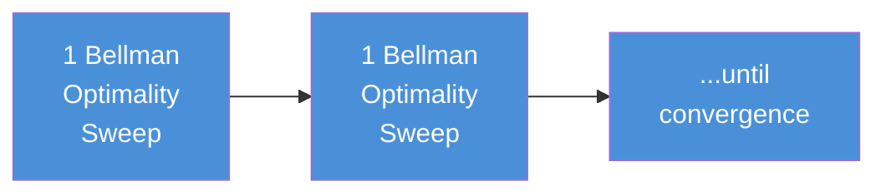
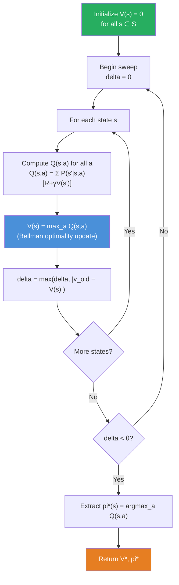
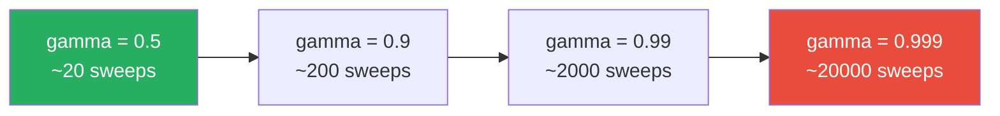
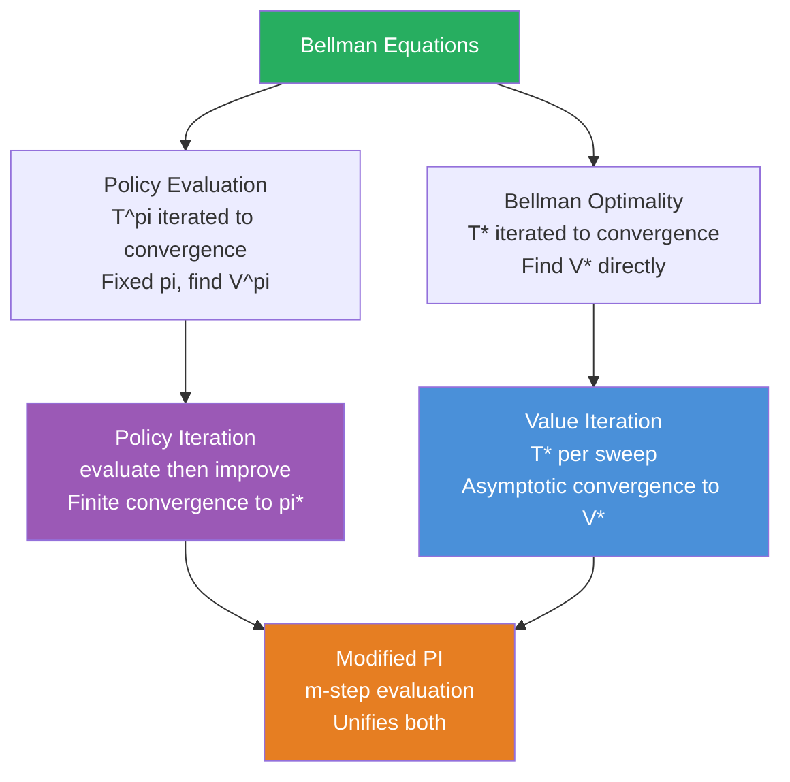
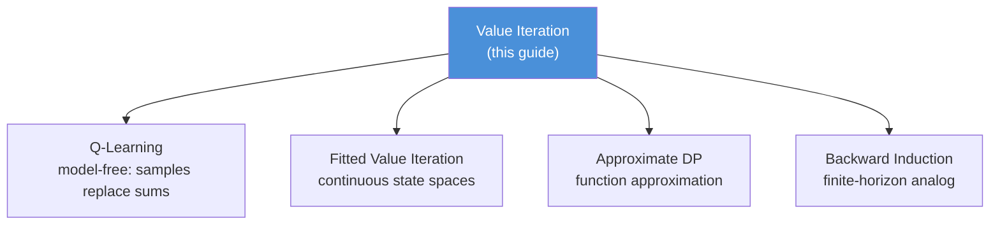

<!-- _class: lead -->

# Value Iteration
## The Bellman Optimality Operator Applied Directly

**Module 1 — Dynamic Programming**

<!-- Speaker notes: Welcome to Value Iteration. This is the third and final DP algorithm in Module 1. Value iteration collapses the two-phase structure of policy iteration into a single update loop. By applying the Bellman optimality operator repeatedly, we converge directly to V* without ever explicitly maintaining a policy during iteration. Estimated time: 35 minutes. -->

---

## Motivation: Can We Skip Full Evaluation?

Policy iteration cost per iteration:
- Full evaluation: hundreds of sweeps until $V^{\pi_k}$ converges
- One improvement step: single pass over all states

**Observation:** We are doing enormous work (evaluation) to inform a single cheap step (improvement). What if we interleave them more aggressively?

**Value iteration:** Apply the Bellman **optimality** operator once per state, per sweep. No explicit policy. Just values.

<!-- Speaker notes: Recall that policy iteration spends most of its time in the evaluation phase. Value iteration asks: why wait for full convergence before improving? Can we do one Bellman step and immediately improve? Yes — and this produces value iteration, which is equivalent to modified policy iteration with m=1. -->

---

## The Bellman Optimality Equation

The optimal value function $V^*$ satisfies:

$$V^*(s) = \max_a \sum_{s', r} p(s', r \mid s, a)\bigl[r + \gamma V^*(s')\bigr]$$

Compare to the Bellman **expectation** equation (policy evaluation):

$$V^\pi(s) = \sum_a \pi(a|s) \sum_{s', r} p(s', r \mid s, a)\bigl[r + \gamma V^\pi(s')\bigr]$$

| | Bellman Expectation | Bellman Optimality |
|---|---|---|
| Operator | $\mathcal{T}^\pi$ (averaging) | $\mathcal{T}^*$ (maximizing) |
| Fixed point | $V^\pi$ | $V^*$ |
| Used in | Policy evaluation | Value iteration |

<!-- Speaker notes: The key difference is max vs sum weighted by pi. In policy evaluation we average over the policy's action distribution. In value iteration we take the max — implicitly acting as if we will choose the best action every time. The max makes this the optimality equation rather than the expectation equation. -->

---

## The Value Iteration Update Rule

$$\boxed{V_{k+1}(s) = \max_a \sum_{s', r} p(s', r \mid s, a)\bigl[r + \gamma V_k(s')\bigr]}$$

- Initialize $V_0(s) = 0$ for all $s$
- Each sweep updates every state once using this rule
- Stop when $\max_s |V_{k+1}(s) - V_k(s)| < \theta$
- Extract $\pi^*$ with a final greedy pass: $\pi^*(s) = \arg\max_a Q(s,a)$

> The policy is never stored during iteration — only the value function.

<!-- Speaker notes: The update is almost identical to policy evaluation, with sum replaced by max. This means value iteration can be implemented by changing a single line of code from the policy evaluation implementation. Emphasize that the policy is implicit in the argmax and is only extracted after convergence — during iteration, we only track V. -->

---

## Value Iteration as Truncated Policy Iteration


**Policy iteration:** evaluate fully, then improve



**Value iteration:** apply $\mathcal{T}^*$ repeatedly (evaluation + improvement fused)

Equivalently: modified policy iteration with $m = 1$ evaluation sweep.

<!-- Speaker notes: This is the key theoretical connection. Value iteration is not a fundamentally different algorithm — it is policy iteration in the limit of minimal evaluation. The Bellman optimality update implicitly does one step of evaluation (using the current V) and one step of improvement (taking the max) simultaneously. -->

---

## Convergence: $\mathcal{T}^*$ is a Contraction

The Bellman optimality operator satisfies:

$$\|\mathcal{T}^* V - \mathcal{T}^* U\|_\infty \leq \gamma \|V - U\|_\infty$$

**Proof sketch:** For any state $s$:
$$|(\mathcal{T}^* V)(s) - (\mathcal{T}^* U)(s)| \leq \max_a \left|\gamma \sum_{s'} p(s'|s,a)[V(s') - U(s')]\right| \leq \gamma\|V - U\|_\infty$$

Using $|\max_a f(a) - \max_a g(a)| \leq \max_a |f(a) - g(a)|$.

**Error bound after $k$ sweeps:**
$$\|V_k - V^*\|_\infty \leq \frac{\gamma^k}{1-\gamma}\|V_1 - V_0\|_\infty$$

<!-- Speaker notes: The contraction proof for T* is slightly more subtle than for T^pi because the max operation is not linear. The key step uses the max-minus-max inequality. The error bound shows geometric convergence at rate gamma — the same rate as policy evaluation. However, value iteration never reaches V* exactly, unlike policy iteration which terminates finitely at pi*. -->

---

## Stopping Rule and Error Bound

Standard stopping condition: halt when $\delta_k = \|V_{k+1} - V_k\|_\infty < \theta$.

**Warning:** This does NOT guarantee $\|V_k - V^*\|_\infty < \theta$.

The correct bound:

$$\|V_k - V^*\|_\infty \leq \frac{\gamma}{1-\gamma} \delta_k$$

| $\gamma$ | Multiplier $\frac{\gamma}{1-\gamma}$ |
|---|---|
| 0.90 | 9 |
| 0.95 | 19 |
| 0.99 | 99 |
| 0.999 | 999 |

To guarantee $\epsilon$ accuracy, use $\theta = \epsilon(1-\gamma)/\gamma$.

<!-- Speaker notes: This is one of the most common implementation bugs. Students set theta=1e-4 thinking they get 1e-4 accuracy, but with gamma=0.99 the actual error could be 99 * 1e-4 = 0.01. For small MDPs this may not matter, but in problems where precise value estimates drive downstream decisions, it is critical. Always use the corrected threshold. -->

---

## Algorithm Flowchart



<!-- Speaker notes: Trace through the flowchart. Note that the policy extraction step happens after convergence, not inside the loop. During the loop, we only update V. The argmax is recomputed once at the end to get the final policy. This is different from policy iteration where the policy is always explicit. -->

---

## Code: Value Iteration

```python
import numpy as np

def value_iteration(P, R, gamma=0.99, theta=1e-8):
    """
    P[s, a, s'] = transition probability
    R[s, a, s'] = reward for that transition
    """
    n_states = P.shape[0]
    V = np.zeros(n_states)

    for sweep in range(100_000):
        delta = 0.0
        for s in range(n_states):
            v_old = V[s]
            # Q(s, a) = sum_{s'} P[s,a,s'] * (R[s,a,s'] + gamma * V[s'])
            q_vals = np.sum(P[s] * (R[s] + gamma * V), axis=1)
            V[s] = q_vals.max()          # Bellman optimality
            delta = max(delta, abs(v_old - V[s]))
        if delta < theta:
            print(f"Converged in {sweep + 1} sweeps.")
            break

    # Extract optimal policy from converged V
    Q = np.sum(P * (R + gamma * V[None, None, :]), axis=2)
    pi = np.argmax(Q, axis=1)
    return V, pi
```

<!-- Speaker notes: Compare this to the policy evaluation code from Guide 01 — the only difference is np.max(q_vals) instead of a weighted sum over pi. This is the simplicity advantage of value iteration. Walk through the Q computation: broadcasting V[None, None, :] to shape (1, 1, n_states), multiplying by P of shape (n_states, n_actions, n_states), summing over axis=2. -->

---

## Vectorized Version

```python
def value_iteration_vectorized(P, R, gamma=0.99, theta=1e-8):
    """
    Eliminates the Python for-loop over states using numpy broadcasting.
    Preferred for large state spaces.
    """
    n_states = P.shape[0]
    V = np.zeros(n_states)

    for sweep in range(100_000):
        # Q[s, a] = sum_{s'} P[s,a,s'] * (R[s,a,s'] + gamma * V[s'])
        # Shapes: P=(S,A,S), R=(S,A,S), V=(S,) -> broadcast to (S,A,S)
        Q = np.sum(P * (R + gamma * V[None, None, :]), axis=2)  # (S, A)
        V_new = Q.max(axis=1)                                    # (S,)

        if np.max(np.abs(V_new - V)) < theta:
            print(f"Converged in {sweep + 1} sweeps.")
            V = V_new
            break
        V = V_new

    pi = np.argmax(Q, axis=1)
    return V, pi
```

<!-- Speaker notes: The vectorized version replaces the state loop with a single matrix operation. The key is the broadcasting: V[None, None, :] expands V from shape (S,) to (1, 1, S), which then broadcasts against P and R of shape (S, A, S). The sum over axis=2 marginalizes over successor states. For large problems (tens of thousands of states), this can be 10-100x faster than the loop version. -->

---

## Comparing Convergence: Policy Iteration vs Value Iteration

Example: 100-state random MDP, $\gamma = 0.95$

| Metric | Policy Iteration | Value Iteration |
|---|---|---|
| Outer iterations | 8 | N/A |
| Total Bellman sweeps | ~400 | ~350 |
| Wall-clock time | Comparable | Comparable |
| Reaches exact $\pi^*$? | Yes (finite) | No (asymptotic) |
| Code simplicity | Moderate | High |

**The tradeoff:** Policy iteration does fewer outer iterations but more work per iteration. Value iteration does many cheap iterations. Total work is often similar.

<!-- Speaker notes: These numbers are illustrative — actual performance depends heavily on the MDP structure and gamma. The key insight is that neither algorithm dominates in all cases. For small MDPs with high gamma, policy iteration usually wins. For large state spaces where each evaluation sweep is expensive, value iteration's simpler loop is preferred. -->

---

## When $\gamma$ Close to 1 is Painful

The number of sweeps needed grows as $\gamma \to 1$:

$$k_\epsilon \approx \frac{\log(\epsilon(1-\gamma))}{\log \gamma} \approx \frac{\log(\epsilon(1-\gamma))}{-(1-\gamma)} \to \infty \text{ as } \gamma \to 1$$



For $\gamma$ close to 1, **policy iteration strongly preferred** (converges in few outer steps).

<!-- Speaker notes: This slide makes the gamma sensitivity concrete. Value iteration is solving what is essentially an ill-conditioned problem when gamma is close to 1 — small changes in V propagate slowly. Policy iteration, by contrast, converges in a finite number of steps that does not depend on gamma in the same way. This is why policy iteration is preferred for problems with long horizons (gamma near 1), such as robotics tasks measured in seconds with fine time discretization. -->

---

## Common Pitfalls

**Pitfall 1: Threshold $\theta$ not adjusted for $\gamma$**
Use $\theta = \epsilon(1-\gamma)/\gamma$ to guarantee $\epsilon$ accuracy. With $\gamma=0.99$ and $\theta=10^{-4}$, actual error can be up to $0.01$.

**Pitfall 2: Extracting policy inside the loop**
The policy extracted from intermediate $V_k$ may be suboptimal. Always extract after convergence.

**Pitfall 3: Expecting finite termination**
Value iteration converges asymptotically, not in finite steps. Policy iteration terminates exactly; value iteration does not.

**Pitfall 4: $\gamma = 1$ (undiscounted)**
The contraction mapping theorem requires $\gamma < 1$. For $\gamma = 1$, convergence is not guaranteed in general. Episodic MDPs can handle $\gamma = 1$ if all policies are proper (reach a terminal state), but this requires care.

<!-- Speaker notes: Pitfall 3 often surprises students who expect "exact" convergence. Value iteration will never output V* exactly — it outputs V_k which is within epsilon of V*. If you need the exact optimal policy, run policy iteration instead. Pitfall 4 is a common source of infinite loops when implementing for episodic environments without properly handling terminal absorbing states. -->

---

## The Three DP Algorithms: Summary



<!-- Speaker notes: This diagram shows the full picture of DP algorithms. All three — policy evaluation, policy iteration, and value iteration — stem from the two Bellman equations. Modified policy iteration is the general family that contains both policy iteration and value iteration as special cases. Understanding this unification is more important than memorizing each algorithm separately. -->

---

## Key Takeaways

1. **Bellman optimality update:** $V_{k+1}(s) = \max_a \sum_{s',r} p(s',r|s,a)[r + \gamma V_k(s')]$
2. **$\mathcal{T}^*$ is a contraction:** convergence from any $V_0$ is guaranteed by the Banach theorem
3. **Asymptotic, not finite:** value iteration converges in the limit; policy iteration terminates exactly
4. **Corrected stopping rule:** use $\theta = \epsilon(1-\gamma)/\gamma$ for $\epsilon$-accurate value function
5. **Policy extracted last:** apply the greedy step once after convergence, not during iteration
6. **Use policy iteration when** $\gamma$ is close to 1; value iteration when simplicity matters

<!-- Speaker notes: Summarize the six key points. Emphasize point 3 — the asymptotic vs finite distinction. Emphasize point 4 — the corrected stopping rule is often ignored in implementations and textbooks. Preview the next steps: now that we have three DP algorithms, the next module will ask how to solve problems when we don't have access to the model p(s',r|s,a) — which leads to Monte Carlo methods and temporal-difference learning. -->

---

## Connections



**References:** Sutton & Barto (2018), Section 4.4 — Bellman (1957), *Dynamic Programming*

<!-- Speaker notes: Value iteration is the direct ancestor of Q-learning. Q-learning replaces the sum over (s', r) pairs with a single observed sample, making it applicable without a model. Fitted value iteration extends value iteration to continuous state spaces using function approximation. These connections will be the foundation of the next several modules. -->

---

<!-- _class: lead -->

# Module 1 Complete

**Dynamic Programming: Three Algorithms**

Policy Evaluation → Policy Iteration → Value Iteration

Next: Monte Carlo Methods (no model required)

<!-- Speaker notes: We have completed Module 1. The three DP algorithms share a common foundation — Bellman equations and contraction mappings — and differ only in how aggressively they interleave evaluation and improvement. The key limitation of all DP methods is the requirement for a complete model p(s',r|s,a). When this model is unavailable, we turn to Monte Carlo methods and temporal-difference learning, which use sampled experience instead of expected values. -->
