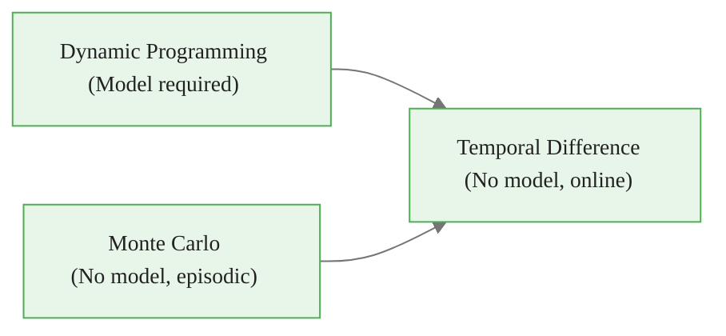

<!-- _class: lead -->

# TD(0) Prediction

## Module 3: Temporal Difference Learning
### Reinforcement Learning

<!-- Speaker notes: Welcome to Module 3. This deck covers TD(0) prediction — the foundation of all temporal difference methods. The key message: TD combines Monte Carlo's model-free sampling with Dynamic Programming's bootstrapping to enable online, incremental learning. Set the stage by noting that TD error will appear in virtually every modern RL algorithm students encounter. -->

---

## Where We Are



TD inherits the best of both:
- **From MC:** learns from raw experience, no model
- **From DP:** bootstraps — updates from estimates without waiting for full returns


<div class="callout-insight">
<strong>Insight:</strong> This is a key takeaway from this section that connects to the broader course themes.
</div>

<!-- Speaker notes: Orient students in the RL algorithm landscape. Emphasize that TD is not a compromise — it often outperforms both MC and DP in practice. Ask: what does it mean to learn without waiting for the end of an episode? That is the core capability TD unlocks. -->

---

## The Core Idea: Don't Wait

**Monte Carlo** waits until the episode ends to update:
$$V(S_t) \leftarrow V(S_t) + \alpha \bigl[\underbrace{G_t}_{\text{actual return}} - V(S_t)\bigr]$$

**TD(0)** updates after every single step:
$$V(S_t) \leftarrow V(S_t) + \alpha \bigl[\underbrace{R_{t+1} + \gamma V(S_{t+1})}_{\text{TD target}} - V(S_t)\bigr]$$

> The TD target substitutes an *estimate* for the true return. This is bootstrapping.


<div class="callout-key">
<strong>Key Point:</strong> Remember this concept — it appears repeatedly in later modules.
</div>

<!-- Speaker notes: Write both equations side by side and ask students what differs. The only change is replacing G_t (actual full return) with R_{t+1} + gamma*V(S_{t+1}) (one-step bootstrap). That single substitution unlocks online learning. Pause here — this is the conceptual core of the entire module. -->

---

## The TD Error $\delta_t$

$$\delta_t = R_{t+1} + \gamma V(S_{t+1}) - V(S_t)$$

The update is simply:

$$V(S_t) \leftarrow V(S_t) + \alpha \, \delta_t$$

<div class="columns">
<div>

**Positive $\delta_t$**
Outcome was *better* than expected.
Increase $V(S_t)$.

</div>
<div>

**Negative $\delta_t$**
Outcome was *worse* than expected.
Decrease $V(S_t)$.

</div>
</div>

> $\delta_t = 0$ means the value estimate is already perfectly consistent with the observed transition.


<div class="callout-warning">
<strong>Warning:</strong> This is a common source of confusion. Pay close attention to the distinction here.
</div>

<!-- Speaker notes: The TD error is the most important quantity in RL. It appears in SARSA, Q-learning, Actor-Critic methods, and even neuroscience models of dopamine signaling. Make sure students understand it intuitively before moving on: it is the gap between what was predicted and what actually happened (over one step). -->

---

## Intuition: The Driving Analogy

You are driving from city **A** to city **C**, passing through **B**.

| Approach | What you do |
|----------|-------------|
| **DP** | Use a perfect road map — no driving needed |
| **MC** | Drive the full A→C route, record the time at the end |
| **TD** | At B, combine the observed A→B time with your estimate of B→C |

TD updates your estimate at *every waypoint*, using the best available information without waiting to arrive.

> In RL: every state transition is a waypoint. TD never wastes a step.


<div class="callout-info">
<strong>Info:</strong> This detail is useful context but not required to memorize.
</div>

<!-- Speaker notes: The driving analogy is highly effective. Make it concrete: "You know it took 45 minutes to get from A to B. You estimate B to C takes 30 minutes. So you update your A-to-C estimate to 75 minutes — right now, without finishing the trip." This is exactly what TD(0) does. -->

---

## What is Bootstrapping?

```
MC target:   G_t = R_{t+1} + γ R_{t+2} + γ² R_{t+3} + ...  (true, but requires full episode)

TD target:   R_{t+1} + γ V(S_{t+1})                         (bootstrap: one real step + an estimate)

DP target:   Σ_{s',r} p(s',r|s,a)[r + γ V(s')]              (full expectation: requires model)
```

**Bootstrapping = using estimates to update estimates.**

- Introduces **bias** (estimate $V(S_{t+1})$ may be wrong)
- Reduces **variance** (only one step of randomness, not a full trajectory)

<!-- Speaker notes: Students often confuse bias and variance in this context. Bias: TD uses an imperfect estimate of V(S_{t+1}), so the target is slightly wrong. Variance: MC sums many random rewards, accumulating randomness at every step. TD's lower variance often more than compensates for its bias — this is why TD outperforms MC on many tasks. -->

---

## TD vs MC vs DP: Full Comparison

| Dimension | Monte Carlo | TD(0) | Dynamic Programming |
|-----------|-------------|-------|---------------------|
| **Target** | Full return $G_t$ | $R_{t+1} + \gamma V(S_{t+1})$ | Bellman expectation |
| **Model?** | No | No | Yes |
| **Update when?** | Episode end | Every step | Full sweep |
| **Episodic only?** | Yes | No | No |
| **Bias** | None | Present | None |
| **Variance** | High | Low | Zero |
| **Online?** | No | Yes | No |

**Bottom line:** TD is the only method that is model-free, online, and works on continuing tasks.

<!-- Speaker notes: Go through this table row by row. Ask students: "Which algorithm would you use if episodes were 10,000 steps long? If you had a perfect model? If the environment never terminates?" The answers reveal why TD is the workhorse of practical RL. -->

---

## The One-Step Backup Diagram

```
Time:    t              t+1

State:   S_t ─── A_t ──→ S_{t+1}
         │                │
Value:  V(S_t)         V(S_{t+1})

         ←────── δ_t ─────┘
         R_{t+1} + γ V(S_{t+1}) - V(S_t)
```

TD(0) uses exactly **one reward** and **one next-state estimate** before updating.

This is the shallowest possible backup — the foundation that n-step methods and TD(λ) extend.

<!-- Speaker notes: Draw this diagram on a whiteboard if possible. The key visual: TD reaches one step into the future (one real reward) and then "looks up" the value estimate for the next state. Contrast this with a Monte Carlo backup which reaches all the way to the end of the episode. -->

---

## Convergence: When Does TD(0) Work?

For tabular TD(0) evaluating a fixed policy $\pi$:

**Converges to $V^\pi$ with probability 1 if:**

1. Every state is visited infinitely often
2. Step sizes satisfy Robbins-Monro conditions:
$$\sum_{t=0}^{\infty} \alpha_t = \infty \quad \text{and} \quad \sum_{t=0}^{\infty} \alpha_t^2 < \infty$$

**Common schedules:** $\alpha_t = \dfrac{1}{N(S_t)}$ (visit count) or $\alpha_t = \dfrac{c}{c + t}$

> Constant $\alpha$ does not converge to a fixed point but tracks non-stationary targets — often preferred in practice.

<!-- Speaker notes: The Robbins-Monro conditions are from stochastic approximation theory. Intuitively: step sizes must be large enough that the algorithm can overcome any initial value (sum = infinity), but small enough that noise averages out (sum of squares < infinity). Students should know these conditions exist even if they do not memorize the proof. -->

---

## Code: TD(0) in 20 Lines

<div class="code-window">
<div class="code-header">
<div class="dots"><span class="dot-red"></span><span class="dot-yellow"></span><span class="dot-green"></span></div>
<span class="filename">example.py</span>
</div>

```python
import numpy as np

def td_zero(env, policy, num_episodes, alpha=0.1, gamma=0.99):
    V = np.zeros(env.observation_space.n)

    for _ in range(num_episodes):
        state, _ = env.reset()
        terminated = truncated = False

        while not (terminated or truncated):
            action = policy(state)
            next_state, reward, terminated, truncated, _ = env.step(action)

            # Bootstrap: one-step TD target
            next_value = 0.0 if terminated else V[next_state]
            td_error = reward + gamma * next_value - V[state]
            V[state] += alpha * td_error

            state = next_state
    return V
```
</div>

> Note `next_value = 0.0 if terminated` — terminal states have value zero by definition.

<!-- Speaker notes: Walk through this code carefully. The critical line is `next_value = 0.0 if terminated`. This is a common bug source: forgetting that terminal states have value 0. If you look up V[terminal_state], you may get a stale non-zero value. The policy callable makes this function general — pass any policy function. -->

---

## Running the Code

<div class="code-window">
<div class="code-header">
<div class="dots"><span class="dot-red"></span><span class="dot-yellow"></span><span class="dot-green"></span></div>
<span class="filename">example.py</span>
</div>

```python
import gymnasium as gym

env = gym.make("FrozenLake-v1", is_slippery=True)
random_policy = lambda s: env.action_space.sample()

V = td_zero(env, random_policy, num_episodes=10_000)

# Visualize the 4x4 grid values
print(V.reshape(4, 4).round(3))
env.close()
```
</div>

```
[[0.    0.    0.001 0.   ]
 [0.001 0.    0.003 0.   ]
 [0.003 0.007 0.019 0.   ]
 [0.    0.012 0.063 0.   ]]
```

Values increase toward the goal (bottom-right). States near holes stay near zero.

<!-- Speaker notes: Run this live if possible. Ask students to interpret the value table: why are states near the goal higher? Why are some states zero even with a random policy (because they are holes — terminal failure states). This connects the math to observable, intuitive behavior. -->

---

## Advantages of TD Learning

<div class="columns">
<div>

**vs Monte Carlo**
- Updates online (no episode needed)
- Works on continuing tasks
- Lower variance
- More data efficient

</div>
<div>

**vs Dynamic Programming**
- No environment model required
- Scales to large state spaces
- Handles unknown dynamics

</div>
</div>

**Universal advantage:** TD(0) computes in $O(1)$ time and $O(|\mathcal{S}|)$ space per step — constant cost regardless of episode length.

<!-- Speaker notes: The practical advantages are why TD methods dominate modern RL. Ask students to think of a real application where you cannot wait for an episode to end — robotics (episodes are expensive), algorithmic trading (continuous market), dialogue systems (conversations do not have clean endings). TD handles all of these; MC does not. -->

---

<!-- _class: lead -->

# Common Pitfalls

<!-- Speaker notes: Transition to the pitfalls section. These are the mistakes that most frequently trip up students and practitioners. Each pitfall comes from misunderstanding a core concept — so walking through them reinforces the material just covered. -->

---

## Pitfall 1: Terminal State Bootstrap

```python
# WRONG: may look up stale value in terminal state
td_error = reward + gamma * V[next_state] - V[state]

# CORRECT: terminal state has value 0
next_value = 0.0 if terminated else V[next_state]
td_error = reward + gamma * next_value - V[state]
```

**Why it matters:** If you initialize $V$ to non-zero values (e.g., optimistic initialization), terminal states carry stale values. Bootstrapping into them corrupts every update made near episode end.

<!-- Speaker notes: This is the most common TD implementation bug. Have students find it in broken code as an exercise. The fix is simple but non-obvious the first time. Emphasize: terminated means the episode ended naturally (goal reached, failure); truncated means time ran out. Both should treat the next state as having value 0 for TD purposes only if terminated — truncated episodes may want to use V[next_state] still (depends on the formulation). -->

---

## Pitfall 2: Step Size Too Large

| $\alpha$ | Behavior |
|----------|----------|
| 0.001 | Learns very slowly; needs more episodes |
| 0.1 | Good balance for many tabular tasks |
| 0.9 | Noisy updates; may not converge |
| 1.0 | Each visit completely overwrites prior estimate |

> Rule of thumb: start with $\alpha = 0.1$. If unstable, halve it. If too slow, double it.

For guaranteed convergence: use $\alpha_t = 1 / N(S_t)$ (inverse visit count).

<!-- Speaker notes: Learning rate tuning is often overlooked in theory but critical in practice. The inverse-visit-count schedule is theoretically correct but can be slow in practice. Constant alpha = 0.1 is the pragmatic starting point for most tabular problems. For function approximation (Module 4), learning rate scheduling becomes even more important. -->

---

## Pitfall 3: Confusing Prediction with Control

| Goal | Algorithm | Output |
|------|-----------|--------|
| Evaluate fixed policy $\pi$ | TD(0) prediction | $V^\pi(s)$ |
| Find optimal policy | SARSA or Q-learning | $Q^*(s,a)$ |

TD(0) as shown in this guide **only evaluates a policy** — it does not improve it.

> You need a policy improvement step (or an action-value method) to actually optimize behavior.

<!-- Speaker notes: Students often run TD(0) prediction and expect the policy to improve. It does not — prediction and control are separate concerns. Prediction answers "how good is this policy?" Control answers "how do I find a better policy?" SARSA and Q-learning (Guides 02-03) add the control component. -->

---

## Summary

<div class="columns">
<div>

### What TD(0) Does
- Evaluates $V^\pi$ online
- Updates after every step
- Bootstraps: uses $V(S_{t+1})$ instead of $G_t$
- Works on continuing tasks

</div>
<div>

### Key Quantities
- **TD error:** $\delta_t = R_{t+1} + \gamma V(S_{t+1}) - V(S_t)$
- **Update:** $V(S_t) \leftarrow V(S_t) + \alpha \delta_t$
- **Converges** to $V^\pi$ under tabular + diminishing $\alpha$

</div>
</div>

**Next:** SARSA extends this idea to action values $Q(s,a)$ and adds policy improvement — giving us full on-policy control.

<!-- Speaker notes: Close by reinforcing the three-word summary of TD: online, incremental, bootstrapping. Each word distinguishes TD from the alternatives covered previously. Preview SARSA: the step from V(s) to Q(s,a) is small mathematically but enormous practically — it enables actual policy optimization. -->

---

## Connections

<div class="columns">
<div>

### Builds On
- Bellman expectation equation (Module 0)
- Monte Carlo prediction (Module 2)
- MDP / discount factor notation

</div>
<div>

### Leads To
- SARSA on-policy control (Guide 02)
- Q-learning off-policy control (Guide 03)
- TD(λ) and eligibility traces (Guide 04)
- Deep RL with neural network function approximation (Module 04)

</div>
</div>

**Neuroscience link:** $\delta_t$ matches the firing pattern of dopaminergic neurons — biological evidence that the brain uses TD-like learning.

<!-- Speaker notes: The neuroscience connection is a powerful hook for students. Wolfram Schultz's 1997 experiments showed that dopamine neuron firing patterns in primates match the mathematical structure of TD errors. This is one of the most striking examples of mathematical theory predicting biological reality. -->

