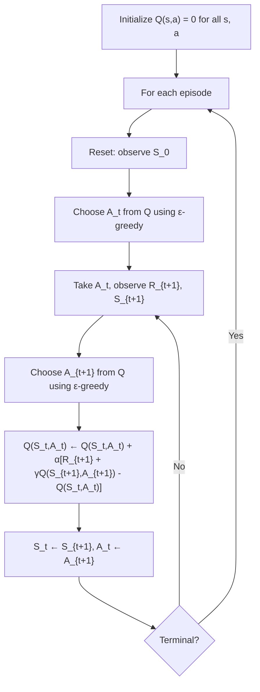

# SARSA: On-Policy TD Control

## In Brief

SARSA is the simplest on-policy TD control algorithm. It extends TD(0) prediction from state values $V(s)$ to action values $Q(s,a)$, and adds a greedy policy improvement step. The name captures the entire update tuple: **S**tate, **A**ction, **R**eward, next **S**tate, next **A**ction.

## Key Insight

SARSA is *on-policy*: the action $A_{t+1}$ used in the bootstrap target is chosen by the same policy currently being followed. This means SARSA learns the value of the behavior policy — including all its exploration noise. It is conservative: it accounts for the cost of exploration during evaluation.

---

## Formal Definition

### SARSA Update Rule

After observing the transition $(S_t, A_t, R_{t+1}, S_{t+1}, A_{t+1})$:

$$Q(S_t, A_t) \leftarrow Q(S_t, A_t) + \alpha \bigl[R_{t+1} + \gamma Q(S_{t+1}, A_{t+1}) - Q(S_t, A_t)\bigr]$$

| Symbol | Meaning |
|--------|---------|
| $Q(S_t, A_t)$ | Estimate of the value of taking action $A_t$ in state $S_t$ under $\pi$ |
| $\alpha$ | Step size |
| $R_{t+1}$ | Reward received |
| $\gamma$ | Discount factor |
| $Q(S_{t+1}, A_{t+1})$ | Value of the *actual next action* taken (on-policy) |

### TD Error for SARSA

$$\delta_t = R_{t+1} + \gamma Q(S_{t+1}, A_{t+1}) - Q(S_t, A_t)$$

The update: $Q(S_t, A_t) \leftarrow Q(S_t, A_t) + \alpha \, \delta_t$

---

## Name Origin: The (S, A, R, S', A') Quintuple

The algorithm is named after the five quantities it uses at each step:

```
  S_t      A_t      R_{t+1}    S_{t+1}    A_{t+1}
  ───    ──────    ─────────    ───────    ───────
 State   Action    Reward    Next State  Next Action
   S   ,   A   ,     R    ,     S'    ,     A'
```

The critical element is $A_{t+1}$: this action is sampled from the *current behavior policy* $\pi$ (typically $\varepsilon$-greedy). It is not the greedy action — it is whatever action the agent actually takes next.

**This is what makes SARSA on-policy.**

---

## Why On-Policy Matters

A policy is **on-policy** if the values it estimates correspond to the policy it is actually following.

SARSA follows an $\varepsilon$-greedy policy and evaluates that same $\varepsilon$-greedy policy:

- With probability $1 - \varepsilon$: take the greedy action
- With probability $\varepsilon$: take a random exploratory action

SARSA's $Q$ estimates therefore reflect the expected return *including exploratory detours*. This is different from Q-learning (Guide 03), which evaluates the optimal greedy policy even while following $\varepsilon$-greedy.

---

## Expected SARSA

Expected SARSA replaces the sampled next action $Q(S_{t+1}, A_{t+1})$ with the expectation under the current policy:

$$Q(S_t, A_t) \leftarrow Q(S_t, A_t) + \alpha \bigl[R_{t+1} + \gamma \sum_{a} \pi(a \mid S_{t+1}) \, Q(S_{t+1}, a) - Q(S_t, A_t)\bigr]$$

The expected value over next actions:

$$\mathbb{E}_\pi[Q(S_{t+1}, A_{t+1}) \mid S_{t+1}] = \sum_a \pi(a \mid S_{t+1}) Q(S_{t+1}, a)$$

**Advantages of Expected SARSA:**
- Lower variance than SARSA (averages out the randomness of $A_{t+1}$)
- Q-learning is a special case: when $\pi$ is greedy, $\sum_a \pi(a|s)Q(s,a) = \max_a Q(s,a)$
- Slightly more computation per step but faster convergence

---

## The Cliff Walking Example

Cliff Walking is a canonical gridworld that illustrates the on-policy vs off-policy difference sharply.

```
 Start                                   Goal
   S . . . . . . . . . . . . . . . . . . G
     C C C C C C C C C C C C C C C C C C
         ← Cliff (reward -100) →
```

- Grid: 4 rows × 12 columns
- Rewards: -1 per step, -100 for stepping on cliff (returns to Start), +0 at Goal
- Actions: Up, Down, Left, Right

**SARSA behavior:** Learns to walk along the *upper path* (row 2), away from the cliff.
- The $\varepsilon$-greedy policy occasionally takes random steps.
- Near the cliff edge, a random step → cliff → -100 reward.
- SARSA accounts for this risk and prefers the safer, longer route.

**Q-learning behavior:** Learns the *cliff edge path* (optimal path just above the cliff).
- Q-learning learns the *optimal* policy, which hugs the cliff for minimum steps.
- During training under $\varepsilon$-greedy, this causes frequent cliff falls, so *training reward* is lower.
- The learned policy (evaluated greedily) is optimal; the training process is risky.

**Key insight:**
- SARSA converges to the optimal *safe* policy (optimal for the actual $\varepsilon$-greedy behavior)
- Q-learning converges to the optimal *greedy* policy (optimal assuming no exploration noise)
- During training with $\varepsilon > 0$: SARSA accumulates more total reward

---

## Diagram: SARSA Control Loop



The crucial implementation detail: $A_{t+1}$ is chosen *before* the SARSA update, using the same $\varepsilon$-greedy policy. The next loop iteration uses this preselected action.

---

## Code Implementation

```python
import numpy as np


def epsilon_greedy(Q: np.ndarray, state: int, epsilon: float) -> int:
    """Select action using epsilon-greedy policy over Q[state]."""
    if np.random.random() < epsilon:
        return np.random.randint(Q.shape[1])   # Explore
    return int(np.argmax(Q[state]))             # Exploit


def sarsa(
    env,
    num_episodes: int,
    alpha: float = 0.1,
    gamma: float = 0.99,
    epsilon: float = 0.1,
) -> np.ndarray:
    """
    On-policy TD control via SARSA.

    Parameters
    ----------
    env          : Discrete Gymnasium environment.
    num_episodes : Number of training episodes.
    alpha        : Step size.
    gamma        : Discount factor.
    epsilon      : Exploration probability for epsilon-greedy.

    Returns
    -------
    Q : np.ndarray, shape (n_states, n_actions)
        Action-value estimates for the learned epsilon-greedy policy.
    """
    n_states = env.observation_space.n
    n_actions = env.action_space.n
    Q = np.zeros((n_states, n_actions))

    for episode in range(num_episodes):
        state, _ = env.reset()
        # Choose the first action BEFORE entering the step loop
        action = epsilon_greedy(Q, state, epsilon)

        terminated = False
        truncated = False

        while not (terminated or truncated):
            next_state, reward, terminated, truncated, _ = env.step(action)

            # Choose next action ON-POLICY (same epsilon-greedy behavior policy)
            next_action = epsilon_greedy(Q, next_state, epsilon)

            # SARSA update: uses the ACTUAL next action (not greedy max)
            if terminated:
                td_target = reward                         # Next state is terminal
            else:
                td_target = reward + gamma * Q[next_state, next_action]

            td_error = td_target - Q[state, action]
            Q[state, action] += alpha * td_error

            # Advance — carry the preselected next_action forward
            state, action = next_state, next_action

        # Optional: decay epsilon for convergence guarantee
        # epsilon = max(0.01, epsilon * 0.995)

    return Q


# ── Example: CliffWalking comparison setup ───────────────────────────────────
import gymnasium as gym

env = gym.make("CliffWalking-v0")
Q_sarsa = sarsa(env, num_episodes=500, alpha=0.1, gamma=1.0, epsilon=0.1)

# Derive the greedy policy from Q
greedy_policy = np.argmax(Q_sarsa, axis=1)
print("Greedy action for each state (0=Up, 1=Right, 2=Down, 3=Left):")
print(greedy_policy.reshape(4, 12))
env.close()
```

---

## Common Pitfalls

**Pitfall 1 — Choosing $A_{t+1}$ after the update (wrong order).**
The correct sequence is: observe $S_{t+1}$, choose $A_{t+1}$, *then* compute the SARSA update using $Q(S_{t+1}, A_{t+1})$, *then* execute $A_{t+1}$. If you choose $A_{t+1}$ after the update, you break the on-policy guarantee because the Q table has already changed.

**Pitfall 2 — Using $\max_a Q(S_{t+1}, a)$ instead of $Q(S_{t+1}, A_{t+1})$.**
This turns SARSA into Q-learning. The difference: SARSA's target uses the *actual next action* from the behavior policy; Q-learning's target uses the *greedy best action*. Mixing them produces an off-policy algorithm that lacks Q-learning's convergence guarantees and SARSA's safety properties.

**Pitfall 3 — Not decaying epsilon.**
With constant $\varepsilon > 0$, SARSA converges to the optimal $\varepsilon$-greedy policy, not the optimal deterministic policy. To converge to $\pi^*$, decay $\varepsilon \to 0$ (e.g., $\varepsilon_t = 1/t$) while satisfying GLIE (Greedy in the Limit with Infinite Exploration) conditions.

**Pitfall 4 — Confusing on-policy with safe.**
SARSA is safer than Q-learning during training on hazardous tasks, but it is not inherently "safe." On tasks where exploration is cheap, Q-learning's optimism yields faster convergence to the globally optimal policy. SARSA's conservatism is beneficial only when exploratory actions carry real cost (cliffs, physical robots, live financial positions).

**Pitfall 5 — Initializing $Q$ values too optimistically.**
Optimistic initialization (e.g., $Q(s,a) = 10$) encourages exploration by making every untried action look attractive. This works well when combined with a greedy policy ($\varepsilon = 0$), but when combined with $\varepsilon$-greedy it can cause the agent to persistently explore non-informative states.

---

## Connections

- **Builds on:** TD(0) prediction (Guide 01), $\varepsilon$-greedy policy, action-value functions $Q(s,a)$
- **Leads to:** Q-learning (Guide 03) — the off-policy counterpart, Expected SARSA, SARSA(λ) with eligibility traces (Guide 04), Actor-Critic methods (Module 06)
- **Related to:** Policy gradient methods (SARSA updates $Q$, which implicitly defines a policy; policy gradient methods update $\pi$ directly)

---

## Further Reading

- Sutton & Barto, *Reinforcement Learning: An Introduction* (2nd ed.), Chapter 6.4 — SARSA derivation, cliff walking example, GLIE convergence conditions
- Rummery & Niranjan (1994). *On-line Q-learning using connectionist systems* — the original SARSA paper (called "modified connectionist Q-learning" at the time)
- Van Seijen et al. (2009). *A Theoretical and Empirical Analysis of Expected Sarsa* — shows Expected SARSA dominates SARSA in variance with minimal additional cost
