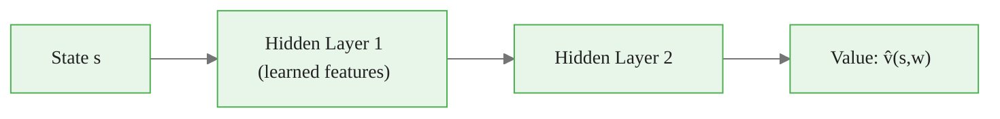
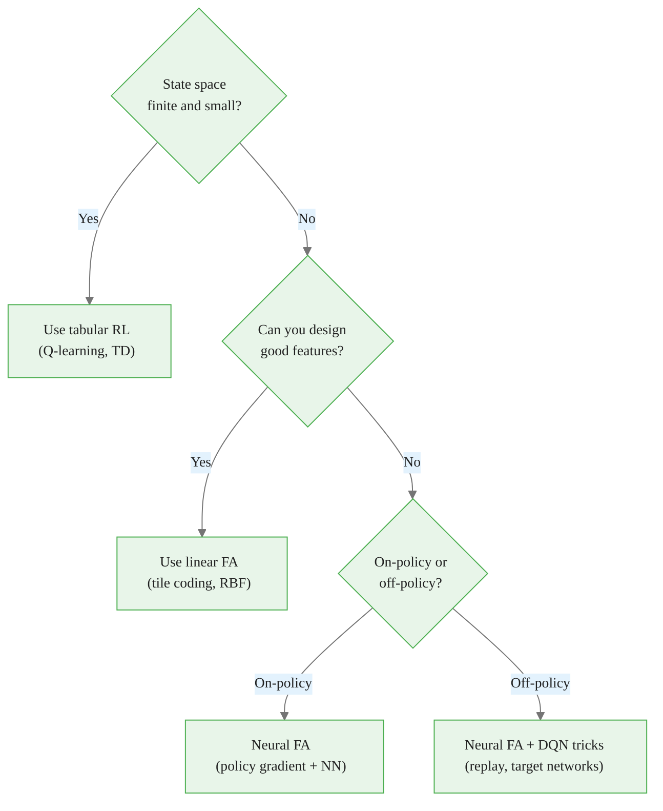

<!-- _class: lead -->

# Why Function Approximation?

## Module 04 — Function Approximation
### Reinforcement Learning Course

<!-- Speaker notes: This deck motivates the shift from tabular to function-approximation methods. The three arguments are: (1) the curse of dimensionality makes tables infeasible, (2) generalization across similar states is free with FA but absent from tables, and (3) FA unlocks continuous state spaces. Every claim here is stated precisely in Sutton & Barto Chapter 9. -->

---

# The Tabular Assumption Is Fragile

```
TabularRL works when:       Real environments look like:
- state space is small      - joint angles (continuous)
- every state is visited    - pixel images (28x28 = 784 dims)
- memory is unlimited       - market features (100+ signals)
```

**Tabular Q-learning on Atari:**
- State = raw screen → $256^{84 \times 84 \times 4}$ possible values
- Number of atoms in the observable universe ≈ $10^{80}$

Tabular methods are exactly right for toy problems and exactly wrong for real ones.


<div class="callout-insight">
<strong>Insight:</strong> This is a key takeaway from this section that connects to the broader course themes.
</div>

<!-- Speaker notes: This slide lands the punchline immediately: tabular RL is provably correct but practically useless at scale. The Atari example makes the absurdity concrete — the table would be astronomically larger than the observable universe. Then pivot to: we need a different representation. -->

---

# The Curse of Dimensionality

For a state with $d$ dimensions, each discretized to $m$ bins:

$$|\mathcal{S}| = m^d$$

| Dimensions | Bins | States | Memory at 8 bytes |
|---|---|---|---|
| 1 | 100 | $10^2$ | 800 B |
| 4 | 100 | $10^8$ | 800 MB |
| 8 | 100 | $10^{16}$ | 80 petabytes |
| 12 | 100 | $10^{24}$ | $8 \times 10^{15}$ TB |

> Each additional dimension multiplies the table size by $m$.


<div class="callout-key">
<strong>Key Point:</strong> Remember this concept — it appears repeatedly in later modules.
</div>

<!-- Speaker notes: Walk through the table row by row. 4 dimensions (CartPole has 4 state variables) already produces 10^8 states — 800 MB just for the table, before training. At 8 dimensions the table exceeds all data centers on Earth. This is the curse: exponential growth with linear increase in problem complexity. -->

---

# Tabular Methods: No Generalization

<div class="columns">

**Tabular agent visits** $s_1$:
- Updates $V(s_1)$
- $V(s_2)$ unchanged
- Even if $s_1 \approx s_2$

**Consequence:**
- Each state must be visited many times
- No transfer between similar states
- Data efficiency collapses as $|\mathcal{S}|$ grows

</div>

```
s1 (position=1.01) → V = 7.2   ← visited
s2 (position=1.02) → V = ?     ← never visited, no info
s3 (position=1.03) → V = ?     ← never visited, no info
```


<div class="callout-warning">
<strong>Warning:</strong> This is a common source of confusion. Pay close attention to the distinction here.
</div>

<!-- Speaker notes: The core limitation is not just memory — it is the complete absence of information sharing. Two nearly identical states have independent value estimates. In a continuous state space, every step visits a state that has never been seen before. The tabular estimate is literally undefined. -->

---

# Function Approximation: The Core Idea

Replace the table with a parameterized function:

$$\hat{v}(s, \mathbf{w}) \approx V^\pi(s)$$

- $\mathbf{w} \in \mathbb{R}^d$ — weight vector, $d \ll |\mathcal{S}|$
- Differentiable in $\mathbf{w}$ (required for gradient learning)
- Updating $\mathbf{w}$ changes predictions for **all** states simultaneously

**Same idea for action values:**

$$\hat{q}(s, a, \mathbf{w}) \approx Q^\pi(s, a)$$


<div class="callout-info">
<strong>Info:</strong> This detail is useful context but not required to memorize.
</div>

<!-- Speaker notes: The key equation is the hat notation: v-hat(s, w). The hat means "approximate." The weight vector w has d components; we can choose d to be much smaller than the number of states, and the function generalizes across all states by sharing parameters. This is the single most important concept in the module. -->

---

# SGD on the Value Error

**Objective:** Minimize Mean Squared Value Error

$$\overline{VE}(\mathbf{w}) = \sum_{s \in \mathcal{S}} \mu(s) \left[ V^\pi(s) - \hat{v}(s, \mathbf{w}) \right]^2$$

**Update rule** (stochastic gradient descent):

$$\mathbf{w} \leftarrow \mathbf{w} + \alpha \left[ V^\pi(S_t) - \hat{v}(S_t, \mathbf{w}) \right] \nabla_{\mathbf{w}} \hat{v}(S_t, \mathbf{w})$$

**Problem:** We never know $V^\pi(S_t)$.

**Solution:** Substitute a target — MC return or TD target (Guide 02).

<!-- Speaker notes: The VE objective is weighted by mu(s), the on-policy state distribution — states visited more often matter more. The SGD update samples one state at a time. The target V-pi(S_t) is the true value we are trying to match, but it is unknown. The resolution (substituting MC or TD targets) is the bridge to Guide 02. -->

---

# The Approximator Zoo

| Type | Formula | Key Property |
|---|---|---|
| Linear | $\mathbf{w}^T \mathbf{x}(s)$ | Convergent, interpretable |
| Polynomial | $[1, s, s^2, \ldots]^T \mathbf{w}$ | No feature design needed |
| Fourier basis | $\cos(\pi \mathbf{c}^T \mathbf{s})$ | Orthogonal, tunable resolution |
| Tile coding | Binary tiles, multiple grids | Sparse, efficient |
| RBF | $\exp(-\|s - c_i\|^2 / 2\sigma^2)$ | Smooth generalization |
| Neural network | $f_{\text{NN}}(s; \mathbf{w})$ | Universal, unstable off-policy |

<!-- Speaker notes: Each row of this table maps to a design decision. Linear methods are safe and convergent — start here. Tile coding is what Sutton uses for mountain car and is covered in depth in Guide 02. Neural networks are covered in Module 05. The key column is Key Property: it summarizes what you gain and what you sacrifice with each choice. -->

---

# Feature Vectors: The Translation Layer

Linear FA requires a feature map $\mathbf{x} : \mathcal{S} \to \mathbb{R}^d$:

<div class="code-window">
<div class="code-header">
<div class="dots"><span class="dot-red"></span><span class="dot-yellow"></span><span class="dot-green"></span></div>
<span class="filename">example.py</span>
</div>

```python
def cartpole_features(state):
    x, x_dot, theta, theta_dot = state
    # Normalize to unit range
    x_n     = x / 2.4
    theta_n = theta / 0.2095
    return np.array([
        1.0,                    # bias term
        x_n,
        x_dot / 3.0,
        theta_n,
        theta_dot / 3.0,
        x_n * theta_n,          # cross term (physically meaningful)
    ])
```
</div>

The feature vector encodes what the agent can represent about the state.

<!-- Speaker notes: The code shows a practical feature vector for CartPole. Three design decisions are visible: (1) normalization so no feature dominates, (2) a bias term so the output can be non-zero when all features are zero, (3) a cross term that captures the physical coupling between cart position and pole angle. Feature engineering is where domain knowledge enters. -->

---

# Tile Coding: Intuition

```
State space s ∈ [0, 1] with 3 tilings of 4 tiles each:

Tiling 1: |--T1--|--T2--|--T3--|--T4--|
Tiling 2:   |--T1--|--T2--|--T3--|--T4--|   (offset 1/6)
Tiling 3:     |--T1--|--T2--|--T3--|--T4--|  (offset 2/6)

For s = 0.42:
  Tiling 1 → Tile 2 active
  Tiling 2 → Tile 2 active
  Tiling 3 → Tile 1 active

Feature vector: binary, sparse (3 ones in 12 dimensions)
```

Generalization = "states in the same tile."
Resolution = controlled by tile width.

<!-- Speaker notes: Tile coding is the workhorse of the linear FA world. Three key features: (1) the feature vector is binary and sparse — exactly one bit active per tiling, (2) generalization is controlled by tile width, (3) multiple tilings with different offsets create fine-grained resolution without individual fine tiles. Think of it as a discrete approximation with overlapping receptive fields. -->

---

# RBF Features: Smooth Generalization

$$x_i(s) = \exp\left( -\frac{\|s - \mathbf{c}_i\|^2}{2\sigma_i^2} \right)$$

```
Each center ci creates a "bump" of influence:

     1 |    ·
       |   · ·        ·             ·
  x_i  |  ·   ·     ·   ·        ·   ·
       | ·     ·   ·     ·      ·     ·
     0 +--c1----c2-------c3------c4------> s
```

- States near center $c_i$ activate feature $i$ strongly.
- Overlap between bumps creates smooth interpolation.
- $\sigma$ controls the width of generalization.

<!-- Speaker notes: RBF features are the smooth alternative to tile coding. The key parameter is sigma: small sigma means sharp, local features (like small tiles); large sigma means broad features that generalize widely. Setting sigma is a hyperparameter that requires validation. RBF features are not sparse, so updates cost O(d) rather than O(n_tilings). -->

---

# Neural Networks: Power vs. Stability



**Advantages over linear FA:**
- No feature engineering — raw pixels work
- Can represent any smooth function (universal approximation)

**Disadvantages vs. linear FA:**
- No convergence guarantee with bootstrapping
- Can diverge catastrophically off-policy
- Requires replay buffers and target networks to stabilize

**Covered in:** Module 05 (DQN).

<!-- Speaker notes: Neural networks remove the feature engineering bottleneck entirely. But they introduce the deadly triad problem covered in Guide 03. The two sentences on disadvantages are the punchline: you get power, but you pay with stability. DQN (Module 05) is specifically about how to recover that stability. -->

---

# Comparison: Tabular vs FA Methods

| | Tabular | Linear FA | Neural Network |
|---|---|---|---|
| State space | Finite, small | Any | Any |
| Generalization | None | Via features | Learned |
| Convergence | Guaranteed | On-policy only | Not guaranteed |
| Feature engineering | None | Required | Optional |
| Memory | $O(|\mathcal{S}|)$ | $O(d)$ | $O(|\mathbf{w}|)$ |
| Best for | Toy MDPs | Structured, moderate | Large-scale, raw input |

<!-- Speaker notes: This comparison table is the take-away reference. The three convergence cells are the most important: tabular always converges, linear on-policy always converges, neural network off-policy does not. The convergence column predicts where you will have training instability problems. -->

---

# When to Use Each Approach



<!-- Speaker notes: This decision tree gives practitioners a concrete starting point. The first question eliminates most real-world problems immediately (the state space is rarely small enough for tabular). The second question separates the feature-engineering camp (linear methods) from the deep learning camp. The third question within neural FA separates on-policy methods (safer) from off-policy (requires stabilization). -->

---

# Common Pitfalls

| Pitfall | Why It Hurts | Fix |
|---|---|---|
| Unnormalized features | One feature dominates updates | Normalize to $[0,1]$ or $[-1,1]$ |
| Too few features | Value function cannot be represented | Add basis functions or check residuals |
| Coarse discretization | Similar states indistinguishable | Use tile coding or RBF instead |
| Neural FA off-policy | Divergence (deadly triad) | Add replay buffer + target network |
| Expecting tabular convergence from NN | It does not hold | Use on-policy methods or linear FA first |

<!-- Speaker notes: Walk through each pitfall quickly. The most dangerous is the last one: assuming that because tabular TD converges, any FA version will also converge. It does not. The deadly triad (Guide 03) is where this intuition fails hardest. Every pitfall here has a concrete fix — emphasize that these are correctable engineering problems, not fundamental limits of FA. -->

---

# Key Takeaways

1. Tabular RL fails when $|\mathcal{S}|$ is large — memory and sample efficiency both collapse.

2. Function approximation compresses the representation: $\hat{v}(s, \mathbf{w})$ with $d \ll |\mathcal{S}|$ parameters.

3. Generalization is the central benefit — updating weights changes predictions for all similar states.

4. Linear FA requires feature engineering; neural FA learns features but loses convergence guarantees.

5. Choose tabular $\to$ linear FA $\to$ neural FA in increasing order of problem scale and complexity.

<!-- Speaker notes: Five numbered takeaways provide the verbal summary to reinforce the visual content. Emphasize point 3 (generalization) because that is the conceptual shift from tabular to FA thinking. Emphasize point 5 because the typical mistake is jumping straight to neural networks when linear FA would solve the problem with far fewer headaches. -->

---

# What's Next

**Guide 02 — Linear Methods:**
- Feature vectors in depth (polynomial, Fourier, tile coding)
- Semi-gradient TD(0): the standard on-policy linear update
- Convergence to the TD fixed point
- Why "semi-gradient" means we don't differentiate through the target

**Guide 03 — The Deadly Triad:**
- Why combining FA + bootstrapping + off-policy causes divergence
- Baird's counterexample
- Mitigation strategies from DQN

<!-- Speaker notes: The forward pointer to Guide 02 tells learners exactly what comes next and why. Semi-gradient TD(0) is the operational algorithm that implements the SGD update introduced in this deck. Guide 03 is the theoretical warning that explains why DQN had to invent experience replay and target networks. -->
