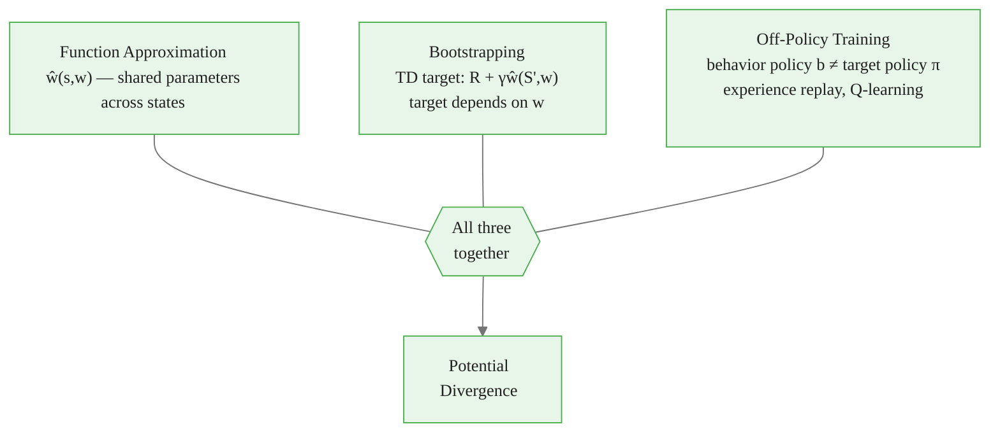

<!-- _class: lead -->

# The Deadly Triad

## Module 04 — Function Approximation
### Reinforcement Learning Course

<!-- Speaker notes: The deadly triad is the theoretical core of why deep RL is hard. By the end of this deck, learners should be able to name the three conditions, explain why each pairwise combination is safe, and connect each DQN innovation to the triad component it addresses. All results here are from Sutton & Barto Chapter 11. -->

---

# What Goes Wrong?

<div class="code-window">
<div class="code-header">
<div class="dots"><span class="dot-red"></span><span class="dot-yellow"></span><span class="dot-green"></span></div>
<span class="filename">example.py</span>
</div>

```python
# Tabular Q-learning: ALWAYS converges ✓
q_table = np.zeros((n_states, n_actions))
q_table[s, a] += alpha * (r + gamma * q_table[s_, a_] - q_table[s, a])

# Linear FA + Q-learning (off-policy): CAN DIVERGE ✗
w = np.zeros(n_features)
td_error = r + gamma * w @ x(s_) - w @ x(s)
w += alpha * td_error * x(s)   # same form, different behavior!
```
</div>

Same update formula. Completely different convergence behavior.

**The difference is not the algorithm. It is the combination of three properties.**


<div class="callout-insight">
<strong>Insight:</strong> This is a key takeaway from this section that connects to the broader course themes.
</div>

<!-- Speaker notes: Start with the code side-by-side. The update rule is identical in structure. The tabular version always converges; the FA version can diverge. This is the mystery that the deadly triad resolves. The three properties are the explanation for why these two identical-looking algorithms have different convergence behavior. -->

---

# The Three Conditions



Remove **any one** → stable. Keep all three → danger.


<div class="callout-key">
<strong>Key Point:</strong> Remember this concept — it appears repeatedly in later modules.
</div>

<!-- Speaker notes: The flowchart shows the three conditions feeding into the divergence risk. The key message is in the bottom note: remove any one and you get safety. This is not just theoretical: it guides every design decision in practical deep RL. When something is unstable, ask which triad component to weaken. -->

---

# Condition 1: Function Approximation

$$\hat{v}(s, \mathbf{w}) \approx V^\pi(s) \quad \text{with} \quad |\mathbf{w}| \ll |\mathcal{S}|$$

**The danger:** Updating $\mathbf{w}$ for state $s$ changes predictions for all states with similar features.

```
Update at s1 affects:
  s1 directly       (intended)
  s2, s3, s4 ...   (via shared weights — unintended side effects)
```

**Safe if:** Updates at related states are consistent (on-policy sampling achieves this).

**Dangerous if:** Updates at $s$ push predictions for $s'$ in the wrong direction (off-policy mismatch).


<div class="callout-warning">
<strong>Warning:</strong> This is a common source of confusion. Pay close attention to the distinction here.
</div>

<!-- Speaker notes: The key concept is weight sharing. In a table, updating row s1 only changes row s1. With FA, updating w changes the predictions for every state whose feature vector overlaps with x(s1). Under on-policy training, states are visited proportionally to how often the policy visits them, so the side effects are statistically consistent. Under off-policy, the side effects are mismatched to the actual visit frequencies. -->

---

# Condition 2: Bootstrapping

TD target depends on current weights $\mathbf{w}$:

$$\text{Target} = R_{t+1} + \gamma \underbrace{\hat{v}(S_{t+1}, \mathbf{w})}_{\text{depends on } \mathbf{w}}$$

Compare to Monte Carlo (no bootstrapping):

$$\text{MC Target} = G_t = \sum_{k=0}^{\infty} \gamma^k R_{t+k+1} \quad \text{(no } \mathbf{w}\text{)}$$

**The danger:** If $\hat{v}(S', \mathbf{w})$ overestimates, the target is inflated, which increases $\hat{v}(S, \mathbf{w})$, which inflates targets for predecessors of $S$...

$$\text{overestimate} \to \text{higher target} \to \text{bigger overestimate} \to \ldots$$


<div class="callout-info">
<strong>Info:</strong> This detail is useful context but not required to memorize.
</div>

<!-- Speaker notes: Bootstrapping creates a feedback loop. The target depends on the current weights, so if the weights drift high, the target drifts high too, pulling the weights even higher. Under tabular methods, this is bounded because each state's value is estimated independently. Under FA, the drift in one state's estimate propagates to all similar states, making the feedback loop much more dangerous. -->

---

# Condition 3: Off-Policy Training

| Algorithm | On or Off-Policy? | Why |
|---|---|---|
| SARSA | On-policy | Target uses $A'$ sampled from $\pi$ |
| Q-learning | Off-policy | Target uses $\max_{a'}$ (greedy), behavior is $\epsilon$-greedy |
| DQN | Off-policy | Replay buffer stores old transitions |
| A2C / PPO | On-policy | Rollouts collected from current policy |

**The danger:** Update distribution $\neq$ on-policy distribution.

The convergence proof for linear TD requires the on-policy distribution $d^\pi(s)$ to weight updates. Off-policy data has a different distribution — the mathematical guarantee dissolves.

<!-- Speaker notes: The table clarifies which algorithms are on vs off-policy and why. Q-learning is off-policy because its target is the greedy action value, not the value under the behavior policy. DQN adds experience replay, which makes it doubly off-policy: replay data comes from old policies AND the target uses the greedy action. SARSA avoids this by using the next action that was actually taken. -->

---

# The Two-Component Safety Map

| | No Bootstrapping (MC) | Bootstrapping (TD) |
|---|---|---|
| **On-policy** | Safe ✓ | Safe ✓ (linear FA) |
| **Off-policy** | Safe ✓ (with IS) | **Deadly Triad ✗** |

> Rows = training distribution. Columns = target type.

The cell that kills: **off-policy × bootstrapping**.

Function approximation amplifies it. Tabular methods survive it.

<!-- Speaker notes: This 2x2 table is the most compact summary of the triad. The off-policy + bootstrapping cell is the danger zone. On-policy Monte Carlo with importance sampling is safe because there is no feedback loop from the target. On-policy TD (linear FA) is safe because the convergence proof holds. Off-policy Monte Carlo with importance sampling is safe because IS corrects the distribution. Only off-policy + bootstrapping breaks. -->

---

# Baird's Counterexample

**7-state MDP, linear FA, reward = 0 everywhere.**

True optimal: $\mathbf{w} = \mathbf{0}$ (all values are zero).

```
States: s1, ..., s6 (non-terminal) → s7 always under target π
Behavior policy: mostly goes to s7 (6/7 solid, 1/7 dashed)

Feature vectors:
  x(si) = [0,...,2,...,0, 1]   (2 in position i, 1 in last)
  x(s7) = [0,0,0,0,0,0,0, 2]
```

Semi-gradient TD under off-policy:

$$w_1 \to 1.0 \to 1.2 \to 3.1 \to 14 \to \infty$$

Despite all rewards being zero. Despite the true solution being $\mathbf{w} = \mathbf{0}$.

<!-- Speaker notes: Baird's counterexample is the proof-of-concept that the deadly triad is real, not theoretical. The MDP is trivially simple: 7 states, zero rewards everywhere, so the true value function is identically zero, representable by w=0. Yet the off-policy + FA + bootstrapping combination causes the weights to diverge to infinity. This result should produce genuine discomfort: our favorite algorithm fails on the simplest possible problem when all three triad conditions are present. -->

---

# Why Baird's MDP Diverges

<div class="code-window">
<div class="code-header">
<div class="dots"><span class="dot-red"></span><span class="dot-yellow"></span><span class="dot-green"></span></div>
<span class="filename">example.py</span>
</div>

```python
# At w = 0, the expected update direction under off-policy sampling is:
# delta = gamma * v(s7) - v(si)
#       = gamma * 2*w8 - (2*wi + w8)
# At w=0: delta = 0 (correct, no update needed)
#
# BUT the off-policy distribution over-weights states s1-s6
# relative to the target policy's distribution.
# This asymmetry creates a net positive push away from w=0.

def expected_update_at_w_zero(gamma=0.99):
    # Behavior policy: 6/7 time in s1-s6, 1/7 time in s7
    # Target policy: always goes to s7
    v_s7 = 0.0  # at w=0
    v_si = 0.0  # at w=0
    delta = gamma * v_s7 - v_si  # = 0 at w=0

    # But the off-policy ratio (importance weight) is:
    # rho = pi(dashed|s) / b(dashed|s) = 1 / (1/7) = 7 for "dashed" action
    # This scales up the effective update, creating instability.
    return "Weights pushed outward by IS mismatch even at true solution"
```
</div>

The importance sampling ratio amplifies updates in the direction away from $\mathbf{w} = \mathbf{0}$.

<!-- Speaker notes: This code illustrates why the math fails at the true solution. At w=0, the TD error is zero for any single transition. But the expected update under the off-policy distribution, weighted by importance sampling ratios, is NOT zero. The behavior policy visits s1-s6 more than the target policy does. When these visits are upweighted by the IS ratio, they create a net push that moves w away from 0. -->

---

# Mitigation Strategy 1: Experience Replay

```python
class ReplayBuffer:
    def __init__(self, capacity=10_000):
        from collections import deque
        self.buffer = deque(maxlen=capacity)

    def push(self, s, a, r, s_, done):
        self.buffer.append((s, a, r, s_, done))

    def sample(self, batch_size):
        import random
        batch = random.sample(self.buffer, batch_size)
        return zip(*batch)
```

**What it fixes:** Temporal correlation — sequential transitions are highly correlated, causing the network to overfit to recent data.

**What it does NOT fix:** The triad. Replay data is still off-policy. Bootstrapping still creates feedback. FA still shares weights.

<!-- Speaker notes: Experience replay is the first of two DQN innovations. It fixes data correlation, not the triad itself. The deque with maxlen automatically discards old experiences. uniform sampling breaks the correlation. But the replay buffer makes the training distribution even more off-policy: we're training on transitions from many different past policies simultaneously. The triad is still present. -->

---

# Mitigation Strategy 2: Target Networks

$$\delta_t = R_{t+1} + \gamma \underbrace{\max_{a'} \hat{q}(S_{t+1}, a', \mathbf{w}^-)}_{\text{target network (frozen for K steps)}} - \hat{q}(S_t, A_t, \mathbf{w})$$

```python
# Hard update: copy weights every K steps
if step % target_update_freq == 0:
    target_network.load_state_dict(online_network.state_dict())

# Soft update: Polyak averaging every step
tau = 0.005
for p, p_tgt in zip(online.parameters(), target.parameters()):
    p_tgt.data.copy_(tau * p.data + (1 - tau) * p_tgt.data)
```

**What it fixes:** The bootstrap feedback loop — the target moves slowly, not in lockstep with the online network.

**What it does NOT fix:** The triad. The feedback loop still exists, just slowed.

<!-- Speaker notes: Target networks are the second DQN innovation. The key insight: if the target is frozen for K steps, then the feedback loop — where overestimates inflate the target which inflates the online prediction — is broken for K steps. The online network chases a fixed target, which is like supervised regression. After K steps, the target is updated, and the process repeats. Soft updates (Polyak averaging) provide a smooth version of this: the target moves at rate tau, which must be small (0.005 is typical). -->

---

# DQN's Full Triad Mitigation

| DQN Component | Triad Ingredient | How It Helps |
|---|---|---|
| Neural network | FA (required) | Enables Atari — no alternative |
| Experience replay | Off-policy | Decorrelates data stream |
| Target network (frozen K steps) | Bootstrapping | Stabilizes feedback loop |
| Gradient clipping | Bootstrapping | Bounds update magnitude |
| Reward clipping to $[-1,1]$ | Bootstrapping | Bounds TD error magnitude |

All three triad ingredients remain. DQN makes them less lethal, not absent.

<!-- Speaker notes: This table maps each DQN design choice to the triad component it addresses. The critical observation in the right column: none of these say "removes" or "eliminates." They say "decorrelates," "stabilizes," "bounds." DQN is engineering around the triad, not solving it. This is why DQN can still fail on some Atari games — the triad interactions are just too severe for the mitigations to handle. -->

---

# Gradient Correction: The Theoretically Sound Fix

**GTD2** (Gradient TD, Sutton et al. 2009):

$$\mathbf{w} \leftarrow \mathbf{w} + \alpha_w \left[ \delta_t \mathbf{x}(S_t) - \gamma \mathbf{x}(S_{t+1}) (\mathbf{x}(S_t)^T \mathbf{h}) \right]$$
$$\mathbf{h} \leftarrow \mathbf{h} + \alpha_h \left[ \delta_t - \mathbf{x}(S_t)^T \mathbf{h} \right] \mathbf{x}(S_t)$$

**Convergent off-policy with linear FA.** Proven. Slower than DQN in practice.

**Why practitioners use DQN instead:**
- GTD converges but slowly (sublinear rate)
- DQN diverges but rarely (on most games)
- Engineering wins over theory in practice

<!-- Speaker notes: GTD2 is the theoretically correct solution. It modifies the semi-gradient update with a correction term (the h-weighted term) that accounts for the off-policy mismatch. Convergence is proven for linear FA off-policy. The secondary weight vector h is updated with a faster step size alpha_h. The reason practitioners don't use GTD is simple: empirically, DQN + replay + target networks works better on most tasks, even without convergence guarantees. Theory and practice diverge here. -->

---

# On-Policy Escape: Avoid the Triad Entirely

**Policy gradient methods (Module 06)** avoid the triad differently:

```
REINFORCE (on-policy, Monte Carlo, FA):
  - On-policy: collects from current policy ✓
  - No bootstrapping: uses full MC return ✓
  - FA: neural network ✓
  → No deadly triad! Safe by design.

PPO (on-policy, bootstrapping, FA):
  - On-policy: stays close to current policy ✓
  - Bootstrapping: uses value function ← potential issue
  - FA: neural network ✓
  → Mild triad; on-policy mitigates it
```

The triad is off-policy + bootstrapping + FA. On-policy methods remove the worst ingredient.

<!-- Speaker notes: Policy gradient methods are the escape hatch from the triad. REINFORCE avoids all three dangerous combinations: it is on-policy, uses Monte Carlo returns (no bootstrapping), and can use any FA. PPO is slightly in the triad because it bootstraps with a value function, but it stays close enough to on-policy that the mismatch is small. This is why PPO is more stable than DQN on most tasks — it is fighting a weaker form of the triad. -->

---

# Common Pitfalls

| Pitfall | Common Misconception | Truth |
|---|---|---|
| "Q-learning is safe because tabular Q-learning is safe" | Convergence transfers to FA | FA convergence requires on-policy |
| "Replay buffer solves off-policy" | Replay = on-policy data | Replay data is old-policy data = off-policy |
| "Target networks eliminate the triad" | Triad is absent | Triad is present, feedback is slowed |
| "GTD is better than DQN" | Theory = practice | GTD is slower empirically |
| "Large reward scale is fine" | Scale is irrelevant | Large rewards amplify divergence |

<!-- Speaker notes: Each row pairs a misconception with the correcting truth. The first row is the most dangerous: the safety of tabular Q-learning creates false confidence in Q-learning + FA. The third row is common among practitioners who implement target networks and assume the problem is solved. Emphasize: the triad is not solved by DQN, it is managed. -->

---

# Key Takeaways

1. The deadly triad: function approximation + bootstrapping + off-policy training.

2. Any two ingredients are safe. All three cause potential divergence.

3. Baird's counterexample proves divergence with linear FA — even the simplest case fails.

4. DQN mitigates (does not solve) the triad with replay buffers and target networks.

5. On-policy methods (PPO, A2C) avoid the worst ingredient by staying on-policy.

6. Gradient TD methods (GTD2) solve it theoretically but are slower empirically.

<!-- Speaker notes: Six takeaways — one more than the typical five — because the GTD point is important context. Practitioners need to know that a theoretically correct solution exists but is not used in practice. This motivates the "why DQN?" question in Module 05. -->

---

# Preview: Module 05 — DQN

**What we implement:**
- Neural network Q-function ($\hat{q}$ via convolutional network)
- Experience replay buffer (uniform sampling, capacity 50k–1M)
- Target network (hard update every 10k steps)
- Epsilon-greedy exploration schedule
- Huber loss for gradient stability

**What we observe:**
- How replay buffer size affects stability
- How target update frequency affects divergence risk
- Where DQN fails (games with long-horizon credit assignment)

**The triad is not solved — it is tamed. Module 05 shows where the taming breaks down.**

<!-- Speaker notes: The Module 05 preview connects the theory in this guide to the implementation in the next module. Each DQN component maps directly to a triad ingredient discussed in this deck. The last line is the hook: Module 05 is not just "how to implement DQN" — it is "what happens when the taming fails and why." -->
