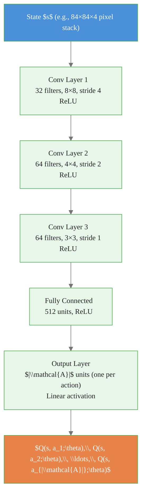

# Deep Q-Network (DQN)

> **Reading time:** ~11 min | **Module:** 5 — Deep RL | **Prerequisites:** Module 4, PyTorch basics

## In Brief

DQN (Mnih et al., 2015) replaces the tabular Q-table with a neural network that approximates the action-value function $Q(s, a; \theta) \approx Q^*(s, a)$. Two stabilizing mechanisms — an **experience replay buffer** and a **target network** — make the training process tractable and converge reliably.

<div class="callout-key">

<strong>Key Concept:</strong> DQN (Mnih et al., 2015) replaces the tabular Q-table with a neural network that approximates the action-value function $Q(s, a; \theta) \approx Q^*(s, a)$. Two stabilizing mechanisms — an **experience replay buffer** and a **target network** — make the training process tractable and converge reliably.

</div>


## Key Insight

Q-learning with a neural network approximator is unstable without intervention. Consecutive transitions are highly correlated, and updating the Q-network moves both the prediction and the target simultaneously — a feedback loop that diverges. Experience replay breaks the correlation; the target network holds the prediction target fixed. Both are required.

---


<div class="callout-key">

<strong>Key Point:</strong> Q-learning with a neural network approximator is unstable without intervention.

</div>

## Formal Definition

The optimal action-value function satisfies the Bellman optimality equation:

<div class="callout-key">

<strong>Key Point:</strong> The optimal action-value function satisfies the Bellman optimality equation:

$$Q^*(s, a) = \mathbb{E}\!\left[r + \gamma \max_{a'} Q^*(s', a') \;\Big|\; S_t = s,\, A_t = a\right]$$

DQN approximates $...

</div>


$$Q^*(s, a) = \mathbb{E}\!\left[r + \gamma \max_{a'} Q^*(s', a') \;\Big|\; S_t = s,\, A_t = a\right]$$

DQN approximates $Q^*$ with a neural network parameterized by $\theta$. The loss at each training step is:

$$\mathcal{L}(\theta) = \mathbb{E}_{(s,\, a,\, r,\, s',\, \text{done}) \sim \mathcal{D}}\!\left[\bigl(Y - Q(s, a;\, \theta)\bigr)^2\right]$$

where the **TD target** $Y$ is computed using a separate **target network** with parameters $\theta^-$:

$$Y = \begin{cases} r & \text{if done} \\ r + \gamma \displaystyle\max_{a'} Q(s',\, a';\, \theta^-) & \text{otherwise} \end{cases}$$

The gradient update is:

$$\theta \leftarrow \theta - \alpha \nabla_\theta \mathcal{L}(\theta)$$

The target network parameters $\theta^-$ are copied from $\theta$ every $C$ steps and held **fixed** between copies.

---

## The Two Stabilizing Innovations

### Innovation 1: Experience Replay Buffer

The replay buffer $\mathcal{D}$ stores transitions $(s, a, r, s', \text{done})$ collected during environment interaction. At each training step, a mini-batch is drawn **uniformly at random** from $\mathcal{D}$.

**Why it is necessary:**

1. **Breaks temporal correlation.** Consecutive transitions $(s_t, a_t, r_{t+1}, s_{t+1})$ are highly correlated because they share the same trajectory. Gradient descent on correlated data oscillates; random mini-batches from the buffer approximate i.i.d. samples.
2. **Improves data efficiency.** Each transition can be replayed many times, amortizing the cost of environment interaction.
3. **Stabilizes the data distribution.** Without a buffer, the distribution of training samples shifts as the policy changes, violating the i.i.d. assumption underlying SGD convergence guarantees.


<div class="flow">
<div class="flow-step mint">1. Breaks temporal correlation.</div>
<div class="flow-arrow">&#8594;</div>
<div class="flow-step amber">2. Improves data efficiency.</div>
<div class="flow-arrow">&#8594;</div>
<div class="flow-step blue">3. Stabilizes the data distributi...</div>
</div>

Buffer capacity is a hyperparameter. A buffer that is too small forgets old experience quickly; too large and early (poor-policy) transitions dilute recent ones.

### Innovation 2: Target Network

The target network is a copy of the Q-network with parameters $\theta^-$ that are updated infrequently (every $C$ environment steps in the original paper, with $C = 10{,}000$).

**Why it is necessary:**

Without a target network the loss is:

$$\mathcal{L}(\theta) = \mathbb{E}\!\left[\bigl(r + \gamma \max_{a'} Q(s', a'; \theta) - Q(s, a; \theta)\bigr)^2\right]$$

Both the prediction $Q(s, a; \theta)$ and the bootstrap target $r + \gamma \max_{a'} Q(s', a'; \theta)$ depend on $\theta$. Every gradient step that improves the prediction simultaneously moves the target in an unpredictable direction — the classic **deadly triad** instability. Freezing $\theta^-$ for $C$ steps turns the target into a near-stationary supervised regression target.

---

## Why Both Are Required: The Deadly Triad

The **deadly triad** (Sutton & Barto, 2018) is the combination of three factors that together cause divergence:

| Factor | Present in DQN? | Mitigation |
|--------|-----------------|------------|
| Function approximation (neural network) | Yes | Cannot avoid — it is the point |
| Bootstrapping (TD update using own estimate) | Yes | Target network freezes the bootstrap target |
| Off-policy learning (replay buffer samples old policies) | Yes | Experience replay provides stable, decorrelated batches |

Removing either the replay buffer or the target network reintroduces one pathway to divergence. The Mnih 2015 ablation study confirms both are needed independently.

---

## Neural Network Architecture

<div class="code-window">
<div class="code-header">
<div class="dots"><span class="dot-red"></span><span class="dot-yellow"></span><span class="dot-green"></span></div>
<span class="filename">example.py</span>
</div>

The following implementation builds on the approach above:



</div>

The network takes a state as input and outputs one Q-value per action simultaneously. At inference, the greedy action is $a^* = \arg\max_a Q(s, a; \theta)$.

---

## Training Loop Pseudocode

```
Initialize Q-network with weights θ
Initialize target network with weights θ⁻ ← θ
Initialize replay buffer D with capacity N

For episode = 1, 2, ..., M:
    s ← env.reset()

    For step t = 1, 2, ..., T:
        # 1. Select action (ε-greedy)
        With probability ε:  a ← random action
        Otherwise:           a ← argmax_a Q(s, a; θ)

        # 2. Execute action, observe outcome
        s', r, done ← env.step(a)

        # 3. Store transition in replay buffer
        D.push((s, a, r, s', done))

        s ← s'

        # 4. Sample mini-batch and compute loss
        If |D| ≥ batch_size:
            {(sᵢ, aᵢ, rᵢ, s'ᵢ, doneᵢ)} ← D.sample(batch_size)

            For each sample i:
                If doneᵢ:  Yᵢ ← rᵢ
                Else:       Yᵢ ← rᵢ + γ · max_a' Q(s'ᵢ, a'; θ⁻)

            L(θ) ← mean((Yᵢ − Q(sᵢ, aᵢ; θ))²)

            θ ← θ − α · ∇_θ L(θ)

        # 5. Periodically sync target network
        If t mod C == 0:
            θ⁻ ← θ
```

---

## Code Implementation

<div class="code-window">
<div class="code-header">
<div class="dots"><span class="dot-red"></span><span class="dot-yellow"></span><span class="dot-green"></span></div>
<span class="filename">example.py</span>
</div>

The following implementation builds on the approach above:

```python
import torch
import torch.nn as nn
import torch.optim as optim
import numpy as np
from collections import deque
import random


class QNetwork(nn.Module):
    """
    Neural network approximating Q(s, a; theta).

    Outputs one Q-value per action — forward pass through a single state
    produces the full action-value vector simultaneously.
    """

    def __init__(self, obs_dim: int, n_actions: int, hidden: int = 128):
        super().__init__()
        self.net = nn.Sequential(
            nn.Linear(obs_dim, hidden),
            nn.ReLU(),
            nn.Linear(hidden, hidden),
            nn.ReLU(),
            nn.Linear(hidden, n_actions),
        )

    def forward(self, x: torch.Tensor) -> torch.Tensor:
        return self.net(x)


class ReplayBuffer:
    """
    Circular buffer storing (s, a, r, s', done) transitions.

    Random sampling breaks temporal correlation in the training data,
    which is the first stabilizing mechanism in DQN.
    """

    def __init__(self, capacity: int):
        self.buffer = deque(maxlen=capacity)

    def push(self, state, action, reward, next_state, done):
        self.buffer.append((state, action, reward, next_state, done))

    def sample(self, batch_size: int):
        batch = random.sample(self.buffer, batch_size)
        states, actions, rewards, next_states, dones = zip(*batch)
        return (
            torch.tensor(np.array(states),      dtype=torch.float32),
            torch.tensor(actions,               dtype=torch.long),
            torch.tensor(rewards,               dtype=torch.float32),
            torch.tensor(np.array(next_states), dtype=torch.float32),
            torch.tensor(dones,                 dtype=torch.float32),
        )

    def __len__(self):
        return len(self.buffer)


class DQNAgent:
    """
    DQN agent (Mnih et al., 2015).

    Two stabilizing mechanisms:
      1. Experience replay buffer — decorrelates training samples
      2. Target network          — stabilizes the TD bootstrap target
    """

    def __init__(
        self,
        obs_dim: int,
        n_actions: int,
        buffer_capacity: int = 50_000,
        batch_size: int = 64,
        gamma: float = 0.99,
        lr: float = 1e-3,
        target_update_freq: int = 1_000,
        epsilon_start: float = 1.0,
        epsilon_end: float = 0.01,
        epsilon_decay: int = 10_000,
    ):
        self.n_actions = n_actions
        self.batch_size = batch_size
        self.gamma = gamma
        self.target_update_freq = target_update_freq
        self.epsilon_start = epsilon_start
        self.epsilon_end = epsilon_end
        self.epsilon_decay = epsilon_decay
        self.steps_done = 0

        # Q-network and target network — identical architecture
        self.q_net = QNetwork(obs_dim, n_actions)
        self.target_net = QNetwork(obs_dim, n_actions)
        self.target_net.load_state_dict(self.q_net.state_dict())
        # Target network is never updated via gradients
        self.target_net.eval()

        self.optimizer = optim.Adam(self.q_net.parameters(), lr=lr)
        self.buffer = ReplayBuffer(buffer_capacity)

    def epsilon(self) -> float:
        """Exponential ε-decay schedule."""
        return self.epsilon_end + (self.epsilon_start - self.epsilon_end) * \
               np.exp(-self.steps_done / self.epsilon_decay)

    def select_action(self, state: np.ndarray) -> int:
        """ε-greedy action selection."""
        self.steps_done += 1
        if random.random() < self.epsilon():
            return random.randrange(self.n_actions)
        with torch.no_grad():
            state_t = torch.tensor(state, dtype=torch.float32).unsqueeze(0)
            return self.q_net(state_t).argmax(dim=1).item()

    def update(self) -> float | None:
        """
        One gradient step on a random mini-batch from the replay buffer.

        Returns the scalar loss value, or None if the buffer is not
        yet large enough to fill a full batch.
        """
        if len(self.buffer) < self.batch_size:
            return None

        states, actions, rewards, next_states, dones = \
            self.buffer.sample(self.batch_size)

        # Current Q-values for the actions actually taken
        q_values = self.q_net(states).gather(1, actions.unsqueeze(1)).squeeze(1)

        # TD targets — computed with the FROZEN target network
        with torch.no_grad():
            max_next_q = self.target_net(next_states).max(dim=1).values
            # When done=1, the episode ended; no future reward exists
            targets = rewards + self.gamma * max_next_q * (1.0 - dones)

        loss = nn.functional.mse_loss(q_values, targets)

        self.optimizer.zero_grad()
        loss.backward()
        # Gradient clipping prevents catastrophically large updates
        nn.utils.clip_grad_norm_(self.q_net.parameters(), max_norm=10.0)
        self.optimizer.step()

        # Periodically copy Q-network weights into the target network
        if self.steps_done % self.target_update_freq == 0:
            self.target_net.load_state_dict(self.q_net.state_dict())

        return loss.item()
```

</div>

---

## Common Pitfalls

<div class="callout-danger">

<strong>Danger:</strong> The pitfalls below are the most common mistakes practitioners make. Each one can silently degrade your results without obvious errors.

</div>

**Pitfall 1 — Omitting the target network.**
Computing TD targets with the same network being updated creates a moving-target problem. Q-values and targets chase each other, typically causing divergence within a few thousand steps. Always use a separate, periodically updated target network.

<div class="callout-warning">

<strong>Warning:</strong> **Pitfall 1 — Omitting the target network.**
Computing TD targets with the same network being updated creates a moving-target problem.

</div>

**Pitfall 2 — Replay buffer too small.**
A buffer that holds fewer than ~10,000 transitions fills quickly with on-policy data. The agent effectively trains only on recent experience, losing the decorrelation benefit. The original DQN used a buffer of 1,000,000 transitions.

**Pitfall 3 — Using the wrong loss function.**
Mean absolute error (Huber loss) is often preferred over MSE in practice because large TD errors are clipped, preventing gradient explosions. Using MSE without gradient clipping can destabilize training.

**Pitfall 4 — Bootstrapping through terminal states.**
The Bellman target for a terminal transition is simply $Y = r$, not $r + \gamma \max_{a'} Q(s', a'; \theta^-)$. Failing to mask done transitions causes the agent to bootstrap value from a state that does not exist, introducing a systematic bias.

**Pitfall 5 — Starting training before the buffer has enough samples.**
Training on mini-batches of size 32 when the buffer contains only 35 transitions means the same transitions are replayed almost every step — no decorrelation benefit. Warm up the buffer for at least a few thousand steps of random exploration before starting gradient updates.

**Pitfall 6 — Greedy policy during evaluation and during training.**
During training, the epsilon-greedy policy is necessary for exploration. During evaluation, always use the greedy policy ($\epsilon = 0$) and report the deterministic performance separately from the training reward.

---

## Connections


<div class="callout-info">

<strong>Info:</strong> This section maps how this guide connects to the broader course. Use these links to navigate related material.

</div>

- **Builds on:** Q-learning (Module 03), Bellman equations (Module 00 Guide 03), function approximation concepts
- **Leads to:** Double DQN, Dueling DQN, Prioritized Experience Replay (Guide 02), policy gradient methods (Module 06)
- **Related to:** temporal-difference learning, neural fitted Q-iteration, fitted value iteration

---


## Practice Questions

**Question 1 — Conceptual:** Based on the concepts in this guide, explain in your own words why the core technique matters and when you would choose it over alternatives.

**Question 2 — Application:** Sketch out how you would apply the main concept from this guide to a real-world dataset or problem you have encountered. What would you need to watch out for?


## Further Reading

- Mnih, V. et al. (2015). *Human-level control through deep reinforcement learning.* Nature, 518, 529–533. — the original DQN paper with the Atari benchmark
- Mnih, V. et al. (2013). *Playing Atari with Deep Reinforcement Learning.* arXiv:1312.5602. — the earlier workshop version with the core ideas
- Sutton & Barto (2018). *Reinforcement Learning: An Introduction*, 2nd ed., Chapter 11 — formal treatment of the deadly triad and off-policy divergence
- van Hasselt, H., Guez, A., & Silver, D. (2016). *Deep Reinforcement Learning with Double Q-Learning.* AAAI. — the natural successor addressing overestimation bias


---

## Cross-References

<a class="link-card" href="./01_dqn_slides.md">
  <div class="link-card-title">Companion Slides</div>
  <div class="link-card-description">Interactive slide deck covering the key concepts with visual examples.</div>
</a>

<a class="link-card" href="../notebooks/01_dqn_from_scratch.ipynb">
  <div class="link-card-title">Hands-on Notebook</div>
  <div class="link-card-description">15-minute micro-notebook with guided exercises and real data.</div>
</a>
