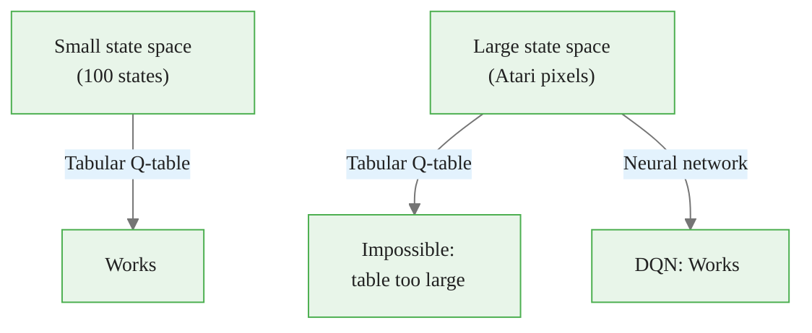
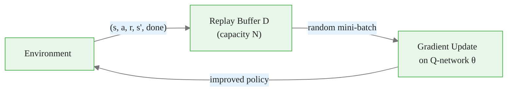
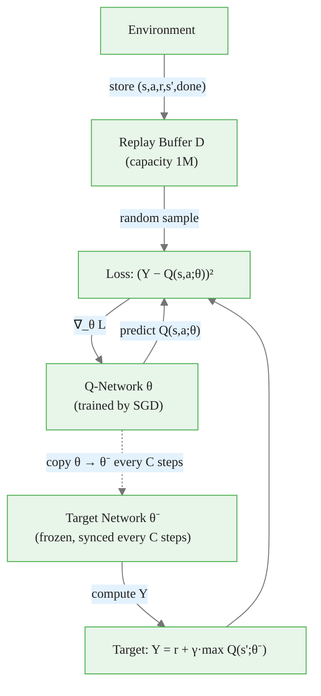
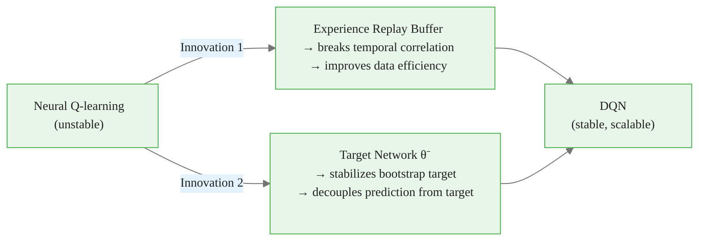

<!-- _class: lead -->

# Deep Q-Network (DQN)

**Module 05 — Deep Reinforcement Learning**

> Mnih et al. (2015): the first algorithm to learn human-level control directly from raw pixels, using nothing but a neural network and two stabilizing innovations.

<!--
Speaker notes: Key talking points for this slide
- DQN marked the beginning of the deep RL era — Nature paper, 2015, Atari benchmark
- The core contribution is NOT the neural network architecture — CNNs existed for decades
- The contribution is two engineering innovations that make neural Q-learning stable
- By the end of this deck learners will be able to implement DQN from scratch and explain WHY both innovations are necessary
-->

<!-- Speaker notes: Cover the key points on this slide about Deep Q-Network (DQN). Pause for questions if the audience seems uncertain. -->

---

# The Problem: Why Tabular Q-Learning Fails at Scale

<div class="columns">
<div>

**Tabular Q-learning** stores one value per (state, action) pair.

Works perfectly for small state spaces:
- GridWorld: ~100 cells
- CartPole: discretized states

**Fails completely for:**
- Atari: $84 \times 84 \times 4$ pixel stack → $256^{28224}$ states
- Robotics: continuous joint angles
- Any real-world perception task

</div>
<div>



</div>
</div>

<!--
Speaker notes: Key talking points for this slide
- Emphasize that the problem is not just memory — even if you could store the table, you could never visit enough states to fill it
- The solution is function approximation: learn a function Q(s, a; θ) that generalizes across states
- Neural networks are universal function approximators — they can represent any continuous function given enough capacity
- The key question is: can we train them stably? That's the whole challenge.
-->


<div class="callout-insight">
<strong>Insight:</strong> This is a key takeaway from this section that connects to the broader course themes.
</div>

<!-- Speaker notes: Cover the key points on this slide about The Problem: Why Tabular Q-Learning Fails at Scale. Pause for questions if the audience seems uncertain. -->

---

# The DQN Idea

Replace the Q-table with a neural network:

$$Q(s, a;\, \theta) \approx Q^*(s, a)$$

The network takes a **state** as input and outputs **one Q-value per action**:

```
Input: state s (pixels, features, ...)
         ↓
   [Neural Network θ]
         ↓
Output: [Q(s,a₁;θ),  Q(s,a₂;θ),  ...,  Q(s,aₙ;θ)]
```

Greedy action selection: $a^* = \arg\max_a Q(s, a;\, \theta)$

<!--
Speaker notes: Key talking points for this slide
- The output layer has one neuron per action — one forward pass gives all Q-values simultaneously
- This is more efficient than running a separate forward pass per action
- For continuous action spaces this design breaks down — that's where actor-critic methods (Module 07) come in
- The parameters θ are learned by gradient descent, just like any neural network
-->


<div class="callout-key">
<strong>Key Point:</strong> Remember this concept — it appears repeatedly in later modules.
</div>

<!-- Speaker notes: Cover the key points on this slide about The DQN Idea. Pause for questions if the audience seems uncertain. -->

---

<!-- _class: lead -->

# The Deadly Triad: Why Naive Training Fails

<!--
Speaker notes: Key talking points for this slide
- Before presenting the solutions, we need to understand why naive neural Q-learning diverges
- The "deadly triad" is the technical name for the three factors that together cause instability
- Each factor alone is manageable; together they create a feedback loop that diverges
- Understanding this motivates each innovation in DQN
-->

<!-- Speaker notes: Cover the key points on this slide about The Deadly Triad: Why Naive Training Fails. Pause for questions if the audience seems uncertain. -->

---

# Three Factors That Cause Divergence

| Factor | What It Means | Why It's a Problem |
|--------|--------------|-------------------|
| **Function approximation** | Neural network as Q-function | Generalization can amplify errors |
| **Bootstrapping** | TD update: $Y = r + \gamma \max Q(s';\theta)$ | Target depends on the same $\theta$ being updated |
| **Off-policy learning** | Train on old transitions | Distribution shift between behavior and target policy |

> The **deadly triad** (Sutton & Barto, 2018): any two of these factors together is manageable. All three together causes divergence.

<!--
Speaker notes: Key talking points for this slide
- Factor 1: function approximation is unavoidable — it's the reason DQN works at all on large state spaces
- Factor 2: bootstrapping means you're using your own (changing) estimate as a training target — chasing a moving target
- Factor 3: off-policy training is actually desired (data efficiency) but adds instability
- The key insight: DQN's two innovations directly address factors 2 and 3
-->


<div class="callout-warning">
<strong>Warning:</strong> This is a common source of confusion. Pay close attention to the distinction here.
</div>

<!-- Speaker notes: Cover the key points on this slide about Three Factors That Cause Divergence. Pause for questions if the audience seems uncertain. -->

---

<!-- _class: lead -->

# Innovation 1: Experience Replay Buffer

<!--
Speaker notes: Key talking points for this slide
- The replay buffer addresses the off-policy and correlation problems simultaneously
- Simple idea, powerful effect — often underestimated
- The buffer converts RL data collection into something closer to supervised learning
-->

<!-- Speaker notes: Cover the key points on this slide about Innovation 1: Experience Replay Buffer. Pause for questions if the audience seems uncertain. -->

---

# Experience Replay: The Idea

Collect transitions and store them in a buffer. Train on **random samples** from the buffer, not the latest transition.



<div class="code-window">
<div class="code-header">
<div class="dots"><span class="dot-red"></span><span class="dot-yellow"></span><span class="dot-green"></span></div>
<span class="filename">example.py</span>
</div>

```python
# Store every transition
buffer.push(state, action, reward, next_state, done)

# Train on a random batch — NOT the latest transition
batch = buffer.sample(batch_size=64)
```
</div>

<!--
Speaker notes: Key talking points for this slide
- The buffer acts as a "memory" of past experience — the agent learns from its history, not just its present
- Key requirement: the buffer must be large enough to hold many diverse trajectories
- Original DQN: buffer size = 1,000,000 transitions
- Walk through the flowchart: collect → store → sample → train → collect (loop)
-->


<div class="callout-info">
<strong>Info:</strong> This detail is useful context but not required to memorize.
</div>

<!-- Speaker notes: Cover the key points on this slide about Experience Replay: The Idea. Pause for questions if the audience seems uncertain. -->

---

# Why Experience Replay Works

<div class="columns">
<div>

**Problem 1: Temporal correlation**

Consecutive transitions $(s_t, s_{t+1}, s_{t+2})$ share the same trajectory — highly correlated. SGD on correlated data oscillates.

**Solution:** Random sampling from the buffer breaks correlation, approximating i.i.d. batches.

</div>
<div>

**Problem 2: Data efficiency**

Each environment step is expensive. Tabular methods discard transitions after one use.

**Solution:** Each transition can be replayed **many times**, amortizing the cost of environment interaction.

</div>
</div>

> A buffer that is too small fills with on-policy data and loses the decorrelation benefit. Minimum practical size: ~10,000 transitions.

<!--
Speaker notes: Key talking points for this slide
- The correlation problem is analogous to training a supervised model where every batch contains samples from the same class
- "Approximately i.i.d." is key — we're not actually i.i.d. (transitions remain correlated over long timescales) but random sampling is sufficient
- Data efficiency gain is substantial: DQN replays each transition on average 8 times (1M buffer, 1M total steps, 8 updates/step)
- Practical note: the buffer warm-up period (collecting random transitions before starting training) is important
-->

<!-- Speaker notes: Cover the key points on this slide about Why Experience Replay Works. Pause for questions if the audience seems uncertain. -->

---

<!-- _class: lead -->

# Innovation 2: Target Network

<!--
Speaker notes: Key talking points for this slide
- The target network directly addresses the bootstrapping instability
- The idea is elegant: make the training target nearly stationary by using a frozen copy of the network
- This is the innovation that most people forget or underestimate
-->

<!-- Speaker notes: Cover the key points on this slide about Innovation 2: Target Network. Pause for questions if the audience seems uncertain. -->

---

# The Moving Target Problem

Without a target network, the loss is:

$$\mathcal{L}(\theta) = \mathbb{E}\!\left[\bigl(\underbrace{r + \gamma \max_{a'} Q(s', a'; \theta)}_{\text{target}} - \underbrace{Q(s, a; \theta)}_{\text{prediction}}\bigr)^2\right]$$

**Both terms depend on $\theta$.**

Every gradient step that reduces the prediction error simultaneously shifts the target — the network chases a moving target and diverges.

<!--
Speaker notes: Key talking points for this slide
- Analogy: trying to hit a bullseye that moves every time you fire an arrow
- This is NOT a convergence speed issue — it causes active divergence
- The problem is that the bootstrap target r + γ·max Q(s';θ) is coupled to the prediction Q(s,a;θ)
- Even a small gradient step can make the target "jump" in a direction that makes the prediction worse
-->

<!-- Speaker notes: Cover the key points on this slide about The Moving Target Problem. Pause for questions if the audience seems uncertain. -->

---

# Target Network: The Fix

Use a **separate, frozen copy** $\theta^-$ for computing targets:

$$Y = \begin{cases} r & \text{if done} \\ r + \gamma \displaystyle\max_{a'} Q(s',\, a';\, \theta^-) & \text{otherwise} \end{cases}$$

$$\mathcal{L}(\theta) = \mathbb{E}\!\left[\bigl(Y - Q(s, a;\, \theta)\bigr)^2\right]$$

**Key:** $\theta^-$ is held **constant** during gradient updates and synced every $C$ steps:

```python
# Sync target network every C steps
if steps_done % C == 0:
    target_net.load_state_dict(q_net.state_dict())
```

<!--
Speaker notes: Key talking points for this slide
- With θ⁻ fixed, the loss looks exactly like supervised regression — a fixed target, a changing prediction
- The original DQN paper used C = 10,000 steps between syncs
- Between syncs, the target is not perfectly stationary (the true Q* changes as policy improves) but it changes slowly enough for SGD to converge
- Soft update alternative: θ⁻ ← τ·θ + (1−τ)·θ⁻ with small τ (e.g., 0.005) — used in DDPG, SAC
-->

<!-- Speaker notes: Cover the key points on this slide about Target Network: The Fix. Pause for questions if the audience seems uncertain. -->

---

# DQN Architecture: Both Innovations Together



<!--
Speaker notes: Key talking points for this slide
- Walk through the diagram carefully — this is the complete DQN system
- Two separate networks: Q-network (trained) and target network (frozen copy)
- The dashed arrow represents the periodic sync: no gradients flow to the target network
- The replay buffer feeds random mini-batches to the loss computation
- Only θ receives gradient updates — θ⁻ never does
-->

<!-- Speaker notes: Cover the key points on this slide about DQN Architecture: Both Innovations Together. Pause for questions if the audience seems uncertain. -->

---

# The DQN Loss

The full training objective, derived from the Bellman optimality equation:

$$\mathcal{L}(\theta) = \mathbb{E}_{(s,\, a,\, r,\, s',\, \text{done}) \sim \mathcal{D}}\!\left[\bigl(Y - Q(s, a;\, \theta)\bigr)^2\right]$$

```python
# Compute Q(s, a; θ) — only for the actions actually taken
q_values = q_net(states).gather(1, actions.unsqueeze(1)).squeeze(1)

# Compute TD targets using the FROZEN target network
with torch.no_grad():
    max_next_q = target_net(next_states).max(dim=1).values
    targets = rewards + gamma * max_next_q * (1.0 - dones)

# MSE loss (or Huber loss for robustness to outliers)
loss = F.mse_loss(q_values, targets)
```

<!--
Speaker notes: Key talking points for this slide
- The gather() operation selects the Q-value for the specific action taken — we don't train all actions, only the one that was executed
- torch.no_grad() ensures no gradients flow through the target computation — this is critical
- The (1.0 − dones) term masks out terminal states: when done=1, there is no future reward to bootstrap
- Huber loss (smooth L1) is often used instead of MSE because it is less sensitive to large TD errors
-->

<!-- Speaker notes: Cover the key points on this slide about The DQN Loss. Pause for questions if the audience seems uncertain. -->

---

# ε-Greedy Exploration

DQN uses a decaying $\epsilon$-greedy policy during training:

<div class="columns">
<div>

$$a_t = \begin{cases} \text{random} & \text{with prob } \epsilon \\ \arg\max_a Q(s_t, a;\theta) & \text{with prob } 1-\epsilon \end{cases}$$

$\epsilon$ decays from 1.0 to 0.01 over training:

```python
eps = eps_end + (eps_start - eps_end) * \
      exp(-steps / eps_decay)
```

</div>
<div>

| Phase | $\epsilon$ | Behavior |
|-------|-----------|----------|
| Start | 1.0 | Pure exploration |
| Mid-training | 0.1–0.5 | Mixed |
| End | 0.01 | Mostly greedy |

> Always evaluate with $\epsilon = 0$ (greedy policy) to measure true performance.

</div>
</div>

<!--
Speaker notes: Key talking points for this slide
- ε-greedy is not unique to DQN — it's inherited from tabular Q-learning
- The decay schedule ensures the agent explores broadly early on, then exploits as it gains confidence
- The minimum ε = 0.01 (not 0) is intentional: some ongoing exploration prevents getting stuck in local optima
- Evaluation vs training: always separate these. Report evaluation scores (ε=0), not training scores (ε > 0)
-->

<!-- Speaker notes: Cover the key points on this slide about ε-Greedy Exploration. Pause for questions if the audience seems uncertain. -->

---

# DQN Training Loop Summary

```
Initialize Q-net θ, target net θ⁻ ← θ, buffer D

For each episode:
  s ← env.reset()
  For each step:
    1. Select a ← ε-greedy(Q(s, ·; θ))
    2. Execute a → observe r, s', done
    3. Store (s, a, r, s', done) in D
    4. s ← s'
    5. If |D| ≥ batch_size:
         Sample mini-batch from D
         Compute targets Y using θ⁻
         Gradient step on L(θ)
    6. If step % C == 0:  θ⁻ ← θ
```

> Steps 1-4 interact with the environment. Steps 5-6 update the networks. These can run at different frequencies.

<!--
Speaker notes: Key talking points for this slide
- Walk through each numbered step — emphasize the separation of environment interaction and network updates
- Step 3 is the replay buffer write; step 5 is the replay buffer read
- Step 6 is the target network sync — periodic, not every step
- "Different frequencies" note: in practice, you might do 4 gradient updates per environment step (DQN original) or 1:1 — this is a hyperparameter
-->

<!-- Speaker notes: Cover the key points on this slide about DQN Training Loop Summary. Pause for questions if the audience seems uncertain. -->

---

# Common Pitfalls

| Pitfall | Consequence | Fix |
|---------|-------------|-----|
| No target network | Divergence in thousands of steps | Add frozen $\theta^-$, sync every $C$ steps |
| Buffer too small (<10K) | No decorrelation benefit | Use $\geq 50{,}000$ transitions |
| Bootstrap through terminal states | Systematic value overestimation | Multiply by $(1 - \text{done})$ |
| Start training with empty buffer | Correlated mini-batches | Warm up for $\geq 1{,}000$ random steps |
| Gradient explosion | Unstable training | Clip gradient norm to 10 |

<!--
Speaker notes: Key talking points for this slide
- These are the five most common bugs in DQN implementations — every practitioner hits at least two of them
- Pitfall 1 (no target network): symptoms are Q-values that spike to very large values, then collapse
- Pitfall 3 (terminal states): subtle bug — the network learns to assign high value to states just before episode end
- Pitfall 5 (gradient explosion): symptoms are NaN loss values or sudden large spikes in loss
- Have learners add diagnostic logging: Q-value mean, gradient norm, epsilon value, loss — these four metrics catch most bugs early
-->

<!-- Speaker notes: Cover the key points on this slide about Common Pitfalls. Pause for questions if the audience seems uncertain. -->

---

# Summary: What Makes DQN Work



**Key equations:**

$$Q(s, a;\, \theta) \approx Q^*(s, a) \qquad Y = r + \gamma \max_{a'} Q(s', a';\, \theta^-)$$

$$\mathcal{L}(\theta) = \mathbb{E}_{\mathcal{D}}\!\left[\bigl(Y - Q(s, a;\, \theta)\bigr)^2\right]$$

<!--
Speaker notes: Key talking points for this slide
- Summary: DQN = neural network + experience replay + target network
- Neither replay nor target network alone is sufficient — both are needed (ablation confirmed in the original paper)
- The equations to remember: Q-function approximation, the TD target Y, and the loss
- Next: Guide 02 covers three improvements — Double DQN, Dueling DQN, and Prioritized Experience Replay — each addressing a specific remaining weakness of vanilla DQN
-->

<!-- Speaker notes: Cover the key points on this slide about Summary: What Makes DQN Work. Pause for questions if the audience seems uncertain. -->

---

# Further Reading

- **Mnih et al. (2015).** *Human-level control through deep reinforcement learning.* Nature 518. — original paper, Atari evaluation, architecture details
- **Mnih et al. (2013).** *Playing Atari with Deep Reinforcement Learning.* arXiv:1312.5602. — earlier version with core ideas
- **Sutton & Barto (2018).** *RL: An Introduction*, Ch. 11. — deadly triad theory
- **van Hasselt et al. (2016).** *Deep RL with Double Q-Learning.* AAAI. — next step after DQN (Guide 02)

<!--
Speaker notes: Key talking points for this slide
- The Nature paper (2015) is the definitive reference — cite this for DQN
- The 2013 arXiv paper is the original workshop version — useful to see the early form of the ideas
- Sutton & Barto Chapter 11 is essential for understanding WHY DQN is designed the way it is
- van Hasselt 2016 is a natural next read — it improves the TD target, which is the focus of Guide 02
-->

<!-- Speaker notes: Cover the key points on this slide about Further Reading. Pause for questions if the audience seems uncertain. -->
