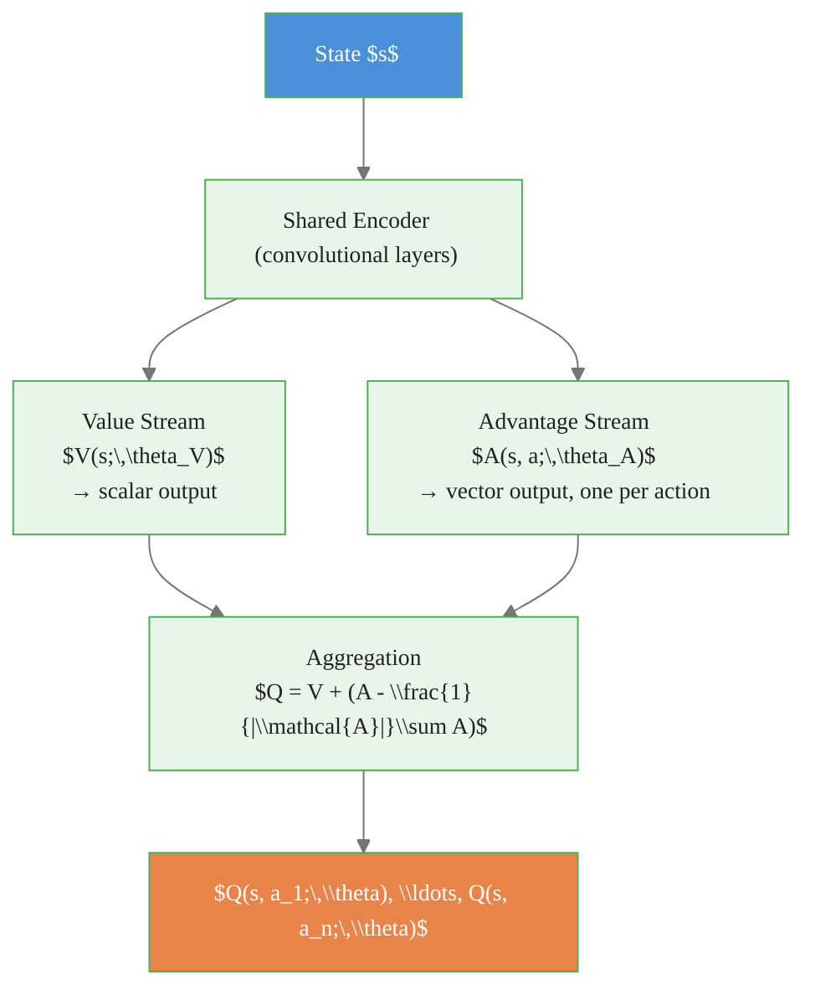

# DQN Improvements: Double DQN, Dueling DQN, PER, and Rainbow

> **Reading time:** ~12 min | **Module:** 5 — Deep RL | **Prerequisites:** Module 4, PyTorch basics

## In Brief

Vanilla DQN (Mnih et al., 2015) has three specific, measurable weaknesses: systematic overestimation of Q-values, no architectural separation between state value and action advantage, and uniform sampling from the replay buffer that ignores which transitions are most informative. Double DQN, Dueling DQN, and Prioritized Experience Replay each address exactly one of these weaknesses. Rainbow (Hessel et al., 2018) combines all known improvements into a single agent.

<div class="callout-key">

<strong>Key Concept:</strong> Vanilla DQN (Mnih et al., 2015) has three specific, measurable weaknesses: systematic overestimation of Q-values, no architectural separation between state value and action advantage, and uniform sampling from the replay buffer that ignores which transitions are most informative. Double DQN, Dueling DQN, and Prioritized Experience Replay each address exactly one of these weaknesses.

</div>


## Key Insight

Each improvement is modular: Double DQN changes only the target computation, Dueling DQN changes only the network architecture, and PER changes only the replay sampling strategy. They can be combined without conflict.

---


<div class="callout-key">

<strong>Key Point:</strong> Each improvement is modular: Double DQN changes only the target computation, Dueling DQN changes only the network architecture, and PER changes only the replay sampling strategy.

</div>

## Improvement 1: Double DQN

### The Problem: Overestimation Bias

<div class="callout-key">

<strong>Key Point:</strong> ### The Problem: Overestimation Bias

The vanilla DQN TD target uses the same network to **select** the best next action and **evaluate** its value:

$$Y^{\text{DQN}} = r + \gamma \max_{a'} Q(s', a';\...

</div>


The vanilla DQN TD target uses the same network to **select** the best next action and **evaluate** its value:

$$Y^{\text{DQN}} = r + \gamma \max_{a'} Q(s', a';\, \theta^-)$$

The $\max$ operator selects the highest Q-value among all actions. When Q-value estimates contain noise (which they always do), the maximum of noisy estimates is systematically biased upward. This **overestimation bias** accumulates across Bellman backups and degrades policy quality.

### Formal Definition

van Hasselt et al. (2016) decompose the target into two separate steps:

**Action selection** — use the **online** network $\theta$ to identify the greedy action:

$$a^* = \arg\max_a Q(s', a;\, \theta)$$

**Action evaluation** — use the **target** network $\theta^-$ to estimate its value:

$$Y^{\text{DDQN}} = r + \gamma Q(s',\, a^*;\, \theta^-)$$

Substituting:

$$Y^{\text{DDQN}} = r + \gamma\, Q\!\left(s',\; \arg\max_a Q(s', a;\, \theta);\; \theta^-\right)$$

By decoupling selection from evaluation, neither network controls both aspects of the target simultaneously. Even if the online network overestimates the value of a particular action, the target network provides an independent check on that estimate.

### Code Change

The only change from vanilla DQN is two lines in the target computation:


The following implementation builds on the approach above:



### Code Implementation


The following implementation builds on the approach above:

<div class="code-window">
<div class="code-header">
<div class="dots"><span class="dot-red"></span><span class="dot-yellow"></span><span class="dot-green"></span></div>

```python
import torch
import torch.nn as nn


class DuelingQNetwork(nn.Module):
    """
    Dueling network architecture (Wang et al., 2016).

    Separates state-value estimation from advantage estimation.
    The mean-subtraction aggregation ensures the decomposition is unique
    and V(s) is an unbiased estimate of state value.
    """

    def __init__(self, obs_dim: int, n_actions: int, hidden: int = 128):
        super().__init__()
        # Shared feature encoder
        self.encoder = nn.Sequential(
            nn.Linear(obs_dim, hidden),
            nn.ReLU(),
        )
        # Value stream: outputs a single scalar V(s)
        self.value_stream = nn.Sequential(
            nn.Linear(hidden, hidden),
            nn.ReLU(),
            nn.Linear(hidden, 1),
        )
        # Advantage stream: outputs one value per action A(s, a)
        self.advantage_stream = nn.Sequential(
            nn.Linear(hidden, hidden),
            nn.ReLU(),
            nn.Linear(hidden, n_actions),
        )

    def forward(self, x: torch.Tensor) -> torch.Tensor:
        features = self.encoder(x)
        value = self.value_stream(features)           # shape: (B, 1)
        advantage = self.advantage_stream(features)   # shape: (B, |A|)

        # Mean-subtraction ensures identifiability of the decomposition
        # After this, argmax over Q equals argmax over A
        q = value + (advantage - advantage.mean(dim=1, keepdim=True))
        return q
```

</div>
</div>

### Why It Helps

- **States where action choice is irrelevant:** the value stream can learn $V(s)$ without the advantage stream contributing noise.
- **States where action choice matters:** the advantage stream captures the relative ranking of actions precisely.
- In practice, dueling networks learn more robust and accurate value estimates, especially in environments with many actions that have similar expected returns.

---

## Improvement 3: Prioritized Experience Replay (PER)

### The Problem: Uniform Sampling Wastes Computation

Vanilla DQN samples transitions uniformly from the replay buffer. Many stored transitions are already well-learned (low TD error), while others are informative but visited rarely. Spending equal compute on both is wasteful.

### Formal Definition

Schaul et al. (2016) assign each transition $i$ a **priority** $p_i$ based on its absolute TD error $\delta_i$:

$$p_i = |\delta_i| + \epsilon$$

where $\epsilon > 0$ is a small constant ensuring every transition has a non-zero sampling probability ($\epsilon = 0.01$ in the original paper). The sampling probability is:

$$P(i) = \frac{p_i^\alpha}{\sum_k p_k^\alpha}$$

The exponent $\alpha \in [0, 1]$ controls the degree of prioritization. $\alpha = 0$ recovers uniform sampling; $\alpha = 1$ is full prioritization.

### Importance Sampling Correction

Prioritized sampling introduces a bias: transitions with high TD error are overrepresented. To correct this, each transition is weighted by an **importance sampling (IS) weight**:

$$w_i = \left(\frac{1}{N \cdot P(i)}\right)^\beta$$

where $N$ is the buffer size. The weights are normalized by $\max_j w_j$ so they only scale down, never up. The exponent $\beta$ is annealed from $\beta_0$ to 1 over training: early in training (when value estimates are poor), less correction is applied; by the end, full correction is applied.

The loss with IS weights:

$$\mathcal{L}(\theta) = \mathbb{E}\!\left[w_i \cdot \bigl(Y_i - Q(s_i, a_i;\, \theta)\bigr)^2\right]$$

After each gradient step, update priorities:

$$p_i \leftarrow |\delta_i^{\text{new}}| + \epsilon$$

### Efficient Implementation: Sum Tree

Naive priority updates are $O(N)$ per step. A **sum tree** data structure reduces sampling and updating to $O(\log N)$:


<div class="code-window">
<div class="code-header">
<div class="dots"><span class="dot-red"></span><span class="dot-yellow"></span><span class="dot-green"></span></div>
<span class="filename">example.py</span>
</div>

```python
class SumTree:
    """
    Binary sum tree for O(log N) priority sampling.

    Leaves store priorities. Each internal node stores the sum
    of its children. Sampling by value locates the leaf in O(log N).
    """

    def __init__(self, capacity: int):
        self.capacity = capacity
        self.tree = [0.0] * (2 * capacity)  # full binary tree
        self.data = [None] * capacity
        self.write_idx = 0
        self.size = 0

    def _propagate(self, idx: int, delta: float):
        parent = (idx - 1) // 2
        self.tree[parent] += delta
        if parent > 0:
            self._propagate(parent, delta)

    def update(self, idx: int, priority: float):
        delta = priority - self.tree[idx]
        self.tree[idx] = priority
        self._propagate(idx, delta)

    def add(self, priority: float, data):
        leaf_idx = self.write_idx + self.capacity - 1
        self.data[self.write_idx] = data
        self.update(leaf_idx, priority)
        self.write_idx = (self.write_idx + 1) % self.capacity
        self.size = min(self.size + 1, self.capacity)

    def get(self, value: float):
        """Return (leaf_idx, priority, data) for a target cumulative sum."""
        idx = 0
        while idx < self.capacity - 1:
            left = 2 * idx + 1
            right = left + 1
            if value <= self.tree[left]:
                idx = left
            else:
                value -= self.tree[left]
                idx = right
        data_idx = idx - self.capacity + 1
        return idx, self.tree[idx], self.data[data_idx]

    @property
    def total_priority(self) -> float:
        return self.tree[0]
```

</div>
</div>

---

## Improvement 4: Rainbow

Hessel et al. (2018) combine six DQN improvements into a single agent:

1. **Double DQN** — corrects overestimation bias
2. **Prioritized Experience Replay** — focuses learning on informative transitions
3. **Dueling Networks** — separates value and advantage streams
4. **Multi-step Returns** — uses $n$-step returns instead of 1-step TD: $Y_t^{(n)} = \sum_{k=0}^{n-1} \gamma^k r_{t+k} + \gamma^n \max_{a'} Q(s_{t+n}, a';\theta^-)$
5. **Distributional RL (C51)** — predicts the full return distribution, not just the expected value
6. **Noisy Networks** — replaces $\epsilon$-greedy with learnable noise for exploration


<div class="flow">
<div class="flow-step mint">1. Double DQN</div>
<div class="flow-arrow">&#8594;</div>
<div class="flow-step amber">2. Prioritized Experience Replay</div>
<div class="flow-arrow">&#8594;</div>
<div class="flow-step blue">3. Dueling Networks</div>
<div class="flow-arrow">&#8594;</div>
<div class="flow-step lavender">4. Multi-step Returns</div>
<div class="flow-arrow">&#8594;</div>
<div class="flow-step rose">5. Distributional RL (C51)</div>
</div>

The ablation study in the Rainbow paper demonstrates that removing any single component degrades performance, but the combined agent significantly outperforms any individual improvement.

---

## Comparison Table

| Algorithm | Target Formula | Architecture | Sampling | Key Benefit |
|-----------|---------------|--------------|----------|-------------|
| DQN | $r + \gamma \max_{a'} Q(s', a'; \theta^-)$ | Standard MLP/CNN | Uniform | Baseline stability |
| Double DQN | $r + \gamma Q(s', \arg\max_a Q(s',a;\theta); \theta^-)$ | Standard | Uniform | Reduces overestimation |
| Dueling DQN | Same as DQN | $V(s) + A(s,a) - \bar{A}$ | Uniform | Better value/advantage decomposition |
| DQN + PER | Same as DQN | Standard | Prioritized by $|\delta_i|$ | Focuses on informative transitions |
| Rainbow | Double target + $n$-step | Dueling + Noisy | Prioritized | State-of-the-art combination |

---

## Common Pitfalls

<div class="callout-danger">

<strong>Danger:</strong> The pitfalls below are the most common mistakes practitioners make. Each one can silently degrade your results without obvious errors.

</div>

**Pitfall 1 — Double DQN: confusing which network does what.**
Action selection uses the **online** network $\theta$; action evaluation uses the **target** network $\theta^-$. Swapping them (or using the same network for both) negates the overestimation correction and produces results identical to vanilla DQN.

<div class="callout-warning">

<strong>Warning:</strong> **Pitfall 1 — Double DQN: confusing which network does what.**
Action selection uses the **online** network $\theta$; action evaluation uses the **target** network $\theta^-$.

</div>

**Pitfall 2 — Dueling DQN: forgetting the mean-subtraction normalization.**
Without subtracting the mean advantage $\frac{1}{|\mathcal{A}|}\sum_{a'} A(s, a'; \theta_A)$, the decomposition $Q = V + A$ is not identifiable. The network cannot distinguish whether high Q-values come from a good state or a high-advantage action. Training converges to incorrect value estimates.

**Pitfall 3 — PER: not annealing $\beta$.**
Using $\beta = 1$ from the start (full IS correction) when value estimates are still poor adds excessive variance to gradient updates. Annealing from $\beta_0 = 0.4$ to $\beta = 1$ over training provides the right balance between bias correction and variance.

**Pitfall 4 — PER: not updating priorities after each gradient step.**
Stale priorities cause the buffer to oversample transitions that were informative at some past point but are now well-learned. Update priorities after every gradient step using the new TD errors.

**Pitfall 5 — Rainbow: applying all improvements before validating each one separately.**
Debugging a combined agent is much harder than debugging each component independently. Build and validate Double DQN first, then add Dueling, then PER. The modular nature of these improvements supports incremental development.

---

## Connections


<div class="callout-info">

<strong>Info:</strong> This section maps how this guide connects to the broader course. Use these links to navigate related material.


- **Builds on:** DQN (Guide 01), Bellman equations (Module 00), replay buffers, target networks
- **Leads to:** distributional RL (C51, QR-DQN), policy gradient methods (Module 06), actor-critic algorithms (Module 07)
- **Related to:** overestimation bias in Q-learning (Thrun & Schwartz, 1993), importance sampling in statistics, advantage functions in policy gradient theory

---


## Practice Questions

**Question 1 — Conceptual:** Based on the concepts in this guide, explain in your own words why the core technique matters and when you would choose it over alternatives.

**Question 2 — Application:** Sketch out how you would apply the main concept from this guide to a real-world dataset or problem you have encountered. What would you need to watch out for?


## Further Reading

- van Hasselt, H., Guez, A., & Silver, D. (2016). *Deep Reinforcement Learning with Double Q-Learning.* AAAI. — original Double DQN paper with overestimation analysis
- Wang, Z. et al. (2016). *Dueling Network Architectures for Deep Reinforcement Learning.* ICML. — original Dueling DQN paper with identifiability analysis
- Schaul, T. et al. (2016). *Prioritized Experience Replay.* ICLR. — original PER paper with sum-tree implementation details
- Hessel, M. et al. (2018). *Rainbow: Combining Improvements in Deep Reinforcement Learning.* AAAI. — ablation study showing each component's individual contribution


---

## Cross-References

<a class="link-card" href="./02_dqn_improvements_slides.md">
  <div class="link-card-title">Companion Slides</div>
  <div class="link-card-description">Interactive slide deck covering the key concepts with visual examples.</div>
</a>

<a class="link-card" href="../notebooks/01_dqn_from_scratch.ipynb">
  <div class="link-card-title">Hands-on Notebook</div>
  <div class="link-card-description">15-minute micro-notebook with guided exercises and real data.</div>
</a>
