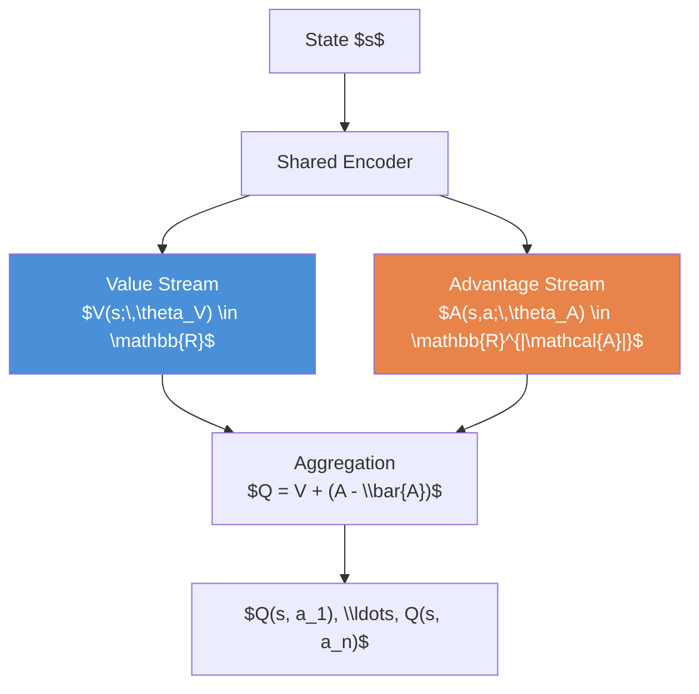
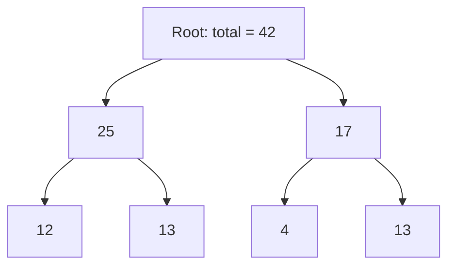
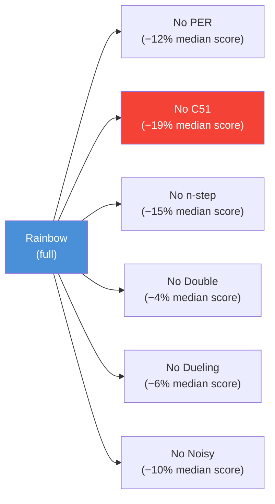
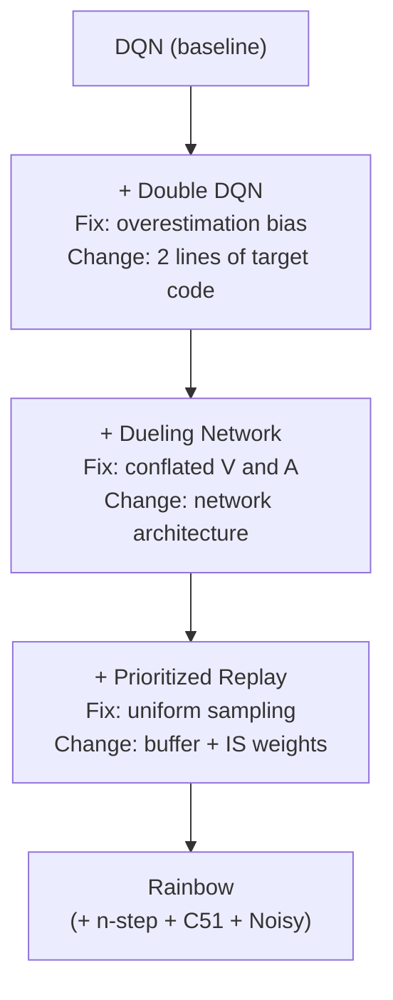

<!-- _class: lead -->

# DQN Improvements

**Double DQN · Dueling DQN · Prioritized Experience Replay · Rainbow**

**Module 05 — Deep Reinforcement Learning**

> Vanilla DQN has three specific, measurable weaknesses. Each improvement fixes exactly one.

<!--
Speaker notes: Key talking points for this slide
- This deck assumes learners have completed Guide 01 (DQN) and understand the replay buffer and target network
- Key framing: these are not arbitrary tweaks — each improvement is motivated by a specific, diagnosable problem
- Double DQN: overestimation bias in TD targets
- Dueling DQN: no separation between state value and action advantage
- PER: uniform sampling ignores transition informativeness
- Rainbow: all of the above, combined
-->

---

# DQN's Three Remaining Weaknesses

| Weakness | Symptom | Fix |
|---------|---------|-----|
| **Overestimation bias** | Q-values systematically too high; policy suboptimal | Double DQN |
| **Conflated value/advantage** | Slow learning when actions matter little | Dueling DQN |
| **Uniform replay sampling** | Wasted compute on easy transitions | Prioritized Experience Replay |

These weaknesses are **independent** — each fix addresses exactly one and can be applied in any combination.

<!--
Speaker notes: Key talking points for this slide
- The modular nature of these fixes is a key point: they can be combined freely (and Rainbow combines all of them)
- Overestimation: Thrun & Schwartz (1993) identified this problem for tabular Q-learning; van Hasselt et al. showed it persists with neural networks
- Conflated value/advantage: intuitively, in many states ALL actions are equally good — the network shouldn't need separate outputs to represent this
- Uniform sampling: a transition with TD error of 0.001 gets the same training attention as one with TD error of 5.0 — that's clearly suboptimal
-->

---

<!-- _class: lead -->

# Double DQN: Fixing Overestimation Bias

<!--
Speaker notes: Key talking points for this slide
- The overestimation problem is subtle but has a real impact on policy quality
- The fix is a two-line change to the target computation — zero architectural changes
- van Hasselt et al. (2016) showed measurable performance improvements on Atari with this single change
-->

---

# Why DQN Overestimates

The DQN target uses $\max$ over noisy Q-value estimates:

$$Y^{\text{DQN}} = r + \gamma \max_{a'} Q(s', a';\, \theta^-)$$

**The max operator selects the highest estimate, not the best action.**

If estimates have noise $Q(s', a'; \theta^-) = Q^*(s', a') + \varepsilon_a$, then:

$$\mathbb{E}\!\left[\max_a Q(s', a'; \theta^-)\right] \geq \max_a Q^*(s', a')$$

The maximum of noisy values is biased upward — always.

<!--
Speaker notes: Key talking points for this slide
- The mathematical inequality is worth pausing on: E[max X] ≥ max E[X] (Jensen's inequality for the convex max function)
- This is not a problem specific to neural networks — it appears in any Q-learning variant using the max operator
- The bias compounds: overestimated Q-values in state s' cause overestimated Q-values in state s, which propagates backward through Bellman backups
- van Hasselt (2010) showed this causes problems even with tabular Q-learning and function approximation
-->

---

# Double DQN: Decouple Selection from Evaluation

**Vanilla DQN:** same network $\theta^-$ selects AND evaluates the best action.

**Double DQN:** decouple into two steps with different networks.

<div class="columns">
<div>

**Step 1 — Select** with online network $\theta$:

$$a^* = \arg\max_a Q(s', a;\, \theta)$$

**Step 2 — Evaluate** with target network $\theta^-$:

$$Y^{\text{DDQN}} = r + \gamma Q(s', a^*;\, \theta^-)$$

</div>
<div>

```python
# Select action using online network
next_a = q_net(next_states).argmax(
    dim=1, keepdim=True
)

# Evaluate using target network
next_q = target_net(next_states).gather(
    1, next_a
).squeeze(1)

targets = rewards + gamma * next_q * (1 - dones)
```

</div>
</div>

<!--
Speaker notes: Key talking points for this slide
- The key insight: both networks must agree for a biased estimate to slip through
- If the online network overestimates action a*, the target network provides an independent check
- Two independent overestimates of the same action are less likely than one, so bias is reduced
- Code: the only change from vanilla DQN is replacing target_net(next_states).max() with the two-step selection/evaluation
-->

---

<!-- _class: lead -->

# Dueling DQN: Separating Value from Advantage

<!--
Speaker notes: Key talking points for this slide
- Dueling DQN is an architectural change — it doesn't affect the loss function or training procedure
- The motivation comes from observing that in many states, action choice is irrelevant
- Wang et al. (2016) showed consistent improvements across Atari games, especially those with many similar-value actions
-->

---

# The Value-Advantage Decomposition

The Q-function can be decomposed as:

$$Q(s, a) = V(s) + A(s, a)$$

- $V(s)$: **How good is this state?** (independent of action)
- $A(s, a)$: **How much better is action $a$ vs average?**

**Why this helps:**

In states where all actions are equally good ($A(s, a) \approx 0$ for all $a$), the network only needs to learn $V(s)$ accurately — the advantage stream contributes nothing. This specialization speeds learning and improves value estimates.

<!--
Speaker notes: Key talking points for this slide
- Analogy: consider driving on an empty highway — the state (highway, good visibility, no obstacles) is intrinsically valuable regardless of which lane you're in
- The advantage separates the "quality of the situation" from "which action is best in this situation"
- In practice: the value stream learns faster for states where action doesn't matter, improving overall Q-value accuracy
-->

---

# Dueling Architecture



**Identifiability constraint** — subtract mean advantage:

$$Q(s, a;\, \theta) = V(s;\, \theta_V) + \left(A(s, a;\, \theta_A) - \frac{1}{|\mathcal{A}|}\sum_{a'} A(s, a';\, \theta_A)\right)$$

<!--
Speaker notes: Key talking points for this slide
- Walk through the architecture: shared encoder → two separate heads → aggregation
- The identifiability constraint is critical: without it, V + A is not uniquely defined (you could add a constant to V and subtract it from all A values with the same Q result)
- Mean subtraction ensures: argmax_a Q = argmax_a A, and for the greedy action, A(s, a*) = 0, so V(s) = Q(s, a*)
- The training loss and procedure are identical to vanilla DQN — only the network architecture changes
-->

---

# Dueling Network Code

```python
class DuelingQNetwork(nn.Module):
    def __init__(self, obs_dim, n_actions, hidden=128):
        super().__init__()
        self.encoder = nn.Sequential(
            nn.Linear(obs_dim, hidden), nn.ReLU()
        )
        # Scalar value head
        self.value = nn.Sequential(
            nn.Linear(hidden, hidden), nn.ReLU(),
            nn.Linear(hidden, 1)
        )
        # Per-action advantage head
        self.advantage = nn.Sequential(
            nn.Linear(hidden, hidden), nn.ReLU(),
            nn.Linear(hidden, n_actions)
        )

    def forward(self, x):
        features = self.encoder(x)
        v = self.value(features)          # (B, 1)
        a = self.advantage(features)       # (B, |A|)
        # Mean-subtraction: identifiability constraint
        return v + (a - a.mean(dim=1, keepdim=True))
```

> Drop-in replacement for standard `QNetwork` — no other code changes required.

<!--
Speaker notes: Key talking points for this slide
- Emphasize the "drop-in replacement" point: the output shape is unchanged, the training code is unchanged
- The mean(dim=1, keepdim=True) is the identifiability constraint in one line of code
- Practical tip: initialize the advantage stream's final layer weights to zero — this ensures the network starts near V(s) with zero advantages, which is a reasonable initialization
-->

---

<!-- _class: lead -->

# Prioritized Experience Replay

<!--
Speaker notes: Key talking points for this slide
- PER addresses a simple inefficiency: why spend equal compute on transitions we've already mastered?
- The insight is borrowed from curriculum learning: focus on examples that are currently most informative
- High TD error = the network was surprised = there's something to learn here
-->

---

# Why Uniform Sampling Wastes Compute

With a uniform replay buffer, every stored transition has equal probability of being sampled. In practice:

- Early training: all transitions are informative (high TD error)
- Late training: most transitions are well-learned (near-zero TD error)
- A handful of rare or surprising transitions carry most of the learning signal

**Uniform sampling spends equal compute on:**
- An already-mastered transition (TD error ≈ 0)
- A rare, highly informative transition (TD error = 5.0)

<!--
Speaker notes: Key talking points for this slide
- Analogy: a student who spends equal time on concepts they've already mastered and concepts they haven't learned yet is inefficient
- The solution is inspired by curriculum learning: sample according to how much the network can learn from each transition
- The TD error is a natural measure of "surprise" — high TD error means the network's prediction was far off, so there's more to learn
-->

---

# PER: Priority and Sampling Probability

**Priority** based on absolute TD error:

$$p_i = |\delta_i| + \epsilon \qquad (\epsilon = 0.01 \text{ prevents zero probability})$$

**Sampling probability** with exponent $\alpha$ controlling prioritization strength:

$$P(i) = \frac{p_i^\alpha}{\sum_k p_k^\alpha} \qquad \alpha \in [0, 1]$$

| $\alpha$ | Behavior |
|----------|----------|
| 0 | Uniform sampling (vanilla DQN) |
| 0.5 | Moderate prioritization |
| 1.0 | Full prioritization by TD error |

Typical setting: $\alpha = 0.6$

<!--
Speaker notes: Key talking points for this slide
- The epsilon offset ensures every transition has a non-zero chance of being sampled — prevents starvation of transitions with zero TD error
- α = 0.6 is a good starting point from the original paper
- Note: priorities must be updated after each gradient step with the new TD errors — stale priorities defeat the purpose
-->

---

# Importance Sampling Correction

Prioritized sampling introduces **bias**: high-TD-error transitions are oversampled. To correct:

$$w_i = \left(\frac{1}{N \cdot P(i)}\right)^\beta \quad \text{(normalized by } \max_j w_j\text{)}$$

- $\beta$ is annealed from $\beta_0 \approx 0.4$ to $1.0$ over training
- Early training: less correction (value estimates are noisy anyway)
- End of training: full correction (value estimates are accurate, bias matters)

The weighted loss:

$$\mathcal{L}(\theta) = \mathbb{E}\!\left[w_i \cdot \bigl(Y_i - Q(s_i, a_i;\, \theta)\bigr)^2\right]$$

<!--
Speaker notes: Key talking points for this slide
- IS correction is required for unbiased gradient estimates — without it, the optimizer will overfit to high-priority transitions
- The β annealing schedule is important: at the start of training, value estimates are so poor that the bias from prioritization doesn't matter much. By the end, it does.
- Practical implementation: multiply each sample's loss by its IS weight before averaging
- normalization by max weight ensures weights are always ≤ 1, so only scale down, never up
-->

---

# PER: Data Structure for Efficient Sampling

Naive priority sampling is $O(N)$ — too slow for a buffer of 1M transitions.

A **sum tree** reduces sampling and updating to $O(\log N)$:



To sample: draw $u \sim \text{Uniform}(0, 42)$, traverse the tree. $O(\log N)$ per sample.

<!--
Speaker notes: Key talking points for this slide
- The sum tree is a standard data structure from computational geometry — key insight applied to RL
- Each leaf stores one transition's priority. Each internal node stores the sum of its subtree.
- To sample with value u: if u ≤ left child's sum, go left. Otherwise, subtract left sum and go right.
- After each gradient step: update the leaf's priority and propagate the change up — O(log N)
- In practice, use the SumTree class from the guide rather than implementing from scratch
-->

---

# Rainbow: Combining All Improvements

Hessel et al. (2018) combined six improvements:

| Component | What It Fixes |
|-----------|--------------|
| Double DQN | Overestimation bias |
| Prioritized Replay | Uniform sampling inefficiency |
| Dueling Networks | Conflated value and advantage |
| Multi-step Returns ($n$-step) | 1-step TD underestimates distant rewards |
| Distributional RL (C51) | Mean estimate misses return distribution |
| Noisy Networks | $\epsilon$-greedy is a poor exploration heuristic |

**Multi-step target:** $Y_t^{(n)} = \sum_{k=0}^{n-1} \gamma^k r_{t+k} + \gamma^n \max_{a'} Q(s_{t+n}, a';\theta^-)$

<!--
Speaker notes: Key talking points for this slide
- Rainbow is not a new algorithm — it's a careful integration of existing improvements
- The ablation study is the key contribution: it proves each component adds independently
- Multi-step returns reduce the bootstrapping horizon — n=3 or n=5 often works better than n=1
- Distributional RL (C51) is the most complex addition — it learns the full distribution of returns, not just the mean
- Noisy Networks add learnable Gaussian noise to weights, enabling more structured exploration than ε-greedy
-->

---

# Rainbow Ablation Results (Atari 57)

The Rainbow paper ablation removed one component at a time:



> Every component contributes. No single component dominates.

<!--
Speaker notes: Key talking points for this slide
- The approximate performance drops shown here are illustrative of the general conclusion from the paper
- Distributional RL (C51) shows the largest individual contribution in most evaluations
- The conclusion: all components interact positively — Rainbow is more than the sum of its parts
- Practical recommendation: for most applications, Double DQN + Dueling + PER (the three covered in depth here) provide most of the gain with less implementation complexity than full Rainbow
-->

---

# Comparison Summary

| | DQN | Double | Dueling | +PER | Rainbow |
|-|-----|--------|---------|------|---------|
| **Target** | $\max Q(s';\theta^-)$ | $Q(s', a^*_\theta;\theta^-)$ | Same | Same | $n$-step Double |
| **Network** | Standard | Standard | $V + A - \bar{A}$ | Standard | Dueling + Noisy |
| **Sampling** | Uniform | Uniform | Uniform | Prioritized | Prioritized |
| **Overestimation** | High | Low | Moderate | High | Low |
| **Complexity** | Low | Low | Low | Medium | High |

<!--
Speaker notes: Key talking points for this slide
- Use this table as a quick reference when choosing which improvements to implement
- For most practical applications: start with Double DQN (trivial code change), then add Dueling (drop-in architecture swap)
- Add PER when you have the sum-tree infrastructure and need better sample efficiency
- Full Rainbow is appropriate for benchmark comparisons or when pushing performance limits
-->

---

# Common Pitfalls

<div class="columns">
<div>

**Double DQN**
- Using the same network for selection AND evaluation negates the fix
- $\theta$ selects, $\theta^-$ evaluates — never swap

**Dueling DQN**
- Missing the mean-subtraction makes the decomposition non-unique
- $Q = V + (A - \bar{A})$, NOT $Q = V + A$

</div>
<div>

**PER**
- Not updating priorities after gradient steps → stale priorities → trains on wrong transitions
- Not annealing $\beta$ from 0.4 → 1.0 → biased gradient estimates

**All improvements**
- Validate each component independently before combining
- Debugging a full Rainbow agent is hard; debugging Double DQN is easy

</div>
</div>

<!--
Speaker notes: Key talking points for this slide
- Pitfall advice from experience: the Double DQN network swap is the most common bug — easy to write `target_net` twice by accident
- The Dueling mean-subtraction bug is silent — training appears to work but Q-values are systematically wrong
- PER stale priorities are especially insidious — the buffer appears to work but the agent stops improving after initial gains
- The "validate incrementally" advice is practical wisdom: each fix is simple, but combined they're hard to debug simultaneously
-->

---

# Summary



Each improvement is modular, motivated, and measurable.

<!--
Speaker notes: Key talking points for this slide
- The progressive stack is the key message: each improvement builds on the previous, and each is motivated by a specific weakness
- Real-world recommendation: for most applications, the stack of DQN → Double DQN → Dueling DQN is sufficient and implementable in a few hours
- PER adds meaningful complexity (sum tree data structure) but provides significant sample efficiency gains
- Next: Guide 03 covers practical deep RL — hyperparameter tuning, debugging, and reproducibility
-->
