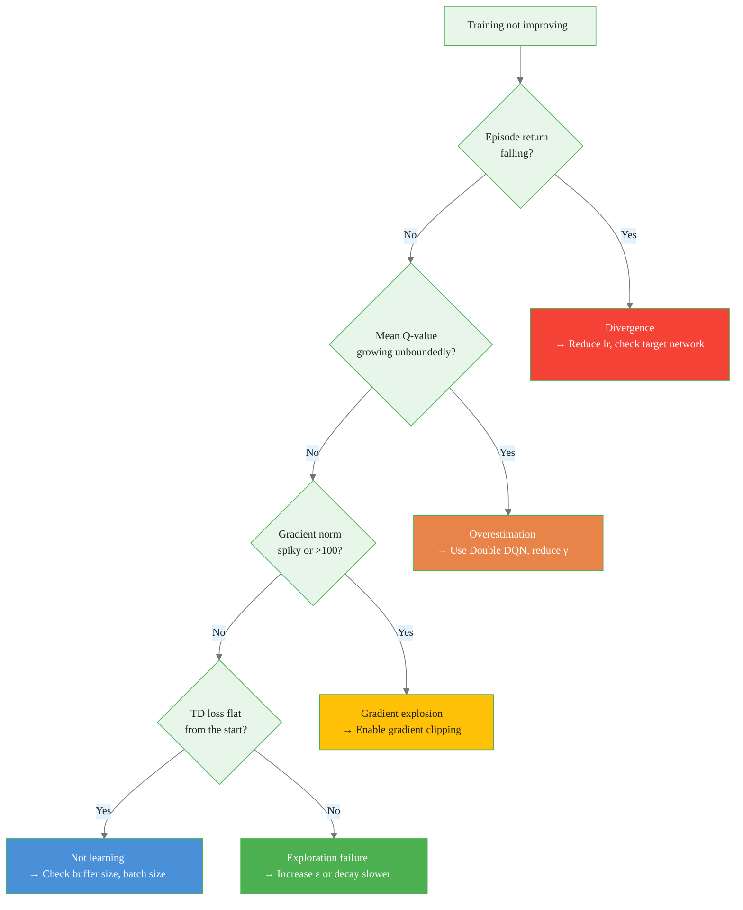

# Practical Deep RL: Tuning, Debugging, and Reproducibility

> **Reading time:** ~18 min | **Module:** 5 — Deep RL | **Prerequisites:** Module 4, PyTorch basics

## In Brief

Deep RL training involves more failure modes than supervised learning. Policy optimization is non-stationary, reward signals are delayed, and hyperparameter sensitivity is high. This guide covers how to configure, debug, and reproduce deep RL experiments systematically.

<div class="callout-key">

<strong>Key Concept:</strong> Deep RL training involves more failure modes than supervised learning. Policy optimization is non-stationary, reward signals are delayed, and hyperparameter sensitivity is high.

</div>


## Key Insight

Most deep RL training failures are diagnosable from four time series: episode return, mean Q-value, gradient norm, and TD loss. Logging these from the first run eliminates most debugging guesswork.

---


<div class="callout-key">

<strong>Key Point:</strong> Most deep RL training failures are diagnosable from four time series: episode return, mean Q-value, gradient norm, and TD loss.

</div>

## Hyperparameter Tuning for DQN

### Complete Hyperparameter Reference

| Hyperparameter | Default (Mnih 2015) | Practical Range | Effect of Increasing |
|----------------|---------------------|-----------------|----------------------|
| Learning rate $\alpha$ | $2.5 \times 10^{-4}$ | $1 \times 10^{-4}$ – $1 \times 10^{-3}$ | Faster early progress; divergence risk |
| Replay buffer size $N$ | $1{,}000{,}000$ | $10{,}000$ – $1{,}000{,}000$ | Better decorrelation; more memory |
| Batch size | $32$ | $32$ – $256$ | Lower variance gradients; more memory |
| Discount factor $\gamma$ | $0.99$ | $0.9$ – $0.999$ | Longer time horizon; slower convergence |
| Target update freq $C$ | $10{,}000$ | $100$ – $10{,}000$ | More stable targets; slower adaptation |
| $\epsilon$ start | $1.0$ | Fixed | Always start at 1.0 |
| $\epsilon$ end | $0.01$ | $0.01$ – $0.1$ | More final exploration |
| $\epsilon$ decay steps | $10^6$ | $10^4$ – $10^6$ | Longer initial exploration |
| Training start | $50{,}000$ steps | $1{,}000$ – $100{,}000$ | More initial diversity in buffer |

### Tuning Priority Order

Not all hyperparameters are equally important. Tune in this order:

1. **Learning rate** — the single most impactful hyperparameter. Too high causes divergence; too low causes no learning. Start at $1 \times 10^{-4}$ for Adam.
2. **Replay buffer size** — must be large enough to decorrelate. Increase if training is unstable. Decrease if memory is constrained.
3. **Target update frequency** — reduce $C$ (sync more often) if the agent learns slowly; increase $C$ if Q-values are noisy.
4. **Batch size** — larger batches reduce gradient variance. Diminishing returns above 256.
5. **$\epsilon$ schedule** — tune last. If the policy is good but slightly suboptimal, more exploration may help.


<div class="flow">
<div class="flow-step mint">1. Learning rate</div>
<div class="flow-arrow">&#8594;</div>
<div class="flow-step amber">2. Replay buffer size</div>
<div class="flow-arrow">&#8594;</div>
<div class="flow-step blue">3. Target update frequency</div>
<div class="flow-arrow">&#8594;</div>
<div class="flow-step lavender">4. Batch size</div>
<div class="flow-arrow">&#8594;</div>
<div class="flow-step rose">5. $\epsilon$ schedule</div>
</div>

### Learning Rate Selection


The following implementation builds on the approach above:



### Common Failure Modes and Solutions

**Failure Mode 1 — Q-value divergence**

Symptom: mean Q-value grows continuously and eventually becomes NaN or very large.

Causes:
- Missing target network (both most common causes)
- Learning rate too high
- Gradient norm not clipped

Solutions:

<div class="code-window">
<div class="code-header">
<div class="dots"><span class="dot-red"></span><span class="dot-yellow"></span><span class="dot-green"></span></div>
<span class="filename">example.py</span>
</div>

```python

# Ensure target network is present and synced
assert target_net is not None
assert steps_done % C == 0  # verify sync is happening

# Reduce learning rate
optimizer = optim.Adam(q_net.parameters(), lr=1e-5)

# Add gradient clipping (should always be present)
nn.utils.clip_grad_norm_(q_net.parameters(), max_norm=10.0)
```

</div>
</div>

**Failure Mode 2 — No improvement after many episodes**

Symptom: episode return stays near the random baseline throughout training.

Causes:
- Buffer not large enough to fill before training starts
- Reward signal too sparse — agent never reaches a terminal reward
- $\epsilon$ decays too fast, preventing adequate exploration

Solutions:
```python

# Check that training hasn't started on a tiny buffer
assert len(buffer) >= batch_size * 10, \
    f"Buffer has {len(buffer)} transitions — too few to train"

# Use reward shaping for sparse rewards

# (shape carefully to avoid unintended behavior)
shaped_reward = reward + 0.01 * distance_reduction

# Slow down epsilon decay
epsilon_decay_steps = 500_000  # extend from default
```

**Failure Mode 3 — Catastrophic forgetting**

Symptom: performance improves for a while, then collapses, then improves again — unstable oscillations.

Causes:
- Replay buffer too small — overwrites important early transitions
- Target network sync frequency too high — targets change too fast
- Policy distribution shift too rapid

Solutions:
```python

# Increase buffer capacity
buffer = ReplayBuffer(capacity=500_000)  # up from default

# Sync target network less often
target_update_freq = 5_000  # up from 1,000

# Reduce learning rate during fine-tuning phase
```

**Failure Mode 4 — Reward hacking**

Symptom: episode return is high, but the agent's behavior is clearly wrong (the metric is gamed, not solved).

Cause: the reward function does not actually capture the intended behavior.

This is not a training bug — it requires redesigning the reward function. Some diagnostic checks:
```python

# Always visualize the agent's behavior directly

# Don't trust the return metric alone

def evaluate_visually(agent, env, n_episodes=3):
    """Record episodes and watch them."""
    for ep in range(n_episodes):
        obs, _ = env.reset()
        done = False
        while not done:
            action = agent.select_action(obs)  # greedy
            obs, reward, terminated, truncated, info = env.step(action)
            env.render()  # requires render_mode="human"
            done = terminated or truncated
```

---

## Hardware Considerations

### Memory Planning for the Replay Buffer

The replay buffer is the primary memory bottleneck. Each transition stores:

| Component | Shape (Atari) | dtype | Size per transition |
|-----------|--------------|-------|---------------------|
| State $s$ | $(84, 84, 4)$ | uint8 | 28,224 bytes = 27.6 KB |
| Next state $s'$ | $(84, 84, 4)$ | uint8 | 27.6 KB |
| Action | scalar | int32 | 4 bytes |
| Reward | scalar | float32 | 4 bytes |
| Done | scalar | bool | 1 byte |

For a 1M transition buffer: $1{,}000{,}000 \times 55{,}253$ bytes $\approx 55$ GB.

**Optimization: frame stacking with lazy storage**

Rather than storing full 4-frame stacks, store only individual frames and reconstruct stacks on sample:

```python
class LazyFrameBuffer:
    """
    Stores individual frames, not frame stacks.
    Memory usage: ~14 GB for 1M transitions vs ~55 GB for naive storage.

    Reconstruction happens at sample time — slight CPU overhead
    in exchange for ~4x memory reduction.
    """

    def __init__(self, capacity: int, frame_stack: int = 4):
        self.capacity = capacity
        self.frame_stack = frame_stack
        self.frames = np.zeros(
            (capacity, 84, 84), dtype=np.uint8
        )
        self.actions = np.zeros(capacity, dtype=np.int32)
        self.rewards = np.zeros(capacity, dtype=np.float32)
        self.dones = np.zeros(capacity, dtype=np.bool_)
        self.ptr = 0
        self.size = 0

    def push(self, frame, action, reward, done):
        self.frames[self.ptr] = frame
        self.actions[self.ptr] = action
        self.rewards[self.ptr] = reward
        self.dones[self.ptr] = done
        self.ptr = (self.ptr + 1) % self.capacity
        self.size = min(self.size + 1, self.capacity)

    def _get_stack(self, idx: int) -> np.ndarray:
        """Reconstruct a frame stack ending at idx."""
        indices = [(idx - k) % self.capacity
                   for k in range(self.frame_stack - 1, -1, -1)]
        return np.stack([self.frames[i] for i in indices], axis=-1)
```

### GPU Utilization

```python
device = torch.device("cuda" if torch.cuda.is_available() else "cpu")

# Move networks to GPU
q_net = QNetwork(obs_dim, n_actions).to(device)
target_net = QNetwork(obs_dim, n_actions).to(device)

# Move batches to GPU at sample time (not at push time)
def sample_to_device(buffer, batch_size, device):
    states, actions, rewards, next_states, dones = \
        buffer.sample(batch_size)
    return (
        states.to(device),
        actions.to(device),
        rewards.to(device),
        next_states.to(device),
        dones.to(device),
    )
```

**Practical memory budget:**

| Setup | GPU VRAM | RAM |
|-------|----------|-----|
| Small environment (CartPole, LunarLander) | 1 GB | 4 GB |
| Medium (MuJoCo locomotion) | 4 GB | 16 GB |
| Atari (1M buffer, frame stack) | 4 GB | 32 GB |
| Atari (1M buffer, naive storage) | 4 GB | 64 GB |

---

## Reproducibility Challenges

### Sources of Non-Determinism

Deep RL experiments are notoriously difficult to reproduce. The sources of non-determinism are:

1. **Random seed** — affects network initialization, $\epsilon$-greedy exploration, environment resets, and replay buffer sampling
2. **CUDA non-determinism** — GPU operations are not bit-exact by default
3. **Environment stochasticity** — some environments have stochastic transitions
4. **Floating-point precision** — different hardware may produce slightly different results

### Seeding Protocol

```python
import random
import numpy as np
import torch
import gymnasium as gym


def set_global_seed(seed: int) -> None:
    """
    Set all random seeds for reproducible deep RL experiments.

    This does NOT guarantee bit-exact reproducibility across different
    hardware or PyTorch versions, but eliminates software-level
    non-determinism.
    """
    random.seed(seed)
    np.random.seed(seed)
    torch.manual_seed(seed)
    torch.cuda.manual_seed_all(seed)

    # Enforce deterministic CUDA operations — significant performance cost
    torch.backends.cudnn.deterministic = True
    torch.backends.cudnn.benchmark = False


def make_env(env_id: str, seed: int) -> gym.Env:
    """Create a seeded environment."""
    env = gym.make(env_id)
    env.reset(seed=seed)
    env.action_space.seed(seed)
    return env
```

### Reporting Standards

Single-seed results are meaningless in deep RL due to high variance. Always report:

```python
import numpy as np
from typing import List


def aggregate_runs(returns_per_seed: List[List[float]]) -> dict:
    """
    Compute statistics across multiple independent runs.

    Parameters
    ----------
    returns_per_seed : List[List[float]]
        Outer list: one entry per seed. Inner list: episode returns.

    Returns
    -------
    dict with mean, std, median, IQM (interquartile mean)
    """
    # Align runs to the same length (min episodes across seeds)
    min_len = min(len(r) for r in returns_per_seed)
    aligned = np.array([r[:min_len] for r in returns_per_seed])

    # IQM is more robust to outliers than mean
    q25 = np.percentile(aligned, 25, axis=0)
    q75 = np.percentile(aligned, 75, axis=0)
    iqm = aligned[
        (aligned >= q25) & (aligned <= q75)
    ].mean(axis=0) if aligned.ndim == 2 else np.mean(aligned)

    return {
        "mean": aligned.mean(axis=0),
        "std": aligned.std(axis=0),
        "median": np.median(aligned, axis=0),
        "iqm": iqm,
        "n_seeds": len(returns_per_seed),
    }
```

**Minimum reproducible experiment:**
- Report results over at least 5 independent seeds
- Report interquartile mean (IQM) rather than mean — more robust to outlier seeds
- Report the number of environment steps, not wall-clock time or epochs
- State exact library versions: `torch`, `gymnasium`, `numpy`

---

## Common Pitfalls

<div class="callout-danger">

<strong>Danger:</strong> The pitfalls below are the most common mistakes practitioners make. Each one can silently degrade your results without obvious errors.

</div>

**Pitfall 1 — Tuning hyperparameters on a single seed.**
Deep RL training variance is high enough that a hyperparameter may appear better on one seed purely by chance. Always evaluate hyperparameter choices across at least 3–5 seeds before drawing conclusions.

<div class="callout-warning">

<strong>Warning:</strong> **Pitfall 1 — Tuning hyperparameters on a single seed.**
Deep RL training variance is high enough that a hyperparameter may appear better on one seed purely by chance.

</div>

**Pitfall 2 — Evaluating policy while ε > 0.**
During training, the agent takes random actions with probability $\epsilon$. Reporting training return (not evaluation return at $\epsilon = 0$) underestimates performance and makes comparison across different $\epsilon$ schedules meaningless. Maintain a separate evaluation loop.

**Pitfall 3 — Comparing algorithms with different random seeds.**
If algorithm A is run with seed 0 and algorithm B is run with seed 42, any difference may be entirely due to the seed. Always use the same set of seeds for all compared algorithms.

**Pitfall 4 — Not monitoring gradient norms.**
Silent gradient explosions (values become very large but not yet NaN) are common. Without gradient norm logging, the first sign of a problem is a NaN loss — long after the issue started. Log gradient norms every update step.

**Pitfall 5 — Conflating training and evaluation environments.**
Some environment wrappers (e.g., `NoopResetEnv`, sticky actions in Atari) add stochasticity intended for training. Evaluation should use deterministic resets to ensure comparability. Keep separate `train_env` and `eval_env` objects.

**Pitfall 6 — Not saving checkpoints.**
Deep RL training can run for hours or days. Without checkpoints, a crash or interruption loses all progress. Save network weights every 100,000 steps at minimum.

```python
import os

def save_checkpoint(agent, step: int, checkpoint_dir: str):
    os.makedirs(checkpoint_dir, exist_ok=True)
    path = os.path.join(checkpoint_dir, f"checkpoint_{step:08d}.pt")
    torch.save({
        "step": step,
        "q_net_state_dict": agent.q_net.state_dict(),
        "target_net_state_dict": agent.target_net.state_dict(),
        "optimizer_state_dict": agent.optimizer.state_dict(),
    }, path)
```

---

## Connections


<div class="callout-info">

<strong>Info:</strong> This section maps how this guide connects to the broader course. Use these links to navigate related material.


- **Builds on:** DQN (Guide 01), DQN improvements (Guide 02), gradient descent fundamentals
- **Leads to:** policy gradient methods (Module 06), actor-critic algorithms (Module 07), distributed RL
- **Related to:** hyperparameter optimization in supervised learning, scientific computing reproducibility practices

---


## Practice Questions

**Question 1 — Conceptual:** Based on the concepts in this guide, explain in your own words why the core technique matters and when you would choose it over alternatives.

**Question 2 — Application:** Sketch out how you would apply the main concept from this guide to a real-world dataset or problem you have encountered. What would you need to watch out for?


## Further Reading

- Henderson, P. et al. (2018). *Deep Reinforcement Learning That Matters.* AAAI. — the most comprehensive analysis of reproducibility issues in deep RL
- Agarwal, R. et al. (2021). *Deep Reinforcement Learning at the Edge of the Statistical Precipice.* NeurIPS. — introduces IQM and other robust evaluation metrics for RL
- Engstrom, L. et al. (2020). *Implementation Matters in Deep RL: A Case Study on PPO and TRPO.* ICLR. — shows how implementation details dominate algorithmic differences
- OpenAI Spinning Up documentation (https://spinningup.openai.com) — practical guide covering implementation details, hyperparameters, and common bugs


---

## Cross-References

<a class="link-card" href="./03_practical_deep_rl_slides.md">
  <div class="link-card-title">Companion Slides</div>
  <div class="link-card-description">Interactive slide deck covering the key concepts with visual examples.</div>
</a>

<a class="link-card" href="../notebooks/01_dqn_from_scratch.ipynb">
  <div class="link-card-title">Hands-on Notebook</div>
  <div class="link-card-description">15-minute micro-notebook with guided exercises and real data.</div>
</a>
