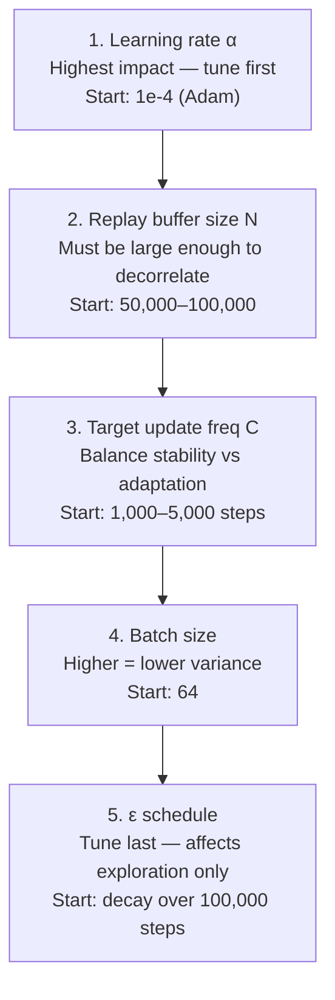
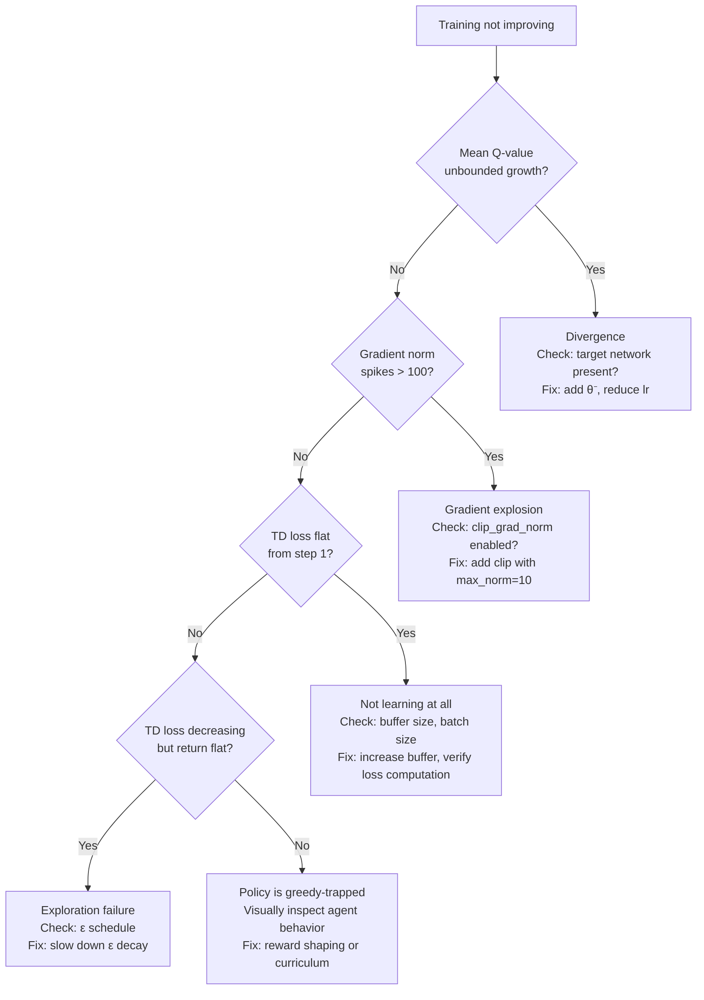

<!-- _class: lead -->

# Practical Deep RL

**Hyperparameter Tuning · Debugging · Reproducibility**

**Module 05 — Deep Reinforcement Learning**

> Getting deep RL to work reliably requires systematic configuration, principled debugging, and rigorous experimental practice.

<!--
Speaker notes: Key talking points for this slide
- This deck covers the engineering practice side of deep RL — not new algorithms, but how to make algorithms actually work
- Research shows that implementation details often explain more performance variance than algorithmic differences (Engstrom et al., 2020)
- Three topics: hyperparameter tuning (what to tune, in what order), debugging (what to monitor, how to diagnose), reproducibility (how to report results that others can trust)
- Every practitioner who has trained deep RL agents has hit all of these issues — this deck will save significant time
-->

---

# Why Deep RL is Harder to Debug Than Supervised Learning

<div class="columns">
<div>

**Supervised learning:**
- Fixed dataset
- Immediate loss feedback
- Stationary loss landscape
- Single source of randomness (batch sampling)

</div>
<div>

**Deep RL:**
- Data generated on-the-fly (non-stationary)
- Delayed reward signal
- Policy changes the data distribution
- Multiple sources of randomness (env, seed, buffer, network init)

</div>
</div>

> A model that "doesn't learn" in supervised learning has one likely cause. A deep RL agent that doesn't learn has at least ten.

<!--
Speaker notes: Key talking points for this slide
- The core difficulty: in supervised learning, the data is fixed. In deep RL, the policy determines what data is collected, which determines what the policy learns — a closed loop
- This closed loop means failures can be self-reinforcing: a policy that explores badly collects bad data, which trains a bad policy, which explores badly
- Multiple random seeds is not optional in deep RL — it's the minimum scientific standard
-->

---

# The Four Diagnostic Metrics

**Always log these from step 1:**

| Metric | What It Measures | What to Look For |
|--------|-----------------|------------------|
| Episode return | Policy quality | Increasing trend (smoothed) |
| Mean Q-value | Value estimation | Stable growth, not unbounded |
| Gradient L2 norm | Update stability | Stays below ~10, no large spikes |
| TD loss | Prediction error | Decreasing trend, no NaN |

```python
# Log after every gradient update
logger.log_update(
    loss=loss.item(),
    q_values=q_values.detach(),
    model_parameters=q_net.parameters(),
)
```

<!--
Speaker notes: Key talking points for this slide
- These four metrics answer four questions: Is the policy improving? Are Q-values stable? Are gradients behaving? Is the loss decreasing?
- If you only log one metric, log the gradient norm — it's the earliest warning sign of instability
- "From step 1" is important — many bugs are visible from the very first update but only diagnosed after hours of training when return never improves
- Log frequency: every update step for metrics 2-4; every episode for metric 1
-->

---

# Hyperparameter Tuning: Priority Order

Not all hyperparameters deserve equal attention.



<!--
Speaker notes: Key talking points for this slide
- The priority order matters: if learning rate is wrong, nothing else can fix it
- Practical approach: fix everything at defaults, tune learning rate first, then move down the list
- Buffer size and batch size are linked: bigger buffer + bigger batch = better decorrelation but more memory
- ε schedule tuning is often unnecessary if the other hyperparameters are correct
-->

---

# Learning Rate: The Most Important Hyperparameter

<div class="columns">
<div>

**Too high:** Q-values diverge

```
Step 1000:  Q ≈ 5.2
Step 5000:  Q ≈ 1,847
Step 10000: Q = NaN
```

**Too low:** No learning

```
Step 1000:  Q ≈ 0.1
Step 50000: Q ≈ 0.1
Step 100000: Q ≈ 0.1
```

**Just right:** Stable growth

```
Step 1000:  Q ≈ 1.2
Step 50000: Q ≈ 4.5
Step 100000: Q ≈ 7.1
```

</div>
<div>

**Recommended schedule:**

| Environment | Learning Rate |
|-------------|--------------|
| CartPole, LunarLander | $1 \times 10^{-3}$ |
| MuJoCo locomotion | $3 \times 10^{-4}$ |
| Atari (Adam) | $1 \times 10^{-4}$ |
| Atari (RMSProp) | $2.5 \times 10^{-4}$ |

Start at the higher end. If unstable, halve it.

</div>
</div>

<!--
Speaker notes: Key talking points for this slide
- The Q-value trace is a useful way to diagnose: track the mean Q-value at evaluation, not just the loss
- "Start at the higher end, then halve" is practical advice — it's faster to diagnose divergence (a few thousand steps) than to diagnose slow learning (hundreds of thousands of steps)
- Adam is generally preferred over RMSProp for new implementations — Mnih 2015 used RMSProp because Adam wasn't widely used yet
-->

---

# Replay Buffer Size: Balancing Memory and Decorrelation

The buffer must be large enough that a random mini-batch contains transitions from **many different time steps**:

$$\text{Effective diversity} \approx \frac{\text{buffer size}}{\text{episode length}}$$

| Environment | Episode length | Recommended buffer | Min viable buffer |
|-------------|---------------|-------------------|------------------|
| CartPole | ~200 steps | 50,000 | 10,000 |
| LunarLander | ~1,000 steps | 100,000 | 20,000 |
| Atari | ~2,000 steps | 1,000,000 | 50,000 |
| MuJoCo | ~1,000 steps | 1,000,000 | 50,000 |

> Buffer warm-up: collect at least `batch_size × 10` transitions with random policy before starting training.

<!--
Speaker notes: Key talking points for this slide
- The "effective diversity" heuristic: if your buffer holds 10 episodes and you sample batch_size=64, each batch draws from fewer than 10 distinct episodes — not much decorrelation
- Memory constraint is real: a 1M Atari buffer with frame stacking requires ~14 GB RAM (lazy storage) or ~55 GB (naive)
- Buffer warm-up is critical: training on a near-empty buffer (e.g., 65 transitions with batch_size=64) provides almost no decorrelation benefit
-->

---

<!-- _class: lead -->

# Debugging Deep RL: Failure Mode Diagnosis

<!--
Speaker notes: Key talking points for this slide
- The diagnostic flowchart on the next slide is the practical tool — memorize it
- Each failure mode has a clear symptom, root cause, and fix
- The order of diagnosis matters: check for divergence first (easiest to identify), then overestimation, then gradient issues, then exploration issues
-->

---

# Failure Mode Diagnosis Flowchart



<!--
Speaker notes: Key talking points for this slide
- Walk through the flowchart with a concrete example from Atari training
- Emphasis: check for divergence FIRST because it's visually obvious and fast to diagnose
- "Gradient norm spikes > 100" is a heuristic — the exact threshold depends on architecture, but values > 10x the baseline norm are a red flag
- "Not learning at all" from step 1 is usually a code bug, not a hyperparameter problem — check the loss computation first
-->

---

# The Five Most Common Deep RL Bugs

```python
# Bug 1: Bootstrapping through terminal states
# WRONG:
targets = rewards + gamma * max_next_q
# CORRECT:
targets = rewards + gamma * max_next_q * (1.0 - dones)

# Bug 2: Target network not frozen during updates
# WRONG: target_net gradients are allowed
# CORRECT:
with torch.no_grad():
    max_next_q = target_net(next_states).max(dim=1).values

# Bug 3: Training before buffer has enough data
# WRONG: train immediately
# CORRECT:
if len(buffer) >= batch_size * 10:
    loss = agent.update()

# Bug 4: Evaluating with ε > 0
# WRONG: report training return
# CORRECT:
eval_return = evaluate(agent, env, epsilon=0.0)

# Bug 5: No gradient clipping
# WRONG: raw backward() with no clip
# CORRECT:
loss.backward()
nn.utils.clip_grad_norm_(q_net.parameters(), max_norm=10.0)
optimizer.step()
```

<!--
Speaker notes: Key talking points for this slide
- Bug 1 (terminal state masking): produces a systematic overestimation of values near episode end — the network learns to assign high value to "about to terminate" states
- Bug 2 (target network gradient): with PyTorch, gradients flow through any network that participates in a computation unless wrapped in no_grad — easy to miss
- Bug 3 (buffer warmup): training on 65 transitions with batch=64 means you replay the same data immediately — zero decorrelation
- Bug 4 (epsilon during eval): can cause 10-20% underestimate of true policy performance
- Bug 5 (gradient clipping): a single large TD error can produce a gradient of magnitude 1000+ — clipping to norm 10 prevents catastrophic updates
-->

---

# Reward Curve Interpretation

<div class="columns">
<div>

**Healthy training:**
```
Return
  ↑
  │     ___----
  │  __/
  │ /
  │/
  └─────────→ Steps
```
Monotonic increase with noise

**Catastrophic forgetting:**
```
Return
  ↑
  │ /\   /\
  │/  \_/  \_
  └─────────→ Steps
```
Unstable oscillations → increase buffer, reduce lr

</div>
<div>

**Exploration failure:**
```
Return
  ↑
  │___________
  │
  └─────────→ Steps
```
Flat near random → slow ε decay

**Divergence:**
```
Return
  ↑
  │  /
  │ /
  │/___________NaN
  └─────────→ Steps
```
Sudden collapse → check target net, clip gradients

</div>
</div>

<!--
Speaker notes: Key talking points for this slide
- These four shapes cover ~90% of training failure modes
- "Healthy training with noise" is important: deep RL return is noisy by nature. Use smoothing (50-episode rolling average) to see the trend
- Catastrophic forgetting often oscillates on a timescale of tens of thousands of steps — easy to miss if you're not plotting regularly
- "Flat near random" from the start: check ε — if it decays too fast, the agent commits to a random policy
-->

---

<!-- _class: lead -->

# Reproducibility in Deep RL

<!--
Speaker notes: Key talking points for this slide
- Henderson et al. (2018) "Deep Reinforcement Learning That Matters" showed that many published results are not reproducible
- The main causes: different random seeds, different hyperparameter settings, different library versions
- The scientific standard: results must be reproducible by someone else using only your paper/code
- This section provides the practical protocol to meet that standard
-->

---

# Sources of Non-Determinism

| Source | Impact | Fix |
|--------|--------|-----|
| Network initialization seed | High | `torch.manual_seed(seed)` |
| Buffer sampling seed | Medium | `random.seed(seed)` |
| Environment reset stochasticity | Medium | `env.reset(seed=seed)` |
| CUDA non-determinism | Low | `torch.backends.cudnn.deterministic = True` |
| Library version changes | Medium | Pin versions in `requirements.txt` |

```python
def set_global_seed(seed: int) -> None:
    import random, numpy as np, torch
    random.seed(seed)
    np.random.seed(seed)
    torch.manual_seed(seed)
    torch.cuda.manual_seed_all(seed)
    torch.backends.cudnn.deterministic = True
    torch.backends.cudnn.benchmark = False
```

<!--
Speaker notes: Key talking points for this slide
- "Same code, same seed, different machine" will often give different results — this is expected for GPU training
- "Same code, same seed, same machine" should give identical results with these settings
- The `benchmark = False` setting disables cuDNN's algorithm auto-selection, which is non-deterministic
- Pin exact library versions: `torch==2.1.0`, `gymnasium==0.29.1` — minor version changes can shift results
-->

---

# How Many Seeds? Reporting Standards

**Minimum:** 5 independent seeds (use 3 only if compute-constrained)

**Reporting:**

```python
# Don't report: mean ± std of final performance
# (vulnerable to outlier seeds)

# Report instead: IQM (Interquartile Mean)
# More robust to good/bad outlier seeds
returns_matrix = np.array(returns_per_seed)  # shape (n_seeds, n_episodes)
q25 = np.percentile(returns_matrix, 25, axis=0)
q75 = np.percentile(returns_matrix, 75, axis=0)
mask = (returns_matrix >= q25) & (returns_matrix <= q75)
iqm = returns_matrix[mask].mean()
```

> Report: median return, IQM, and the number of seeds. Plot learning curves with shaded inter-quartile range.

<!--
Speaker notes: Key talking points for this slide
- IQM reference: Agarwal et al. (2021) "Deep RL at the Edge of the Statistical Precipice" — NeurIPS best paper
- Why IQM over mean: a single seed that diverges pulls the mean down significantly; IQM trims the top and bottom 25%
- Shaded learning curves: the shaded region should show the interquartile range (25th–75th percentile), not ±1 std
- Practical note: 5 seeds × a full Atari run × 50M steps can take weeks on a single GPU — use parallel runs
-->

---

# Hardware and Environment Checklist

Before starting a training run:

```
Pre-flight checklist:
□ Replay buffer fits in RAM (estimate: N × transition_size)
□ set_global_seed() called before any network/env init
□ Separate train_env and eval_env objects created
□ Checkpoint directory created and writable
□ GPU memory sufficient for Q-net + target net + batch
□ Library versions recorded (requirements.txt or conda env export)
□ Diagnostic logging initialized (return, Q-value, grad norm, loss)
□ Evaluation loop uses epsilon=0 (greedy policy)
□ Training start threshold set (buffer warmup)
```

<!--
Speaker notes: Key talking points for this slide
- This checklist addresses the most common "I can't reproduce my own result" issues
- "Separate train_env and eval_env" is subtle: if you use the same env object for both, the episode counter and internal state get mixed — this affects reproducibility and evaluation accuracy
- "Library versions recorded" — many learners skip this. Three months later when re-running an experiment, they discover that gymnasium 0.26 and 0.29 have different API semantics
-->

---

# Summary

<div class="columns">
<div>

**Hyperparameter tuning:**
1. Learning rate first
2. Buffer size second
3. Target update freq third
4. Batch size fourth
5. ε schedule last

</div>
<div>

**Debugging:**
1. Log 4 metrics from step 1
2. Check divergence first
3. Check gradient norms
4. Check exploration
5. Visualize agent behavior

</div>
</div>

**Reproducibility non-negotiables:**
- Seed everything: `random`, `numpy`, `torch`, environment
- Report IQM over 5+ seeds with shaded learning curves
- Pin library versions
- Save checkpoints every 100K steps

<!--
Speaker notes: Key talking points for this slide
- These three lists are the actionable takeaways from this deck
- In practice: the biggest return on investment is the four diagnostic metrics — logging these takes 20 lines of code and eliminates 80% of debugging guesswork
- Reproducibility: the community is moving toward higher standards (IQM, multiple seeds, open code). These practices are expected for published work.
- Next steps: Module 06 (policy gradient methods) — applies all of this infrastructure to a different family of algorithms
-->
