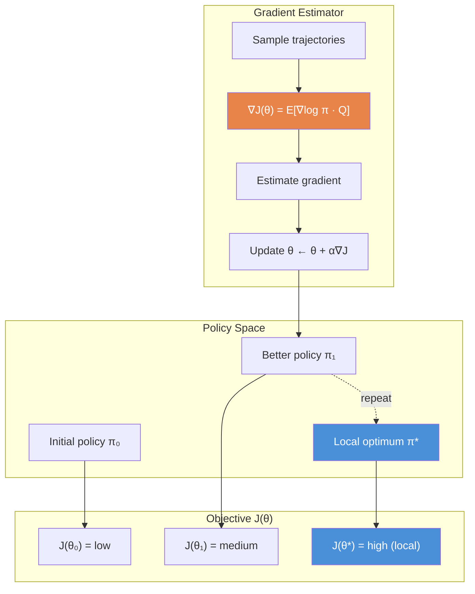

# The Policy Gradient Theorem

## In Brief

Policy gradient methods optimize the agent's policy directly by following the gradient of expected return with respect to the policy parameters $\theta$. The policy gradient theorem provides an analytically tractable expression for this gradient that can be estimated from sampled trajectories, enabling gradient ascent even when the environment dynamics are unknown.

## Key Insight

Instead of learning a value function and deriving a policy from it, parameterize the policy $\pi(a|s;\theta)$ directly and nudge its parameters in the direction that increases expected return. Actions that led to above-average outcomes get their probabilities increased; actions that led to below-average outcomes get their probabilities decreased.

---

## Why Parameterize the Policy Directly?

Value-based methods (Q-learning, DQN) learn $Q(s,a)$ and derive a policy greedily: $\pi(s) = \arg\max_a Q(s,a)$. This works well in discrete action spaces but breaks down in several important scenarios.

### Advantages Over Value-Based Methods

**1. Continuous action spaces.**
Maximizing over a continuous action set is itself an optimization problem at every step. Policy gradient methods output action parameters (e.g., mean and variance of a Gaussian) directly, bypassing this inner loop.

**2. Stochastic policies.**
Some problems require genuinely stochastic policies — for example, in partially observable environments or in game theory settings. Greedy policies are deterministic by construction; policy gradient methods represent and learn stochastic policies naturally.

**3. Convergence guarantees.**
Under mild conditions, policy gradient methods converge to a local optimum of $J(\theta)$. Value-based methods with function approximation can diverge (the deadly triad: off-policy learning + function approximation + bootstrapping). Policy gradient methods avoid bootstrapping in their pure form.

**4. Smooth policy improvement.**
Small changes in $\theta$ produce small changes in the policy, enabling stable gradient-based optimization. Greedy policy improvement can cause large behavioral jumps.

**5. Incorporating domain structure.**
The policy parameterization can encode domain knowledge directly — for example, a Gaussian policy for a robotic arm, or a softmax over a structured action space.

---

## Objective Function

The goal is to find parameters $\theta$ that maximize expected return:

$$J(\theta) = \mathbb{E}_{\pi_\theta}\!\left[\sum_{t=0}^{T} \gamma^t R_t\right] = \mathbb{E}_{\tau \sim \pi_\theta}\!\left[G_0\right]$$

where the expectation is over trajectories $\tau = (S_0, A_0, R_1, S_1, A_1, \ldots)$ sampled by following $\pi_\theta$.

Equivalently, using the stationary distribution $d^{\pi_\theta}(s)$ under the policy:

$$J(\theta) = \sum_{s} d^{\pi_\theta}(s) \sum_{a} \pi_\theta(a|s) Q^{\pi_\theta}(s,a)$$

Gradient ascent updates: $\theta \leftarrow \theta + \alpha \nabla_\theta J(\theta)$.

---

## The Policy Gradient Theorem

Computing $\nabla_\theta J(\theta)$ directly is problematic: the expectation is over trajectories whose distribution depends on $\theta$, and the environment dynamics $p(s'|s,a)$ appear in the state distribution $d^{\pi_\theta}(s)$.

The **policy gradient theorem** (Sutton et al., 2000; Sutton & Barto Ch. 13) resolves this by eliminating the dependence on the unknown dynamics:

$$\nabla_\theta J(\theta) = \mathbb{E}_{\pi_\theta}\!\left[\nabla_\theta \log \pi_\theta(A|S) \cdot Q^{\pi_\theta}(S,A)\right]$$

The gradient of the objective equals the expected product of the **score function** $\nabla_\theta \log \pi_\theta(a|s)$ and the **action-value function** $Q^{\pi_\theta}(s,a)$, under the on-policy distribution.

### Statement

For any differentiable policy $\pi_\theta$ and any starting state distribution:

$$\nabla_\theta J(\theta) \propto \sum_s d^{\pi_\theta}(s) \sum_a Q^{\pi_\theta}(s,a) \nabla_\theta \pi_\theta(a|s)$$

which, by the log-derivative trick, becomes:

$$\nabla_\theta J(\theta) = \mathbb{E}_{\pi_\theta}\!\left[\nabla_\theta \log \pi_\theta(A|S) \cdot Q^{\pi_\theta}(S,A)\right]$$

---

## The Log-Derivative Trick

The key algebraic step that makes the theorem tractable is:

$$\nabla_\theta \pi_\theta(a|s) = \pi_\theta(a|s) \cdot \frac{\nabla_\theta \pi_\theta(a|s)}{\pi_\theta(a|s)} = \pi_\theta(a|s) \cdot \nabla_\theta \log \pi_\theta(a|s)$$

This identity converts a gradient of a probability (which appears inside an expectation over a distribution that also depends on $\theta$) into a product of that probability with the gradient of its log. The $\pi_\theta(a|s)$ factor then folds back into the expectation:

$$\sum_a \pi_\theta(a|s) \cdot \nabla_\theta \log \pi_\theta(a|s) \cdot Q^{\pi_\theta}(s,a) = \mathbb{E}_{A \sim \pi_\theta(\cdot|s)}\!\left[\nabla_\theta \log \pi_\theta(A|s) \cdot Q^{\pi_\theta}(s,A)\right]$$

The result is an expectation we can estimate by sampling: run the policy, record trajectories, compute the gradient estimator.

---

## Intuition: Reinforcing Good Actions

The score function $\nabla_\theta \log \pi_\theta(a|s)$ points in the direction that increases the log-probability of action $a$ in state $s$. Multiplying by $Q^{\pi_\theta}(s,a)$:

- When $Q^{\pi_\theta}(s,a) > 0$ (action leads to high return): gradient points toward increasing the probability of this action. Good.
- When $Q^{\pi_\theta}(s,a) < 0$ (action leads to poor return): gradient points toward decreasing the probability. Good.
- When $Q^{\pi_\theta}(s,a) = 0$: no update. The action is neither reinforced nor suppressed.

The update rule weights gradient steps by how good the chosen action turned out to be.

---

## Policy Parameterizations

### Softmax Policy (Discrete Actions)

For a discrete action space $\mathcal{A} = \{1, \ldots, K\}$ with feature vector $\phi(s,a) \in \mathbb{R}^d$:

$$\pi_\theta(a|s) = \frac{\exp(\theta^\top \phi(s,a))}{\sum_{a'} \exp(\theta^\top \phi(s,a'))}$$

Score function:
$$\nabla_\theta \log \pi_\theta(a|s) = \phi(s,a) - \sum_{a'} \pi_\theta(a'|s) \phi(s,a') = \phi(s,a) - \mathbb{E}_\pi[\phi(s,\cdot)]$$

The gradient increases the weight of action $a$'s features relative to the average features under the current policy.

### Gaussian Policy (Continuous Actions)

For a one-dimensional continuous action $a \in \mathbb{R}$, parameterize a Gaussian:

$$\pi_\theta(a|s) = \mathcal{N}(\mu_\theta(s),\, \sigma^2_\theta(s))$$

where $\mu_\theta(s) = \theta_\mu^\top \phi(s)$ and $\sigma_\theta(s) = \exp(\theta_\sigma^\top \phi(s))$ (log-parameterization ensures $\sigma > 0$).

Score functions:
$$\nabla_{\theta_\mu} \log \pi_\theta(a|s) = \frac{a - \mu_\theta(s)}{\sigma^2_\theta(s)} \phi(s)$$
$$\nabla_{\theta_\sigma} \log \pi_\theta(a|s) = \left(\frac{(a - \mu_\theta(s))^2}{\sigma^2_\theta(s)} - 1\right) \phi(s)$$

When a sampled action $a$ exceeds the current mean and led to high return, the mean shifts toward $a$. This is gradient descent on the mean in the direction of good actions.

---

## Optimization Landscape



Policy gradient methods perform gradient ascent on $J(\theta)$ using Monte Carlo estimates of the gradient. Because $J(\theta)$ is generally non-convex, convergence to global optima is not guaranteed — only local optima.

---

## Code Snippet

```python
import numpy as np
import torch
import torch.nn as nn

class SoftmaxPolicy(nn.Module):
    """
    Softmax policy network for discrete action spaces.

    Maps state observations to action probability distributions.
    Parameters theta are the network weights.
    """

    def __init__(self, state_dim: int, action_dim: int, hidden_dim: int = 64):
        super().__init__()
        self.net = nn.Sequential(
            nn.Linear(state_dim, hidden_dim),
            nn.Tanh(),
            nn.Linear(hidden_dim, action_dim),
        )

    def forward(self, state: torch.Tensor) -> torch.Tensor:
        """Return action probability distribution."""
        logits = self.net(state)
        return torch.softmax(logits, dim=-1)

    def log_prob(self, state: torch.Tensor, action: torch.Tensor) -> torch.Tensor:
        """
        Compute log π_θ(a|s) — the score function numerator.

        This is the quantity whose gradient (∇_θ log π_θ(a|s)) appears
        in the policy gradient theorem.
        """
        probs = self.forward(state)
        # Gather log probability of the selected action
        return torch.log(probs.gather(1, action.unsqueeze(1)).squeeze(1))


def compute_policy_gradient_loss(
    log_probs: torch.Tensor,
    returns: torch.Tensor,
) -> torch.Tensor:
    """
    Policy gradient loss: -E[log π(a|s) * Q(s,a)].

    Negated because PyTorch minimizes; we want gradient ascent on J(θ).

    Parameters
    ----------
    log_probs : Tensor of shape (T,)
        log π_θ(A_t | S_t) for each time step.
    returns : Tensor of shape (T,)
        Q estimates G_t for each time step.

    Returns
    -------
    loss : scalar Tensor
        Loss whose gradient equals -∇J(θ).
    """
    # Policy gradient theorem: ∇J = E[∇log π * Q]
    # Loss = -mean(log_probs * returns) gives ∇loss = -∇J
    return -(log_probs * returns).mean()
```

---

## Common Pitfalls

**Pitfall 1 — High variance gradient estimates.**
Monte Carlo estimates of $Q^{\pi_\theta}(s,a)$ using episode returns have high variance because a single trajectory sample includes contributions from many stochastic decisions. Without variance reduction (baselines, control variates), learning is slow and unstable. See Guide 02 on REINFORCE with baseline and Guide 03 on actor-critic methods.

**Pitfall 2 — Using absolute returns instead of advantages.**
If all returns in an episode are positive (even though some actions were relatively bad), the policy gradient increases the probability of all actions proportionally to their absolute return. This is correct in expectation but biased in small samples. Subtracting a baseline $b(s)$ centers returns around zero without changing the expected gradient.

**Pitfall 3 — Policy collapse or explosion.**
Without entropy regularization or careful learning rate selection, softmax policies can collapse to near-deterministic distributions prematurely, cutting off exploration. Monitor policy entropy during training.

**Pitfall 4 — Large step sizes destroying good policies.**
Unlike value-based methods, a single bad gradient step can cause a dramatic policy change that reduces $J(\theta)$ significantly. Trust region methods (TRPO, PPO in Module 07) address this by constraining the KL divergence between successive policies.

**Pitfall 5 — Off-policy data with on-policy estimators.**
The policy gradient theorem assumes on-policy data: trajectories sampled under $\pi_\theta$. Using replayed or old data introduces a distribution mismatch bias. Importance sampling corrections are required for off-policy policy gradient.

---

## Connections

- **Builds on:** Module 00 (MDP formalism, $Q^{\pi}$, $V^{\pi}$), Module 04 (function approximation), Module 05 (neural network policies)
- **Leads to:** REINFORCE (Guide 02), actor-critic (Guide 03), PPO and TRPO (Module 07)
- **Related to:** Score function estimators (REINFORCE estimator), variational inference (ELBO gradient), evolution strategies

---

## Further Reading

- Sutton, R. S. & Barto, A. G. (2018). *Reinforcement Learning: An Introduction* (2nd ed.), Chapter 13 — the primary reference for the policy gradient theorem and its derivation
- Sutton, R. S., McAllester, D., Singh, S., & Mansour, Y. (2000). Policy gradient methods for reinforcement learning with function approximation. *NeurIPS* — the original policy gradient theorem paper
- Williams, R. J. (1992). Simple statistical gradient-following algorithms for connectionist reinforcement learning. *Machine Learning* — introduces the REINFORCE estimator and score function approach
- Schulman, J., Moritz, P., Levine, S., Jordan, M., & Abbeel, P. (2016). High-dimensional continuous control using generalized advantage estimation. *ICLR* — GAE for variance reduction
