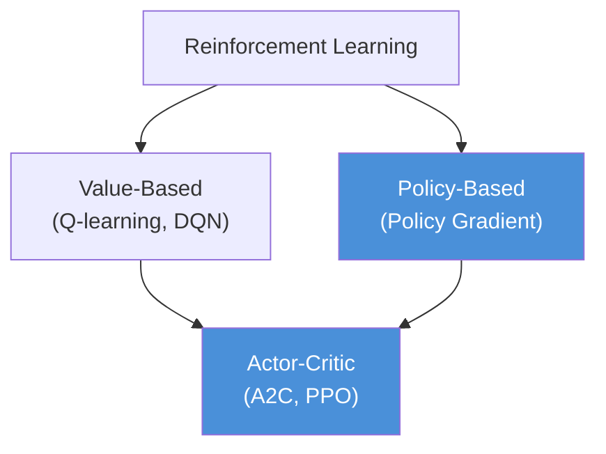
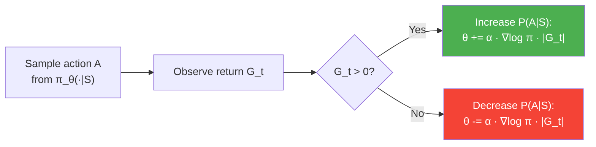
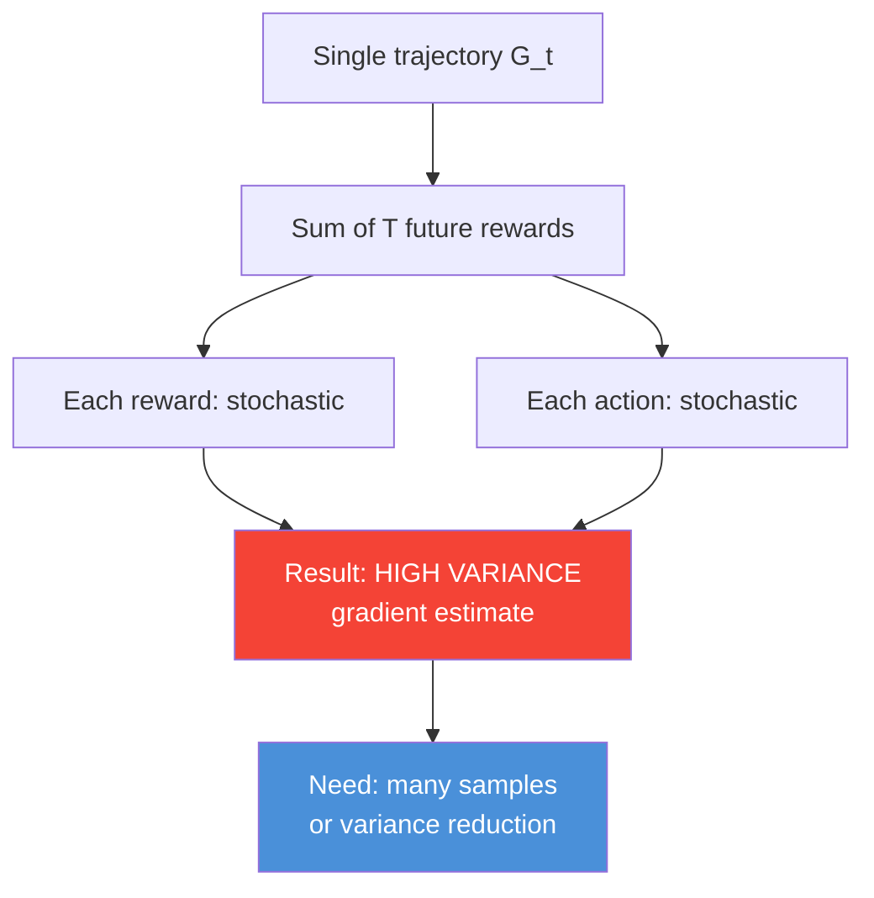

<!-- _class: lead -->

# The Policy Gradient Theorem

**Module 06 — Policy Gradient Methods**

> Optimize the policy directly: increase the probability of actions that lead to high returns, decrease those that lead to poor outcomes.

<!--
Speaker notes: Key talking points for this slide
- Welcome to Module 06 -- we are now in the third major branch of RL: policy-based methods
- Modules 01-03 covered dynamic programming and Monte Carlo, Module 04-05 covered value function approximation
- This module introduces a fundamentally different idea: don't learn a value function and derive a policy -- learn the policy directly
- Key motivating question: "Why would we want to do that, given that value-based methods work so well?"
-->

---

# Where We Are in the RL Landscape

**Policy gradient methods** occupy the right branch — and actor-critic methods combine both.

<!--
Speaker notes: Key talking points for this slide
- Value-based: learn Q(s,a), derive policy greedily
- Policy-based: learn π(a|s;θ) directly
- Actor-critic: learn both simultaneously -- the topic of Guide 03
- Policy gradient is not replacing value-based methods; it is a complementary approach with different tradeoffs
- The two branches merge in actor-critic, which is the dominant paradigm in modern deep RL
-->

---

# Why Parameterize the Policy Directly?

**Value-based limitations:**
- Discrete actions only (naturally)
- Deterministic policies by default
- $\arg\max_a Q(s,a)$ requires enumeration
- Deadly triad: divergence risk with function approximation

**Policy gradient advantages:**
- Handles continuous action spaces
- Naturally stochastic policies
- Smooth parameter updates
- Convergence to local optima guaranteed

<!--
Speaker notes: Key talking points for this slide
- The "deadly triad" -- off-policy + function approximation + bootstrapping -- causes divergence in value-based methods (Tsitsiklis and Van Roy 1997)
- Policy gradient methods don't bootstrap (in their pure form), avoiding one leg of the triad
- Continuous action spaces: a robotic arm has joint torques in [-5, 5] -- you can't enumerate all actions and take a max
- Stochastic policies: rock-paper-scissors requires a 1/3 mixed strategy; a greedy policy always loses to an adaptive opponent
-->

---

# The Optimization Objective

We maximize expected return over trajectories sampled from $\pi_\theta$:

$$J(\theta) = \mathbb{E}_{\tau \sim \pi_\theta}\!\left[\sum_{t=0}^{T} \gamma^t R_t\right] = \mathbb{E}_{\pi_\theta}[G_0]$$

**Gradient ascent:** $\theta \leftarrow \theta + \alpha \nabla_\theta J(\theta)$

The challenge: $J(\theta)$ involves an expectation over trajectories whose distribution depends on $\theta$ through both the policy and (implicitly) the state distribution.

<!--
Speaker notes: Key talking points for this slide
- This looks like a standard optimization objective, but there's a subtlety: the distribution over trajectories changes as θ changes
- The state distribution d^π(s) depends on the policy through the transition dynamics
- Naive finite-difference gradient estimation would require many trajectory rollouts per gradient step and doesn't scale
- The policy gradient theorem resolves this by giving us an analytic expression we can estimate from a single set of trajectories
-->

---

# The Core Challenge

We want $\nabla_\theta J(\theta)$, but:

$$J(\theta) = \int_\tau p_\theta(\tau) G(\tau) \, d\tau$$

The trajectory distribution $p_\theta(\tau)$ depends on $\theta$ — we can't differentiate through the environment dynamics.

**Solution: The Log-Derivative Trick**

$$\nabla_\theta p_\theta(\tau) = p_\theta(\tau) \cdot \nabla_\theta \log p_\theta(\tau)$$

This converts a gradient outside an expectation into a gradient inside one.

<!--
Speaker notes: Key talking points for this slide
- p_θ(τ) = p(s₀) · ∏_t π_θ(a_t|s_t) · p(s_{t+1}|s_t,a_t)
- When we take the log: log p_θ(τ) = log p(s₀) + Σ_t log π_θ(a_t|s_t) + Σ_t log p(s_{t+1}|s_t,a_t)
- The dynamics terms p(s_{t+1}|s_t,a_t) don't depend on θ -- their gradients are zero!
- Only the policy terms log π_θ(a_t|s_t) survive differentiation -- this is why we don't need to know the dynamics
-->

---

# Log-Derivative Trick: Step by Step

$$\nabla_\theta J(\theta) = \nabla_\theta \int_\tau p_\theta(\tau) G(\tau) \, d\tau$$

$$= \int_\tau \nabla_\theta p_\theta(\tau) \cdot G(\tau) \, d\tau$$

$$= \int_\tau p_\theta(\tau) \cdot \nabla_\theta \log p_\theta(\tau) \cdot G(\tau) \, d\tau$$

$$= \mathbb{E}_{\pi_\theta}\!\left[\nabla_\theta \log p_\theta(\tau) \cdot G(\tau)\right]$$

Since dynamics terms vanish:

$$\nabla_\theta \log p_\theta(\tau) = \sum_t \nabla_\theta \log \pi_\theta(A_t|S_t)$$

<!--
Speaker notes: Key talking points for this slide
- Step 1: move gradient inside the integral (valid under mild regularity conditions)
- Step 2: apply log-derivative trick: ∇p = p · ∇log p
- Step 3: the result is an expectation we can estimate by sampling
- Step 4: expand log p_θ(τ) -- the initial state and transition probabilities don't depend on θ
- The final expression only requires knowing π_θ, not the environment dynamics p(s'|s,a)
-->

---

# The Policy Gradient Theorem

$$\boxed{\nabla_\theta J(\theta) = \mathbb{E}_{\pi_\theta}\!\left[\nabla_\theta \log \pi_\theta(A|S) \cdot Q^{\pi_\theta}(S,A)\right]}$$

- $\nabla_\theta \log \pi_\theta(A|S)$ — **score function**: direction that increases log-prob of the taken action
- $Q^{\pi_\theta}(S,A)$ — **action-value**: how good was this action from this state?

> Sutton et al. (2000); Sutton & Barto Ch. 13

<!--
Speaker notes: Key talking points for this slide
- This is the central result of this entire module -- everything else is a practical instantiation of this theorem
- The score function is computable: just backpropagate through the policy network
- Q^π(s,a) is NOT computable directly -- we need to estimate it. That's what REINFORCE and actor-critic do differently
- REINFORCE uses Monte Carlo returns G_t as an unbiased estimate of Q^π(s,a)
- Actor-critic uses a learned value network -- leading to lower variance but some bias
-->

---

# Intuition: Reinforcing Good Actions

The gradient **pushes probability mass** toward actions with positive returns and **pulls it away** from actions with negative returns.

<!--
Speaker notes: Key talking points for this slide
- This is the core learning signal of policy gradient: a form of trial and error with soft updates
- Unlike value-based methods which maintain a Q-table, policy gradient directly modifies action probabilities
- The magnitude of the update is proportional to the return -- bigger rewards cause bigger probability shifts
- Important subtlety: this only works correctly when actions lead to both positive and negative returns; if all returns are positive, all action probabilities increase (though relatively)
-->

---

# Policy Parameterization: Softmax (Discrete)

For discrete actions with features $\phi(s,a)$:

$$\pi_\theta(a|s) = \frac{\exp(\theta^\top \phi(s,a))}{\sum_{a'} \exp(\theta^\top \phi(s,a'))}$$

Score function:
$$\nabla_\theta \log \pi_\theta(a|s) = \phi(s,a) - \underbrace{\sum_{a'} \pi_\theta(a'|s) \phi(s,a')}_{\text{expected features}}$$

The gradient is the deviation of the action's features from the **expected features under the policy**.

<!--
Speaker notes: Key talking points for this slide
- The softmax ensures probabilities sum to 1 and are all positive
- The score function has an elegant interpretation: "How different is action a from what I usually do?"
- If the action's features are close to the average, the gradient is near zero -- the policy already gives it appropriate weight
- If the action's features deviate strongly from average AND it has high return, the gradient is large -- strong learning signal
- In neural network policies, we don't compute this manually: autograd handles it via log_softmax
-->

---

# Policy Parameterization: Gaussian (Continuous)

For continuous actions, parameterize a Gaussian:

$$\pi_\theta(a|s) = \mathcal{N}(\mu_\theta(s),\, \sigma^2_\theta(s))$$

Score functions:
$$\nabla_{\theta_\mu} \log \pi_\theta(a|s) = \frac{a - \mu_\theta(s)}{\sigma^2_\theta(s)}\, \phi(s)$$

$$\nabla_{\theta_\sigma} \log \pi_\theta(a|s) = \left(\frac{(a-\mu_\theta(s))^2}{\sigma^2_\theta(s)} - 1\right) \phi(s)$$

<!--
Speaker notes: Key talking points for this slide
- The mean score function says: "If the sampled action was above the mean and led to high return, shift the mean upward"
- The variance score function controls exploration: if actions near the mean are consistently good, reduce variance (exploit); if returns are varied, maintain variance (explore)
- Log-parameterize σ to ensure positivity: σ = exp(θ_σ · φ(s))
- In practice, σ is often a learned scalar or a fixed hyperparameter, not state-dependent
- Multi-dimensional actions: use a diagonal Gaussian (independent dimensions) or full covariance Gaussian
-->

---

# Monte Carlo Gradient Estimator

Given a trajectory $\tau = (S_0, A_0, R_1, \ldots, S_T)$:

$$\widehat{\nabla J(\theta)} = \frac{1}{T} \sum_{t=0}^{T-1} \nabla_\theta \log \pi_\theta(A_t|S_t) \cdot G_t$$

where $G_t = \sum_{k=0}^{T-t-1} \gamma^k R_{t+k+1}$ is the **return from time $t$**.

This is an **unbiased estimator** of $\nabla J(\theta)$, but has **high variance**.

<!--
Speaker notes: Key talking points for this slide
- Unbiased: E[G_t | S_t, A_t] = Q^π(S_t, A_t) -- the return is an unbiased estimate of the action-value
- High variance: G_t depends on all future actions and states, which are all stochastic
- The variance scales with the episode length T and the reward magnitude
- High variance means we need many samples to get a reliable gradient estimate
- This is the key weakness of the pure REINFORCE estimator -- addressed in Guide 02 with baselines
-->

---

# The Variance Problem

**Variance reduction techniques:** baselines (Guide 02), actor-critic (Guide 03), GAE (Guide 03)

<!--
Speaker notes: Key talking points for this slide
- A return G_t is a sum of T future rewards -- each one is random, so G_t has variance that grows with T
- Long episodes are especially problematic: a single bad late reward poisons the gradient estimates for all earlier actions
- Baselines don't fix the problem -- they reduce it without introducing bias (if baseline is independent of the action)
- Actor-critic replaces G_t with a one-step TD estimate -- much lower variance, but introduces some bias
- The bias-variance tradeoff is the central design decision in policy gradient algorithms
-->

---

# Common Pitfalls

| Pitfall | Cause | Fix |
|---------|-------|-----|
| No learning / slow convergence | High variance gradient | Add baseline, use actor-critic |
| Policy collapses to deterministic | No entropy regularization | Add entropy bonus $-\beta H(\pi)$ |
| Divergence after good performance | Step size too large | Use PPO/TRPO clip or line search |
| Off-policy data used | Old replay buffer mixed in | Importance weights or on-policy rollouts only |
| All returns positive — wrong updates | No baseline centering | Subtract $b(s) = V(s)$ from returns |

<!--
Speaker notes: Key talking points for this slide
- Entropy regularization: add -β·H(π) to the loss where H(π) = -Σ_a π(a|s)log π(a|s)
- This penalizes low-entropy (deterministic) policies and encourages exploration
- The step size issue is why PPO became dominant: it clips the policy ratio to prevent catastrophic updates
- Off-policy: if you sample trajectories from an old policy and use them to update the current policy, the gradient estimate is biased
- Importance sampling corrects this but has its own variance problems for large policy differences
-->

---

# Summary: Policy Gradient Theorem

**The theorem:**
$$\nabla J(\theta) = \mathbb{E}_{\pi_\theta}[\nabla \log \pi_\theta(A|S) \cdot Q^{\pi_\theta}(S,A)]$$

**What it tells us:**
1. Gradient is an expectation — estimate by sampling
2. No knowledge of environment dynamics needed
3. Score function is computable via autograd
4. $Q^{\pi}$ must be estimated somehow

**Parameterizations:**

| Space | Policy | Score |
|-------|--------|-------|
| Discrete | Softmax | Feature deviation |
| Continuous | Gaussian | $(a-\mu)/\sigma^2$ |

**Next:** REINFORCE (Guide 02) — estimating $Q^{\pi}$ with episode returns

<!--
Speaker notes: Key talking points for this slide
- The policy gradient theorem is the foundation; everything else is about how to estimate Q^π
- REINFORCE: use the full episode return G_t -- unbiased but high variance
- Actor-critic: use a learned value function V(s) -- lower variance but biased
- PPO/TRPO: constrain how far θ can move per update -- stable policy improvement
- The key equation to remember: ∇J = E[∇log π · Q] -- this is the starting point for all policy gradient algorithms
- References: Sutton & Barto Ch. 13 for proof; Williams (1992) for REINFORCE; Schulman (2016) for GAE
-->
