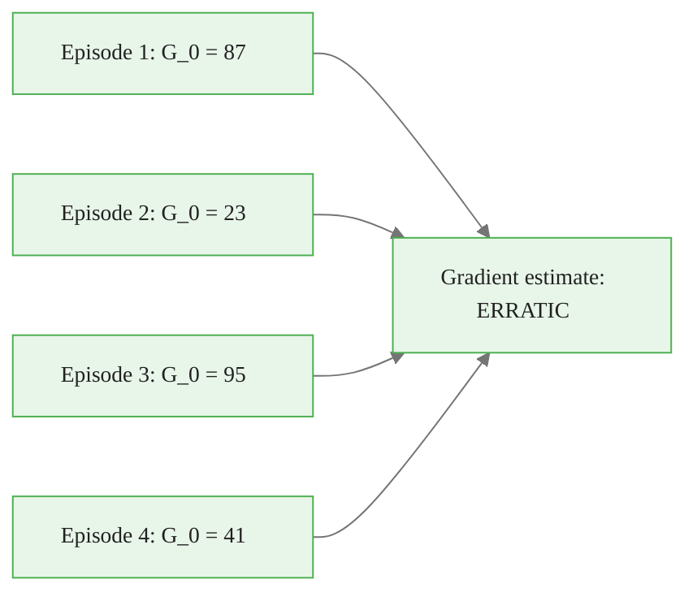

<!-- _class: lead -->

# REINFORCE: Monte Carlo Policy Gradient

**Module 06 — Policy Gradient Methods**

> The simplest policy gradient algorithm: run complete episodes, observe which actions led to high returns, and increase their probability.

<!--
Speaker notes: Key talking points for this slide
- REINFORCE was introduced by Ronald Williams in 1992 -- more than 30 years ago and still relevant
- It is the direct, unmodified application of the policy gradient theorem using Monte Carlo returns
- Everything more advanced (actor-critic, PPO, SAC) is essentially REINFORCE with variance reduction and stability improvements
- Understanding REINFORCE deeply makes all successor algorithms easy to understand
-->

<!-- Speaker notes: Cover the key points on this slide about REINFORCE: Monte Carlo Policy Gradient. Pause for questions if the audience seems uncertain. -->

---

# The Core Idea

The policy gradient theorem says:

$$\nabla_\theta J(\theta) = \mathbb{E}_{\pi_\theta}\!\left[\nabla_\theta \log \pi_\theta(A|S) \cdot Q^{\pi_\theta}(S,A)\right]$$

We need to estimate $Q^{\pi_\theta}(S,A)$.

**REINFORCE's answer:** Use the actual return $G_t$ from that step.

$$\mathbb{E}[G_t \mid S_t, A_t] = Q^{\pi_\theta}(S_t, A_t) \quad \checkmark$$

Run the episode to completion, then compute returns.

<!--
Speaker notes: Key talking points for this slide
- Q^π(s,a) is the expected return when taking action a in state s, then following π thereafter
- G_t IS a sample from this distribution -- so E[G_t | S_t, A_t] = Q^π exactly
- This is the Monte Carlo principle applied to policy gradient: replace expectations with sample averages
- The price: each G_t is a single sample, so the estimate is unbiased but has high variance
- No approximation is needed -- just run episodes and collect returns
-->


<div class="callout-insight">
<strong>Insight:</strong> This is a key takeaway from this section that connects to the broader course themes.
</div>

<!-- Speaker notes: Cover the key points on this slide about The Core Idea. Pause for questions if the audience seems uncertain. -->

---

# The Return $G_t$

The discounted return from time step $t$:

$$G_t = \sum_{k=0}^{T-t-1} \gamma^k R_{t+k+1} = R_{t+1} + \gamma R_{t+2} + \gamma^2 R_{t+3} + \cdots + \gamma^{T-t-1} R_T$$

**Efficient computation (backward pass):**

$$G_{T-1} = R_T$$
$$G_{T-2} = R_{T-1} + \gamma G_{T-1}$$
$$G_{T-3} = R_{T-2} + \gamma G_{T-2}$$
$$\vdots$$

Start from the end of the episode and work backward.

<!--
Speaker notes: Key talking points for this slide
- The backward computation avoids computing each G_t independently (which would be O(T²))
- The recursive form G_t = R_{t+1} + γ G_{t+1} is the standard efficient implementation
- γ = 0.99 is a common choice: future rewards are 99% as valuable as immediate rewards
- γ = 1 means all future rewards count equally (only valid for finite episodes)
- The causality principle: G_t only includes rewards from time t onward -- action A_t could not have caused R_1,...,R_t
-->


<div class="callout-key">
<strong>Key Point:</strong> Remember this concept — it appears repeatedly in later modules.
</div>

<!-- Speaker notes: Cover the key points on this slide about The Return $G_t$. Pause for questions if the audience seems uncertain. -->

---

# REINFORCE Update Rule

$$\theta \leftarrow \theta + \alpha \sum_{t=0}^{T-1} \gamma^t G_t \nabla_\theta \log \pi_\theta(A_t|S_t)$$

Three components:
- $\alpha$ — learning rate
- $\gamma^t G_t$ — discounted return (how good was this trajectory from step $t$?)
- $\nabla_\theta \log \pi_\theta(A_t|S_t)$ — direction to increase probability of action $A_t$

<!--
Speaker notes: Key talking points for this slide
- The γ^t factor: earlier time steps get discounted less because they contribute more to J(θ)
- In practice, many implementations drop γ^t (set it to 1) and still work well
- The sum over t: we update based on ALL time steps in the episode, not just the last one
- This is more data-efficient than only updating on the final outcome
- Important: all updates use the SAME θ from before the episode; you don't update mid-episode
-->


<div class="callout-warning">
<strong>Warning:</strong> This is a common source of confusion. Pay close attention to the distinction here.
</div>

<!-- Speaker notes: Cover the key points on this slide about REINFORCE Update Rule. Pause for questions if the audience seems uncertain. -->

---

# REINFORCE Algorithm

```
Initialize: policy parameters θ (randomly or pre-trained)
           step size α, discount γ

For each episode:
  ┌─────────────────────────────────────────────────────┐
  │ 1. COLLECT: Run episode following π(·|·; θ)         │
  │    τ = (S₀,A₀,R₁, S₁,A₁,R₂, ..., S_{T-1},A_{T-1},R_T) │
  │                                                      │
  │ 2. COMPUTE RETURNS: Work backward from t=T-1        │
  │    G_t = R_{t+1} + γ G_{t+1}  (G_T = 0)            │
  │                                                      │
  │ 3. UPDATE: For each t = 0, ..., T-1                 │
  │    θ ← θ + α · γ^t · G_t · ∇_θ log π(A_t|S_t; θ) │
  └─────────────────────────────────────────────────────┘
```

<!--
Speaker notes: Key talking points for this slide
- This is the complete algorithm in three steps: collect, compute, update
- Step 1 is the bottleneck for long episodes -- no updates happen during collection
- Step 2 is O(T) -- very fast
- Step 3 requires backpropagation through the policy network for each time step -- can be batched efficiently
- In PyTorch: stack all log_probs into a tensor, multiply by returns tensor, take negative mean, call .backward()
- The episode boundary is critical: NEVER update mid-episode in vanilla REINFORCE
-->


<div class="callout-info">
<strong>Info:</strong> This detail is useful context but not required to memorize.
</div>

<!-- Speaker notes: Cover the key points on this slide about REINFORCE Algorithm. Pause for questions if the audience seems uncertain. -->

---

# The Variance Problem

Why does REINFORCE struggle?

$$G_t = \underbrace{R_{t+1}}_{\text{random}} + \gamma \underbrace{R_{t+2}}_{\text{random}} + \cdots + \gamma^{T-t-1} \underbrace{R_T}_{\text{random}}$$

**Variance compounds:** Each future reward is random. Returns from long episodes have high variance. The gradient estimate inherits this variance.



<!--
Speaker notes: Key talking points for this slide
- Even for the same starting state and action, G_0 varies wildly across episodes
- This is the fundamental limitation of Monte Carlo estimation: one sample is a noisy estimate of the mean
- The variance grows with episode length T: more random rewards = more variance
- Consequence: gradient steps can go in the wrong direction for individual episodes
- This is why REINFORCE needs many episodes and small learning rates -- individual gradient estimates are unreliable
-->

<!-- Speaker notes: Cover the key points on this slide about The Variance Problem. Pause for questions if the audience seems uncertain. -->

---

# Baseline Subtraction: The Fix

**Key insight:** We can subtract any function $b(S_t)$ that doesn't depend on the action:

$$\theta \leftarrow \theta + \alpha \sum_t \gamma^t (G_t - b(S_t)) \nabla_\theta \log \pi_\theta(A_t|S_t)$$

**Why this doesn't introduce bias:**

$$\mathbb{E}_{A_t \sim \pi_\theta}\!\left[b(S_t) \nabla_\theta \log \pi_\theta(A_t|S_t)\right] = b(S_t) \nabla_\theta \underbrace{\sum_a \pi_\theta(a|S_t)}_{=1} = 0$$

The baseline's contribution is always zero in expectation.

<!--
Speaker notes: Key talking points for this slide
- This is a mathematically beautiful result: we can subtract anything we want (as long as it doesn't depend on A_t) without changing the expected gradient
- The proof: b(S_t) is constant w.r.t. A_t, so it factors out of the sum over actions
- The sum of all ∇log π(a|s) = ∇_θ 1 = 0 (gradient of a constant is zero)
- So b(S_t) · 0 = 0 -- the baseline contributes nothing in expectation
- But it dramatically reduces variance by centering the returns around what was "expected"
-->

<!-- Speaker notes: Cover the key points on this slide about Baseline Subtraction: The Fix. Pause for questions if the audience seems uncertain. -->

---

# What Makes a Good Baseline?

| Baseline | Complexity | Variance Reduction |
|----------|------------|-------------------|
| $b = 0$ (none) | None | None |
| $b = \bar{G}$ (episode mean) | Trivial | Moderate |
| $b = \bar{G}_{\text{running}}$ (exponential average) | Low | Good |
| $b(s) = V^{\pi_\theta}(s)$ (learned value) | Network + training | Best |

**Best choice:** $b(s) = V^{\pi_\theta}(s)$ — the state-value function.

Then $G_t - V(S_t)$ estimates the **advantage** $A^{\pi}(S_t, A_t)$.

<!--
Speaker notes: Key talking points for this slide
- Running mean baseline is easy: keep an exponential moving average of episode returns and subtract it
- Learned baseline requires training a second network V(s) -- but the reduction in variance is usually worth it
- The advantage A^π(s,a) = Q^π(s,a) - V^π(s) measures: "Is this action better or worse than average?"
- When A > 0: action was better than expected -- increase its probability
- When A < 0: action was worse than expected -- decrease its probability
- When A ≈ 0: action performed as expected -- no update needed
- This is the bridge between REINFORCE and actor-critic: the actor-critic learns V(s) as a neural network
-->

<!-- Speaker notes: Cover the key points on this slide about What Makes a Good Baseline?. Pause for questions if the audience seems uncertain. -->

---

# The Advantage Function

$$A^{\pi_\theta}(s,a) = Q^{\pi_\theta}(s,a) - V^{\pi_\theta}(s)$$

<div class="columns">
<div>

**Interpretation:**
- $V^{\pi}(s)$: average expected return from state $s$
- $Q^{\pi}(s,a)$: expected return for taking action $a$
- $A^{\pi}(s,a)$: how much better than average?

**Properties:**
- $\mathbb{E}_{a \sim \pi}[A^{\pi}(s,a)] = 0$
- $A > 0$: action above average
- $A < 0$: action below average

</div>
<div>

**REINFORCE with advantage:**
$$\theta \leftarrow \theta + \alpha \sum_t \gamma^t \hat{A}_t \nabla_\theta \log \pi_\theta(A_t|S_t)$$

where $\hat{A}_t = G_t - V(S_t)$

</div>
</div>

<!--
Speaker notes: Key talking points for this slide
- The advantage function is THE central quantity in modern policy gradient methods
- PPO, A2C, A3C, SAC -- all use some form of advantage estimation
- The advantage naturally has zero mean under the policy, which is exactly why it reduces variance
- Computing exact advantages requires knowing both Q^π and V^π -- we never have these
- Practical approximations: G_t - V(S_t) (Monte Carlo advantage), R + γV(S') - V(S) (TD advantage), GAE (weighted combination)
-->

<!-- Speaker notes: Cover the key points on this slide about The Advantage Function. Pause for questions if the audience seems uncertain. -->

---

# Code: REINFORCE in PyTorch

<div class="code-window">
<div class="code-header">
<div class="dots"><span class="dot-red"></span><span class="dot-yellow"></span><span class="dot-green"></span></div>
<span class="filename">example.py</span>
</div>

```python
def reinforce_update(log_probs, rewards, optimizer, gamma=0.99):
    """Single REINFORCE episode update with running baseline."""

    # Compute returns backward from episode end
    returns, G = [], 0.0
    for r in reversed(rewards):
        G = r + gamma * G
        returns.insert(0, G)
    returns = torch.tensor(returns, dtype=torch.float32)

    # Subtract baseline (mean return in this episode)
    returns = (returns - returns.mean()) / (returns.std() + 1e-8)

    # Policy gradient loss: -E[log π(a|s) * G_t]
    loss = -(torch.stack(log_probs) * returns).sum()

    optimizer.zero_grad()
    loss.backward()
    optimizer.step()
```
</div>

<!--
Speaker notes: Key talking points for this slide
- The backward loop computes G_t = R_{t+1} + γ G_{t+1} efficiently in O(T)
- Normalizing returns within an episode is a simple but effective variance reduction trick
- The loss is negated because PyTorch minimizes; we want to maximize J(θ)
- torch.stack(log_probs) converts a list of scalar tensors to a 1D tensor -- necessary for vectorized multiplication
- optimizer.zero_grad() is critical: without it, gradients accumulate across episodes
- This is the complete update -- just 10 lines of actual logic
-->

<!-- Speaker notes: Cover the key points on this slide about Code: REINFORCE in PyTorch. Pause for questions if the audience seems uncertain. -->

---

# Limitations of Vanilla REINFORCE

<div class="columns">
<div>

**Structural limitations:**
- Requires complete episodes
- Cannot update online
- Inapplicable to continuing tasks
- Episode length limits sample efficiency

**Statistical limitations:**
- High variance (even with baseline)
- Slow convergence in practice
- Sensitive to learning rate choice

</div>
<div>

**What actor-critic fixes:**
- Replace $G_t$ with TD estimate: $R + \gamma V(S')$
- No need to wait for episode end
- Lower variance (at cost of some bias)
- Works for continuing tasks

</div>
</div>

<!--
Speaker notes: Key talking points for this slide
- "Requires complete episodes" is a hard constraint: G_t needs all future rewards
- For environments with episode lengths of 1000+ steps, this is a significant sample efficiency problem
- Online updates (updating every step) are possible with actor-critic -- see Guide 03
- The actor-critic is essentially REINFORCE where we replace G_t with R + γV(S') (one-step bootstrap)
- The tradeoff: Monte Carlo (REINFORCE) has high variance but zero bias; TD (actor-critic) has lower variance but some bias from the value approximation
-->

<!-- Speaker notes: Cover the key points on this slide about Limitations of Vanilla REINFORCE. Pause for questions if the audience seems uncertain. -->

---

# When to Use REINFORCE

**REINFORCE is appropriate when:**
- Episodes are short (< 200 steps)
- Reward signal is dense (not sparse)
- Simplicity and interpretability matter
- You are learning/teaching the fundamentals

**Move to actor-critic when:**
- Episodes are long or continuing
- Variance is causing unstable training
- Sample efficiency matters
- Reward signal is sparse

<!--
Speaker notes: Key talking points for this slide
- CartPole-v1 (max 500 steps, dense reward): REINFORCE works fine
- MuJoCo locomotion (1000+ steps, shaped reward): REINFORCE is too slow; use PPO or SAC
- Sparse reward (reward only at episode end): G_t is the same for all steps -- no signal about which action caused the reward
- In research: REINFORCE is rarely used directly; it serves as the baseline that actor-critic methods improve upon
- In education: REINFORCE is the right starting point because it directly implements the policy gradient theorem without additional complexity
-->

<!-- Speaker notes: Cover the key points on this slide about When to Use REINFORCE. Pause for questions if the audience seems uncertain. -->

---

# Summary

<div class="columns">
<div>

**Algorithm:**
1. Run complete episode under $\pi_\theta$
2. Compute returns $G_t$ (backward pass)
3. Update: $\theta \leftarrow \theta + \alpha \gamma^t G_t \nabla \log \pi_\theta$

**With baseline:**
$$\theta \leftarrow \theta + \alpha \gamma^t (G_t - b(S_t)) \nabla \log \pi_\theta$$

**Advantage:**
$$A^{\pi}(s,a) = Q^{\pi}(s,a) - V^{\pi}(s)$$

</div>
<div>

**Properties:**
- Unbiased gradient estimate
- High variance (decreases with baseline)
- Requires complete episodes
- Converges to local optimum

**Next:** Actor-Critic (Guide 03) — replace $G_t$ with a learned value estimate to enable online updates and lower variance

</div>
</div>

<!--
Speaker notes: Key talking points for this slide
- REINFORCE with baseline is a complete, working algorithm -- not just a theoretical result
- The unbiasedness is its key advantage over actor-critic (which is biased through bootstrap)
- In practice: train with REINFORCE first to verify your environment and policy network work correctly, then switch to actor-critic for performance
- The advantage function A(s,a) is the conceptual bridge to actor-critic -- the actor-critic learns V(s) (the critic) to compute advantages for the actor
- References: Williams (1992) for original algorithm; Sutton & Barto Ch. 13.3 for baseline theory
-->

<!-- Speaker notes: Cover the key points on this slide about Summary. Pause for questions if the audience seems uncertain. -->
