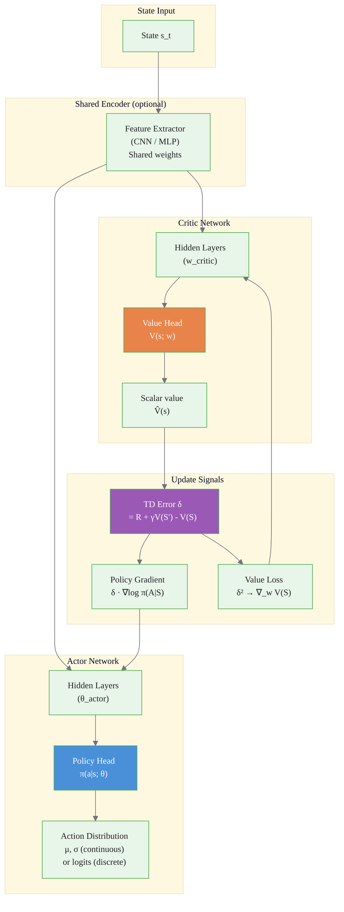
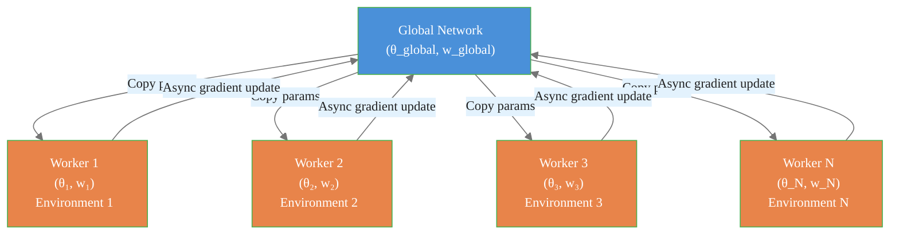

# Actor-Critic Methods

> **Reading time:** ~14 min | **Module:** 6 — Policy Gradient | **Prerequisites:** Module 5

## In Brief

Actor-critic methods decompose the policy gradient agent into two separate components: an **actor** (the policy network $\pi(a|s;\theta)$) that selects actions, and a **critic** (the value network $V(s;\mathbf{w})$) that evaluates how good states are. The critic's value estimates replace the high-variance Monte Carlo returns of REINFORCE, enabling online updates, lower variance, and applicability to continuing tasks.

<div class="callout-key">

<strong>Key Concept:</strong> Actor-critic methods decompose the policy gradient agent into two separate components: an **actor** (the policy network $\pi(a|s;\theta)$) that selects actions, and a **critic** (the value network $V(s;\mathbf{w})$) that evaluates how good states are. The critic's value estimates replace the high-variance Monte Carlo returns of REINFORCE, enabling online updates, lower variance, and applicability to continuing tasks.

</div>


## Key Insight

REINFORCE must wait until an episode ends to compute $G_t$. The actor-critic replaces $G_t$ with $R + \gamma V(S';\mathbf{w})$ — a one-step bootstrap estimate using the critic. This enables per-step updates and dramatically reduces variance at the cost of some bias introduced by the critic's approximation error.

---


<div class="callout-key">

<strong>Key Point:</strong> REINFORCE must wait until an episode ends to compute $G_t$.

</div>
## The Two Networks: Actor and Critic

The most important design principle of actor-critic is that the actor and critic are **separate networks with different roles, different parameters, and different loss functions**. They are not interchangeable, and their updates are independent.

<div class="callout-key">

<strong>Key Point:</strong> The most important design principle of actor-critic is that the actor and critic are **separate networks with different roles, different parameters, and different loss functions**.

</div>


### Actor: The Policy Network

$$\pi(a|s;\theta)$$

- **Role:** Decision-maker. Given the current state, outputs a probability distribution over actions.
- **Parameters:** $\theta$ (policy parameters)
- **Input:** State $s$
- **Output:** Action distribution $\pi(\cdot|s;\theta)$
- **Loss:** Policy gradient loss — shaped by the advantage signal from the critic
- **Goal:** Find $\theta$ that maximizes expected return $J(\theta)$

### Critic: The Value Network

$$V(s;\mathbf{w})$$

- **Role:** Evaluator. Given the current state, estimates how much total future reward the actor will collect from here.
- **Parameters:** $\mathbf{w}$ (value parameters)
- **Input:** State $s$
- **Output:** Scalar value estimate $\hat{V}(s) \approx V^{\pi_\theta}(s)$
- **Loss:** Mean-squared error against TD targets (or Monte Carlo returns)
- **Goal:** Find $\mathbf{w}$ that makes $V(s;\mathbf{w})$ accurate under the current policy $\pi_\theta$

The critic does **not** select actions. The actor does **not** evaluate states. This separation is the defining structural characteristic of actor-critic methods.

---

## One-Step Actor-Critic

The simplest actor-critic variant performs one update per time step using a one-step TD error.

<div class="callout-info">

<strong>Info:</strong> The simplest actor-critic variant performs one update per time step using a one-step TD error.

</div>


### TD Error (Advantage Estimate)

At each step, compute the **TD error**:

$$\delta_t = R_{t+1} + \gamma V(S_{t+1};\mathbf{w}) - V(S_t;\mathbf{w})$$

where:
- $R_{t+1}$ — the reward received after taking action $A_t$
- $\gamma V(S_{t+1};\mathbf{w})$ — discounted estimated value of the next state (bootstrap)
- $V(S_t;\mathbf{w})$ — current estimate of the value of $S_t$

The TD error $\delta_t$ is an estimate of the advantage $A^{\pi}(S_t, A_t)$: positive when the step exceeded expectations, negative when it fell short.

### Critic Update (Minimize TD Error)

$$\mathbf{w} \leftarrow \mathbf{w} + \alpha_w \delta_t \nabla_{\mathbf{w}} V(S_t;\mathbf{w})$$

This is semi-gradient TD(0) applied to the critic. The critic minimizes the squared TD error, learning to predict the value of each state under the current policy.

### Actor Update (Policy Gradient with TD Advantage)

$$\theta \leftarrow \theta + \alpha_\theta \delta_t \nabla_\theta \log \pi(A_t|S_t;\theta)$$

The actor update is identical in structure to REINFORCE, but $G_t$ is replaced by $\delta_t$. The critic provides the advantage signal that shapes the actor's learning.

### Why TD Error Estimates the Advantage

$$\mathbb{E}[\delta_t \mid S_t, A_t] = Q^{\pi}(S_t, A_t) - V^{\pi}(S_t) = A^{\pi}(S_t, A_t)$$

The TD error is a biased but low-variance estimate of the advantage. The bias comes from the critic's approximation error $V(s;\mathbf{w}) \neq V^{\pi_\theta}(s)$.

---

## One-Step Actor-Critic: Algorithm Pseudocode

```
One-Step Actor-Critic
──────────────────────────────────────────────
Input: differentiable π(a|s;θ), V(s;w)
       learning rates α_θ, α_w, discount γ
Initialize: θ, w arbitrarily

For each episode:
    Initialize S₀
    I ← 1   (discount accumulator)

    For t = 0, 1, 2, ... (until terminal):
        A_t ← sample from π(·|S_t; θ)
        Observe R_{t+1}, S_{t+1}

        # Critic: compute TD error
        if S_{t+1} is terminal:
            δ ← R_{t+1} - V(S_t; w)
        else:
            δ ← R_{t+1} + γ V(S_{t+1}; w) - V(S_t; w)

        # Critic update: minimize temporal difference
        w ← w + α_w · δ · ∇_w V(S_t; w)

        # Actor update: policy gradient with TD advantage
        θ ← θ + α_θ · I · δ · ∇_θ log π(A_t|S_t; θ)

        I ← γ · I   (update discount accumulator)
        S_t ← S_{t+1}
```

---

## Architecture: Actor-Critic Network

<div class="code-window">
<div class="code-header">
<div class="dots"><span class="dot-red"></span><span class="dot-yellow"></span><span class="dot-green"></span></div>
<span class="filename">example.py</span>
</div>

The following implementation builds on the approach above:



</div>

The actor (blue) and critic (orange) can share a backbone encoder for efficiency, but their output heads and update rules remain fully independent.

---

## A2C: Advantage Actor-Critic

A2C (Mnih et al., 2016) is the synchronous variant of A3C, which is simpler to implement and more reproducible. It extends the one-step actor-critic to multi-step returns and uses a batch of parallel environment workers.

### Key Features

**Synchronous workers:** All workers collect rollouts of length $n$, then updates happen in a single synchronized batch. This eliminates the instability of asynchronous gradient updates.

**Multi-step advantage estimate:** Instead of the one-step TD error, A2C uses the $n$-step return:

$$\hat{A}_t = \sum_{k=0}^{n-1} \gamma^k R_{t+k+1} + \gamma^n V(S_{t+n};\mathbf{w}) - V(S_t;\mathbf{w})$$

**Entropy bonus:** To prevent premature policy collapse, A2C adds an entropy regularization term to the actor loss:

$$\mathcal{L}_{\text{actor}} = -\mathbb{E}[\hat{A}_t \nabla_\theta \log \pi(A_t|S_t;\theta)] - \beta \mathcal{H}(\pi(\cdot|S_t;\theta))$$

where $\mathcal{H}(\pi) = -\sum_a \pi(a|s) \log \pi(a|s)$ encourages exploration.

---

## A3C: Asynchronous Advantage Actor-Critic

A3C (Mnih et al., 2016) runs multiple parallel workers, each with its own copy of the environment and local network parameters. Workers asynchronously compute gradients and apply them to a shared global network.

### A3C Architecture

<div class="code-window">
<div class="code-header">
<div class="dots"><span class="dot-red"></span><span class="dot-yellow"></span><span class="dot-green"></span></div>
<span class="filename">example.py</span>
</div>

The following implementation builds on the approach above:



</div>

**Key insight:** Asynchronous workers implicitly decorrelate their experience, acting like a distributed replay buffer without the off-policy complications.

**A2C vs A3C in practice:** A2C (synchronous) is generally preferred for reproducibility and ease of debugging. A3C's asynchrony provides minimal benefit over A2C with vectorized environments.

---

## Generalized Advantage Estimation (GAE)

GAE (Schulman et al., 2016) provides a principled way to interpolate between the one-step TD advantage (low variance, high bias) and the Monte Carlo advantage (zero bias, high variance).

### Multi-Step TD Errors

Define the one-step TD error at each step:

$$\delta_t = R_{t+1} + \gamma V(S_{t+1};\mathbf{w}) - V(S_t;\mathbf{w})$$

### GAE Formula

$$\hat{A}_t^{\text{GAE}(\gamma,\lambda)} = \sum_{l=0}^{\infty} (\gamma\lambda)^l \delta_{t+l}$$

The hyperparameter $\lambda \in [0,1]$ controls the bias-variance tradeoff:

| $\lambda$ | Equivalent to | Bias | Variance |
|-----------|---------------|------|----------|
| $0$ | One-step TD advantage: $\delta_t = R + \gamma V(S') - V(S)$ | High (critic error) | Low |
| $1$ | Monte Carlo advantage: $G_t - V(S_t)$ | Zero | High |
| $0.95$ | Weighted multi-step (common in practice) | Low | Moderate |

### Efficient Computation

GAE can be computed backward through a rollout:

$$\hat{A}_{T-1} = \delta_{T-1}$$
$$\hat{A}_t = \delta_t + \gamma\lambda \hat{A}_{t+1}$$

This is the same backward recurrence as return computation, with $\gamma\lambda$ replacing $\gamma$.

---

## Code Snippet

<div class="code-window">
<div class="code-header">
<div class="dots"><span class="dot-red"></span><span class="dot-yellow"></span><span class="dot-green"></span></div>
<span class="filename">example.py</span>
</div>

The following implementation builds on the approach above:

```python
import torch
import torch.nn as nn
import torch.optim as optim
import numpy as np
import gymnasium as gym
from typing import Tuple


class ActorNetwork(nn.Module):
    """
    Policy network (actor): maps states to action distributions.

    This network ONLY makes decisions -- it does not evaluate states.
    """

    def __init__(self, obs_dim: int, action_dim: int, hidden_dim: int = 128):
        super().__init__()
        self.net = nn.Sequential(
            nn.Linear(obs_dim, hidden_dim),
            nn.Tanh(),
            nn.Linear(hidden_dim, action_dim),
        )

    def forward(self, obs: torch.Tensor) -> torch.distributions.Categorical:
        """Return a Categorical distribution over actions."""
        logits = self.net(obs)
        return torch.distributions.Categorical(logits=logits)


class CriticNetwork(nn.Module):
    """
    Value network (critic): maps states to scalar value estimates.

    This network ONLY evaluates states -- it does not select actions.
    The value estimate V(s;w) approximates the expected return under π.
    """

    def __init__(self, obs_dim: int, hidden_dim: int = 128):
        super().__init__()
        self.net = nn.Sequential(
            nn.Linear(obs_dim, hidden_dim),
            nn.Tanh(),
            nn.Linear(hidden_dim, 1),
        )

    def forward(self, obs: torch.Tensor) -> torch.Tensor:
        """Return scalar value estimate V(s; w)."""
        return self.net(obs).squeeze(-1)


def one_step_actor_critic_update(
    actor: ActorNetwork,
    critic: CriticNetwork,
    actor_optimizer: optim.Optimizer,
    critic_optimizer: optim.Optimizer,
    obs: np.ndarray,
    action: int,
    reward: float,
    next_obs: np.ndarray,
    done: bool,
    gamma: float = 0.99,
) -> Tuple[float, float]:
    """
    Perform one-step actor-critic update.

    Actor and critic are updated INDEPENDENTLY with their own optimizers.

    Returns
    -------
    actor_loss : float
    critic_loss : float
    """
    obs_t = torch.FloatTensor(obs)
    next_obs_t = torch.FloatTensor(next_obs)
    reward_t = torch.FloatTensor([reward])

    # --- Critic: compute TD error ---
    # δ = R + γ V(S'; w) - V(S; w)
    with torch.no_grad():
        next_value = critic(next_obs_t) * (1.0 - float(done))  # 0 if terminal
    current_value = critic(obs_t)
    td_error = reward_t + gamma * next_value - current_value

    # --- Critic update: minimize squared TD error ---
    # ∇_w loss = ∇_w (δ²) → w ← w + α_w δ ∇_w V(S; w)
    critic_loss = td_error.pow(2)
    critic_optimizer.zero_grad()
    critic_loss.backward()
    critic_optimizer.step()

    # --- Actor update: policy gradient with TD advantage ---
    # θ ← θ + α_θ δ ∇_θ log π(A|S; θ)
    dist = actor(obs_t)
    log_prob = dist.log_prob(torch.LongTensor([action]))
    # Detach td_error: the actor uses it as a scalar signal, not a differentiable path
    actor_loss = -(td_error.detach() * log_prob)
    actor_optimizer.zero_grad()
    actor_loss.backward()
    actor_optimizer.step()

    return actor_loss.item(), critic_loss.item()


def compute_gae(
    rewards: list,
    values: list,
    next_value: float,
    dones: list,
    gamma: float = 0.99,
    lam: float = 0.95,
) -> torch.Tensor:
    """
    Compute Generalized Advantage Estimation (GAE).

    GAE(γ,λ) = Σ_{l=0}^∞ (γλ)^l δ_{t+l}
    where δ_t = R_{t+1} + γ V(S_{t+1}) - V(S_t)

    Parameters
    ----------
    rewards     : list of rewards R_{t+1}
    values      : list of value estimates V(S_t)
    next_value  : V(S_T) — value of the last observed state
    dones       : list of done flags (1 if terminal, 0 otherwise)
    gamma       : discount factor
    lam         : GAE lambda (0 = TD, 1 = Monte Carlo)
    """
    advantages = []
    gae = 0.0
    values_ext = values + [next_value]  # append bootstrap value

    for t in reversed(range(len(rewards))):
        # One-step TD error: δ_t = R_{t+1} + γ V(S_{t+1}) - V(S_t)
        delta = rewards[t] + gamma * values_ext[t + 1] * (1 - dones[t]) - values_ext[t]
        # GAE backward recurrence: Â_t = δ_t + γλ Â_{t+1}
        gae = delta + gamma * lam * (1 - dones[t]) * gae
        advantages.insert(0, gae)

    return torch.FloatTensor(advantages)
```

</div>

---

## Common Pitfalls

<div class="callout-danger">

<strong>Danger:</strong> The pitfalls below are the most common mistakes practitioners make. Each one can silently degrade your results without obvious errors.

</div>

**Pitfall 1 — Mixing actor and critic parameters.**
The actor and critic must have separate parameters and separate optimizers. A common mistake in implementations is to accidentally share parameters or update them with the same optimizer, causing unstable learning. The actor's loss should use `td_error.detach()` so the critic's gradient doesn't flow through the actor computation graph.

<div class="callout-warning">

<strong>Warning:</strong> **Pitfall 1 — Mixing actor and critic parameters.**
The actor and critic must have separate parameters and separate optimizers.

</div>

**Pitfall 2 — Bootstrapping into terminal states.**
When $S_{t+1}$ is a terminal state, $V(S_{t+1}) = 0$ by definition (no future reward is possible). The TD error should be $\delta = R_{t+1} - V(S_t)$, not $\delta = R_{t+1} + \gamma V(S_{t+1}) - V(S_t)$. Failing to zero out terminal state values causes incorrect value targets and corrupted learning.

**Pitfall 3 — Critic learning rate too high relative to actor.**
If the critic updates faster than the actor, it may adapt to the new actor policy before the actor has learned anything useful, creating a feedback loop. In practice, use $\alpha_w \approx 10\alpha_\theta$ or schedule critic learning separately.

**Pitfall 4 — Forgetting entropy regularization.**
Without entropy regularization, the actor often converges prematurely to a deterministic policy that is suboptimal. Add $-\beta \mathcal{H}(\pi)$ to the actor loss. Start with $\beta = 0.01$ and tune. If the policy entropy collapses early in training, increase $\beta$.

**Pitfall 5 — GAE with incorrect done masking.**
The GAE backward recurrence must zero out the bootstrapped advantage at episode boundaries: $\hat{A}_t = \delta_t + \gamma\lambda (1 - d_{t+1}) \hat{A}_{t+1}$. If the done flag is not applied, the GAE leaks information across episode boundaries, producing incorrect advantage estimates.

**Pitfall 6 — Shared encoder with mismatched update rates.**
When actor and critic share a feature extractor, their conflicting gradient signals can destabilize the shared layers. Use gradient clipping or reduce the shared encoder's learning rate relative to the heads.

---

## Connections


<div class="callout-info">

<strong>Info:</strong> This section maps how this guide connects to the broader course. Use these links to navigate related material.

</div>

- **Builds on:** Policy gradient theorem (Guide 01), REINFORCE and advantage function (Guide 02), TD learning (Module 03), function approximation (Module 04)
- **Leads to:** Proximal Policy Optimization and TRPO (Module 07), Soft Actor-Critic (Module 07)
- **Related to:** A2C and A3C (Mnih et al., 2016), GAE (Schulman et al., 2016)

---


## Practice Questions

**Question 1 — Conceptual:** Based on the concepts in this guide, explain in your own words why the core technique matters and when you would choose it over alternatives.

**Question 2 — Application:** Sketch out how you would apply the main concept from this guide to a real-world dataset or problem you have encountered. What would you need to watch out for?


## Further Reading

- Sutton, R. S. & Barto, A. G. (2018). *Reinforcement Learning: An Introduction* (2nd ed.), Chapter 13.5 — one-step actor-critic algorithm and convergence theory
- Mnih, V., et al. (2016). Asynchronous methods for deep reinforcement learning. *ICML* — introduces A3C and A2C; foundational for modern deep RL
- Schulman, J., Moritz, P., Levine, S., Jordan, M., & Abbeel, P. (2016). High-dimensional continuous control using generalized advantage estimation. *ICLR* — GAE derivation and empirical validation
- Konda, V. R. & Tsitsiklis, J. N. (2000). Actor-critic algorithms. *NeurIPS* — two-timescale convergence analysis for actor-critic


---

## Cross-References

<a class="link-card" href="./03_actor_critic_slides.md">
  <div class="link-card-title">Companion Slides</div>
  <div class="link-card-description">Interactive slide deck covering the key concepts with visual examples.</div>
</a>

<a class="link-card" href="../notebooks/01_reinforce_from_scratch.ipynb">
  <div class="link-card-title">Hands-on Notebook</div>
  <div class="link-card-description">15-minute micro-notebook with guided exercises and real data.</div>
</a>
