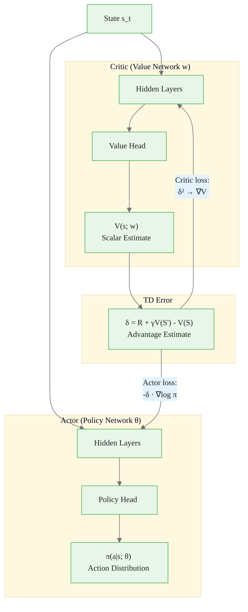
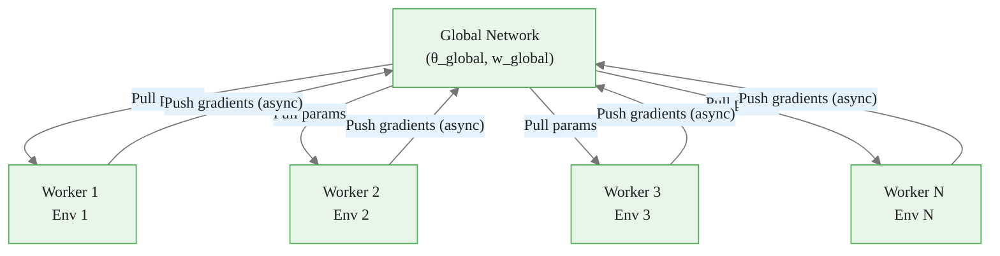

<!-- _class: lead -->

# Actor-Critic Methods

**Module 06 — Policy Gradient Methods**

> Combine a policy network (actor) that decides what to do with a value network (critic) that evaluates how good each decision is.

<!--
Speaker notes: Key talking points for this slide
- Actor-critic bridges the gap between value-based and policy-based methods
- REINFORCE's weakness: must wait for a complete episode to estimate Q^π using G_t
- Actor-critic's solution: use a learned value function V(s;w) to estimate advantages online
- This module covers one-step actor-critic, A2C, A3C, and GAE -- the building blocks of PPO and SAC
- Key design principle we'll emphasize: actor and critic are SEPARATE networks with SEPARATE roles
-->

<!-- Speaker notes: Cover the key points on this slide about Actor-Critic Methods. Pause for questions if the audience seems uncertain. -->

---

# From REINFORCE to Actor-Critic

**REINFORCE limitation:**
- Must wait until episode ends to compute $G_t$
- High variance Monte Carlo estimate
- Cannot update online

**The fix: Replace $G_t$ with $R + \gamma V(S';\mathbf{w})$**

| Method | Advantage Estimate | Bias | Variance |
|--------|-------------------|------|----------|
| REINFORCE | $G_t$ (full return) | None | High |
| Actor-Critic (1-step) | $R + \gamma V(S') - V(S)$ | Yes (critic error) | Low |
| GAE | Weighted multi-step | Low | Moderate |

<!--
Speaker notes: Key talking points for this slide
- The key trade-off: Monte Carlo (zero bias, high variance) vs bootstrap (some bias, low variance)
- The "bias" in actor-critic comes from the critic being an imperfect approximation of V^π
- If the critic were perfect, actor-critic would be unbiased
- In practice, lower variance wins: you can learn more reliably from 1000 episodes with moderate bias than from 1000 episodes with high variance
- This is the same logic behind why TD(0) is preferred over Monte Carlo for value learning (Module 03)
-->


<div class="callout-insight">
<strong>Insight:</strong> This is a key takeaway from this section that connects to the broader course themes.
</div>

<!-- Speaker notes: Cover the key points on this slide about From REINFORCE to Actor-Critic. Pause for questions if the audience seems uncertain. -->

---

# The Two Networks: Separate Roles

<div class="columns">
<div>

## Actor: Policy Network
$$\pi(a|s;\theta)$$

- **Role:** Decision-maker
- **Input:** State $s$
- **Output:** Action distribution
- **Loss:** Policy gradient
- **Goal:** Maximize $J(\theta)$

The actor **selects actions**. It does not evaluate states.

</div>
<div>

## Critic: Value Network
$$V(s;\mathbf{w})$$

- **Role:** Evaluator
- **Input:** State $s$
- **Output:** Scalar $\hat{V}(s)$
- **Loss:** TD error (MSE)
- **Goal:** Accurate value estimates

The critic **evaluates states**. It does not select actions.

</div>
</div>

<!--
Speaker notes: Key talking points for this slide
- This separation is the most common source of implementation confusion -- emphasize it strongly
- Actor: "Given this state, what action should I take?" → outputs a probability distribution
- Critic: "Given this state, how much total reward can I expect from here?" → outputs a single number
- They share the same state input but have completely different outputs and loss functions
- In code: separate nn.Module classes, separate optimizers, separate backward() calls
- Common mistake: using the same optimizer for both, or accidentally backpropagating through one into the other
-->


<div class="callout-key">
<strong>Key Point:</strong> Remember this concept — it appears repeatedly in later modules.
</div>

<!-- Speaker notes: Cover the key points on this slide about The Two Networks: Separate Roles. Pause for questions if the audience seems uncertain. -->

---

# Actor-Critic Architecture



<!--
Speaker notes: Key talking points for this slide
- Both actor and critic receive the same state as input
- They can share a feature extractor (common in Atari-style CNN policies) but have separate output heads
- The TD error δ flows to BOTH networks but with different loss functions
- Critic: minimizes δ² (wants δ → 0, meaning its predictions match reality)
- Actor: uses δ as a signed weight on the policy gradient (wants actions that produce δ > 0)
- The gradient flow MUST be separated: td_error.detach() when computing actor loss
-->


<div class="callout-warning">
<strong>Warning:</strong> This is a common source of confusion. Pay close attention to the distinction here.
</div>

<!-- Speaker notes: Cover the key points on this slide about Actor-Critic Architecture. Pause for questions if the audience seems uncertain. -->

---

# The TD Error as Advantage

At each step, compute the **TD error**:

$$\delta_t = R_{t+1} + \gamma V(S_{t+1};\mathbf{w}) - V(S_t;\mathbf{w})$$

This is a one-step estimate of the **advantage**:

$$\mathbb{E}[\delta_t \mid S_t, A_t] = A^{\pi}(S_t, A_t) = Q^{\pi}(S_t,A_t) - V^{\pi}(S_t)$$

- $\delta_t > 0$: action exceeded expectations — reinforce it
- $\delta_t < 0$: action fell below expectations — suppress it
- $\delta_t \approx 0$: action met expectations — no change needed

<!--
Speaker notes: Key talking points for this slide
- This is the key insight: the TD error is a signed signal about whether the action was better or worse than expected
- V(S_t;w) is the critic's prediction of what will happen; R + γV(S') is what actually happened
- The difference between prediction and reality is the advantage estimate
- If the critic is perfect: E[δ_t | S_t, A_t] = A^π(S_t, A_t) exactly
- In practice the critic has error, so δ_t is a biased estimate of A^π -- but with much lower variance than G_t
- Terminal states: V(S_terminal) = 0, so δ = R - V(S_t) at episode end
-->


<div class="callout-info">
<strong>Info:</strong> This detail is useful context but not required to memorize.
</div>

<!-- Speaker notes: Cover the key points on this slide about The TD Error as Advantage. Pause for questions if the audience seems uncertain. -->

---

# One-Step Actor-Critic Update Rules

**Critic update** — minimize TD error:
$$\mathbf{w} \leftarrow \mathbf{w} + \alpha_w \,\delta_t\, \nabla_{\mathbf{w}} V(S_t;\mathbf{w})$$

**Actor update** — policy gradient with TD advantage:
$$\theta \leftarrow \theta + \alpha_\theta \,\delta_t\, \nabla_\theta \log \pi(A_t|S_t;\theta)$$

Both use the **same** $\delta_t$, but with **different** parameters and **different** learning rates ($\alpha_w$ and $\alpha_\theta$).

> **Critical:** Compute $\delta_t$ once. Use it to update the critic first, then use `detach()` when updating the actor.

<!--
Speaker notes: Key talking points for this slide
- The critic update is standard semi-gradient TD(0): semi-gradient because we don't differentiate through the target R + γV(S')
- The actor update is the policy gradient theorem with δ_t replacing G_t
- Separate learning rates: common choices are α_w = 1e-3, α_θ = 1e-4 (critic learns faster than actor)
- The detach() is critical: when computing actor_loss = -δ * log_prob, δ must be detached
  Without detach, the actor's backward pass would propagate gradients through the critic's parameters via δ
- This would effectively couple the two networks' gradients -- causing instability
-->

<!-- Speaker notes: Cover the key points on this slide about One-Step Actor-Critic Update Rules. Pause for questions if the audience seems uncertain. -->

---

# One-Step Actor-Critic Algorithm

```
For each episode:
  S₀ ← env.reset()
  I ← 1

  For each step t:
    A_t ~ π(·|S_t; θ)
    R_{t+1}, S_{t+1}, done ← env.step(A_t)

    # Critic: compute TD error
    δ ← R_{t+1} + γ V(S_{t+1}; w) · (1-done) - V(S_t; w)

    # Critic update (minimize δ²)
    w ← w + α_w · δ · ∇_w V(S_t; w)

    # Actor update (maximize J(θ))
    θ ← θ + α_θ · I · δ · ∇_θ log π(A_t|S_t; θ)

    I ← γ · I
    S_t ← S_{t+1}
```

**Key difference from REINFORCE:** Update happens at EVERY step, not only at episode end.

<!--
Speaker notes: Key talking points for this slide
- The (1-done) mask is critical: when S_{t+1} is terminal, its value is 0 by definition
- I is the cumulative discount factor γ^t -- it down-weights gradient contributions from later steps
- In practice, I is often set to 1 (undiscounted) for the actor update, especially with neural networks
- The immediate update (every step, not every episode) is what makes actor-critic sample-efficient
- This is an ONLINE algorithm: it learns while interacting, not from a batch of completed episodes
- Disadvantage: updates are noisy because each step's experience is correlated with the previous step
-->

<!-- Speaker notes: Cover the key points on this slide about One-Step Actor-Critic Algorithm. Pause for questions if the audience seems uncertain. -->

---

# A2C: Advantage Actor-Critic

A2C (Mnih et al., 2016) extends one-step actor-critic:

<div class="columns">
<div>

**Key additions:**
1. **Parallel workers** — collect rollouts from N environments simultaneously
2. **Multi-step returns** — $n$-step advantage estimates
3. **Entropy bonus** — prevents policy collapse

$$\mathcal{L}_{\text{actor}} = -\hat{A}_t \log \pi(A_t|S_t) - \beta \mathcal{H}(\pi)$$

</div>
<div>

**Why parallel workers?**
- Decorrelate experience (like a replay buffer)
- Better GPU utilization
- More stable gradients
- Synchronous = reproducible

</div>
</div>

<!--
Speaker notes: Key talking points for this slide
- A2C is "synchronous A3C": all workers collect rollouts, then all gradients are averaged in one update
- The entropy term H(π) = -Σ_a π(a|s) log π(a|s) is maximized along with returns
- β = 0.01 is a common starting value for the entropy coefficient
- Entropy bonus: when π is uniform (max entropy), H = log|A|; when π is deterministic, H = 0
- This prevents the actor from collapsing to a greedy policy too quickly before the critic is accurate
- Multi-step: n-step returns give a better bias/variance tradeoff than one-step TD
-->

<!-- Speaker notes: Cover the key points on this slide about A2C: Advantage Actor-Critic. Pause for questions if the audience seems uncertain. -->

<div class="flow">
<div class="flow-step mint">Parallel workers</div>
<div class="flow-arrow">&#8594;</div>
<div class="flow-step amber">Multi-step returns</div>
<div class="flow-arrow">&#8594;</div>
<div class="flow-step blue">Entropy bonus</div>
</div>

---

# A3C: Asynchronous Advantage Actor-Critic



**A3C vs A2C:** A3C has asynchronous gradient updates. A2C synchronizes all workers before updating. In practice, A2C is preferred for reproducibility.

<!--
Speaker notes: Key talking points for this slide
- A3C uses shared memory and threading (in Python, or separate processes) for parallel workers
- Each worker: copy global params → collect rollout → compute local gradients → push to global network
- The asynchrony is both the strength (fast, no waiting) and weakness (stale gradients, harder to debug)
- A2C eliminates the staleness problem by having all workers collect the SAME number of steps before the global update
- With vectorized environments (e.g., gymnasium's VectorEnv), A2C is trivially parallelizable without threading
- Mnih et al. showed A3C outperformed DQN with replay buffer on Atari -- the async diversity acts like a replay buffer
-->

<!-- Speaker notes: Cover the key points on this slide about A3C: Asynchronous Advantage Actor-Critic. Pause for questions if the audience seems uncertain. -->

---

# Generalized Advantage Estimation (GAE)

GAE (Schulman et al., 2016) interpolates between TD and Monte Carlo advantages:

$$\hat{A}_t^{\text{GAE}(\gamma,\lambda)} = \sum_{l=0}^{\infty} (\gamma\lambda)^l \delta_{t+l}$$

where $\delta_{t+l} = R_{t+l+1} + \gamma V(S_{t+l+1}) - V(S_{t+l})$.

| $\lambda$ | Result | Tradeoff |
|-----------|--------|----------|
| $\lambda = 0$ | $\hat{A}_t = \delta_t$ (1-step TD) | Low variance, high bias |
| $\lambda = 1$ | $\hat{A}_t = G_t - V(S_t)$ (Monte Carlo) | Zero bias, high variance |
| $\lambda = 0.95$ | Weighted multi-step (common) | Balanced |

<!--
Speaker notes: Key talking points for this slide
- GAE is one of the most impactful practical contributions to policy gradient methods
- The λ parameter plays the same role as in TD(λ) for value functions (Module 03)
- λ = 0.95 with γ = 0.99 is the default in PPO implementations (Schulman et al. 2017)
- GAE is computed efficiently with a backward pass: Â_t = δ_t + γλ(1-d_t) Â_{t+1}
- This is identical to the backward recurrence for returns, just with γλ instead of γ
- Why GAE works: it smoothly weights the bias-variance tradeoff, letting you tune to your problem
-->

<!-- Speaker notes: Cover the key points on this slide about Generalized Advantage Estimation (GAE). Pause for questions if the audience seems uncertain. -->

---

# GAE: Efficient Computation

**Backward recurrence** (same structure as return computation):

$$\hat{A}_{T-1} = \delta_{T-1}$$
$$\hat{A}_t = \delta_t + \gamma\lambda\,(1 - d_{t+1})\,\hat{A}_{t+1}$$

<div class="code-window">
<div class="code-header">
<div class="dots"><span class="dot-red"></span><span class="dot-yellow"></span><span class="dot-green"></span></div>
<span class="filename">example.py</span>
</div>

```python
def compute_gae(rewards, values, next_value, dones, gamma=0.99, lam=0.95):
    advantages, gae = [], 0.0
    values_ext = values + [next_value]
    for t in reversed(range(len(rewards))):
        delta = rewards[t] + gamma * values_ext[t+1] * (1-dones[t]) - values_ext[t]
        gae   = delta + gamma * lam * (1 - dones[t]) * gae
        advantages.insert(0, gae)
    return advantages
```
</div>

<!--
Speaker notes: Key talking points for this slide
- The (1-dones[t]) mask zeros out the bootstrap at episode boundaries -- this is essential
- Without the done mask, GAE leaks advantage information across episode boundaries
- next_value is V(S_T) -- the bootstrap value at the end of the rollout
  If the rollout ends mid-episode, this is V(S_T; w) from the critic
  If the rollout ends at a terminal state, this is 0
- This single function is the core of most modern policy gradient implementations (PPO, A2C, etc.)
- The backward loop is O(T) -- fast and memory-efficient
-->

<!-- Speaker notes: Cover the key points on this slide about GAE: Efficient Computation. Pause for questions if the audience seems uncertain. -->

---

# Common Pitfalls

| Pitfall | Symptom | Fix |
|---------|---------|-----|
| Mixing actor/critic parameters | Unstable training, both diverge | Separate nn.Module + separate optimizer |
| Missing `detach()` on TD error | Actor gradient leaks into critic | `delta.detach()` in actor loss |
| Bootstrap at terminal state | Value targets too high | `V(S') * (1 - done)` |
| No entropy regularization | Policy collapses in first 100 episodes | Add $-\beta H(\pi)$ to actor loss |
| Same learning rate for both | Critic overfits, actor oscillates | $\alpha_w > \alpha_\theta$ (critic learns faster) |
| GAE without done masking | Wrong advantages at episode boundaries | `(1-done)` in GAE backward recurrence |

<!--
Speaker notes: Key talking points for this slide
- Each of these is a bug that commonly occurs in from-scratch implementations
- "Mixing parameters" is subtle: if you call actor_loss.backward() and critic_loss.backward() on the same loss, you may accidentally update the wrong network
- Missing detach(): actor_loss = -(delta * log_prob) -- if delta requires grad, backward() will update w through delta
- Terminal state bootstrap: in gymnasium, "terminated" means natural episode end (game over, goal reached) -- V = 0
  "truncated" means time limit hit -- V = V(S_T;w) is a valid bootstrap target
- Entropy: β = 0.01 is a good starting point; tune if policy collapses early or fails to explore
-->

<!-- Speaker notes: Cover the key points on this slide about Common Pitfalls. Pause for questions if the audience seems uncertain. -->

---

# Summary: Actor-Critic Methods

<div class="columns">
<div>

**Core idea:**
- Actor $\pi(a|s;\theta)$: selects actions
- Critic $V(s;\mathbf{w})$: evaluates states
- TD error: $\delta = R + \gamma V(S') - V(S)$

**Update rules:**
$$\mathbf{w} \leftarrow \mathbf{w} + \alpha_w \delta \nabla_{\mathbf{w}} V(S)$$
$$\theta \leftarrow \theta + \alpha_\theta \delta \nabla_\theta \log \pi(A|S)$$

</div>
<div>

**Extensions:**
- **A2C:** Parallel workers, multi-step, entropy bonus
- **A3C:** Asynchronous workers (Mnih 2016)
- **GAE:** $\hat{A}_t = \sum_l (\gamma\lambda)^l \delta_{t+l}$ (Schulman 2016)

**Next:** Module 07 — Proximal Policy Optimization (PPO) and Trust Region methods, which add stability constraints to the actor update

</div>
</div>

<!--
Speaker notes: Key talking points for this slide
- The actor-critic framework is the foundation for nearly all modern deep RL algorithms
- PPO (Module 07) adds a clipping constraint to the actor loss: prevents large policy updates that destabilize training
- SAC (Module 07) extends actor-critic to maximum entropy RL with automatic temperature tuning
- The GAE formula is used directly in PPO -- so mastering it here pays off immediately
- Key takeaway: actor and critic are separate networks; TD error connects them; GAE controls the bias-variance tradeoff
- References: Sutton & Barto Ch. 13.5 (one-step AC), Mnih et al. 2016 (A3C/A2C), Schulman et al. 2016 (GAE)
-->

<!-- Speaker notes: Cover the key points on this slide about Summary: Actor-Critic Methods. Pause for questions if the audience seems uncertain. -->
