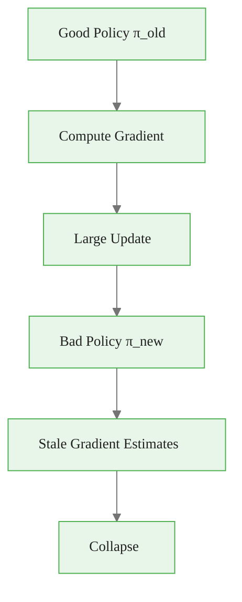
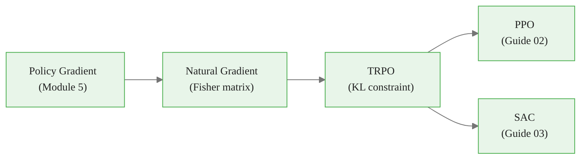

<!-- _class: lead -->

# Trust Region Policy Optimization

**Module 07 — Advanced Policy Optimization**

> Large policy updates can be catastrophic and irreversible. Trust region methods constrain how far a policy can move per update — measured in the space of distributions, not parameters.

<!--
Speaker notes: Welcome to the first guide of Module 07. We are moving into the advanced algorithms that power state-of-the-art deep RL systems. TRPO is the theoretical foundation. It was published by Schulman et al. at ICML 2015 and introduced the ideas that led directly to PPO. Ask learners: have they ever seen a policy gradient training run suddenly collapse? That is the problem we solve today.
-->

<!-- Speaker notes: Cover the key points on this slide about Trust Region Policy Optimization. Pause for questions if the audience seems uncertain. -->

---

# The Catastrophic Update Problem

<div class="columns">
<div>

**Plain policy gradient:**

$$\theta \leftarrow \theta + \alpha \nabla_\theta J(\theta)$$

**What can go wrong:**
- Gradient estimated under $\pi_{old}$
- Update applied to $\pi_{new}$
- If $\pi_{new} \gg \pi_{old}$: estimate is stale
- Policy collapses — returns drop to near zero
- Recovery is slow (sometimes impossible)

</div>
<div>



</div>
</div>

<!--
Speaker notes: Show a real training curve where a policy gradient run collapses — reward is high for 1M steps, then drops to near zero and never recovers. This is the concrete problem TRPO was designed to fix. The root cause: the gradient is only accurate near the point where it was computed. Move too far and the gradient points the wrong direction entirely.
-->


<div class="callout-insight">
<strong>Insight:</strong> This is a key takeaway from this section that connects to the broader course themes.
</div>

<!-- Speaker notes: Cover the key points on this slide about The Catastrophic Update Problem. Pause for questions if the audience seems uncertain. -->

---

# Why Parameter Distance Is the Wrong Metric

Two policies can have very different **parameter** norms but identical **behavior**, or vice versa.

<div class="code-window">
<div class="code-header">
<div class="dots"><span class="dot-red"></span><span class="dot-yellow"></span><span class="dot-green"></span></div>
<span class="filename">example.py</span>
</div>

```python
# Example: same behavior, different parameters
# Softmax with temperature scaling
policy_A = lambda s: softmax(W @ s)          # ||W|| = 10
policy_B = lambda s: softmax(0.1 * W @ s)    # ||W|| = 1  — same argmax!

# Different behavior, same parameter change
# Near a boundary, a tiny weight shift flips the action
```
</div>

**The correct distance measure lives in distribution space.**

$$\text{Parameter distance: } \|\theta_{new} - \theta_{old}\|_2 \quad \leftarrow \text{ wrong}$$

$$\text{Distribution distance: } D_{KL}(\pi_{old} \,\|\, \pi_{new}) \quad \leftarrow \text{ correct}$$

<!--
Speaker notes: This is the key geometric insight. The Euclidean distance between parameter vectors does not measure behavioral change. A ReLU network near a zero boundary can flip every action with an infinitesimally small weight change. KL divergence, by contrast, measures exactly what we care about: how differently the two policies behave across all states.
-->


<div class="callout-key">
<strong>Key Point:</strong> Remember this concept — it appears repeatedly in later modules.
</div>

<!-- Speaker notes: Cover the key points on this slide about Why Parameter Distance Is the Wrong Metric. Pause for questions if the audience seems uncertain. -->

---

# KL Divergence as Policy Distance

**KL divergence** measures information lost when approximating $\pi_{old}$ with $\pi_{new}$:

$$D_{KL}(\pi_{old} \,\|\, \pi_{new}) = \mathbb{E}_{a \sim \pi_{old}}\!\left[\log \frac{\pi_{old}(a|s)}{\pi_{new}(a|s)}\right]$$

For policy optimization, average over the state distribution $d^{\pi_{old}}$:

$$\overline{D}_{KL}(\pi_{old} \,\|\, \pi_{new}) = \mathbb{E}_{s \sim d^{\pi_{old}}}\!\left[D_{KL}(\pi_{old}(\cdot|s) \,\|\, \pi_{new}(\cdot|s))\right]$$

**Key properties:**
| Property | Value |
|---|---|
| $D_{KL}(p \| p)$ | $= 0$ (identical policies) |
| $D_{KL}(p \| q)$ | $\geq 0$ always |
| Symmetric? | No: $D_{KL}(p\|q) \neq D_{KL}(q\|p)$ |

<!--
Speaker notes: Walk through the formula. The expectation under pi_old matters: we are measuring how surprised pi_old would be if it observed actions sampled from pi_new. Note asymmetry: the direction matters. TRPO uses D_KL(pi_old || pi_new) with the old policy in the reference position. This is called forward KL or I-projection and tends to produce mean-seeking behavior.
-->


<div class="callout-warning">
<strong>Warning:</strong> This is a common source of confusion. Pay close attention to the distinction here.
</div>

<!-- Speaker notes: Cover the key points on this slide about KL Divergence as Policy Distance. Pause for questions if the audience seems uncertain. -->

---

# The TRPO Objective

**Schulman et al., 2015 — ICML**

$$\max_\theta \; L(\theta) = \mathbb{E}\!\left[\frac{\pi_\theta(a|s)}{\pi_{\theta_{old}}(a|s)} \hat{A}(s,a)\right]$$

$$\text{subject to} \quad \mathbb{E}\!\left[D_{KL}\!\left(\pi_{\theta_{old}} \,\|\, \pi_\theta\right)\right] \leq \delta$$

**Components:**

| Symbol | Meaning |
|---|---|
| $\pi_\theta(a\|s) / \pi_{\theta_{old}}(a\|s)$ | Importance ratio — how much more/less likely the new policy is |
| $\hat{A}(s,a)$ | Advantage estimate — how good action $a$ is vs. average |
| $\delta$ | Trust region radius (typically $0.01$) |

<!--
Speaker notes: This is the core TRPO formulation. The objective maximizes a weighted advantage sum — importance weighting corrects for the fact that data was collected under pi_old but we are evaluating pi_new. The constraint keeps this reweighting valid by bounding how far pi_new strays from pi_old. When ratio = 1 everywhere, the constraint is trivially satisfied and we have not changed the policy at all. When ratio deviates from 1, we must check the KL.
-->


<div class="callout-info">
<strong>Info:</strong> This detail is useful context but not required to memorize.
</div>

<!-- Speaker notes: Cover the key points on this slide about The TRPO Objective. Pause for questions if the audience seems uncertain. -->

---

# The Fisher Information Matrix

Standard gradient descent is blind to the curvature of the distribution manifold.

**Fisher information matrix** captures this curvature:

$$F(\theta) = \mathbb{E}_{\pi_\theta}\!\left[\nabla_\theta \log \pi_\theta(a|s) \; \nabla_\theta \log \pi_\theta(a|s)^\top\right]$$

**Natural policy gradient** corrects for manifold geometry:

$$\theta \leftarrow \theta + \alpha \, F(\theta)^{-1} \nabla_\theta J(\theta)$$

**Why it matters:**

```
Euclidean gradient:  treats all parameter directions equally
Natural gradient:    weights directions by how much they change behavior
                     — small parameter change in "sensitive" direction
                       → large behavioral change → large F weighting
                       → small effective step size in that direction
```

<!--
Speaker notes: The Fisher matrix is the Hessian of the KL divergence at zero. It tells us, for each direction in parameter space, how much a unit step changes the policy distribution. The natural gradient pre-multiplies by F_inverse, which shrinks steps in sensitive directions and amplifies steps in insensitive ones. TRPO is essentially constrained natural gradient descent — the constraint radius delta determines the step size.
-->

<!-- Speaker notes: Cover the key points on this slide about The Fisher Information Matrix. Pause for questions if the audience seems uncertain. -->

---

# Practical Optimization: Conjugate Gradient

Direct inversion $F^{-1}$ is infeasible: $O(d^2)$ memory, $O(d^3)$ compute for $d$ parameters.

**Conjugate Gradient (CG)** solves $Fx = g$ without forming $F$:

<div class="code-window">
<div class="code-header">
<div class="dots"><span class="dot-red"></span><span class="dot-yellow"></span><span class="dot-green"></span></div>
<span class="filename">example.py</span>
</div>

```python
def conjugate_gradient(Fv, b, n_iters=10):
    """Solve Fx = b using only matrix-vector products."""
    x, r, p = zeros_like(b), b.clone(), b.clone()
    r_dot = (r * r).sum()
    for _ in range(n_iters):
        Ap = Fv(p)                          # one F*v product
        alpha = r_dot / (p * Ap).sum()
        x += alpha * p
        r -= alpha * Ap
        new_r_dot = (r * r).sum()
        p = r + (new_r_dot / r_dot) * p    # conjugate direction
        r_dot = new_r_dot
    return x
```
</div>

**Each $Fv$ product requires two backward passes** — one for the KL gradient, one for the Jacobian-vector product. With 10 CG iterations, that is 20 backward passes per TRPO update.

<!--
Speaker notes: The CG trick is what makes TRPO computationally tractable. Instead of storing and inverting the N-by-N Fisher matrix (where N can be millions of parameters), CG only needs to compute F times a vector. This can be done efficiently with PyTorch's autograd by computing a Jacobian-vector product on the KL gradient. Still expensive — roughly 20x a plain gradient step — but not astronomically so.
-->

<!-- Speaker notes: Cover the key points on this slide about Practical Optimization: Conjugate Gradient. Pause for questions if the audience seems uncertain. -->

---

# Backtracking Line Search

After computing the natural gradient step direction $x = F^{-1}g$:

$$\text{step size} = \sqrt{\frac{2\delta}{x^\top F x}}$$

Then **backtrack** to find the largest step that satisfies both conditions:

```
for i = 0, 1, 2, ..., max_iters:
    candidate_params = old_params + backtrack_coeff^i * full_step
    if KL(pi_old || pi_new) <= delta AND surrogate_improved:
        accept and return
revert to old_params   # safety fallback
```

**Why backtracking is necessary:**
The CG solution is only an approximation of $F^{-1}g$. The constraint may be violated for the full step. The line search finds the largest safe fraction.

<!--
Speaker notes: The line search is a safety net for the approximation errors in CG. In practice, about 80% of updates are accepted at full step size (exponent 0). When many backtrack steps are needed, it often signals that delta is too large or the advantage estimates are noisy. Monitor the number of backtrack steps as a diagnostic.
-->

<!-- Speaker notes: Cover the key points on this slide about Backtracking Line Search. Pause for questions if the audience seems uncertain. -->

---

# TRPO Algorithm Summary

```
Algorithm: TRPO (Schulman et al., 2015)

Repeat:
  1. Collect trajectories under current policy π_θ_old
  2. Compute advantage estimates Â(s,a) for all transitions
  3. Normalize advantages: Â ← (Â - mean(Â)) / std(Â)
  4. Compute gradient g = ∇_θ L(θ)|_{θ_old}
  5. Use conjugate gradient to compute x = F⁻¹g  (10 iters)
  6. Compute step size: β = sqrt(2δ / xᵀFx)
  7. Backtracking line search to find largest safe fraction
  8. Update: θ_new = θ_old + α * x   (α from line search)
Until convergence
```

**Hyperparameters:**
| Parameter | Typical Value |
|---|---|
| $\delta$ (KL constraint) | $0.01$ |
| CG iterations | $10$ |
| Backtrack coefficient | $0.8$ |
| Max backtrack steps | $10$ |

<!--
Speaker notes: Walk through the algorithm step by step. Emphasize that steps 5-7 are what makes TRPO expensive but safe. The gradient in step 4 is the same vanilla policy gradient you compute in any PG algorithm. Steps 5-7 transform it into a natural gradient with guaranteed KL constraint satisfaction.
-->

<!-- Speaker notes: Cover the key points on this slide about TRPO Algorithm Summary. Pause for questions if the audience seems uncertain. -->

---

# Monotonic Improvement Guarantee

TRPO is motivated by a theoretical bound from Kakade & Langford (2002):

$$J(\pi_{new}) \geq J(\pi_{old}) - \frac{4\epsilon\gamma}{(1-\gamma)^2} \overline{D}_{KL}(\pi_{old}, \pi_{new})$$

where $\epsilon = \max_{s,a} |A^{\pi_{old}}(s,a)|$.

**Implication:** If the KL is small enough, the surrogate objective $L(\theta)$ lower bounds the true objective $J(\theta)$. Maximizing $L$ with a KL constraint guarantees the true objective does not decrease.

**Conditions required:**
- Advantage estimates are accurate
- KL constraint is enforced exactly
- Sufficient data for reliable estimates

<!--
Speaker notes: This is the theorem that justifies TRPO's design. The lower bound says: if I maximize L subject to KL <= delta, and delta is small enough that the penalty term is smaller than the L improvement, then J cannot decrease. In practice the theoretical bound requires very small delta to be tight — practitioners use delta=0.01 which is tighter than theory requires but avoids instability.
-->

<!-- Speaker notes: Cover the key points on this slide about Monotonic Improvement Guarantee. Pause for questions if the audience seems uncertain. -->

---

# TRPO: When It Works and When It Doesn't

<div class="columns">
<div>

**TRPO works well when:**
- Advantage estimates are low-variance
- Episodes are long (good return signal)
- Action space is discrete or low-dimensional continuous
- Compute budget allows 20+ backward passes per step

</div>
<div>

**TRPO struggles when:**
- Very high-dimensional action spaces (large FVP cost)
- Sparse rewards (poor advantage estimates)
- Extremely deep networks (CG convergence slow)
- Wall-clock time is critical (PPO is 10x faster)

</div>
</div>

**Historical context:**
- 2015: TRPO published, state-of-the-art on MuJoCo locomotion
- 2017: PPO published, replaces TRPO in most applications
- Today: TRPO is a reference algorithm; PPO is the default choice

<!--
Speaker notes: TRPO is rarely used in new projects today, but understanding it is essential for understanding why PPO is designed the way it is. Every design choice in PPO is a simplification of one part of TRPO. The clipping objective approximates the KL constraint. Multiple epochs approximate the line search. Knowing TRPO makes you a much better PPO practitioner.
-->

<!-- Speaker notes: Cover the key points on this slide about TRPO: When It Works and When It Doesn't. Pause for questions if the audience seems uncertain. -->

---

# Common Pitfalls

**1. KL constraint direction reversed**
Constraint is $D_{KL}(\pi_{old} \| \pi_{new})$, not $D_{KL}(\pi_{new} \| \pi_{old})$.
These are numerically different and produce different behaviors.

**2. Advantages not normalized**
Un-normalized advantages scale the effective step size. Always normalize per batch to mean 0, variance 1.

**3. Too few CG iterations**
With fewer than 5 iterations, the natural gradient direction is inaccurate. Use 10+ and monitor residual.

**4. FVP computed with detached graph**
The Fisher-vector product requires second-order gradients through the KL. Detaching the KL gradient kills the computation graph.

**5. Backtracking never triggers**
If line search always accepts at full step, delta may be too large. Monitor accepted KL values alongside the constraint.

<!--
Speaker notes: Pitfall 4 is the most common implementation bug. When you compute the KL gradient and then call .detach() on it before the second backward pass, you get garbage. The FVP requires that the KL computation graph remains intact for the Jacobian-vector product. If your KL values are exploding or the line search always fails, this is the first thing to check.
-->

<!-- Speaker notes: Cover the key points on this slide about Common Pitfalls. Pause for questions if the audience seems uncertain. -->

---

# Summary and Connections

**TRPO in one sentence:** Maximize the importance-weighted advantage subject to a hard KL constraint, solved via conjugate gradient + line search.



**Key equations:**
- Objective: $L(\theta) = \mathbb{E}\!\left[\frac{\pi_\theta(a|s)}{\pi_{\theta_{old}}(a|s)} \hat{A}(s,a)\right]$
- Constraint: $\mathbb{E}[D_{KL}(\pi_{\theta_{old}} \| \pi_\theta)] \leq \delta$
- Update: $\theta \leftarrow \theta + \alpha F^{-1} \nabla J(\theta)$

**Next:** PPO replaces the hard constraint with a clipped objective — same idea, 10x simpler.

<!--
Speaker notes: Wrap up by connecting TRPO to the module arc. TRPO solved the catastrophic update problem rigorously but at high computational cost. PPO in Guide 02 achieves the same goal with a much simpler mechanism. SAC in Guide 03 approaches stability from a completely different angle — entropy maximization rather than constraint satisfaction. All three algorithms are worth knowing; they dominate modern RL benchmarks.
-->

<!-- Speaker notes: Cover the key points on this slide about Summary and Connections. Pause for questions if the audience seems uncertain. -->
