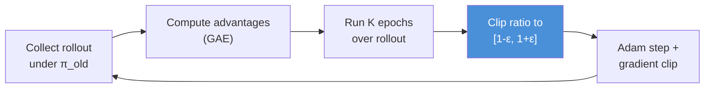

<!-- _class: lead -->

# Proximal Policy Optimization (PPO)

**Module 07 — Advanced Policy Optimization**

> PPO achieves TRPO-level stability with a single line of code: clip the importance ratio. No conjugate gradient. No line search. No second-order matrices. Just Adam and a clamp.

<!--
Speaker notes: This is the algorithm that runs most of modern deep RL. PPO powers OpenAI Five, is the default in Stable-Baselines3, and is used to fine-tune large language models via RLHF. Published by Schulman et al. in 2017, two years after TRPO, it replaced TRPO almost immediately in practice. Today we will understand exactly why — both the mechanism and the limitations.
-->

---

# TRPO's Cost: What We Are Eliminating

**TRPO per update requires:**
- ~20 backward passes (conjugate gradient)
- ~10 forward passes (line search)
- Full gradient stored in memory throughout

**PPO per update requires:**
- 1 backward pass per mini-batch
- Standard Adam optimizer
- No constraint solver

**Same idea, different implementation:**
- TRPO: hard KL constraint → exact enforcement via CG + line search
- PPO: soft constraint → approximate enforcement via clipping

<!--
Speaker notes: Before diving into PPO's mechanics, ground it in what problem it solves relative to TRPO. If learners implemented or ran TRPO in the previous section, they experienced its slowness. A TRPO step on a typical MuJoCo environment takes roughly 30 seconds on a CPU. A PPO step takes about 1 second. For the same wall-clock training budget, PPO runs 30x as many gradient updates, which translates directly to better sample efficiency in practice.
-->

---

# The Probability Ratio

PPO centers on a single quantity: **how much more or less likely is the current policy to take action $a_t$ compared to when data was collected?**

$$r_t(\theta) = \frac{\pi_\theta(a_t|s_t)}{\pi_{\theta_{old}}(a_t|s_t)} = \exp\!\left(\log \pi_\theta(a_t|s_t) - \log \pi_{\theta_{old}}(a_t|s_t)\right)$$

| $r_t(\theta)$ | Interpretation |
|---|---|
| $= 1$ | Policy unchanged for this transition |
| $> 1$ | New policy finds this action more likely |
| $< 1$ | New policy finds this action less likely |
| $= 2$ | New policy is twice as likely to take $a_t$ |
| $= 0.5$ | New policy is half as likely to take $a_t$ |

Without clipping: $r_t \hat{A}_t$ is TRPO's unclipped objective.

<!--
Speaker notes: Ratio computation in log space is numerically superior — you subtract log probabilities rather than dividing raw probabilities, which avoids underflow for very small probabilities. Note that when theta equals theta_old exactly, all ratios are 1 and the objective equals the mean advantage — same as REINFORCE. As theta changes, ratios deviate from 1 and importance weighting corrects for the distribution shift.
-->

---

# The PPO-Clip Objective

**Schulman et al., 2017 — arXiv:1707.06347**

$$L^{CLIP}(\theta) = \mathbb{E}_t\!\left[\min\!\left(r_t(\theta)\hat{A}_t,\; \text{clip}(r_t(\theta),\, 1-\epsilon,\, 1+\epsilon)\,\hat{A}_t\right)\right]$$

**What each term does:**

| Term | Role |
|---|---|
| $r_t(\theta)\hat{A}_t$ | Unclipped: would keep pushing policy if no limit |
| $\text{clip}(r_t, 1-\epsilon, 1+\epsilon)\hat{A}_t$ | Clipped: stops at boundary |
| $\min(\cdot, \cdot)$ | Always takes the pessimistic (lower) bound |

**Why min?** It ensures the objective never rewards a policy update that has already moved outside the safe region.

<!--
Speaker notes: Spend time on the min. Both terms equal each other when r_t is inside [1-eps, 1+eps]. When r_t exceeds 1+eps with positive advantage, the clipped term is smaller — so min picks it, zeroing the gradient. When r_t is below 1-eps with negative advantage, the clipped term is again smaller — min picks it, zeroing the gradient. The min ensures that in every direction that would make the policy "more extreme," the gradient is zero beyond the clip boundary.
-->

---

# Clip Behavior: Positive Advantage

**Scenario:** Action $a_t$ was good ($\hat{A}_t > 0$). We want to make it more likely.

```
L^CLIP
  |
  |          ______ (clipped — gradient = 0 here)
  |         /
  |        /  slope = Â_t
  |       /
  |______/
  |
  +------+--+--+-----------> r_t(θ)
         0 1-ε 1 1+ε

  ↑                ↑
  ratio too small  ratio at clip boundary
  (policy moved    (no more gradient reward
   away from good   for increasing ratio)
   action)
```

**Effect:** The policy increases the probability of $a_t$ up to $1+\epsilon$ times the old probability, then stops. Gradient is zero for larger ratios.

<!--
Speaker notes: Draw this on the whiteboard if possible. The flat region beyond 1+epsilon is the key. A standard policy gradient would keep increasing the ratio as long as the advantage is positive — potentially making the ratio 100x or 1000x the original, which would completely change the policy. PPO stops the gradient at 1+epsilon, saying: you have already captured the full benefit of this good action, no need to go further this update.
-->

---

# Clip Behavior: Negative Advantage

**Scenario:** Action $a_t$ was bad ($\hat{A}_t < 0$). We want to make it less likely.

```
L^CLIP
  |
  |  (clipped — gradient = 0 here)
  |___
  |   \
  |    \  slope = Â_t (negative)
  |     \
  |      \________
  |
  +--+--+-+-----------> r_t(θ)
     1-ε 1 1+ε

  ↑
  ratio at clip boundary
  (no more gradient for
   decreasing ratio)
```

**Effect:** The policy decreases the probability of $a_t$ down to $1-\epsilon$ times the old probability, then stops.

<!--
Speaker notes: This is the symmetric case. For a bad action, we want to reduce its probability. The ratio falls below 1. When it hits 1-epsilon, the clipped and unclipped terms equalize and the gradient goes to zero. The policy has already "penalized" this action enough — reducing its probability by epsilon from the old policy. Both the positive and negative cases enforce the same trust region: ratio stays in [1-epsilon, 1+epsilon].
-->

---

# Full PPO Objective

In practice, PPO trains a **combined actor-critic** with three components:

$$L^{PPO}(\theta) = L^{CLIP}(\theta) - c_1 L^{VF}(\theta) + c_2 \mathcal{H}[\pi_\theta](\cdot|s_t)$$

<div class="columns">
<div>

**Policy term** $L^{CLIP}$:
- Clipped importance ratio objective
- Drives policy improvement

**Value term** $L^{VF}$:
- MSE of value predictions vs returns
- $L^{VF} = (V_\theta(s_t) - V_t^{targ})^2$
- Coefficient $c_1 \approx 0.5$

</div>
<div>

**Entropy term** $\mathcal{H}$:
- Entropy of the policy distribution
- Encourages exploration
- Prevents premature determinism
- Coefficient $c_2 \approx 0.01$

**Signs:** maximize $L^{CLIP}$ and $\mathcal{H}$, minimize $L^{VF}$. Combined as: minimize $-L^{PPO}$.

</div>
</div>

<!--
Speaker notes: The value function and entropy terms are often overlooked but are important. The value function loss trains the critic that estimates advantages. Without a good critic, advantage estimates are poor and PPO is unstable. The entropy bonus prevents the policy from collapsing to a deterministic policy too early — if entropy drops to near zero, the policy has stopped exploring and may be stuck in a local optimum.
-->

---

# PPO Implementation Core

```python
def ppo_clip_loss(log_probs_new, log_probs_old, advantages, epsilon=0.2):
    """
    PPO-Clip objective. Sign convention: return negative for minimization.
    """
    # Importance ratio in log space (numerically stable)
    ratio = torch.exp(log_probs_new - log_probs_old)

    # Unclipped surrogate
    surr1 = ratio * advantages

    # Clipped surrogate: ratio constrained to [1-eps, 1+eps]
    surr2 = torch.clamp(ratio, 1.0 - epsilon, 1.0 + epsilon) * advantages

    # Pessimistic bound: take the minimum
    return -torch.min(surr1, surr2).mean()
```

**That is the entire PPO policy loss in 5 lines.**

Compare to TRPO: conjugate gradient solver, Fisher-vector products, backtracking line search — ~300 lines.

<!--
Speaker notes: Show this code on screen and let it sink in. The PPO loss is genuinely this simple. The complexity of TRPO has been collapsed into a single torch.clamp call. Ask learners: where is the trust region enforcement? It is implicit — the clamp is the constraint. When ratio exceeds 1+epsilon, surr2 is smaller than surr1, so min picks surr2, and the gradient with respect to log_probs_new through surr2 is zero because clamp has a zero gradient outside its bounds.
-->

---

# Multiple Epochs: Amortizing Data Collection

PPO collects one batch of experience, then trains for **multiple gradient epochs** over it.

```python
for epoch in range(n_epochs):          # typically 4-10 epochs
    indices = torch.randperm(N)        # shuffle for stochastic gradient

    for start in range(0, N, batch_size):
        idx = indices[start:start + batch_size]

        log_probs_new, values, entropy = model.evaluate(states[idx], actions[idx])

        policy_loss = ppo_clip_loss(log_probs_new, log_probs_old[idx],
                                    advantages[idx], epsilon)
        value_loss  = 0.5 * ((values - returns[idx]) ** 2).mean()
        loss = policy_loss + 0.5 * value_loss - 0.01 * entropy.mean()

        optimizer.zero_grad()
        loss.backward()
        nn.utils.clip_grad_norm_(model.parameters(), 0.5)  # gradient clip
        optimizer.step()
```

**Critical:** `log_probs_old` is computed **once** before the loop and held fixed.

<!--
Speaker notes: The multiple epochs are what distinguish PPO from a simple clipped policy gradient. Each epoch uses the same old_log_probs computed at collection time. As theta changes across epochs, the ratio drifts further from 1. The clipping ensures this drift does not cause harm — the gradient zeros out for transitions where the ratio has already hit the boundary. Monitor approx_kl = mean(log_probs_old - log_probs_new) across epochs; if it exceeds 0.02, stop early.
-->

---

# Generalized Advantage Estimation (GAE)

PPO typically uses GAE (Schulman et al., 2016) for advantage estimates:

$$\hat{A}_t^{GAE(\gamma,\lambda)} = \sum_{l=0}^{\infty} (\gamma\lambda)^l \delta_{t+l}^V$$

where $\delta_t^V = r_t + \gamma V(s_{t+1}) - V(s_t)$ is the TD residual.

```python
def compute_gae(rewards, values, dones, gamma=0.99, lam=0.95):
    """GAE backward pass — O(T) time and memory."""
    T = len(rewards)
    advantages = np.zeros(T, dtype=np.float32)
    gae = 0.0
    for t in reversed(range(T)):
        next_val = values[t + 1] * (1 - dones[t])   # 0 at episode end
        delta = rewards[t] + gamma * next_val - values[t]
        gae = delta + gamma * lam * (1 - dones[t]) * gae
        advantages[t] = gae
    return advantages, advantages + values[:T]       # advantages, returns
```

**$\lambda$ controls bias-variance:** $\lambda=0$ → TD(0); $\lambda=1$ → Monte Carlo.

<!--
Speaker notes: GAE is not specific to PPO — it can be used with any actor-critic algorithm. But PPO almost always uses GAE with lambda=0.95. The intuition: TD(0) has low variance but high bias because the value function is imperfect. MC has low bias but high variance because it sums many random rewards. GAE interpolates: lambda=0.95 means distant TD residuals are down-weighted by 0.95^l, giving a gentle decay that is empirically optimal for most environments.
-->

---

# PPO vs TRPO: Side-by-Side

| Aspect | TRPO | PPO |
|---|---|---|
| Trust region | Hard KL constraint | Clipped ratio |
| Optimizer | CG + line search | Adam |
| Backward passes/step | ~20 | 1 per mini-batch |
| Memory | High (CG vectors) | Low |
| Implementation lines | ~300 | ~100 |
| Monotonic guarantee | Yes (theoretically) | No (empirically stable) |
| MuJoCo performance | Strong | Competitive |
| RLHF fine-tuning | Rarely | Standard |

**Bottom line:** PPO wins on engineering cost. TRPO wins on theoretical guarantees. In practice, PPO is used; TRPO is studied.

<!--
Speaker notes: Engstrom et al. 2020 showed that many of PPO's performance advantages over TRPO come from implementation details like normalization and gradient clipping, not from the clip objective itself. This is actually reassuring: it means that careful implementation of either algorithm produces similar results, and PPO's simpler code base makes it easier to implement correctly.
-->

---

# Hyperparameter Guide

<div class="columns">
<div>

**Clip $\epsilon$:**
- $0.1$ — conservative, fine-tuning
- $0.2$ — default (most envs)
- $0.3$ — aggressive, simple envs

**Epochs:**
- $4$ — safe starting point
- $4{-}10$ — typical range
- $> 10$ — risk of policy drift

**Batch size:**
- $64{-}2048$ — larger = more stable
- Powers of 2 for GPU efficiency

</div>
<div>

**Diagnostics to monitor:**

| Signal | Healthy |
|---|---|
| Approx KL | $< 0.02$ |
| Clip fraction | $0.1{-}0.3$ |
| Policy entropy | Slow decrease |
| Value loss | Decreasing |
| Explained variance | $> 0.5$ |

**Early stopping:** if approx KL $> 0.05$, stop gradient epochs early.

</div>
</div>

<!--
Speaker notes: Hyperparameter tuning for PPO follows a clear hierarchy. First, get the basics right: epsilon=0.2, 4 epochs, batch size 64, LR 3e-4. Then check diagnostics after the first 100 updates. If clip fraction is above 0.5, epsilon or LR is too high. If entropy collapses, increase ent_coef. If value loss is not decreasing, increase vf_coef or add a separate value optimizer. Most PPO failures are diagnosable from these five numbers.
-->

---

# Common Pitfalls

**1. Recomputing "old" log-probs inside the epoch loop**
Store `log_probs_old` before training. Recomputing makes ratio = 1 always — PPO degenerates to vanilla PG.

**2. Normalizing advantages per mini-batch, not per rollout**
Compute mean and std over the full rollout, apply to all mini-batches. Per-mini-batch normalization reintroduces noise.

**3. Forgetting gradient clipping**
`nn.utils.clip_grad_norm_(params, 0.5)` is required. Without it, occasional large batches cause spikes.

**4. Too many epochs with large $\epsilon$**
With $\epsilon=0.3$ and 20 epochs, the policy drifts far from the batch distribution. Monitor approx KL and stop early if $> 0.02$.

**5. Using `terminated` and `truncated` the same way in GAE**
At truncation (time limit), bootstrap with $V(s_T)$, not 0. At termination (episode end), use 0. Gymnasium separates these; use them correctly.

<!--
Speaker notes: Pitfall 1 is the most common PPO bug in student implementations. It is subtle because training appears to work — the policy improves — but it converges slower and is less stable than correct PPO. A quick diagnostic: log the mean absolute ratio deviation from 1 across the rollout. If it is always near 0 after the first epoch, you are recomputing old log probs.
-->

---

# Summary and Connections

**PPO in one sentence:** Replace TRPO's hard KL constraint with clipping the importance ratio, then run Adam for multiple epochs over the same rollout.

$$L^{CLIP}(\theta) = \mathbb{E}_t\!\left[\min\!\left(r_t(\theta)\hat{A}_t,\; \text{clip}(r_t(\theta),\, 1-\epsilon,\, 1+\epsilon)\hat{A}_t\right)\right]$$



**Next:** SAC (Guide 03) approaches stability differently — via entropy maximization rather than ratio clipping. SAC dominates continuous control; PPO is more general.

<!--
Speaker notes: PPO is the workhorse of modern RL. It is simple enough that a competent practitioner can implement it from scratch in a day, yet powerful enough to solve most benchmark tasks. Its main limitation is sample efficiency compared to off-policy algorithms like SAC. Guide 03 shows how entropy regularization provides an alternative route to stable, high-performing policies for continuous action problems.
-->
