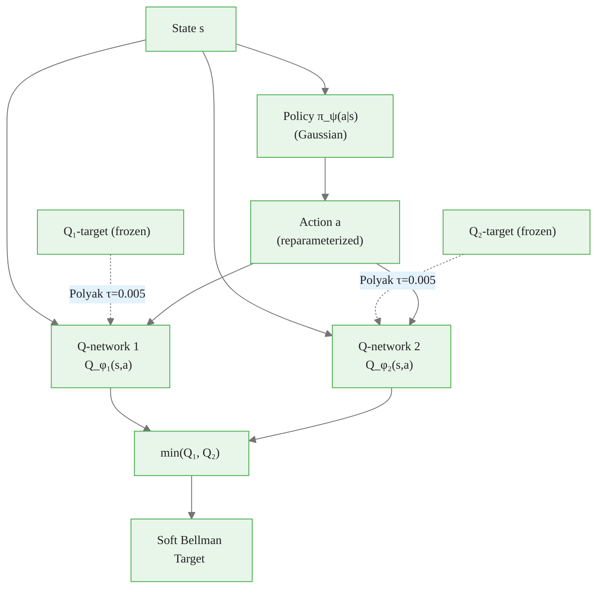
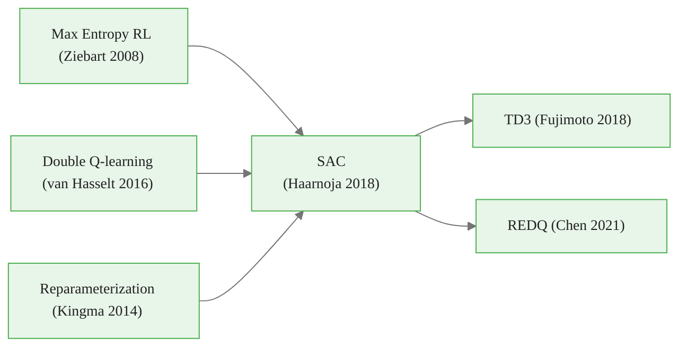

<!-- _class: lead -->

# Soft Actor-Critic (SAC)

**Module 07 — Advanced Policy Optimization**

> What if maximizing reward is not the right objective? Maximum entropy RL says: maximize reward AND stay as random as possible. This single change produces dramatically more robust, sample-efficient policies.

<!--
Speaker notes: SAC represents a fundamentally different philosophy from TRPO and PPO. Those algorithms keep the standard RL objective and add mechanisms to stabilize learning. SAC changes the objective itself — it asks the agent to be maximally uncertain while still collecting good rewards. Published by Haarnoja et al. at ICML 2018, SAC quickly became the state of the art for continuous control tasks like MuJoCo locomotion. Today we understand why entropy regularization works and how SAC's architecture implements it.
-->

<!-- Speaker notes: Cover the key points on this slide about Soft Actor-Critic (SAC). Pause for questions if the audience seems uncertain. -->

---

# The Problem with Standard RL Objectives

**Standard RL:** maximize expected return only

$$J_{standard}(\pi) = \mathbb{E}\!\left[\sum_t \gamma^t r_t\right]$$

**What this produces:**
- Policy converges to near-deterministic behavior
- Commits to one strategy, ignores alternatives
- Brittle: small environment changes cause failure
- Requires careful exploration schedules

**Real locomotion example:**
- Standard policy: one fixed walking gait
- If that gait fails (slope, slippery surface) → falls
- Alternative: maintain multiple valid gaits simultaneously

<!--
Speaker notes: Show the concrete failure mode. A standard DDPG agent trained on HalfCheetah learns one specific running gait. If you add noise to the environment (velocity perturbation, friction change), performance drops sharply. A SAC agent maintains diverse gaits — some faster, some more stable — and switches fluidly. The entropy regularization is what produces this robustness without any explicit multi-strategy training.
-->


<div class="callout-insight">
<strong>Insight:</strong> This is a key takeaway from this section that connects to the broader course themes.
</div>

<!-- Speaker notes: Cover the key points on this slide about The Problem with Standard RL Objectives. Pause for questions if the audience seems uncertain. -->

---

# Maximum Entropy RL: The Core Idea

**Add entropy of the policy at every time step to the objective:**

$$J(\pi) = \sum_{t} \mathbb{E}_{(s_t, a_t) \sim \rho_\pi}\!\left[r(s_t, a_t) + \alpha \mathcal{H}(\pi(\cdot|s_t))\right]$$

Where:
- $\mathcal{H}(\pi(\cdot|s_t)) = -\mathbb{E}_{a \sim \pi}\!\left[\log \pi(a|s_t)\right]$ — Shannon entropy
- $\alpha > 0$ — **temperature**: controls entropy vs. reward tradeoff

**Interpretation:**
- Reward + entropy bonus at every step
- Policy is incentivized to be *unpredictable*
- More randomness = higher entropy bonus
- Unless committing to one action is much more rewarding

<!--
Speaker notes: Walk through the formula carefully. The entropy of a uniform distribution over N actions is log(N) — maximum. The entropy of a deterministic policy (delta function) is 0 — minimum. SAC's objective says: earn the reward bonus AND earn log(N) entropy bonus if all actions are equally good. This pushes the policy toward uniform exploration in states where the Q-function is flat, and toward committed action only where one action is clearly superior.
-->


<div class="callout-key">
<strong>Key Point:</strong> Remember this concept — it appears repeatedly in later modules.
</div>

<!-- Speaker notes: Cover the key points on this slide about Maximum Entropy RL: The Core Idea. Pause for questions if the audience seems uncertain. -->

---

# Entropy as Exploration Mechanism

**Entropy of common distributions:**

| Distribution | Entropy |
|---|---|
| Uniform over $N$ actions | $\log N$ (maximum) |
| Deterministic (one action) | $0$ (minimum) |
| Gaussian $\mathcal{N}(\mu, \sigma^2)$ | $\frac{1}{2}\log(2\pi e \sigma^2)$ |

**How $\alpha$ controls behavior:**

```
α = 0:    Standard RL — maximize reward only, policy goes deterministic
α = 0.01: Slight exploration bonus — small perturbations from optimal
α = 0.2:  Moderate entropy — broad exploration in uncertain states
α = 1.0:  Strong entropy — near-uniform behavior, slow reward learning
```

**Automatic $\alpha$ tuning:** SAC learns $\alpha$ to keep entropy at a target level $\bar{\mathcal{H}}$.

<!--
Speaker notes: The temperature alpha is the most important hyperparameter in SAC, and automatic tuning eliminates the need to set it manually. The target entropy is set to -dim(A) by convention — meaning the policy should be no more certain than a uniform distribution over a unit hypercube. In practice this works remarkably well across diverse tasks without any task-specific tuning.
-->


<div class="callout-warning">
<strong>Warning:</strong> This is a common source of confusion. Pay close attention to the distinction here.
</div>

<!-- Speaker notes: Cover the key points on this slide about Entropy as Exploration Mechanism. Pause for questions if the audience seems uncertain. -->

---

# The Soft Bellman Equations

In the maximum entropy framework, the soft Q-function satisfies:

$$Q^{\pi}(s_t, a_t) = \mathbb{E}\!\left[\sum_{l=0}^{\infty} \gamma^l \bigl(r_{t+l} + \alpha \mathcal{H}(\pi(\cdot|s_{t+l+1}))\bigr)\right]$$

**Soft Bellman backup:**

$$Q^{\pi}(s_t, a_t) = r_t + \gamma \, \mathbb{E}_{s_{t+1}}\!\left[V^{\pi}(s_{t+1})\right]$$

$$V^{\pi}(s_t) = \mathbb{E}_{a_t \sim \pi}\!\left[Q^{\pi}(s_t, a_t) - \alpha \log \pi(a_t|s_t)\right]$$

**Key difference from standard Q:** The value function subtracts $\alpha \log \pi$ — actions with high probability are penalized. The optimal policy at each state is a **Boltzmann distribution** over Q-values:

$$\pi^*(a|s) \propto \exp\!\left(\frac{Q^*(s,a)}{\alpha}\right)$$

<!--
Speaker notes: The soft Bellman equation is the theoretical core of SAC. The V function explicitly subtracts the log-probability of the action — so a deterministic policy (where log_prob = 0 for one action and -inf for others) has the entropy term collapse to 0. This is the mechanism that rewards stochasticity. At convergence, the optimal soft policy is proportional to exp(Q/alpha) — a Boltzmann/softmax distribution that is more spread out when alpha is large.
-->


<div class="callout-info">
<strong>Info:</strong> This detail is useful context but not required to memorize.
</div>

<!-- Speaker notes: Cover the key points on this slide about The Soft Bellman Equations. Pause for questions if the audience seems uncertain. -->

---

# SAC Architecture: Three Networks



**Five networks total:** $Q_{\phi_1}$, $Q_{\phi_2}$, $Q_{\phi_1^-}$, $Q_{\phi_2^-}$, $\pi_\psi$

<!--
Speaker notes: Draw attention to the five-network structure. The two Q-networks and their two target copies handle the double Q-learning and target stability. The single policy network is the actor. SAC has no value network V — it computes V implicitly from the Q-networks: V(s) = E[Q(s,a) - alpha*log_pi(a|s)] under the current policy. This simplifies implementation compared to early SAC versions that had an explicit V network.
-->

<!-- Speaker notes: Cover the key points on this slide about SAC Architecture: Three Networks. Pause for questions if the audience seems uncertain. -->

---

# Double Q-Networks: Controlling Overestimation

**The problem:** A single Q-network overestimates Q-values.

When the Bellman backup uses $\max_a Q(s', a)$ (or in actor-critic, $Q(s', \pi(s'))$), the same network both generates and evaluates actions. Optimization bias causes systematic overestimation.

**Solution: use two independent Q-networks, take the minimum:**

$$Q_{target} = r + \gamma \left[\min(Q_1^-(s', a'), Q_2^-(s', a')) - \alpha \log \pi(a'|s')\right]$$

**Effect:**
- Each Q-network is independently optimized toward a different target
- The minimum is a pessimistic estimate — biases Q-values downward
- Downward bias is safer: underestimating reward causes exploration
- Overestimating reward causes the policy to exploit spurious high-Q regions

<!--
Speaker notes: Double Q-learning was introduced by van Hasselt et al. in 2016 for DQN. SAC extends it to the continuous actor-critic setting. The key insight: if Q1 overestimates in some region, Q2 likely does not (they see different mini-batches and have different initializations). Taking the min of two independently-biased estimates reduces overestimation. The target network further stabilizes learning by preventing the target Q from chasing the online Q.
-->

<!-- Speaker notes: Cover the key points on this slide about Double Q-Networks: Controlling Overestimation. Pause for questions if the audience seems uncertain. -->

---

# Reparameterization Trick

**Problem:** We need $\nabla_\psi \mathbb{E}_{a \sim \pi_\psi}[Q(s,a)]$, but sampling is not differentiable.

**Solution:** Express the sample as a deterministic function of a noise variable:

$$a = \tanh(\mu_\psi(s) + \sigma_\psi(s) \odot \xi), \quad \xi \sim \mathcal{N}(0, I)$$

Now $\nabla_\psi a$ exists — the gradient flows through $\mu_\psi$ and $\sigma_\psi$.

**Why tanh squashing?**
- Most environments have bounded action spaces $[a_{min}, a_{max}]^d$
- Gaussian samples are unbounded
- $\tanh$ maps $\mathbb{R}$ to $(-1, 1)$ — then rescale to environment range

**Jacobian correction for log-probability:**

$$\log \pi(a|s) = \underbrace{\log \mathcal{N}(\tilde{a}; \mu, \sigma)}_{\text{Gaussian log-prob}} - \underbrace{\sum_d \log(1 - \tanh^2(\tilde{a}_d))}_{\text{tanh Jacobian correction}}$$

<!--
Speaker notes: The reparameterization trick is what makes SAC feasible. Without it, you would need to use log-derivative trick (REINFORCE) to estimate the policy gradient, which introduces high variance. Reparameterization reduces variance dramatically by expressing the gradient as an expectation over a fixed noise distribution rather than a policy-dependent one. The tanh Jacobian correction is a common source of bugs — if you forget it, the log-prob is wrong and alpha tuning destabilizes.
-->

<!-- Speaker notes: Cover the key points on this slide about Reparameterization Trick. Pause for questions if the audience seems uncertain. -->

---

# Automatic Temperature Tuning

Instead of manually setting $\alpha$, SAC treats it as a Lagrange multiplier:

**Constrained objective:** maximize reward subject to entropy $\geq \bar{\mathcal{H}}$

**Dual problem (minimized over $\alpha$):**

$$\min_\alpha \; \mathbb{E}_{a_t \sim \pi_\psi}\!\left[-\alpha \log \pi_\psi(a_t|s_t) - \alpha \bar{\mathcal{H}}\right]$$

**Gradient update for $\alpha$:**

<div class="code-window">
<div class="code-header">
<div class="dots"><span class="dot-red"></span><span class="dot-yellow"></span><span class="dot-green"></span></div>
<span class="filename">example.py</span>
</div>

```python
alpha_loss = -(log_alpha.exp() * (log_probs.detach() + target_entropy)).mean()
alpha_optimizer.zero_grad()
alpha_loss.backward()
alpha_optimizer.step()
alpha = log_alpha.exp().item()
```
</div>

**Self-correcting behavior:**
- Entropy too low → $\alpha$ increases → more entropy bonus → policy explores more
- Entropy too high → $\alpha$ decreases → less entropy bonus → policy commits more

<!--
Speaker notes: Automatic temperature tuning is one of SAC's most useful practical features. The target entropy minus dim(A) corresponds roughly to a policy that is no more certain than uniformly random, which is a reasonable lower bound on exploration. In practice, this heuristic works for most continuous control tasks without modification. Note that log_alpha is the learned parameter — using log-space ensures alpha stays positive.
-->

<!-- Speaker notes: Cover the key points on this slide about Automatic Temperature Tuning. Pause for questions if the audience seems uncertain. -->

---

# SAC Training Loop

<div class="code-window">
<div class="code-header">
<div class="dots"><span class="dot-red"></span><span class="dot-yellow"></span><span class="dot-green"></span></div>
<span class="filename">example.py</span>
</div>

```python
agent = SACAgent(obs_dim=17, act_dim=6)   # e.g., HalfCheetah-v4

for step in range(total_steps):
    # 1. Collect one transition
    action = agent.select_action(state)
    next_state, reward, terminated, truncated, _ = env.step(action)
    done = terminated or truncated
    agent.replay_buffer.push(state, action, reward, next_state, float(done))
    state = env.reset()[0] if done else next_state

    # 2. Update networks (once per environment step)
    if len(agent.replay_buffer) > 1000:     # warm-up period
        diagnostics = agent.update()

    # 3. Log diagnostics every N steps
    if step % 1000 == 0 and diagnostics:
        print(f"Step {step} | Q1: {diagnostics['q1_loss']:.3f} | "
              f"Policy: {diagnostics['policy_loss']:.3f} | "
              f"α: {diagnostics['alpha']:.4f} | "
              f"H: {diagnostics['entropy']:.3f}")
```
</div>

**Key difference from PPO:** SAC updates **once per environment step**, using off-policy data from the replay buffer. No rollout batches required.

<!--
Speaker notes: The 1:1 ratio of environment steps to gradient steps is standard for SAC. Some papers explore higher update ratios (e.g., 10 gradient steps per env step) for better sample efficiency at the cost of more compute. The warm-up period of 1000 steps before updating is important — updating on a near-empty buffer causes severe overfitting to the first few transitions. Use 1000 or batch_size * 4 as a minimum, whichever is larger.
-->

<!-- Speaker notes: Cover the key points on this slide about SAC Training Loop. Pause for questions if the audience seems uncertain. -->

---

# SAC vs PPO: Decision Guide

<div class="columns">
<div>

**Choose SAC when:**
- Continuous action spaces
- Sample efficiency critical
  (real hardware, expensive sim)
- Want automatic exploration
- MuJoCo / robotics tasks
- 1M+ step training budget

**SAC typical results:**
- Ant-v4: ~5000 return @ 1M steps
- HalfCheetah-v4: ~11000 @ 1M steps
- Humanoid-v4: ~5500 @ 3M steps

</div>
<div>

**Choose PPO when:**
- Discrete action spaces (Atari)
- Parallel environment rollouts available
- Simpler implementation preferred
- RLHF / LLM fine-tuning
- Moderate episode lengths (< 1000 steps)

**PPO typical results:**
- Atari (57 games): superhuman on ~30
- MuJoCo: slightly below SAC at same steps
- Faster wall-clock with parallel envs

</div>
</div>

<!--
Speaker notes: This is the practical decision guide. For continuous control with expensive simulation (e.g., real robot time, costly physics sim), SAC's sample efficiency advantage is decisive. For discrete action problems or when you have many parallel environments (vectorized gym), PPO's simplicity and scalability wins. In research contexts, both are often evaluated to establish fair baselines.
-->

<!-- Speaker notes: Cover the key points on this slide about SAC vs PPO: Decision Guide. Pause for questions if the audience seems uncertain. -->

---

# Common Pitfalls

**1. Replay buffer too small**
Buffer $< 100$K causes overfitting to recent experience. Use 1M transitions (default). Most memory allows it — 1M transitions of 17-dim obs, 6-dim action ≈ 200MB.

**2. Forgetting tanh Jacobian correction**
Subtract $\sum_d \log(1 - \tanh^2(\tilde{a}_d))$ from log-prob. Without it, alpha tuning diverges.

**3. Target entropy wrong sign or magnitude**
Use $\bar{\mathcal{H}} = -\dim(\mathcal{A})$ for continuous actions. Not $+\dim(\mathcal{A})$. Positive target entropy is valid but requires much higher $\alpha$.

**4. Target network $\tau$ too large**
$\tau = 0.005$ means 99.5% of old, 0.5% of new. Values like $\tau = 0.1$ destabilize Q-targets and cause Q-value divergence.

**5. Action not rescaled from $(-1,1)$ to environment range**
SAC outputs in $(-1,1)^d$ due to tanh. Always: `a_env = low + 0.5*(a+1)*(high-low)`.

<!--
Speaker notes: Pitfall 2 and 5 are the two bugs that most commonly produce silent failures — training appears to run, loss numbers look reasonable, but performance is much worse than expected. Always verify the log-prob computation against a numerical check: compute log-prob two ways (manual formula and PyTorch distribution with transform) and confirm they match within 1e-5 on a test batch.
-->

<!-- Speaker notes: Cover the key points on this slide about Common Pitfalls. Pause for questions if the audience seems uncertain. -->

---

# Summary and Connections

**SAC in one sentence:** Off-policy actor-critic that maximizes reward plus policy entropy, with double Q-networks for stability and automatic temperature tuning.

**The three key ideas:**

| Idea | Mechanism | Benefit |
|---|---|---|
| Max entropy objective | $r + \alpha \mathcal{H}(\pi)$ at every step | Exploration, robustness |
| Double Q-networks | $\min(Q_1, Q_2)$ for targets | Overestimation control |
| Reparameterization | $a = \tanh(\mu + \sigma\xi)$ | Low-variance policy gradient |



<!--
Speaker notes: Close by emphasizing SAC's position in the algorithm family tree. It synthesizes maximum entropy RL theory, double Q-learning stability techniques, and VAE-style reparameterization. Each ingredient solves a specific problem. Understanding why each is needed makes SAC much easier to debug and extend. The cheatsheet in this module consolidates all three algorithms for quick reference.
-->

<!-- Speaker notes: Cover the key points on this slide about Summary and Connections. Pause for questions if the audience seems uncertain. -->
