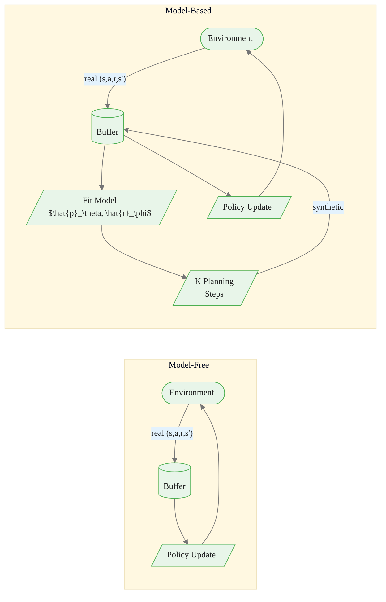

<!-- _class: lead -->

# Model-Based Reinforcement Learning
## Overview and Foundations

Module 8 · Reinforcement Learning

<!-- Speaker notes: Welcome to Module 8. This module introduces the most sample-efficient class of RL algorithms. The central idea is simple: instead of throwing away the structural information in each transition, we fit a model of the environment and use it to generate additional experience for free. Start by asking students: how many real games did AlphaGo need to train? The answer involves a lot of self-play — which is itself a form of model-based planning. -->

---

## Where We Are

```
Module 0: Foundations (MDP, Bellman)
Module 1: Dynamic Programming       ← needs true model
Module 2: Monte Carlo               ← model-free, episodic
Module 3: Temporal Difference       ← model-free, online
Module 4: Function Approximation    ← scaling TD/MC
Module 5: Deep RL (DQN, DDPG)      ← neural function approx
Module 6: Policy Gradients          ← direct policy search
Module 7: Advanced Policy Optim     ← PPO, SAC, trust regions
▶ Module 8: Model-Based RL          ← learn a world model
Module 9: Frontiers
```


<div class="callout-insight">
<strong>Insight:</strong> This is a key takeaway from this section that connects to the broader course themes.
</div>

<!-- Speaker notes: Situate students in the curriculum. Dynamic Programming in Module 1 required the *true* model — transition probabilities p(s'|s,a) and reward function r(s,a). Modules 2–7 deliberately avoided using a model. Module 8 asks: what if we *learn* a model from data? This gives us the planning power of DP combined with the model-free ability to work from experience. -->

---

## The Core Problem: Sample Inefficiency

<div class="columns">

**Model-Free (e.g., SAC)**

- Each transition $(s, a, r, s')$ used ~1–4 times
- Atari DQN: ~200 million frames to human-level
- MuJoCo locomotion: ~1–10 million steps
- Real robot: **prohibitively expensive**

**Model-Based Goal**

- Extract more value from each transition
- Simulate additional experience in the model
- $K$ planning steps per real step
- Demonstrated: $5\times$–$100\times$ fewer real steps

</div>


<div class="callout-key">
<strong>Key Point:</strong> Remember this concept — it appears repeatedly in later modules.
</div>

<!-- Speaker notes: Ground the motivation in real numbers. 200 million Atari frames at 60 fps is about 38 days of real play. A physical robot arm doing 1 million grasping attempts at 1 attempt/second takes 11 days — and motors wear out. The model-based promise is dramatic: MBPO achieves HalfCheetah performance matching 1 million SAC steps with only ~30k real steps. -->

---

## What Is a Model?

A **learned model** approximates the true environment dynamics:

$$\hat{p}_\theta(s' \mid s, a) \approx p(s' \mid s, a)$$

$$\hat{r}_\phi(s, a) \approx \mathbb{E}[R_{t+1} \mid S_t = s, A_t = a]$$

Fitted by supervised learning on collected transitions $\mathcal{D} = \{(s_i, a_i, r_i, s'_i)\}$

| Component | Predicts | Parameterization |
|-----------|----------|-----------------|
| Transition model $\hat{p}_\theta$ | Next state $s'$ | MLP, ensemble, GP |
| Reward model $\hat{r}_\phi$ | Reward $r$ | MLP, linear |


<div class="callout-warning">
<strong>Warning:</strong> This is a common source of confusion. Pay close attention to the distinction here.
</div>

<!-- Speaker notes: Emphasize that the model is just supervised learning — regression from (s,a) to (s', r). There is nothing RL-specific about the model training step itself. The magic is in how you then *use* the model. Also note the two components: some algorithms learn only the transition model (when reward is known) and some need both. -->

---

## Planning: Using the Model

**Planning** = compute or improve a policy using model queries, without real interaction

```
for k in range(K_planning_steps):
    s, a = sample_from_buffer()          # real past experience
    s_prime, r = model.predict(s, a)     # imagined transition
    Q[s, a] ← Q[s, a] + α[r + γ max Q[s_prime, :] - Q[s, a]]
```

Each imagined transition is a **free** Q-learning update.

$K = 50$ planning steps per real step → effectively $50\times$ more data


<div class="callout-info">
<strong>Info:</strong> This detail is useful context but not required to memorize.
</div>

<!-- Speaker notes: This pseudocode is essentially Dyna-Q, which we will study in detail in Guide 02. The key point is that after collecting one real transition, we can spin the model K times to get K synthetic transitions for Q-updates. The cost is only compute — no additional environment interaction. Walk through the loop: we sample a past (s,a) pair, query the model for the predicted next state and reward, and run a standard Q-learning update on that imaginary transition. -->

---

## Model-Free vs Model-Based Pipeline



<!-- Speaker notes: Draw attention to the extra feedback loop in the model-based pipeline: real data fits the model, the model generates synthetic data, synthetic data augments the buffer, and the policy trains on the augmented buffer. The real environment is still there — the model supplements but does not replace it. This is the Dyna architecture. An alternative is to use the model purely offline for planning at decision time (MCTS style), which we cover in Guide 02. -->

---

## Sample Efficiency Advantage: The Math

**Model-free:** 1 Q-update per 1 real transition

**Model-based:** $K+1$ Q-updates per 1 real transition

Effective sample multiplier: $K + 1$

**Empirical results (continuous control):**

| Algorithm | Real Steps to Solve HalfCheetah |
|-----------|--------------------------------|
| SAC (model-free) | ~1,000,000 |
| MBPO (model-based) | ~30,000 |
| Sample ratio | $\approx 33\times$ |

<!-- Speaker notes: The $K+1$ multiplier is an upper bound — synthetic data quality degrades as the model becomes inaccurate. In practice, the effective multiplier is lower, but even $10\times$ is transformative for expensive environments. Share the MBPO result from Janner et al. 2019 as a concrete benchmark. Note that MBPO uses short rollouts (H=1 to 5 steps) to avoid compounding errors — a lesson we will return to. -->

---

## The Core Challenge: Compounding Errors

A model with 5% per-step error:

| Rollout Length | Approximate Accuracy |
|---------------|----------------------|
| 1 step | 95% |
| 5 steps | 77% |
| 10 steps | 60% |
| 20 steps | 36% |
| 50 steps | 8% |

**Model exploitation:** policy finds actions the model *thinks* are good but aren't

<!-- Speaker notes: This table comes from the simple calculation 0.95^H. Real compounding is often worse because errors interact — a wrong next state feeds into another wrong prediction. Model exploitation is particularly insidious: the policy is literally adversarially attacking your own model, finding its blind spots. This is why model-based RL has been historically harder to get working than model-free RL despite the theoretical sample efficiency advantage. -->

---

## Mitigating Model Error

<div class="columns">

**Short rollouts**
Use model for $H \in [1, 10]$ steps only. Return to real data for longer horizons.
*Used by: MBPO, Dyna-Q*

**Ensemble of models**
Train $M$ independent models. Use disagreement as uncertainty: high disagreement → avoid that region.
*Used by: PETS, MBPO*

**Pessimistic planning**
Penalize states where ensemble disagrees. Prevents policy from seeking out model's blind spots.
*Used by: MOPO, MOReL*

**Latent-space models**
Learn compressed representation. Errors stay bounded in latent space.
*Used by: World Models, MuZero*

</div>

<!-- Speaker notes: Each mitigation addresses a different aspect of the problem. Short rollouts are the simplest and most widely used. Ensemble models give an explicit uncertainty signal — if all 5 models agree on the next state, we trust the prediction; if they disagree, we are in unfamiliar territory. Pessimistic planning extends this to offline RL where exploration is impossible. Latent-space models are covered in Guide 03 and are the most sophisticated approach. -->

---

## Taxonomy: Three Ways to Use a Model

**Category 1: Learn Model → Plan**
Fit model offline, then run planner (MCTS, value iteration, trajectory optimization)

**Category 2: Learn Model to Augment Model-Free**
Standard model-free algorithm + synthetic transitions from the model added to replay buffer
*This is Dyna — most commonly used in practice*

**Category 3: Backpropagate Through the Model**
Differentiable model allows $\nabla_\theta J(\theta)$ through simulated trajectories
*Dreamer, SVG(1), PILCO*

<!-- Speaker notes: These three categories differ in computational structure and applicability. Category 1 is cleanest conceptually but requires fast planning at decision time. Category 2 (Dyna) is the most practical and widely deployed — just add a model and a planning loop to any model-free algorithm. Category 3 is the most data-efficient but requires a differentiable model, which limits applicability to smooth continuous state spaces. -->

---

## Model Parameterizations

| Environment Type | Recommended Model | Why |
|-----------------|-------------------|-----|
| Small discrete | Tabular $\hat{p}$ table | Exact, no approximation error |
| Continuous, smooth | Gaussian MLP | Fast, differentiable |
| Stochastic, multi-modal | Mixture Density Network | Captures multi-modal transitions |
| High uncertainty | Ensemble of MLPs | Explicit uncertainty quantification |
| Image observations | VAE + RNN | Compress, then model in latent space |

<!-- Speaker notes: The choice of model parameterization is as important as the planning algorithm. A deterministic MLP fails on stochastic environments because it will average the modes of the transition distribution, giving a prediction that is probable under neither mode. Mixture density networks or ensembles handle this correctly. For high-dimensional observations like images, directly modeling pixel transitions is impractical — latent space models (Guide 03) are the right tool. -->

---

## When to Use Model-Based RL

**Use model-based RL when:**

- Real environment interactions are expensive (robotics, wet-lab experiments, simulation)
- Environment dynamics are learnable (not fully chaotic or adversarial)
- Sample budget is limited ($< 10^5$ steps)
- You need planning at decision time (safety constraints, multi-step lookahead)

**Prefer model-free when:**

- Simulation is cheap (Atari, MuJoCo with fast sim)
- Dynamics are too complex to model accurately (multi-agent, contact-rich)
- Engineering simplicity is priority

<!-- Speaker notes: This is a practical decision slide. Model-based RL has more moving parts — model training, planning, uncertainty estimation — so the engineering cost is higher. That cost pays off when real environment interactions are expensive. Robotics is the paradigm case: a physical robot takes 1000x more wall-clock time per step than simulation. Drug discovery and materials science are even more extreme — a single wet-lab experiment can take days and cost thousands of dollars. -->

---

## Module 8 Roadmap

| Guide | Topic |
|-------|-------|
| **01 (this guide)** | Overview: what, why, taxonomy |
| **02** | Dyna-Q: the classic MBRL framework + MCTS |
| **03** | World Models and MuZero: deep MBRL |
| **Cheatsheet** | Quick reference: algorithms, formulas, decision guide |

**Notebooks:** Implement Dyna-Q on GridWorld → MCTS on Frozen Lake → World Model on CartPole

<!-- Speaker notes: Preview the module so students know what is coming. Guide 02 covers the two foundational MBRL algorithms — Dyna-Q (1991) and MCTS — that established the core ideas. Guide 03 covers modern deep learning implementations. Emphasize that the notebooks build up progressively: Dyna-Q on a small tabular problem to see the planning benefit clearly, then MCTS, then a neural network world model. -->

---

## Summary: Key Ideas

1. **Model** = learned $\hat{p}(s' \mid s, a)$ and $\hat{r}(s, a)$ fitted from real transitions

2. **Planning** = policy improvement using model queries, no real interaction

3. **Sample efficiency** = $K$ planning steps per real step → up to $K\times$ data efficiency

4. **Core challenge** = model errors compound over long rollouts

5. **Taxonomy** = plan-then-execute | augment model-free | backprop through model

<!-- Speaker notes: Summarize the five points explicitly. Ask students which of the three taxonomy categories they find most natural or surprising. The backpropagation-through-model category often surprises people — the idea that you can compute gradients through a learned simulator of the world is powerful and is at the core of modern algorithms like Dreamer. -->

<div class="flow">
<div class="flow-step mint">Model</div>
<div class="flow-arrow">&#8594;</div>
<div class="flow-step amber">Planning</div>
<div class="flow-arrow">&#8594;</div>
<div class="flow-step blue">Sample efficiency</div>
<div class="flow-arrow">&#8594;</div>
<div class="flow-step lavender">Core challenge</div>
<div class="flow-arrow">&#8594;</div>
<div class="flow-step rose">Taxonomy</div>
</div>

---

## Looking Ahead

**Guide 02:** Dyna-Q and Monte Carlo Tree Search

- Dyna-Q: the original MBRL algorithm (Sutton, 1991)
- $n$ planning steps per real step
- MCTS: selection → expansion → simulation → backpropagation
- AlphaGo, AlphaZero connection

**Key question to keep in mind:** How do we decide *which* model-generated transitions to use for planning — random states, recent states, or something smarter?

<!-- Speaker notes: End with a question that motivates the next guide. The answer involves both the Dyna architecture (random past states) and MCTS (forward-planning from current state). The two approaches complement each other: Dyna improves the value function globally, MCTS improves the decision at the current state. AlphaZero combines both. -->

---

## Further Reading

- **Sutton & Barto Ch. 8** — Planning and Learning with Tabular Methods (primary reference)
- **Moerland et al. (2023)** — "Model-based Reinforcement Learning: A Survey"
- **Janner et al. (2019)** — "When to Trust Your Model: MBPO" (arXiv:1906.08253)
- **Chua et al. (2018)** — "Deep RL in a Handful of Trials: PETS" (arXiv:1805.12114)

<!-- Speaker notes: Point students to Sutton & Barto Chapter 8 as required reading before Guide 02. The survey by Moerland et al. is the best modern taxonomy and covers everything in this module in greater depth. MBPO and PETS are the landmark empirical results that demonstrated model-based RL can match or exceed model-free performance on standard benchmarks. -->
