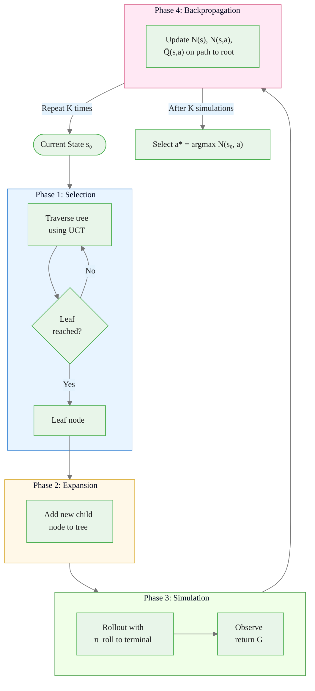

# Dyna-Q and Monte Carlo Tree Search

> **Reading time:** ~17 min | **Module:** 8 — Model-Based RL | **Prerequisites:** Module 5

## In Brief

Dyna-Q (Sutton, 1991) is the foundational algorithm that unifies learning from real experience and planning with a learned model. Monte Carlo Tree Search (MCTS) is the dominant algorithm for lookahead planning in large discrete spaces and the engine behind AlphaGo and AlphaZero. Both methods exploit a model — one implicitly through replay, one explicitly through simulation.

<div class="callout-key">

<strong>Key Concept:</strong> Dyna-Q (Sutton, 1991) is the foundational algorithm that unifies learning from real experience and planning with a learned model. Monte Carlo Tree Search (MCTS) is the dominant algorithm for lookahead planning in large discrete spaces and the engine behind AlphaGo and AlphaZero.

</div>


## Key Insight

Dyna-Q asks: "After each real step, why not run several imagined steps too?" The imagined steps use a tabular model fitted from real transitions and produce additional Q-learning updates at zero environment cost. MCTS asks: "Before acting, why not simulate many futures and pick the action whose subtree looks best?" Both approaches trade compute for fewer real environment interactions.

---


<div class="callout-key">

<strong>Key Point:</strong> Dyna-Q asks: "After each real step, why not run several imagined steps too?" The imagined steps use a tabular model fitted from real transitions and produce additional Q-learning updates at zero envir...

</div>

## Intuitive Explanation: Dyna-Q

A student preparing for an exam:
- **Real experience** (Step 2): work through new practice problems as they encounter them.
- **Model** (Step 3): maintain a mental model of which problem types map to which solution patterns.
- **Planning** (Step 4): drill from memory — re-solve problems already seen, reinforce the solution pattern without doing new problems.

<div class="callout-key">

<strong>Key Point:</strong> A student preparing for an exam:
- **Real experience** (Step 2): work through new practice problems as they encounter them.

</div>


The $n$ parameter controls the ratio of drilling to new problems. $n = 0$ is pure reactive learning; large $n$ is mostly drilling on past experience. The optimal $n$ depends on model accuracy and the cost of new problems.

---


## Formal Definition: Dyna-Q

### Setting

<div class="callout-info">

<strong>Info:</strong> ### Setting

Tabular MDP $(\mathcal{S}, \mathcal{A}, p, r, \gamma)$ with a deterministic learned model $\hat{p}$.

</div>


Tabular MDP $(\mathcal{S}, \mathcal{A}, p, r, \gamma)$ with a deterministic learned model $\hat{p}$. The agent maintains:

- $Q(s, a)$: action-value estimates (initialized to 0)
- $\text{Model}(s, a)$: a table storing $(r, s')$ for each observed $(s, a)$ pair

### Dyna-Q Algorithm (Sutton & Barto, Ch. 8.2)

```
Initialize Q(s, a) = 0 for all s, a
Initialize Model(s, a) = empty for all s, a

Loop (for each real episode step):
  1. [Act] Observe S; choose A ← ε-greedy(Q, S)

  2. [Real update] Execute A; observe R, S'
     Q(S, A) ← Q(S, A) + α[R + γ max_a Q(S', a) - Q(S, A)]

  3. [Model learning] Model(S, A) ← (R, S')   # store transition

  4. [Planning] Repeat n times:
       S̃ ← random previously observed state
       Ã ← random action previously taken in S̃
       R̃, S̃' ← Model(S̃, Ã)
       Q(S̃, Ã) ← Q(S̃, Ã) + α[R̃ + γ max_a Q(S̃', a) - Q(S̃, Ã)]

  S ← S'
```

Steps 1–3 are standard Q-learning. Step 4 is the **planning loop**: $n$ additional Q-updates using model-generated transitions. The two types of updates are identical in form — the only difference is whether $(S, A, R, S')$ came from real experience or the model.

### Effect of Planning Steps $n$

| $n$ (planning steps) | Real steps needed to solve maze | Speedup vs $n=0$ |
|---------------------|--------------------------------|-----------------|
| 0 (pure Q-learning) | ~1,000 | 1× |
| 5 | ~200 | 5× |
| 50 | ~20 | 50× |

Source: Sutton & Barto Figure 8.2 — the Maze example.

---


## Dyna-Q+ for Changing Environments

Standard Dyna-Q assumes the environment is stationary. If the environment changes (e.g., a wall is removed or added), the model becomes stale and planning reinforces outdated beliefs.

<div class="callout-warning">

<strong>Warning:</strong> Standard Dyna-Q assumes the environment is stationary.

</div>


**Dyna-Q+** (Sutton & Barto, Ch. 8.3) adds an exploration bonus that grows with the time since a state-action pair was last tried in the real environment:

$$\tilde{r}(S, A) = r + \kappa\sqrt{\tau(S, A)}$$

where $\tau(S, A)$ is the number of real time steps since $(S, A)$ was last executed, and $\kappa > 0$ is a small bonus coefficient.

**Effect:** Actions that have not been tried recently receive inflated reward estimates. This drives the agent to re-explore parts of the environment that may have changed, preventing the model from becoming permanently stale.

**Practical setting:** $\kappa = 0.001$ to $0.01$. Too large a value over-explores; too small fails to detect changes.

---

## Python Implementation: Dyna-Q


<div class="callout-insight">

The following implementation builds on the approach above:
---
</div>
The following implementation builds on the approach above:



---

## AlphaGo and AlphaZero Connection

Standard MCTS uses a **random rollout policy** for simulation, which is slow and imprecise in complex games like Go (branching factor ≈ 250, game length ≈ 150 moves).

**AlphaGo (Silver et al., 2016)** replaced both the rollout policy and the value estimate with neural networks:

- **Policy network** $p_\sigma(a \mid s)$: guides selection (replaces UCT exploration) and rollouts
- **Value network** $v_\theta(s)$: replaces random rollouts with a direct value estimate at the leaf

The AlphaGo UCT variant:

$$\text{UCT}(s, a) = \bar{Q}(s, a) + c \cdot p_\sigma(a \mid s) \cdot \frac{\sqrt{N(s)}}{1 + N(s, a)}$$

**AlphaZero (Silver et al., 2017)** eliminates separate rollouts entirely — the value network provides all leaf evaluations. The policy and value networks are trained entirely by self-play, with MCTS generating the training data.

**MuZero (Schrittwieser et al., 2020)** further removes the need for a known game simulator — it learns the dynamics model used for MCTS planning. Covered in Guide 03.

---

## Planning vs Learning Trade-Offs

| Dimension | Dyna-Q | MCTS |
|-----------|--------|------|
| **Planning mode** | Background (offline) | Foreground (at decision time) |
| **Model use** | Improve global Q-table | Look ahead from current state |
| **Compute budget** | Fixed $n$ steps/real-step | Flexible: more simulations = better action |
| **Environment type** | Tabular/small continuous | Large discrete, perfect/learned sim |
| **Best suited for** | Sample efficiency during training | High-quality action selection at test time |

The two approaches are complementary. AlphaZero uses both: Dyna-style self-play to improve the value network globally, and MCTS at decision time for high-quality action selection.

---


<div class="compare">
<div class="compare-card">
<div class="header before">Planning</div>
<div class="body">

See detailed comparison in the table above.

</div>
</div>
<div class="compare-card">
<div class="header after">Learning Trade-Offs</div>
<div class="body">

See detailed comparison in the table above.

</div>
</div>
</div>

## Code Snippet: MCTS Core Loop


The following implementation builds on the approach above:

<div class="code-window">
<div class="code-header">
<div class="dots"><span class="dot-red"></span><span class="dot-yellow"></span><span class="dot-green"></span></div>

```python
import math
from dataclasses import dataclass, field
from typing import Optional


@dataclass
class MCTSNode:
    """
    A node in the MCTS search tree.

    Each node corresponds to a state reached by a specific action from its parent.
    """
    state: object
    parent: Optional["MCTSNode"] = None
    parent_action: Optional[int] = None

    visit_count: int = 0
    value_sum: float = 0.0
    children: dict = field(default_factory=dict)   # action -> MCTSNode

    @property
    def q_value(self) -> float:
        """Mean return from this node (exploitation term)."""
        if self.visit_count == 0:
            return 0.0
        return self.value_sum / self.visit_count

    def uct_score(self, c: float = math.sqrt(2)) -> float:
        """
        UCT score used by the parent to select this child.

        Balances exploitation (q_value) and exploration (visit-count ratio).
        Returns infinity if unvisited — unvisited nodes are always expanded first.
        """
        if self.visit_count == 0:
            return float("inf")
        parent_visits = self.parent.visit_count
        exploration = c * math.sqrt(math.log(parent_visits) / self.visit_count)
        return self.q_value + exploration


def mcts_search(root_state, env_simulator, n_simulations: int, c: float = math.sqrt(2)):
    """
    Run MCTS from root_state for n_simulations iterations.

    Args:
        root_state:    Initial state to plan from
        env_simulator: Callable (state, action) -> (next_state, reward, done)
                       and env_simulator.action_space_size -> int
        n_simulations: Number of Selection-Expansion-Simulation-Backprop cycles
        c:             UCT exploration coefficient

    Returns:
        best_action: int — action with highest visit count from root
    """
    root = MCTSNode(state=root_state)
    n_actions = env_simulator.action_space_size

    for _ in range(n_simulations):
        # --- Phase 1: Selection ---
        node = root
        while node.children and len(node.children) == n_actions:
            # All actions expanded — select best UCT child
            node = max(node.children.values(), key=lambda c_: c_.uct_score(c))

        # --- Phase 2: Expansion ---
        # Find an untried action and expand it
        tried_actions = set(node.children.keys())
        untried = [a for a in range(n_actions) if a not in tried_actions]
        if untried:
            action = untried[np.random.randint(len(untried))]
            next_state, reward, done = env_simulator(node.state, action)
            child = MCTSNode(state=next_state, parent=node, parent_action=action)
            node.children[action] = child
            node = child

        # --- Phase 3: Simulation (rollout) ---
        sim_state = node.state
        sim_return = 0.0
        discount = 1.0
        max_depth = 50

        for _ in range(max_depth):
            if done:
                break
            a_roll = np.random.randint(n_actions)   # random rollout policy
            sim_state, r, done = env_simulator(sim_state, a_roll)
            sim_return += discount * r
            discount *= 0.99

        # --- Phase 4: Backpropagation ---
        while node is not None:
            node.visit_count += 1
            node.value_sum += sim_return    # same return propagated to all ancestors
            node = node.parent

    # Select action with highest visit count from root (robust to outliers)
    best_action = max(root.children, key=lambda a: root.children[a].visit_count)
    return best_action
```

</div>
</div>

---

## Common Pitfalls

<div class="callout-danger">

<strong>Danger:</strong> The pitfalls below are the most common mistakes practitioners make. Each one can silently degrade your results without obvious errors.

</div>

**Pitfall 1 — Using stale model transitions in Dyna-Q after environment change.**
If the environment changes (a wall is added, a reward location moves), Dyna-Q continues to plan with old model transitions that are now wrong. These incorrect planning updates can undo learning from real experience. Use Dyna-Q+ with an exploration bonus, or discard model entries older than a threshold.

<div class="callout-warning">

<strong>Warning:</strong> **Pitfall 1 — Using stale model transitions in Dyna-Q after environment change.**
If the environment changes (a wall is added, a reward location moves), Dyna-Q continues to plan with old model transitions that are now wrong.

</div>

**Pitfall 2 — Insufficient planning steps for the model quality.**
Too many planning steps with an inaccurate model causes model exploitation. Too few planning steps with an accurate model wastes the sample efficiency benefit. A practical heuristic: start with $n = 5$, monitor whether simulated transitions match real transitions, and scale $n$ with model accuracy.

**Pitfall 3 — Wrong UCT exploration coefficient $c$.**
The theoretical $c = \sqrt{2}$ assumes normalized returns $\in [0,1]$. If rewards are not normalized, $c$ must be rescaled. Unnormalized $c$ that is too small causes MCTS to exploit early results, missing better branches. Unnormalized $c$ too large causes random-looking search. Always normalize rewards or tune $c$ per environment.

**Pitfall 4 — Expanding a node before it is a leaf (premature expansion).**
MCTS selection should proceed until reaching a node with unexpanded children. Expanding a non-leaf wastes tree depth and corrupts statistics. Verify that the "is leaf" check is correct: a node is a leaf if it has at least one unvisited action.

**Pitfall 5 — Backpropagating the wrong return.**
The return $G$ backpropagated must reflect cumulative reward from the expanded node to the end of the rollout, not just the rollout rewards. If the node was reached by a real transition with reward $r$, that reward must be included. Track cumulative return starting from the expanded node's parent.

**Pitfall 6 — Conflating Dyna-Q planning and MCTS planning.**
Dyna-Q improves the *global* Q-table by replaying past experience. MCTS improves the *local* decision at the current state by forward simulation. Mixing them incorrectly — e.g., using MCTS rollouts to update Q-table values for states not on the rollout path — violates the statistics of both algorithms.

---

## Connections


<div class="callout-info">

<strong>Info:</strong> This section maps how this guide connects to the broader course. Use these links to navigate related material.

</div>

- **Builds on:** Model-Based Overview (Guide 01), Q-learning and TD updates (Module 3), UCB1 bandit algorithm (Multi-Armed Bandits course)
- **Leads to:** World Models and MuZero (Guide 03) which replace the hand-crafted simulator in MCTS with a learned latent model
- **Related to:** Monte Carlo methods (Module 2) — MCTS uses MC rollouts; prioritized experience replay — a variation of Dyna-Q's planning step sampling

---


## Practice Questions

**Question 1 — Conceptual:** Based on the concepts in this guide, explain in your own words why the core technique matters and when you would choose it over alternatives.

**Question 2 — Application:** Sketch out how you would apply the main concept from this guide to a real-world dataset or problem you have encountered. What would you need to watch out for?


## Further Reading

- Sutton & Barto, *Reinforcement Learning: An Introduction* (2nd ed.), Chapter 8.1–8.4 — Dyna-Q, Dyna-Q+, prioritized sweeping
- Kocsis & Szepesvári (2006), "Bandit Based Monte-Carlo Planning" — original UCT paper
- Silver et al. (2016), "Mastering the game of Go with deep neural networks and tree search" (AlphaGo)
- Silver et al. (2017), "Mastering Chess and Shogi by Self-Play with a General Reinforcement Learning Algorithm" (AlphaZero)
- Browne et al. (2012), "A Survey of Monte Carlo Tree Search Methods" — comprehensive MCTS reference


---

## Cross-References

<a class="link-card" href="./02_dyna_and_mcts_slides.md">
  <div class="link-card-title">Companion Slides</div>
  <div class="link-card-description">Interactive slide deck covering the key concepts with visual examples.</div>
</a>

<a class="link-card" href="../notebooks/01_dyna_q.ipynb">
  <div class="link-card-title">Hands-on Notebook</div>
  <div class="link-card-description">15-minute micro-notebook with guided exercises and real data.</div>
</a>
