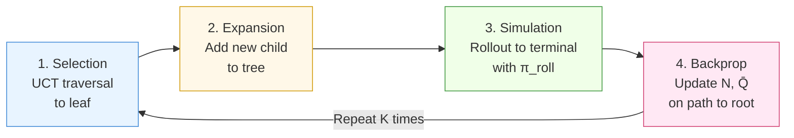

<!-- _class: lead -->

# Dyna-Q and Monte Carlo Tree Search

## Planning with Learned Models

Module 8 · Guide 02

<!-- Speaker notes: This guide covers two foundational model-based RL algorithms. Dyna-Q from 1991 is elegant in its simplicity: after every real step, run n additional imagined Q-updates. MCTS is the planning engine behind AlphaGo and every major game-playing AI. Both exploit a model; they differ in when and how planning happens. By the end of this guide, students should be able to implement both from scratch. -->

---

## Two Approaches to Planning

<div class="columns">

**Dyna-Q: Background Planning**
- Plan during training, improve global Q-table
- Model queried with *past* (state, action) pairs
- $n$ imagined steps per real step
- Result: faster convergence during learning

**MCTS: Decision-Time Planning**
- Plan at each action selection, improve *current* decision
- Model queried with *forward* simulations from current state
- $K$ simulations per real step
- Result: high-quality action at test time

</div>

<!-- Speaker notes: The key distinction is *when* planning happens. Dyna-Q plans during training to improve the Q-table globally — the result is a better Q-function that makes good decisions everywhere. MCTS plans at decision time to improve the specific action chosen right now — the result is a good action at the current state, but no permanent improvement to a stored value function. Ask students: which is better? Neither is strictly better — it depends on whether you need a reusable policy (Dyna) or high-quality decisions in a specific situation (MCTS). -->

---

## Dyna-Q: The Architecture

Three interleaved processes per real step:

```
                    ┌─────────────────────┐
  Real Env ─────▶  │  1. Direct RL update │  Q-learning from real (s,a,r,s')
                   └─────────────────────┘
                            │
                            ▼
                   ┌─────────────────────┐
  Experience ────▶ │  2. Model learning  │  Store (s,a) → (r, s') in table
                   └─────────────────────┘
                            │
                            ▼
                   ┌─────────────────────┐
  Model ─────────▶ │  3. Planning (×n)   │  n Q-updates on simulated transitions
                   └─────────────────────┘
```

All three updates share the same Q-table and are identical in form.

<!-- Speaker notes: The beauty of Dyna-Q is that steps 1 and 4 (planning) are the same Q-learning update — the only difference is the source of the transition tuple. This means you can implement Dyna-Q by taking any Q-learning implementation and adding two lines: model.update(s, a, r, s') and a loop of n simulated updates. Show students the pseudocode on the next slide. -->

---

## Dyna-Q Algorithm (Sutton & Barto, Ch. 8.2)

```
Initialize Q(s,a) = 0, Model = empty

For each step:
  (1) Observe S; choose A ← ε-greedy(Q, S)
  (2) Execute A; observe R, S'

  [Direct RL]
  (3) Q(S,A) ← Q(S,A) + α[R + γ max_a Q(S',a) - Q(S,A)]

  [Model learning]
  (4) Model(S,A) ← (R, S')

  [Planning — repeat n times]
  (5) S̃ ← random previously seen state
      Ã ← random action taken in S̃
      R̃, S̃' ← Model(S̃, Ã)
      Q(S̃,Ã) ← Q(S̃,Ã) + α[R̃ + γ max_a Q(S̃',a) - Q(S̃,Ã)]
```

Steps 3 and 5 are the same formula — real and imagined transitions are treated identically.

<!-- Speaker notes: Read through the algorithm carefully. Emphasize step 5: S̃ is sampled from *previously observed states*, not the current state. This means planning happens across the entire state space that has been visited, not just the current location. After the agent discovers a reward at one part of the maze, planning propagates that information backward to distant states — much faster than waiting for real trajectories to reach those states. -->

---

## Effect of Planning Steps: Maze Example

<div class="columns">

**The Experiment (S&B Figure 8.2)**

- 47-state gridworld maze
- Blocked paths require exploration
- Agent must reach goal in minimum steps
- Metric: real steps to solve

**Results**

| $n$ | Steps to solve |
|-----|---------------|
| 0 (Q-learning) | ~1,000 |
| 5 | ~200 |
| 50 | ~20 |

</div>

Planning steps $n$ directly multiply sample efficiency — with accurate model.

<!-- Speaker notes: This is one of the cleanest experiments in all of RL because it isolates the planning benefit. With n=0 (pure Q-learning), the agent must literally walk the rewarding path many times before the value propagates back to the start. With n=50, planning propagates value information backward after every single real step — converging 50x faster. The curve is approximately 1/n, which confirms the theoretical multiplier. -->

---

## Dyna-Q+: Handling Non-Stationarity

**Problem:** Environment changes; model becomes stale.

- Wall removed → agent should explore the new path
- Dyna-Q keeps planning with old model → reinforces outdated beliefs

**Solution:** Add time-based exploration bonus

$$\tilde{r}(S, A) = r + \kappa\sqrt{\tau(S, A)}$$

where $\tau(S, A)$ = steps since $(S, A)$ was last tried in the real environment.

Actions not recently tried receive inflated reward → agent re-explores.

**Practical setting:** $\kappa = 0.001$. Larger $\kappa$ → more re-exploration.

<!-- Speaker notes: The Dyna-Q+ exploration bonus is elegant: it is automatically zero for recently tried actions and grows with staleness. The square root ensures the bonus is bounded — it can never dominate a large true reward difference. The S&B shortcut maze experiment shows Dyna-Q+ adapting to environment changes within a few hundred steps, while standard Dyna-Q takes thousands. This is directly relevant to real-world non-stationary environments like financial markets. -->

---

## Monte Carlo Tree Search: Overview

**Core idea:** Before choosing an action at state $s_0$, simulate $K$ futures and pick the action whose subtree looks best.

**Used in:** AlphaGo, AlphaZero, MuZero, board games, scheduling, protein folding planning

**Requirements:**
- A simulator: $(s, a) \to (s', r, \text{done})$
- A rollout policy $\pi_\text{roll}$ (even random works)
- Compute budget $K$ (more simulations = better decisions)

**No stored value function.** MCTS builds a temporary tree that is discarded after each decision.

<!-- Speaker notes: MCTS was invented in 2006 for Go, a game that defeated all previous AI approaches because the state space is too large for standard minimax search and the branching factor is too high for exhaustive enumeration. The key insight of MCTS is that you don't need to search the full tree — you can focus computational effort on the most promising branches using the UCT criterion. This is the same explore-exploit tradeoff as multi-armed bandits, applied to tree search. -->

---

## The Four MCTS Phases



Each iteration: one leaf expanded, one rollout, statistics updated.

Final action: $a^* = \arg\max_a N(s_0, a)$ — most-visited child of root.

<!-- Speaker notes: Walk through each phase explicitly. Selection: we use UCT to navigate from root to a leaf — a state that either has untried actions or is terminal. Expansion: we add one new child node for an untried action. Simulation: we play out a rollout from that new node using a fast rollout policy (often random). Backpropagation: we walk back up the tree, incrementing visit counts and updating mean Q-values at every node on the path. After K iterations, we take the action with the most visits — not the highest Q-value, because visit counts are more robust to outliers. -->

---

## UCT: The Selection Formula

$$\text{UCT}(s, a) = \underbrace{\bar{Q}(s, a)}_{\text{exploitation}} + \underbrace{c \sqrt{\frac{\ln N(s)}{N(s, a)}}}_{\text{exploration}}$$

| Symbol | Meaning |
|--------|---------|
| $\bar{Q}(s, a)$ | Mean return from $(s, a)$ across all simulations |
| $N(s)$ | Total visits to state $s$ |
| $N(s, a)$ | Visits to action $a$ from state $s$ |
| $c$ | Exploration coefficient (typical: $\sqrt{2}$) |

**Unvisited actions:** $N(s, a) = 0$ → UCT = $\infty$ → always expand first.

<!-- Speaker notes: UCT is the Multi-Armed Bandit UCB1 formula applied to the tree search problem. The exploitation term uses the empirical mean return — the better an action has looked historically, the more we prefer it. The exploration term is the UCB confidence interval — actions that have been tried rarely relative to the total number of visits get a large bonus. The theoretical c = sqrt(2) assumes returns are normalized to [0,1] — if your rewards are not normalized, scale c accordingly. This is a common source of bugs. -->

---

## UCT Intuition: Balanced Search

After 100 simulations:

```
Root (N=100)
├── Action A: N=60, Q̄=0.7    ← well-explored, looks good
├── Action B: N=35, Q̄=0.5    ← explored, looks average
└── Action C: N=5,  Q̄=0.3    ← barely explored!

UCT(C) = 0.3 + √2 · √(ln 100 / 5) = 0.3 + √2 · 0.96 = 1.66  ← HIGHEST
UCT(A) = 0.7 + √2 · √(ln 100 / 60) = 0.7 + √2 · 0.28 = 1.10
UCT(B) = 0.5 + √2 · √(ln 100 / 35) = 0.5 + √2 · 0.37 = 1.02
```

Next simulation explores Action C — even though it has lowest $\bar{Q}$.

<!-- Speaker notes: Walk through this numerical example carefully. Action C has been visited only 5 times — we have very little information about it. Its low Q-value of 0.3 could be due to bad luck in 5 samples. UCT correctly identifies that we should explore C more before concluding it is bad. After more exploration, if C's true value is 0.3, its UCT score will fall and A will dominate again. This is the key difference from greedy selection: greedy would never revisit C after seeing 0.3 average. -->

---

## MCTS Backpropagation

After each rollout with return $G$, update every node on the path from the expanded leaf to root:

$$N(s) \leftarrow N(s) + 1$$

$$N(s, a) \leftarrow N(s, a) + 1$$

$$\bar{Q}(s, a) \leftarrow \bar{Q}(s, a) + \frac{G - \bar{Q}(s, a)}{N(s, a)}$$

The last line is an **incremental mean update** — equivalent to $\bar{Q}(s,a) = \frac{1}{N(s,a)}\sum G_i$ but uses $O(1)$ memory.

<!-- Speaker notes: The incremental mean update is the same formula used in the bandit chapter — this is not a coincidence. MCTS is literally running UCB1 bandit algorithms at every internal node of the tree simultaneously, sharing information through the parent-child structure. The backpropagation step is what makes them share information: a good rollout at a deep node propagates value back to all its ancestors. -->

---

## AlphaGo: Neural Networks + MCTS

**Standard MCTS weakness:** Random rollouts in Go are nearly useless (Go is too complex for random play to give meaningful signal).

**AlphaGo solution:** Replace random rollout with neural network evaluation

$$\text{UCT}_\text{AlphaGo}(s, a) = \bar{Q}(s, a) + c \cdot p_\sigma(a \mid s) \cdot \frac{\sqrt{N(s)}}{1 + N(s, a)}$$

- $p_\sigma(a \mid s)$: **policy network** prior — guides search toward human-like moves
- **Value network** $v_\theta(s)$: replaces rollout with a direct state evaluation

**AlphaZero** (2017): Both networks trained entirely from self-play, no human data.

<!-- Speaker notes: The AlphaGo paper (Silver et al. 2016) was a landmark because it demonstrated that neural networks could be integrated into MCTS not just as a faster rollout but as a prior over actions. The policy network replaces the exploration term's uniform assumption — instead of treating all actions as equally worth exploring, we bias toward moves a trained network considers promising. The value network provides a signal from a single forward pass rather than playing out 50+ random moves. This combination is far more compute-efficient than standard MCTS. -->

---

## From AlphaZero to MuZero

<div class="columns">

**AlphaZero (2017)**
- Requires a perfect simulator (rules of chess/Go/shogi)
- MCTS planning in real state space
- No learned dynamics

**MuZero (2020)**
- No simulator needed — learns one
- MCTS planning in **latent state space**
- Works on Atari (no known rules!)
- Same algorithm: chess, Go, shogi, Atari

</div>

MuZero = AlphaZero + learned dynamics model. Covered in Guide 03.

<!-- Speaker notes: MuZero is the natural extension: if AlphaZero needs a perfect simulator, and we don't always have one, learn the simulator. The key insight is that you don't need to model the full observation space — you only need a model of the information relevant for planning. MuZero's dynamics function predicts the next *latent state* and reward, not the next raw observation. This is more tractable and avoids the curse of dimensionality in observation space. -->

---

## Dyna-Q vs MCTS: When to Use Each

| Dimension | Dyna-Q | MCTS |
|-----------|--------|------|
| **Planning mode** | Background, during training | Foreground, at decision time |
| **Result** | Better global Q-table | Better current action |
| **Compute** | Fixed $n$ per step | Flexible $K$ simulations |
| **Environment** | Tabular / small continuous | Large discrete |
| **Use when** | Training sample budget limited | Decision quality critical |
| **Examples** | Robot navigation, small MDPs | Games, planning problems |

Both can be combined: train Q-network with Dyna, enhance with MCTS at test time.

<!-- Speaker notes: The table summarizes the trade-offs. Dyna-Q is the right choice when you are in training and want to get the most out of limited real interactions. MCTS is the right choice when you have compute to spare at decision time and need the best possible action — regardless of whether there is a trained value function. In practice, the most powerful systems combine both: use model-based training (Dyna-style) to get a good initial policy and value function, then enhance with MCTS at test time to improve decisions in critical situations. -->

---

## Common Pitfalls

**Dyna-Q pitfalls:**
- Stale model after environment change → use Dyna-Q+
- Too many planning steps with inaccurate model → model exploitation
- Not re-seeding planning from recent states → slow value propagation

**MCTS pitfalls:**
- UCT $c$ not scaled to reward range → poor exploration/exploitation balance
- Premature expansion (expanding non-leaf nodes) → corrupt statistics
- Using raw Q-value (not visit count) for final action selection → sensitive to outlier rollouts

<!-- Speaker notes: Highlight the most common bug in student implementations: using Q-value instead of visit count for final action selection. A single anomalously good rollout can inflate Q̄(s,a) for a rarely visited action, making it appear better than a well-explored action with more reliable statistics. Visit count is naturally robust: it only becomes the highest when the action has consistently performed well across many simulations. -->

---

## Summary

**Dyna-Q:**
1. Real step → Q-update + model update
2. $n$ simulated steps → $n$ planning Q-updates
3. Dyna-Q+ adds staleness bonus for non-stationarity

**MCTS:**
1. Selection: UCT traversal to leaf
2. Expansion: add new child node
3. Simulation: rollout with $\pi_\text{roll}$
4. Backpropagation: update $N$, $\bar{Q}$ to root
5. Action: $a^* = \arg\max_a N(s_0, a)$

**Key formula:** $\text{UCT}(s,a) = \bar{Q}(s,a) + c\sqrt{\frac{\ln N(s)}{N(s,a)}}$

<!-- Speaker notes: Summarize both algorithms in parallel. Both are based on the same underlying insight — use model simulations to improve decision quality — but they implement this in fundamentally different ways. The UCT formula is the most important equation in this guide; students should be able to write it from memory and explain each term. -->

---

## Next: World Models and MuZero

**Guide 03** covers deep model-based RL:

- **World Models** (Ha & Schmidhuber, 2018): VAE + RNN latent model, policy in latent space
- **MuZero** (2020): learn dynamics in latent space, plan with MCTS

**Key question:** When the state space is too large for tabular Dyna-Q and too complex for handcrafted simulators, how do we build models that scale?

<!-- Speaker notes: Close with the bridge to Guide 03. Dyna-Q and MCTS both assume either a tabular model or a perfect simulator. Real-world problems — robotics, video games, scientific discovery — have neither. World Models and MuZero show how to build learned models that are compact, differentiable, and powerful enough for MCTS-style planning. These are the state-of-the-art techniques as of 2024. -->

---

## Further Reading

- **Sutton & Barto Ch. 8.1–8.4** — Dyna-Q, Dyna-Q+, prioritized sweeping (required)
- **Kocsis & Szepesvári (2006)** — "Bandit Based Monte-Carlo Planning" — original UCT paper
- **Silver et al. (2016)** — "Mastering the game of Go" (AlphaGo, Nature)
- **Silver et al. (2017)** — "Mastering Chess and Shogi by Self-Play" (AlphaZero)
- **Browne et al. (2012)** — "A Survey of Monte Carlo Tree Search Methods" — comprehensive reference

<!-- Speaker notes: The Kocsis & Szepesvári UCT paper is short and readable — recommend it as supplementary reading. The AlphaGo and AlphaZero papers are landmark results that are accessible to advanced undergraduates. The Browne survey is the definitive MCTS reference with 800+ citations; recommend Chapter 3 (algorithms) and Chapter 7 (applications) as selective reading. -->
