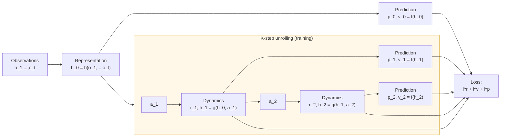

# World Models and MuZero

> **Reading time:** ~14 min | **Module:** 8 — Model-Based RL | **Prerequisites:** Module 5

## In Brief

World Models (Ha & Schmidhuber, 2018) decompose the agent into three specialized components — a visual encoder, a temporal memory, and a compact controller — enabling the controller to be trained entirely inside a learned dream environment. MuZero (Schrittwieser et al., 2020) eliminates the need for an explicit environment simulator by learning dynamics in a latent space, then applying AlphaZero-style MCTS planning within that space. Both represent the frontier of sample-efficient deep RL.

<div class="callout-key">
<strong>Key Concept:</strong> World Models (Ha & Schmidhuber, 2018) decompose the agent into three specialized components — a visual encoder, a temporal memory, and a compact controller — enabling the controller to be trained entirely inside a learned dream environment. MuZero (Schrittwieser et al., 2020) eliminates the need for an explicit environment simulator by learning dynamics in a latent space, then applying AlphaZero-style MCTS planning within that space.
</div>


## Key Insight

The challenge in applying Dyna-Q to rich, high-dimensional environments (pixel-based games, robotics from cameras) is that modeling raw pixels is expensive and brittle. The solution: learn a *compressed* representation of the world, then model and plan in that compact space. A 64×64 RGB image has 12,288 dimensions; a good latent vector has 32–256 dimensions. Modeling in latent space is faster, more accurate, and more generalizable.

---


<div class="callout-key">
<strong>Key Point:</strong> The challenge in applying Dyna-Q to rich, high-dimensional environments (pixel-based games, robotics from cameras) is that modeling raw pixels is expensive and brittle.
</div>
## Intuitive Explanation: World Models

A film director preparing for a scene does not need to actually film every possible camera angle. They have a mental model of how lighting, actor positioning, and camera motion combine to produce an image. They can simulate in their mind which angles will look good and issue precise instructions on set — with minimal real takes.

<div class="callout-key">
<strong>Key Point:</strong> A film director preparing for a scene does not need to actually film every possible camera angle.
</div>


The V model is the director's perceptual system: it compresses the complex visual world into essential features. The M model is the director's predictive imagination: given a current shot and a camera move, predict what the next frame looks like. The C model is the director's decision process: given the compressed state and predicted future, choose the action.

The key insight is that training C inside the dream (using V and M) is much faster than training C from real environment interactions — dream simulations run at thousands of frames per second instead of real-time.

---


## Formal Definition: World Models

The World Models architecture (Ha & Schmidhuber, 2018) decomposes the agent into three modules that are trained separately:

<div class="callout-info">
<strong>Info:</strong> The World Models architecture (Ha & Schmidhuber, 2018) decomposes the agent into three modules that are trained separately:

### Module 1: Vision Model (V) — Variational Autoencoder

The V model compr...
</div>


### Module 1: Vision Model (V) — Variational Autoencoder

The V model compresses each observation $o_t$ (e.g., a frame image) into a compact latent vector $z_t$:

$$z_t = \text{encode}(o_t), \quad z_t \in \mathbb{R}^{d_z}$$

More precisely, the VAE encodes to a distribution:

$$q_\phi(z_t \mid o_t) = \mathcal{N}(\mu_\phi(o_t),\, \text{diag}(\sigma^2_\phi(o_t)))$$

and samples $z_t \sim q_\phi(z_t \mid o_t)$. The decoder reconstructs:

$$\hat{o}_t = \text{decode}_\psi(z_t)$$

Training minimizes the VAE loss (reconstruction + KL regularization):

$$\mathcal{L}_\text{VAE} = \underbrace{-\mathbb{E}_{q_\phi}[\log p_\psi(o_t \mid z_t)]}_{\text{reconstruction}} + \underbrace{\beta \cdot D_\text{KL}(q_\phi(z_t \mid o_t) \| \mathcal{N}(0, I))}_{\text{regularization}}$$

### Module 2: Memory Model (M) — MDN-RNN

The M model predicts the distribution over the *next latent state* given the current latent state and action, and maintains an RNN hidden state $h_t$:

$$\hat{z}_{t+1} \sim p_\theta(z_{t+1} \mid z_t, a_t, h_t)$$

$$h_{t+1} = \text{RNN}_\theta(h_t, z_t, a_t)$$

The predictive distribution is parameterized as a **Mixture Density Network (MDN)**:

$$p_\theta(z_{t+1} \mid z_t, a_t, h_t) = \sum_{k=1}^{K} \pi_k \cdot \mathcal{N}(z_{t+1}; \mu_k, \sigma_k^2 I)$$

where $\pi_k$, $\mu_k$, $\sigma_k$ are all functions of $(z_t, a_t, h_t)$. The mixture handles multi-modal transitions.

### Module 3: Controller (C) — Linear Policy

The C module is a deliberately simple linear policy that maps the concatenated $(z_t, h_t)$ to an action:

$$a_t = W_c [z_t; h_t] + b_c$$

Because $[z_t; h_t]$ is a compact summary of the current observation and temporal context, even a linear controller can express sophisticated behaviors. Using a small controller enables training with evolutionary strategies rather than gradient descent.

### Training Procedure

1. Collect rollouts from the environment using a random policy (or current policy).
2. Train V (VAE) on individual frames to learn $z_t = \text{encode}(o_t)$.
3. Encode all frames with V. Train M (MDN-RNN) to predict $z_{t+1}$ from $(z_t, a_t, h_t)$.
4. Train C (controller) entirely inside the "dream" — using V and M to simulate the environment without any real interaction.

In the dream, the agent experiences:
$$z_0 \leftarrow \text{encode}(o_0), \quad h_0 = 0$$
$$\text{for } t = 0, 1, 2, \ldots: \quad a_t = C(z_t, h_t), \quad z_{t+1} \sim M(z_t, a_t, h_t), \quad h_{t+1} \leftarrow \text{RNN}(h_t, z_t, a_t)$$

---


## MuZero: Learning Dynamics Without Reconstruction

World Models build a full predictive model of the observation space. MuZero (Schrittwieser et al., 2020) asks: do we need to reconstruct observations at all? For planning, we only need three things:

1. A representation of the current state useful for predicting future rewards and values
2. A model that evolves that representation when actions are applied
3. A prediction of reward and value from any state in the representation

MuZero provides exactly these through three learned functions:

### Representation Function $h$

Maps the observation history to an initial hidden state:

$$h_0 = h(o_1, o_2, \ldots, o_t) \in \mathbb{R}^{d_h}$$

The representation function is a neural network (CNN for images, MLP for low-dimensional observations). Crucially, $h_0$ need not decode back to observations — it only needs to support accurate future predictions.

### Dynamics Function $g$

Predicts the next hidden state and immediate reward, given a hidden state and action:

$$r_k, h_k = g(h_{k-1}, a_k)$$

This function is learned jointly with the rest of MuZero, purely from the planning signal. It operates entirely in the latent space — no observation reconstruction.

### Prediction Function $f$

Predicts the policy distribution and state value from any hidden state:

$$p_k, v_k = f(h_k)$$

where $p_k$ is a probability vector over actions (policy prior for MCTS) and $v_k$ is a scalar value estimate.

---

## MuZero Planning: MCTS in Latent Space

At decision time, MuZero runs MCTS using the three learned functions instead of a real simulator:

```
For each MCTS simulation from root h_0:
  1. Selection: traverse tree using PUCT
        PUCT(h, a) = Q̄(h, a) + c · p_k(a) · sqrt(N(h)) / (1 + N(h, a))
  2. Expansion: for new (h, a) pair, compute h_k, r_k = g(h_{k-1}, a_k)
                                      p_k, v_k = f(h_k)
  3. Backpropagation: update N, Q̄ using v_k as the leaf value
                      (no random rollout — value network replaces it)
```

There is no simulation/rollout phase — the value network $f$ provides a direct estimate of leaf value, equivalent to the AlphaZero design.

### MuZero Training

MuZero is trained end-to-end from game trajectories. For each trajectory, $K$ steps are unrolled through the dynamics function and the losses are:

$$\mathcal{L} = \sum_{k=0}^{K} \Bigl[\underbrace{l^r(u_{t+k}, r_k)}_{\text{reward prediction}} + \underbrace{l^v(z_{t+k}, v_k)}_{\text{value prediction}} + \underbrace{l^p(\pi_{t+k}, p_k)}_{\text{policy prediction}}\Bigr]$$

where $u_{t+k}$ is the actual reward, $z_{t+k}$ is the bootstrapped target value, and $\pi_{t+k}$ is the MCTS policy improved by the search. The gradient flows through the dynamics function across $K$ unrolled steps.

---

## MuZero Architecture Diagram

<div class="code-window">
<div class="code-header">
<div class="dots"><span class="dot-red"></span><span class="dot-yellow"></span><span class="dot-green"></span></div>
<span class="filename">example.py</span>
</div>

The following implementation builds on the approach above:


</div>

---

## World Models vs MuZero: Key Differences

| Dimension | World Models | MuZero |
|-----------|-------------|--------|
| **Observation model** | Full VAE reconstruction | None (no reconstruction) |
| **Latent space** | VAE $z$ + RNN $h$ | Learned $h$ only |
| **Planning** | Train controller in dream | MCTS in latent space |
| **Training signal** | Three separate losses | End-to-end unified loss |
| **Scalability** | Up to medium environments | Board games + Atari (SOTA) |
| **Interpretability** | Can decode latent to image | Latent space is abstract |

---


<div class="compare">
<div class="compare-card">
<div class="header before">World Models</div>
<div class="body">

See detailed comparison in the table above.

</div>
</div>
<div class="compare-card">
<div class="header after">MuZero: Key Differences</div>
<div class="body">

See detailed comparison in the table above.

</div>
</div>
</div>

## Sample Efficiency Comparison

Approximate real steps to reach strong performance on standard benchmarks:

| Method | HalfCheetah (MuJoCo) | Atari Pong |
|--------|---------------------|------------|
| SAC (model-free) | 1,000,000 | 10,000,000 |
| Dyna-Q (tabular equiv.) | N/A | N/A |
| MBPO (Dyna + neural) | 30,000 | N/A |
| World Models | ~10,000 (CarRacing) | N/A |
| MuZero | N/A | ~200,000 |
| DreamerV3 (World Models successor) | ~100,000 | ~200,000 |

Model-based methods achieve $10\times$–$50\times$ sample efficiency improvement over model-free baselines across domains.

---

## Python Implementation: World Model Components

<div class="code-window">
<div class="code-header">
<div class="dots"><span class="dot-red"></span><span class="dot-yellow"></span><span class="dot-green"></span></div>
<span class="filename">example.py</span>
</div>

The following implementation builds on the approach above:

```python
import torch
import torch.nn as nn
import torch.nn.functional as F


class VisionModel(nn.Module):
    """
    Convolutional VAE: encodes 64×64×3 frames to a latent vector.

    Architecture follows Ha & Schmidhuber (2018) World Models.
    """

    def __init__(self, z_dim: int = 32):
        super().__init__()
        self.z_dim = z_dim

        # Encoder: image → (μ, log σ²)
        self.encoder = nn.Sequential(
            nn.Conv2d(3, 32, 4, stride=2), nn.ReLU(),    # 64→31
            nn.Conv2d(32, 64, 4, stride=2), nn.ReLU(),   # 31→14
            nn.Conv2d(64, 128, 4, stride=2), nn.ReLU(),  # 14→6
            nn.Conv2d(128, 256, 4, stride=2), nn.ReLU(), # 6→2
            nn.Flatten(),                                  # 256*2*2 = 1024
        )
        self.fc_mu = nn.Linear(1024, z_dim)
        self.fc_log_var = nn.Linear(1024, z_dim)

        # Decoder: z → image
        self.decode_fc = nn.Linear(z_dim, 1024)
        self.decoder = nn.Sequential(
            nn.Unflatten(1, (256, 2, 2)),
            nn.ConvTranspose2d(256, 128, 5, stride=2), nn.ReLU(),
            nn.ConvTranspose2d(128, 64, 5, stride=2), nn.ReLU(),
            nn.ConvTranspose2d(64, 32, 6, stride=2), nn.ReLU(),
            nn.ConvTranspose2d(32, 3, 6, stride=2), nn.Sigmoid(),
        )

    def encode(self, x: torch.Tensor):
        """Encode image to (μ, log σ²) of latent distribution."""
        h = self.encoder(x)
        return self.fc_mu(h), self.fc_log_var(h)

    def reparameterize(self, mu: torch.Tensor, log_var: torch.Tensor):
        """Sample z using reparameterization trick: z = μ + σ·ε, ε ~ N(0,I)."""
        std = torch.exp(0.5 * log_var)
        eps = torch.randn_like(std)
        return mu + std * eps

    def forward(self, x: torch.Tensor):
        mu, log_var = self.encode(x)
        z = self.reparameterize(mu, log_var)
        x_hat = self.decoder(self.decode_fc(z))
        return x_hat, mu, log_var

    def vae_loss(self, x, x_hat, mu, log_var, beta: float = 1.0):
        """
        ELBO loss = reconstruction loss + β * KL divergence.

        β > 1 encourages a more disentangled latent space.
        """
        # Reconstruction: pixel-wise binary cross-entropy
        recon = F.binary_cross_entropy(x_hat, x, reduction="sum")
        # KL: closed-form for Gaussian q vs N(0,I) prior
        kl = -0.5 * torch.sum(1 + log_var - mu.pow(2) - log_var.exp())
        return recon + beta * kl


class MemoryModel(nn.Module):
    """
    MDN-RNN: predicts next latent state as a Gaussian mixture.

    Processes sequences of (z_t, a_t) and maintains hidden state h_t.
    """

    def __init__(self, z_dim: int = 32, action_dim: int = 3, hidden_dim: int = 256, n_mixtures: int = 5):
        super().__init__()
        self.z_dim = z_dim
        self.hidden_dim = hidden_dim
        self.n_mixtures = n_mixtures

        # RNN processes concatenated (z, a)
        self.rnn = nn.LSTM(z_dim + action_dim, hidden_dim, batch_first=True)

        # MDN output heads: mixture weights, means, log-variances
        mdn_out_dim = n_mixtures * (1 + z_dim + z_dim)   # π + μ + log σ per mixture
        self.mdn_head = nn.Linear(hidden_dim, mdn_out_dim)

    def forward(self, z_seq: torch.Tensor, a_seq: torch.Tensor, hidden=None):
        """
        Args:
            z_seq:   (batch, T, z_dim) — latent state sequence
            a_seq:   (batch, T, action_dim) — action sequence
            hidden:  optional initial LSTM hidden state

        Returns:
            pi, mu, log_sigma: mixture parameters, each (batch, T, n_mixtures, ...)
            hidden:            updated LSTM state
        """
        x = torch.cat([z_seq, a_seq], dim=-1)
        h, hidden = self.rnn(x, hidden)

        # MDN parameters for next-state distribution
        mdn_out = self.mdn_head(h)
        pi_raw, mu, log_sigma = torch.split(
            mdn_out,
            [self.n_mixtures, self.n_mixtures * self.z_dim, self.n_mixtures * self.z_dim],
            dim=-1
        )
        pi = torch.softmax(pi_raw, dim=-1)
        mu = mu.view(*mu.shape[:-1], self.n_mixtures, self.z_dim)
        log_sigma = log_sigma.view(*log_sigma.shape[:-1], self.n_mixtures, self.z_dim)

        return pi, mu, log_sigma, hidden
```
</div>

---

## Common Pitfalls

<div class="callout-danger">
<strong>Danger:</strong> The pitfalls below are the most common mistakes practitioners make. Each one can silently degrade your results without obvious errors.
</div>

**Pitfall 1 — Training the three World Model components in the wrong order.**
The V model must be trained before the M model, because M operates on encoded latents $z_t$. If you train M on raw observations or on latents from an untrained V, M learns noise. Train V first; freeze it; encode the dataset; then train M on the encoded sequences.

<div class="callout-warning">
<strong>Warning:</strong> **Pitfall 1 — Training the three World Model components in the wrong order.**
The V model must be trained before the M model, because M operates on encoded latents $z_t$.
</div>

**Pitfall 2 — Forgetting the temperature parameter in MDN-RNN sampling.**
At test time (inside the dream), a temperature $\tau > 1$ is often added when sampling from the MDN to inject exploration. Without temperature, the dream is too deterministic and the controller may overfit to a narrow set of trajectories. Use $\tau \in [0.5, 1.5]$; the original World Models paper uses $\tau = 1.15$ for the CarRacing environment.

**Pitfall 3 — MuZero gradient scaling across unrolled steps.**
MuZero unrolls the dynamics function for $K$ steps during training. Gradients at the first step flow through all $K$ applications of $g$, accumulating gradient norm. Without gradient clipping (typically $\ell_2$ norm $\leq 1.0$) or gradient scaling at later unroll steps, training destabilizes. The original MuZero paper scales gradients by $1/2$ at each dynamics application after the first.

**Pitfall 4 — Using value targets without bootstrapping correction in MuZero.**
The value target $z_{t+k}$ in MuZero is a bootstrapped estimate: actual rewards for $n$ steps ahead, then the value network's estimate. If $n$ is too large, the target is dominated by a potentially inaccurate value estimate; too small, and it is dominated by accumulated reward variance. The original MuZero uses $n = 10$ for Atari and $n = 5$ for board games.

**Pitfall 5 — Confusing World Models "dreaming" with model-free imagination.**
Dreamer and World Models train the *controller* inside the dream. This is distinct from simply augmenting a replay buffer (Dyna style). In the dream, the entire trajectory — not just individual transitions — is simulated. This means errors compound over the full episode length. Use short episode lengths in the dream ($\leq 50$ steps) or discount aggressively ($\gamma \leq 0.99$).

**Pitfall 6 — Neglecting reconstruction quality before training the controller.**
The controller trained in the dream can only be as good as the dream. A V model that reconstructs poorly (blurry, missing fine structure) produces a dream environment that distorts the task. Always visualize reconstructed observations and verify reconstruction loss has plateaued before proceeding to M and C training.

---

## Connections


<div class="callout-info">
<strong>Info:</strong> This section maps how this guide connects to the broader course. Use these links to navigate related material.
</div>

- **Builds on:** Dyna-Q and MCTS (Guide 02), variational autoencoders (deep learning), LSTM/recurrent networks
- **Leads to:** DreamerV2/V3 (Hafner et al. 2020–2023), IRIS (Micheli et al. 2022), TD-MPC2 (Hansen et al. 2024)
- **Related to:** Predictive coding in neuroscience — the brain may maintain a generative world model and continuously predict sensory input; imagination in humans parallels agent dreaming

---


## Practice Questions

**Question 1 — Conceptual:** Based on the concepts in this guide, explain in your own words why the core technique matters and when you would choose it over alternatives.

**Question 2 — Application:** Sketch out how you would apply the main concept from this guide to a real-world dataset or problem you have encountered. What would you need to watch out for?


## Further Reading

- Ha & Schmidhuber (2018), "World Models" (arXiv:1803.10122) — original paper; also available at worldmodels.github.io
- Schrittwieser et al. (2020), "Mastering Atari, Go, Chess and Shogi by Planning with a Learned Model" (MuZero, Nature) — arXiv:1911.08265
- Hafner et al. (2020), "Dream to Control: Learning Behaviors by Latent Imagination" (Dreamer) — direct successor to World Models
- Hafner et al. (2023), "Mastering Diverse Domains through World Models" (DreamerV3) — single algorithm, same hyperparameters, solving all environments
- Grimm et al. (2020), "The Value Equivalence Principle for Model-Based Reinforcement Learning" — theoretical foundation for why MuZero's latent model is sufficient for planning


---

## Cross-References

<a class="link-card" href="./03_world_models_slides.md">
  <div class="link-card-title">Companion Slides</div>
  <div class="link-card-description">Interactive slide deck covering the key concepts with visual examples.</div>
</a>

<a class="link-card" href="../notebooks/01_dyna_q.ipynb">
  <div class="link-card-title">Hands-on Notebook</div>
  <div class="link-card-description">15-minute micro-notebook with guided exercises and real data.</div>
</a>
