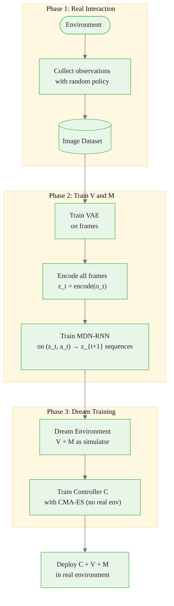

<!-- _class: lead -->

# World Models and MuZero

## Deep Model-Based Reinforcement Learning

Module 8 · Guide 03

<!-- Speaker notes: This guide covers the two most influential deep model-based RL algorithms: World Models (Ha & Schmidhuber, 2018) and MuZero (Schrittwieser et al., 2020). Both learn a compact model of the environment in a latent space, but they make different architectural choices. World Models reconstruct observations; MuZero does not. Both achieve remarkable sample efficiency. This is the frontier of the field — by the end of this guide students should understand why latent-space models are the right design choice for scalable model-based RL. -->

---

## The Problem with Raw-Observation Models

Dyna-Q works in a tabular setting. What breaks when we scale to images?

<div class="columns">

**Raw pixel modeling**
- 64×64×3 = 12,288 dimensional state
- One-step model: 12,288 → 12,288
- High-capacity network required
- Blurry predictions → errors compound fast
- Training is slow and unstable

**Latent-space modeling**
- Compress: 12,288 → 32 dimensions
- Model 32 → 32 (100× smaller)
- Clean, smooth latent manifold
- Errors bounded in compact space
- Fast training, stable gradients

</div>


<div class="callout-insight">
<strong>Insight:</strong> This is a key takeaway from this section that connects to the broader course themes.
</div>

<!-- Speaker notes: This is the core motivation for latent-space models. Modeling in raw pixel space is wasteful — most of the 12,288 dimensions are background, lighting artifacts, and texture details that are irrelevant to decision making. A good encoder strips these out, leaving only the task-relevant structure. Empirically, latent-space dynamics models make predictions 10-100× more accurate than pixel-space models of the same parameter count. -->

---

## World Models: Three-Component Architecture

```
Observation o_t (image)
        │
        ▼
┌──────────────────┐
│   V: Vision      │  VAE encodes o_t → z_t ∈ ℝ³²
│   (Encoder)      │  Compression: 12,288 → 32 dims
└──────────────────┘
        │  z_t
        ▼
┌──────────────────┐
│   M: Memory      │  MDN-RNN predicts ẑ_{t+1} ~ p(z_{t+1}|z_t, a_t, h_t)
│   (Temporal)     │  Maintains history in hidden state h_t
└──────────────────┘
        │  [z_t, h_t]
        ▼
┌──────────────────┐
│   C: Controller  │  Linear: a_t = W[z_t; h_t] + b
│   (Policy)       │  Trained entirely inside the dream
└──────────────────┘
```


<div class="callout-key">
<strong>Key Point:</strong> Remember this concept — it appears repeatedly in later modules.
</div>

<!-- Speaker notes: Walk through each component. V is a standard VAE — reconstruct the observation as a training objective, but the useful output is the latent z. M is an LSTM with a Mixture Density Network head — it predicts the distribution over next latent states. Using a mixture is important for multi-modal transitions (e.g., a car can turn left or right after a fork). C is deliberately simple — a linear layer. This keeps training fast (evolutionary strategies instead of backprop) and prevents overfitting to the dream. -->

---

## V Model: Variational Autoencoder

$$q_\phi(z_t \mid o_t) = \mathcal{N}(\mu_\phi(o_t),\; \text{diag}(\sigma^2_\phi(o_t)))$$

$$\mathcal{L}_\text{VAE} = \underbrace{-\mathbb{E}_{q_\phi}[\log p_\psi(o_t \mid z_t)]}_{\text{reconstruction loss}} + \underbrace{\beta \cdot D_\text{KL}(q_\phi \| \mathcal{N}(0, I))}_{\text{regularization}}$$

**What the VAE learns:**
- $z_t$ captures the essential structure of $o_t$
- KL term forces $z_t$ to stay near the unit Gaussian — smooth latent space
- Smooth latent space makes the M model's prediction task easier


<div class="callout-warning">
<strong>Warning:</strong> This is a common source of confusion. Pay close attention to the distinction here.
</div>

<!-- Speaker notes: The VAE is trained separately on a dataset of observations collected by a random policy. The KL term is critical: without it, the encoder could assign very different z values to similar observations, making the dynamics hard to model. The beta parameter controls the trade-off — larger beta gives a more disentangled latent space but worse reconstruction. Ha & Schmidhuber use beta=1. DreamerV2 uses larger beta=1 with additional reconstruction terms. The key output is not the reconstructed image — it is the latent vector z used by M and C. -->

---

## M Model: MDN-RNN

The memory model predicts the *distribution* over the next latent state:

$$p_\theta(z_{t+1} \mid z_t, a_t, h_t) = \sum_{k=1}^{K} \pi_k \cdot \mathcal{N}(z_{t+1};\, \mu_k,\, \sigma_k^2 I)$$

$$h_{t+1} = \text{LSTM}_\theta(h_t,\; [z_t; a_t])$$

**Why a mixture density network?**
- Stochastic environments have multi-modal transitions
- A single Gaussian would predict the average of the modes — which may have probability zero under the true distribution
- The mixture captures genuine stochasticity


<div class="callout-info">
<strong>Info:</strong> This detail is useful context but not required to memorize.
</div>

<!-- Speaker notes: The MDN-RNN is the most technically complex component. The key insight is that we need a *distribution* over next latent states, not a point prediction. In a racing game, hitting a corner could result in many different outcomes depending on friction, speed, and steering — a single Gaussian average would predict the car in the middle of the track, which never actually happens. The LSTM's hidden state h accumulates information about the trajectory — what has happened so far — giving the controller a sense of temporal context beyond the current frame. -->

---

## C Model: Controller in the Dream

$$a_t = W_c [z_t;\, h_t] + b_c$$

**Training entirely inside the dream:**

```
for each dream episode:
    z_0 = encode(real_obs_0),  h_0 = 0
    for t = 0, 1, ..., T:
        a_t = C(z_t, h_t)
        z_{t+1} ~ M(z_t, a_t, h_t)    # imagined next state
        h_{t+1} = LSTM(h_t, z_t, a_t)
    reward = V and M's predicted cumulative reward
optimize C to maximize dream reward (CMA-ES evolutionary strategy)
```

**No real environment interaction during C training.**

<!-- Speaker notes: The controller training step is the most surprising aspect of World Models. The entire policy optimization happens inside the dream — V and M simulate what would happen if C took action a_t. Because the dream runs thousands of times faster than the real environment, C can be optimized with slow evolutionary strategies (CMA-ES) rather than fast gradient descent. The original World Models paper trains C on CarRacing-v0 with only 10,000 real frames for V/M training, then zero additional real frames for C training. -->

---

## World Models: The Dream Pipeline



<!-- Speaker notes: The three-phase pipeline is the key engineering insight. Phase 1 is brief — just enough real data to train V and M. Phase 2 is supervised learning — straightforward VAE and MDN-RNN training. Phase 3 is where the RL happens, but entirely inside a learned simulator. The real environment is consulted only during deployment testing. In the CarRacing-v0 experiments, this approach required ~10,000 real frames versus ~1 million for model-free methods. -->

---

## MuZero: Planning Without Reconstruction

**World Models** reconstruct observations as training signal.

**MuZero's insight:** For planning, you don't need to reconstruct observations. You only need to predict:
- Future rewards $r_k$ (for value estimation)
- Future values $v_k$ (for planning efficiency)
- Future policies $p_k$ (for search guidance)

Three learned functions are sufficient:

| Function | Input → Output | Role |
|----------|----------------|------|
| Representation $h$ | $o_{1..t} \to h_0$ | Initial hidden state |
| Dynamics $g$ | $h_{k-1}, a_k \to r_k, h_k$ | Transition + reward |
| Prediction $f$ | $h_k \to p_k, v_k$ | Policy prior + value |

<!-- Speaker notes: The key philosophical difference from World Models: MuZero never tries to reconstruct what the world looks like. It only models what is necessary for making good decisions — reward, value, and policy. This is formalized by Grimm et al. (2020) as the "Value Equivalence Principle": two models are equivalent for planning if they produce the same values under the same policies. MuZero finds a minimal model that satisfies value equivalence without the reconstruction overhead. -->

---

## MuZero: Three Functions

$$h_0 = h(o_1, o_2, \ldots, o_t) \qquad \text{(Representation)}$$

$$r_k,\; h_k = g(h_{k-1}, a_k) \qquad \text{(Dynamics)}$$

$$p_k,\; v_k = f(h_k) \qquad \text{(Prediction)}$$

**MCTS planning in latent space:**
- Selection: PUCT using $p_k$ as prior
- Expansion: apply $g$ to get new $h_k$, $r_k$; apply $f$ for $p_k$, $v_k$
- Backpropagation: $v_k$ is the leaf value (no rollout)
- Action: $a^* = \arg\max_a N(h_0, a)$

<!-- Speaker notes: Compare to standard MCTS in Guide 02: the dynamics function g replaces the environment simulator, and the value function v_k replaces the rollout. The PUCT variant of UCT uses the policy prior p_k(a) to weight the exploration term — actions that the policy network thinks are promising get a larger exploration bonus, biasing search toward promising regions of the tree. This is the same design as AlphaZero but now applied without needing a known game simulator. -->

---

## MuZero Training: Unrolled Prediction

During training, unroll $K$ steps through the dynamics function:

```
From real trajectory at time t:
  h_0 = h(o_1, ..., o_t)        # encode history
  For k = 1 to K:
    r_k, h_k = g(h_{k-1}, a_{t+k})   # dynamics: one step
    p_k, v_k = f(h_k)                  # prediction: policy + value

Loss = Σ_k [ reward_loss(r_k, actual_r_{t+k})
           + value_loss(v_k, bootstrapped_target)
           + policy_loss(p_k, MCTS_policy_{t+k}) ]
```

Gradients flow through $g$ across all $K$ unrolled steps.

<!-- Speaker notes: The unrolled training is what makes MuZero end-to-end: the representation function h, dynamics function g, and prediction function f are all trained jointly to minimize the sum of prediction errors across K future steps. The policy target is the MCTS policy from a previous self-play game — training a better policy improves the MCTS policy target, which improves the network, which further improves MCTS. This is the self-improving loop that makes MuZero so powerful. Note the gradient scaling issue mentioned in the guide: gradients at the first unroll step flow through all K applications of g, requiring careful clipping. -->

---

## MuZero Results: One Algorithm, All Domains

MuZero (2020) with the same architecture and hyperparameters:

| Domain | Task | Performance |
|--------|------|-------------|
| Board games | Chess | Matches AlphaZero (trained from scratch) |
| Board games | Shogi | Matches AlphaZero |
| Board games | Go | Matches AlphaZero |
| Video games | Atari 57 | State-of-the-art (57 games) |

**Key difference from AlphaZero:** No hand-crafted simulator required.

<!-- Speaker notes: The universality result is remarkable. AlphaZero needed three different implementations for chess, shogi, and Go because the rules differ. MuZero uses the same learned dynamics function for all three — it discovers the rules from data. And it then transfers to Atari, where there are no explicit rules at all, just pixel observations and scores. This is a genuine breakthrough: a single agent architecture that masters both perfect-information board games and partial-observation video games. -->

---

## Sample Efficiency Comparison

Approximate environment steps to reach strong performance:

| Method | Steps | Notes |
|--------|-------|-------|
| DQN (model-free) | 200,000,000 | Original Atari result |
| Rainbow (model-free) | 20,000,000 | Many tricks combined |
| MuZero | 200,000 | 100× more efficient than DQN |
| EfficientZero (2021) | 100,000 | Improved MuZero variant |
| DreamerV3 (2023) | 200,000 | World Models approach |

Model-based methods reach human-level performance with 100× fewer samples.

<!-- Speaker notes: These numbers are impressive but come with caveats: the compute cost per step is much higher for model-based methods (MCTS planning, model training). The total wall-clock time may be similar. The advantage is in *sample efficiency* — the number of real environment interactions. For environments where real interaction is expensive (robotics, scientific discovery), sample efficiency is the primary metric. For simulations that run fast, wall-clock time matters more. -->

---

## Common Pitfalls

**World Models:**
- Train V before M — M needs encoded latents, not raw observations
- Use temperature when sampling from MDN-RNN in dream — prevents over-deterministic dreaming
- Verify reconstruction quality before training C — garbage in, garbage out

**MuZero:**
- Scale gradients by $1/2$ at each unroll step after the first — prevents gradient explosion
- Normalize reward targets to $[-1, 1]$ — value network learns poorly with raw rewards
- Bootstrap value target with $n$-step return, not just 1-step

<!-- Speaker notes: Highlight the most common implementation errors. For World Models, the training order bug is particularly common in student implementations: they try to train all three components simultaneously or in the wrong order, getting nonsensical results. For MuZero, gradient scaling is the most subtle issue — the original paper describes it in the appendix and it is easy to miss. Always check training curves: value loss should decrease smoothly over the first few thousand steps; if it oscillates, check gradient norms. -->

---

## The Progression: From Dyna to MuZero

```
Dyna-Q (1991)
  - Tabular model stored in memory
  - Q-updates on simulated (s, a, r, s') transitions
  - n planning steps per real step

World Models (2018)
  - Compressed representation (VAE)
  - Temporal model (MDN-RNN) in latent space
  - Controller trained entirely in dream
  - First "dream training" demonstration

MuZero (2020)
  - Learned latent dynamics (no reconstruction)
  - MCTS planning in latent space
  - End-to-end training
  - State-of-the-art across board games + Atari
```

Each step: more powerful model, fewer assumptions about the environment.

<!-- Speaker notes: This progression shows the conceptual arc of model-based RL. Dyna-Q established the core idea: real experience trains a model, model generates synthetic experience, synthetic experience trains the agent. World Models showed this scales to high-dimensional observations with a VAE. MuZero showed that reconstruction is unnecessary — only value-relevant predictions matter. DreamerV3 (2023) merges the best of both, achieving state-of-the-art across all domains with a single set of hyperparameters. -->

---

## Summary: World Models vs MuZero

<div class="columns">

**World Models**
- $z = \text{encode}(o)$ — VAE compression
- $\hat{z}_{t+1} \sim \text{MDN-RNN}(z_t, a_t, h_t)$ — latent dynamics
- Controller $C$ trained in dream
- Interpret latent space via decoding
- Best for: understanding, rapid prototyping

**MuZero**
- $h_0 = h(o_1, \ldots, o_t)$ — representation
- $r_k, h_k = g(h_{k-1}, a_k)$ — dynamics
- $p_k, v_k = f(h_k)$ — prediction
- MCTS in latent space at decision time
- Best for: state-of-the-art performance

</div>

<!-- Speaker notes: Summarize the key design choices. World Models is more interpretable (you can decode z back to an image to inspect what the agent is imagining) but less powerful. MuZero is more powerful but the latent space is opaque — you cannot directly visualize what the agent is thinking. DreamerV3 bridges the gap by using World Models-style reconstruction alongside MuZero-style value prediction. For course projects, World Models is the better starting point due to its modularity and interpretability. -->

---

## Module 8 Summary

All three guides complete the model-based RL picture:

| Guide | Core Algorithm | Key Idea |
|-------|---------------|----------|
| 01 | MBRL Overview | Model = $\hat{p}(s'\|s,a)$ + $\hat{r}(s,a)$; plan to save samples |
| 02 | Dyna-Q, MCTS | Background planning vs decision-time planning |
| 03 | World Models, MuZero | Latent-space models scale to rich observations |

**The throughline:** Every model-based method trades model accuracy for sample efficiency. The key engineering challenge is controlling model error.

<!-- Speaker notes: Close with the throughline that connects all three guides. Every model-based RL method is solving the same fundamental problem: how do I extract more value from expensive real interactions by modeling the environment? Dyna-Q does this in a table. World Models do this with a VAE and RNN. MuZero does this with a latent dynamics function. The math is the same; the parameterization scales. -->

---

## Further Reading

- **Ha & Schmidhuber (2018)** — "World Models" (arXiv:1803.10122) — very readable
- **Schrittwieser et al. (2020)** — "Mastering Atari, Go, Chess, Shogi with MuZero" (Nature)
- **Hafner et al. (2023)** — "Mastering Diverse Domains through World Models" (DreamerV3)
- **Grimm et al. (2020)** — "The Value Equivalence Principle" — theoretical foundation for MuZero's design

<!-- Speaker notes: The World Models paper is exceptionally well-written and available as an interactive article at worldmodels.github.io — highly recommend it. The MuZero paper is longer but the supplementary material contains the full algorithm details. DreamerV3 is the current state of the art as of 2023-2024 and represents the synthesis of ideas from all three guides. -->
