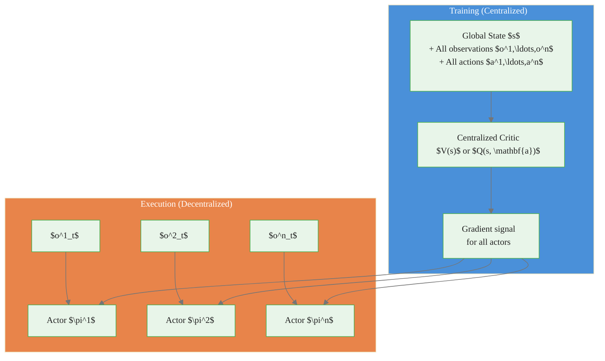

# Multi-Agent Reinforcement Learning

> **Reading time:** ~11 min | **Module:** 9 — Frontiers | **Prerequisites:** Modules 5-8

## In Brief

Multi-agent reinforcement learning (MARL) extends the single-agent RL framework to settings where multiple agents simultaneously interact with a shared environment. Each agent observes (possibly partial) state, selects actions, and receives rewards — but now every agent's behavior shapes the environment experienced by all others.

<div class="callout-key">

<strong>Key Concept:</strong> Multi-agent reinforcement learning (MARL) extends the single-agent RL framework to settings where multiple agents simultaneously interact with a shared environment. Each agent observes (possibly partial) state, selects actions, and receives rewards — but now every agent's behavior shapes the environment experienced by all others.

</div>


## Key Insight

The fundamental difficulty of MARL is that the environment appears **non-stationary** to every individual agent: as agents update their policies, the transition and reward distributions experienced by any single agent change, even if the underlying environment dynamics are fixed. This breaks the standard convergence guarantees that single-agent RL relies on.

---


<div class="callout-key">

<strong>Key Point:</strong> The fundamental difficulty of MARL is that the environment appears **non-stationary** to every individual agent: as agents update their policies, the transition and reward distributions experienced by...

</div>

## Formal Definition

A Multi-Agent MDP (MMDP) for $n$ agents is a tuple $(\mathcal{S}, \{\mathcal{A}^i\}_{i=1}^n, \mathcal{P}, \{R^i\}_{i=1}^n, \gamma)$ where:

<div class="callout-key">

<strong>Key Point:</strong> A Multi-Agent MDP (MMDP) for $n$ agents is a tuple $(\mathcal{S}, \{\mathcal{A}^i\}_{i=1}^n, \mathcal{P}, \{R^i\}_{i=1}^n, \gamma)$ where:

| Symbol | Meaning |
|--------|---------|
| $\mathcal{S}$ | ...

</div>


| Symbol | Meaning |
|--------|---------|
| $\mathcal{S}$ | Shared state space |
| $\mathcal{A}^i$ | Action space of agent $i$ |
| $\mathcal{A} = \prod_i \mathcal{A}^i$ | Joint action space |
| $\mathcal{P}(s' \mid s, \mathbf{a})$ | Transition kernel given joint action $\mathbf{a}$ |
| $R^i(s, \mathbf{a}, s')$ | Reward function for agent $i$ |
| $\gamma \in [0, 1)$ | Discount factor (shared) |

Each agent $i$ maintains a policy $\pi^i(a^i \mid o^i)$ conditioned on its own observation $o^i$ (which may be a partial view of $s$).

The joint policy is $\boldsymbol{\pi} = (\pi^1, \ldots, \pi^n)$.

---

## Taxonomy: Cooperative, Competitive, and Mixed Settings

### Cooperative (Team Reward)

<div class="callout-info">

<strong>Info:</strong> ### Cooperative (Team Reward)

All agents share a single reward signal: $R^1 = R^2 = \cdots = R^n = R$.

</div>


All agents share a single reward signal: $R^1 = R^2 = \cdots = R^n = R$.

The joint objective is:

$$\max_{\boldsymbol{\pi}} \; \mathbb{E}\left[\sum_{t=0}^{\infty} \gamma^t R(S_t, \mathbf{A}_t)\right]$$

Examples: warehouse robots coordinating fulfillment, traffic lights reducing city-wide delay, multi-UAV search and rescue.

### Competitive (Zero-Sum)

In two-agent zero-sum games: $R^1 + R^2 = 0$ at every step. What one agent gains, the other loses.

$$R^1(s, \mathbf{a}) = -R^2(s, \mathbf{a}) \quad \forall s, \mathbf{a}$$

Examples: chess, poker, two-player board games, adversarial cybersecurity.

### Mixed (General-Sum)

Agents have partially aligned, partially conflicting interests. This is the most general and most common real-world setting.

Examples: autonomous vehicles at an intersection (cooperate to avoid collision, compete for right of way), market makers (compete for order flow, cooperate to provide liquidity).

---

## Independent Learners

The simplest MARL approach: each agent runs a standard single-agent RL algorithm (e.g., Q-learning or PPO) and treats all other agents as part of the environment.

**Procedure for agent $i$:**

1. Observe $o^i_t$
2. Select $a^i_t \sim \pi^i(\cdot \mid o^i_t)$
3. Receive $r^i_t$ and observe $o^i_{t+1}$
4. Update $\pi^i$ using any single-agent RL update

**Pros:** Simple, scalable, no inter-agent communication required.

**Cons:** The environment is non-stationary from each agent's perspective (other agents are learning simultaneously), breaking convergence guarantees. Q-values estimated during early training become stale as other agents' policies change.


<span class="filename">example.py</span>
</div>
The following implementation builds on the approach above:



**Key algorithms using CTDE:**

- **MADDPG** (Multi-Agent DDPG): Each agent has a centralized critic that conditions on all agents' observations and actions. Actors are decentralized.
- **MAPPO** (Multi-Agent PPO): Shared or per-agent centralized value function; decentralized policies.
- **QMIX**: Centralized monotonic mixing network over per-agent Q-values, enabling credit assignment while keeping execution decentralized.

### MADDPG Centralized Critic

$$Q^i_{\boldsymbol{\mu}}(s, a^1, \ldots, a^n) \approx Q^i_*(s, a^1, \ldots, a^n)$$

The critic for agent $i$ sees the full joint action. The actor for agent $i$ conditions only on $o^i$:

$$\nabla_{\theta^i} J(\pi^i) = \mathbb{E}\left[\nabla_{\theta^i} \log \pi^i(a^i \mid o^i) \cdot Q^i_{\boldsymbol{\mu}}(s, a^1, \ldots, a^n)\right]$$

---

## Communication Between Agents

When agents can send messages, the effective observation of agent $i$ becomes $(o^i_t, m^{-i}_t)$ where $m^{-i}_t$ are messages received from other agents.

**Learned communication approaches:**

- **CommNet**: Continuous messages averaged across agents; agents learn what to communicate end-to-end.
- **DIAL** (Differentiable Inter-Agent Learning): Messages passed as differentiable channels; gradients flow through communication.
- **ATOC**: Attention mechanism selects which agents to communicate with (sparse communication).

**Design considerations:**

| Dimension | Options |
|-----------|---------|
| Message content | Learned continuous vectors, discrete tokens, explicit state summaries |
| Communication topology | All-to-all, graph-structured, attention-selected |
| Bandwidth | Continuous vs. quantized vs. binary messages |
| Timing | Synchronous vs. asynchronous |


<span class="filename">example.py</span>
</div>
The following implementation builds on the approach above:

<div class="code-window">
<div class="code-header">
<div class="dots"><span class="dot-red"></span><span class="dot-yellow"></span><span class="dot-green"></span></div>

```python
class CommunicatingAgent:
    """
    Agent that learns both a local policy and a message encoding.
    Messages are continuous vectors processed by recipients via attention.
    """
    def __init__(self, obs_dim: int, msg_dim: int, action_dim: int):
        self.encoder = MessageEncoder(obs_dim, msg_dim)
        self.attention = AttentionAggregator(msg_dim)
        self.actor = Actor(obs_dim + msg_dim, action_dim)

    def encode_message(self, obs: torch.Tensor) -> torch.Tensor:
        # Compress own observation into a message for peers
        return self.encoder(obs)

    def act(self, obs: torch.Tensor, received_messages: torch.Tensor) -> torch.Tensor:
        # Aggregate received messages using attention weights
        aggregated = self.attention(received_messages)
        # Condition policy on own obs + aggregated peer information
        return self.actor(torch.cat([obs, aggregated], dim=-1))
```

</div>
</div>

---

## Nash Equilibrium in Multi-Agent Settings

In general-sum games, the solution concept generalizing optimality is the **Nash Equilibrium (NE)**: a joint policy $\boldsymbol{\pi}^*$ such that no agent can unilaterally improve its expected return by deviating.

**Formal definition:**

$$V^i(\pi^{i*}, \boldsymbol{\pi}^{-i*}) \geq V^i(\pi^i, \boldsymbol{\pi}^{-i*}) \quad \forall \pi^i, \; \forall i$$

where $\boldsymbol{\pi}^{-i}$ denotes all agents' policies except agent $i$.

**Key facts:**

- Nash equilibria always exist in finite games (Nash, 1950).
- Nash equilibria need not be unique — there may be many.
- Computing Nash equilibria in general-sum games is PPAD-hard.
- In two-player zero-sum games, Nash equilibria correspond to minimax optimal strategies and are efficiently computable via linear programming.

**Connection to RL:** Self-play training (each agent plays against the current version of other agents) can converge to Nash equilibria in two-player zero-sum games. AlphaGo and AlphaStar use this approach.

---

## Applications

### Traffic Control

- **State:** vehicle counts and waiting times at each intersection
- **Action:** phase duration for each traffic light
- **Reward:** negative total waiting time across all vehicles
- **Setting:** cooperative (all lights minimize city-wide delay)
- **Challenge:** thousands of intersecting agents; scalability requires parameter sharing or hierarchical control

### Multi-Player Games

- **Setting:** competitive (poker, StarCraft) or mixed (team games)
- **Key results:** AlphaStar reached Grandmaster in StarCraft II; OpenAI Five won against world champions in Dota 2
- **Algorithm:** self-play with population-based training to avoid cyclic overfitting

### Market Making

- **State:** order book depth, recent trade flow, inventory position
- **Action:** bid/ask spread and quote sizes
- **Reward:** realized P&L minus inventory risk penalty
- **Setting:** mixed-sum (market makers compete for flow, collectively provide liquidity)
- **Challenge:** adversarial informed traders; partially observable opponent intent

---

## Challenges

### Non-Stationarity

As all agents update simultaneously, the MDP experienced by each agent is non-stationary. Standard convergence proofs for Q-learning require a stationary environment and do not apply.

**Mitigations:** opponent modeling, slow policy updates, centralized critics (CTDE), averaging over recent opponent policies.

### Credit Assignment

In cooperative settings with shared reward, identifying which agent's action contributed to a positive outcome is the **multi-agent credit assignment problem**.

$$\delta^i = r - \text{baseline without agent } i$$

QMIX, COMA (Counterfactual Multi-Agent Policy Gradients), and VDN (Value Decomposition Networks) each offer different solutions.

### Scalability

Joint action space grows exponentially: $|\mathcal{A}| = \prod_{i=1}^n |\mathcal{A}^i|$.

**Mitigations:** factored value functions, mean-field approximations (replace interactions with average-agent interaction), parameter sharing across homogeneous agents.

---

## Common Pitfalls

<div class="callout-danger">

<strong>Danger:</strong> The pitfalls below are the most common mistakes practitioners make. Each one can silently degrade your results without obvious errors.

</div>

**Pitfall 1 — Applying single-agent convergence guarantees to multi-agent settings.**
Q-learning provably converges in single-agent MDPs. In multi-agent settings with simultaneously-learning agents, Q-values chase moving targets. Do not assume convergence without additional assumptions (e.g., two-player zero-sum, or all agents converging in a specific order).

<div class="callout-warning">

<strong>Warning:</strong> **Pitfall 1 — Applying single-agent convergence guarantees to multi-agent settings.**
Q-learning provably converges in single-agent MDPs.

</div>

**Pitfall 2 — Ignoring non-stationarity in replay buffers.**
Experience replay stores transitions from earlier stages of training. In MARL, these old transitions were generated by earlier (different) policies of all agents. Old data is off-policy with respect to the current joint policy, which can cause instability. Use short replay buffers or prioritize recent data.

**Pitfall 3 — Conflating cooperative and competitive objectives.**
Setting up a cooperative task (e.g., traffic) as a competitive game (each agent maximizes its own throughput) leads to socially suboptimal equilibria. Always verify that reward structure matches the desired multi-agent objective.

**Pitfall 4 — Overlooking the partial observability problem.**
In most real deployments, agents receive local observations, not full global state. Conditioning on full state during evaluation (after training on full state) is an evaluation bug. Train and evaluate under the same observation regime.

**Pitfall 5 — Underestimating communication bandwidth costs.**
Learned communication algorithms often pass dense continuous message vectors at every step. In robotics or distributed systems, bandwidth is constrained. Design message protocols with real communication costs in mind from the start.

---

## Connections


<div class="callout-info">

<strong>Info:</strong> This section maps how this guide connects to the broader course. Use these links to navigate related material.

</div>

- **Builds on:** MDP formalism (Module 0), policy gradient methods (Module 6), value function approximation (Module 4)
- **Leads to:** Offline RL (Guide 02), Safe RL and RLHF (Guide 03), RL for trading (Guide 04)
- **Related to:** game theory (Nash equilibria, mechanism design), decentralized control, swarm intelligence

---


## Practice Questions

**Question 1 — Conceptual:** Based on the concepts in this guide, explain in your own words why the core technique matters and when you would choose it over alternatives.

**Question 2 — Application:** Sketch out how you would apply the main concept from this guide to a real-world dataset or problem you have encountered. What would you need to watch out for?


## Further Reading

- Lowe et al. (2017). *Multi-Agent Actor-Critic for Mixed Cooperative-Competitive Environments* (MADDPG) — the foundational CTDE paper
- Rashid et al. (2018). *QMIX: Monotonic Value Function Factorisation for Deep Multi-Agent Reinforcement Learning* — cooperative credit assignment via mixing networks
- Vinyals et al. (2019). *Grandmaster level in StarCraft II using multi-agent reinforcement learning* — large-scale MARL in complex games
- Yang et al. (2018). *Mean Field Multi-Agent Reinforcement Learning* — scalable approximation for large populations
- Hernandez-Leal et al. (2019). *A Survey and Critique of Multiagent Deep Reinforcement Learning* — comprehensive overview with failure modes


---

## Cross-References

<a class="link-card" href="./01_multi_agent_rl_slides.md">
  <div class="link-card-title">Companion Slides</div>
  <div class="link-card-description">Interactive slide deck covering the key concepts with visual examples.</div>
</a>

<a class="link-card" href="../notebooks/01_offline_rl_basics.ipynb">
  <div class="link-card-title">Hands-on Notebook</div>
  <div class="link-card-description">15-minute micro-notebook with guided exercises and real data.</div>
</a>
