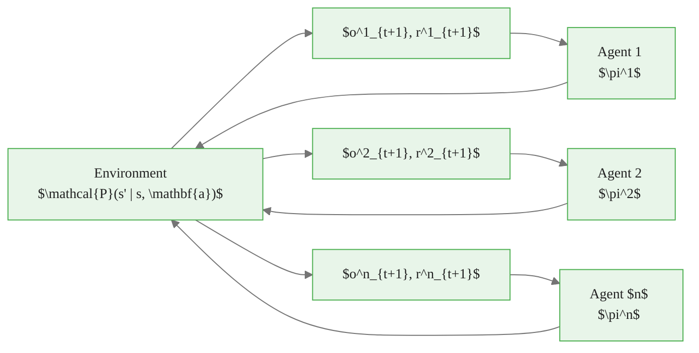
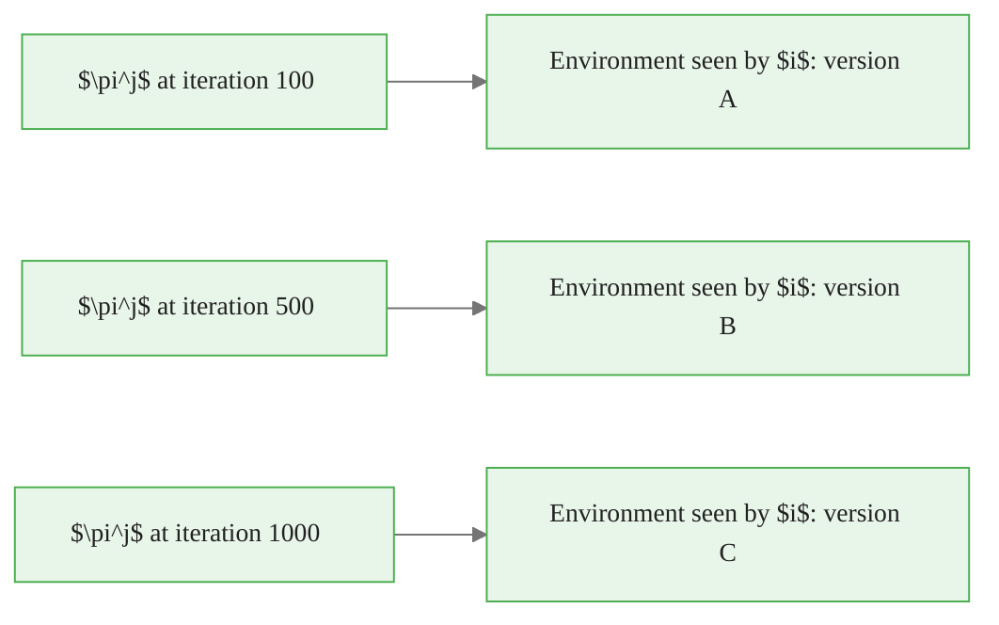
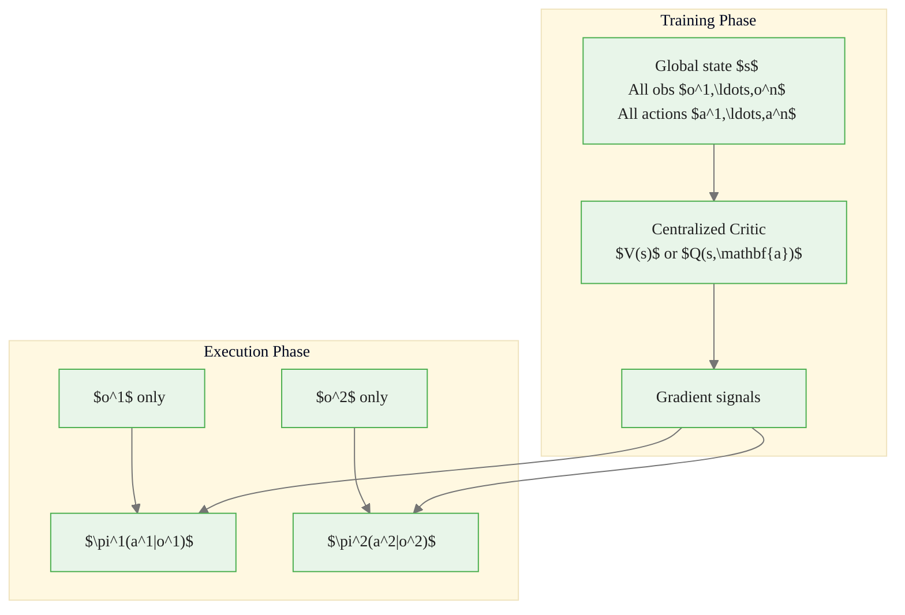
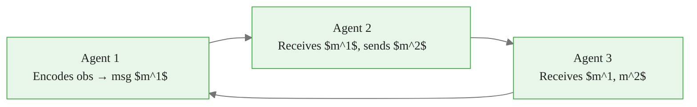
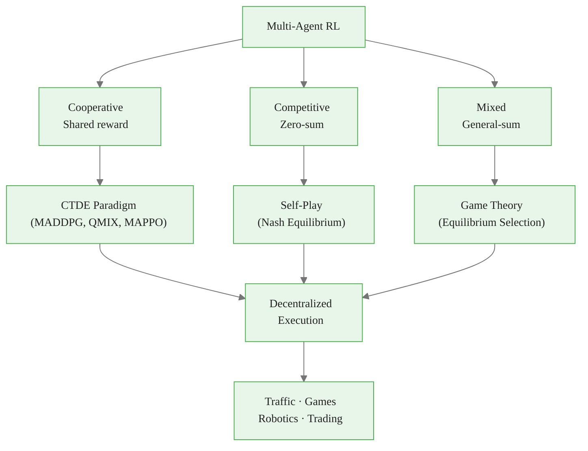

<!-- _class: lead -->

# Multi-Agent Reinforcement Learning

## Module 9: Frontiers & Applications
### Reinforcement Learning

<!-- Speaker notes: Welcome to the multi-agent RL lecture. Single-agent RL is a clean abstraction, but the real world is populated by many learning agents simultaneously. This deck builds the vocabulary and key algorithmic ideas needed to reason about those settings. Ask the audience: who has played a multiplayer game or traded in a market? Both are multi-agent environments. -->

---

## Why Multi-Agent RL?

Most real environments involve **multiple decision-makers**:

| Domain | Agents | Interaction |
|--------|--------|-------------|
| Traffic control | Traffic lights | Cooperative |
| Financial markets | Traders, market makers | Mixed |
| Game playing | Opponents | Competitive |
| Robotics | Robot fleet | Cooperative |
| Autonomous vehicles | Cars at intersection | Mixed |

> Single-agent RL assumes the environment is stationary. Multi-agent RL drops that assumption.


<div class="callout-insight">
<strong>Insight:</strong> This is a key takeaway from this section that connects to the broader course themes.
</div>

<!-- Speaker notes: Ground the motivation before defining anything formal. The key point is that single-agent RL has a silent assumption: the environment does not change as a result of other learning agents. In MARL, that assumption fails by design. This is not just an edge case — it is the normal condition for deployed AI systems. -->

---

## Formal Setup: Multi-Agent MDP

An MMDP for $n$ agents: $(\mathcal{S}, \{\mathcal{A}^i\}_{i=1}^n, \mathcal{P}, \{R^i\}_{i=1}^n, \gamma)$

$$\mathcal{P}(s' \mid s, \mathbf{a}), \quad \mathbf{a} = (a^1, \ldots, a^n) \in \prod_i \mathcal{A}^i$$

Each agent $i$ has policy $\pi^i(a^i \mid o^i)$ conditioned on **own observation** $o^i$.




<div class="callout-key">
<strong>Key Point:</strong> Remember this concept — it appears repeatedly in later modules.
</div>

<!-- Speaker notes: Walk through the MMDP definition carefully. Point out that the transition kernel now conditions on the full joint action vector — no single agent controls the outcome alone. The joint action space is the Cartesian product, so it grows exponentially with the number of agents. This is why scalability is a central challenge. -->

---

## Three Settings: Cooperative, Competitive, Mixed

<div class="columns">
<div>

### Cooperative
All agents share reward:
$$R^1 = R^2 = \cdots = R^n$$

Agents form a **team**.

Examples: warehouse robots, search-and-rescue UAVs, traffic lights

</div>
<div>

### Competitive (Zero-Sum)
$$R^1 + R^2 = 0$$

One agent's gain is the other's loss.

Examples: chess, poker, adversarial networks

### Mixed (General-Sum)
Partially aligned interests.

Examples: market making, autonomous vehicles, social dilemmas

</div>
</div>


<div class="callout-warning">
<strong>Warning:</strong> This is a common source of confusion. Pay close attention to the distinction here.
</div>

<!-- Speaker notes: This taxonomy is the most important conceptual framework in MARL. The appropriate algorithm, convergence guarantee, and solution concept depend entirely on which regime you are in. Spend time here. Cooperative settings allow joint optimization. Competitive settings require adversarial thinking. Mixed settings require game-theoretic reasoning about equilibria. -->

---

## Approach 1: Independent Learners

Each agent runs **standard single-agent RL**, treating others as part of the environment.

<div class="code-window">
<div class="code-header">
<div class="dots"><span class="dot-red"></span><span class="dot-yellow"></span><span class="dot-green"></span></div>
<span class="filename">example.py</span>
</div>

```python
class IndependentLearner:
    def act(self, own_observation):
        # Only sees own observation — other agents invisible
        return self.policy_net(own_observation).sample()

    def update(self, batch):
        # Standard single-agent update (PPO, DQN, etc.)
        loss = policy_gradient_loss(self.policy_net, batch)
        loss.backward()
        self.optimizer.step()
```
</div>

**Pros:** Simple, scalable, no coordination needed

**Cons:** Environment is non-stationary — convergence guarantees break

> The world is not stationary because the other agents are also learning.


<div class="callout-info">
<strong>Info:</strong> This detail is useful context but not required to memorize.
</div>

<!-- Speaker notes: Independent learners is the baseline to understand before anything more sophisticated. It often works surprisingly well in practice despite lacking theoretical guarantees. The key failure mode is that Q-values estimated early in training become stale as other agents' policies change. Ask: if you played poker against opponents who kept changing their strategy, would your model of their play stay accurate? -->

---

## The Non-Stationarity Problem

From agent $i$'s perspective, the effective environment changes as other agents learn:

$$\mathcal{P}^i_{\text{eff}}(o^i_{t+1} \mid o^i_t, a^i_t) = \sum_{\mathbf{a}^{-i}} \mathcal{P}(s_{t+1} \mid s_t, a^i_t, \mathbf{a}^{-i}_t) \prod_{j \neq i} \pi^j(a^j_t \mid o^j_t)$$

As $\pi^j$ updates, $\mathcal{P}^i_{\text{eff}}$ changes — even if the true $\mathcal{P}$ is fixed.



<!-- Speaker notes: This slide makes the non-stationarity problem mathematically precise. The effective transition kernel experienced by agent i is a mixture over all other agents' policies. When those policies change, the mixture changes. This is why replay buffers are dangerous in MARL — old transitions were collected under a different joint policy. -->

---

## Approach 2: Centralized Training, Decentralized Execution (CTDE)

The dominant paradigm for **cooperative** MARL:



**Key algorithms:** MADDPG, MAPPO, QMIX, COMA

<!-- Speaker notes: CTDE is the key idea that makes cooperative MARL tractable. During training, we can use a simulator or centralized server that has access to all information. The centralized critic learns a much richer signal than any individual agent could. At deployment, each agent only uses its local observation — no communication overhead, no need for a central server. -->

---

## MADDPG: Centralized Critic, Decentralized Actors

Each agent $i$ has:
- **Actor** $\pi^i_{\theta^i}(a^i \mid o^i)$ — decentralized
- **Critic** $Q^i_{\phi^i}(s, a^1, \ldots, a^n)$ — centralized (sees all)

Policy gradient for agent $i$:

$$\nabla_{\theta^i} J = \mathbb{E}\left[\nabla_{\theta^i} \log \pi^i(a^i \mid o^i) \cdot Q^i_{\phi^i}(s, a^1, \ldots, a^n)\right]$$

> The critic sees the full joint action. The actor conditions only on own observation. At deployment, the critic is discarded.

<!-- Speaker notes: Walk through the MADDPG gradient equation carefully. The actor gradient looks identical to standard policy gradient, except the Q-value is evaluated by a critic that has full information. This dramatically reduces variance because the critic can attribute reward correctly even when the reward depends on the joint action. The critic is a training scaffold, not a deployment component. -->

---

## QMIX: Credit Assignment via Value Decomposition

In cooperative settings, factorize the joint Q-function:

$$Q_{\text{tot}}(s, \mathbf{a}) = f_{\psi}(Q^1(o^1, a^1), \ldots, Q^n(o^n, a^n); s)$$

where $f_\psi$ is a **monotone mixing network** (weights are non-negative):

$$\frac{\partial Q_{\text{tot}}}{\partial Q^i} \geq 0 \quad \forall i$$

This ensures: $\arg\max_{\mathbf{a}} Q_{\text{tot}} = (\arg\max_{a^1} Q^1, \ldots, \arg\max_{a^n} Q^n)$

Each agent can act greedily on its own $Q^i$ — decentralized execution is consistent with joint optimality.

<!-- Speaker notes: QMIX solves the credit assignment problem elegantly. The monotonicity constraint on the mixing network guarantees that each agent's individual greedy action aligns with the globally optimal joint action. This is a non-trivial constraint — without it, agents might learn individually optimal actions that are jointly suboptimal. The mixing network is conditioned on global state during training. -->

---

## Nash Equilibrium

In general-sum games, the solution concept is **Nash Equilibrium**: a joint policy where no agent benefits from unilateral deviation.

$$V^i(\pi^{i*}, \boldsymbol{\pi}^{-i*}) \geq V^i(\pi^i, \boldsymbol{\pi}^{-i*}) \quad \forall \pi^i, \; \forall i$$

| Game Type | Solution Concept | Computability |
|-----------|-----------------|---------------|
| Two-player zero-sum | Minimax = Nash | Polynomial (LP) |
| Cooperative | Social welfare optimum | Problem-dependent |
| General-sum | Nash Equilibrium | PPAD-hard in general |

**Self-play:** Train each agent against current versions of others. Converges to Nash in two-player zero-sum games.

<!-- Speaker notes: Nash equilibrium is the game-theoretic cornerstone of MARL. The key practical point is that computing exact Nash equilibria is computationally hard for general-sum games, but self-play provides an approximate procedure that works in practice for zero-sum games. AlphaGo and AlphaStar both use self-play as their core training loop. The PPAD-hardness result means we should not expect efficient exact algorithms for general multi-agent settings. -->

---

## Agent Communication

When agents can send messages, effective observation becomes $(o^i_t, m^{-i}_t)$:



**Key approaches:**

- **CommNet:** Continuous messages averaged across agents; learned end-to-end
- **DIAL:** Differentiable channels; gradients flow through communication
- **ATOC:** Attention selects *who* to communicate with (sparse)

> Communication is only useful if the receiver can interpret the message and act on it.

<!-- Speaker notes: Communication is the bridge between independent learning and full coordination. The key insight is that messages must be learned jointly with the policy — you cannot design a fixed protocol in advance for complex tasks. The attention-based approaches (ATOC) are particularly practical because they manage communication bandwidth by selectively communicating only when it helps. -->

---

## Applications Deep Dive

<div class="columns">
<div>

### Traffic Control
- State: queue lengths, wait times
- Action: signal phase durations
- Reward: minimize city-wide delay
- Setting: cooperative
- Scale: hundreds of intersections

### Multi-Player Games
- AlphaStar: Grandmaster StarCraft II
- OpenAI Five: Dota 2 world champions
- Method: self-play + population training

</div>
<div>

### Market Making
- State: order book, inventory, flow
- Action: bid/ask spread, quote size
- Reward: P&L minus inventory risk
- Setting: mixed-sum
- Challenge: adversarial informed traders

### Robotics Fleet
- State: positions, sensor readings
- Action: motor commands
- Reward: shared task completion
- Method: CTDE with parameter sharing

</div>
</div>

<!-- Speaker notes: Ground each application in the MARL taxonomy. For traffic: purely cooperative, reward is shared city-wide metric. For games: zero-sum (chess, poker) or mixed-sum (team games). For market making: mixed — market makers compete with each other but collectively provide a service. For robotics: cooperative with homogeneous agents, often using parameter sharing to scale. -->

---

## Key Challenges Summary

| Challenge | Root Cause | Common Mitigations |
|-----------|------------|-------------------|
| Non-stationarity | Other agents are learning | CTDE, opponent modeling, slow updates |
| Credit assignment | Shared reward, joint actions | QMIX, COMA, counterfactual baselines |
| Scalability | Exponential joint action space | Mean field, parameter sharing, factored Q |
| Partial observability | Local observations only | Communication, memory, CTDE |
| Equilibrium selection | Multiple Nash equilibria exist | Convention, commitment, communication |

<!-- Speaker notes: This table summarizes the entire field in a single reference slide. Each challenge has a root cause and known mitigations. Emphasize that none of these challenges has a complete solution — MARL is an active research area. When students encounter MARL problems in practice, this table provides a diagnostic checklist: identify which challenges are present, then select mitigations accordingly. -->

---

## Common Pitfalls

**Pitfall 1 — Assuming single-agent convergence in MARL.**
Q-learning proofs require a stationary environment. With simultaneously-learning agents, Q-values chase moving targets. Convergence is not guaranteed without additional structure.

**Pitfall 2 — Stale replay buffers.**
Old transitions were generated under a different joint policy. Prioritize recent data or use short replay windows in MARL.

**Pitfall 3 — Wrong reward structure.**
Using competitive rewards for a cooperative task leads to socially suboptimal equilibria. Always verify that reward structure matches the desired outcome.

**Pitfall 4 — Evaluating with global state after partial-observation training.**
This creates an evaluation—training mismatch. Always match observation regime between training and evaluation.

<!-- Speaker notes: Common pitfalls are where most MARL projects fail in practice. Pitfall 1 is the most dangerous because it's invisible — independent learners often appear to converge but have not found a stable Nash equilibrium. Pitfall 3 is surprisingly common: engineers set up competitive rewards because they seem natural, then wonder why agents do not cooperate. Always start by explicitly deciding: cooperative, competitive, or mixed? -->

---

## Visual Summary



**Next:** Offline RL — learning from fixed datasets without environment interaction

<!-- Speaker notes: This summary diagram shows how the entire MARL landscape organizes around three settings, each with its own algorithmic approach, all converging on decentralized execution. Emphasize the bottom row: despite all the algorithmic complexity, the end goal is always a decentralized policy that each agent can run independently. This is the engineering contract that makes MARL systems deployable in the real world. -->
