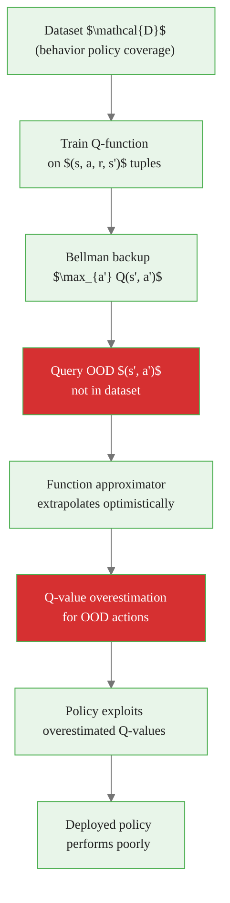
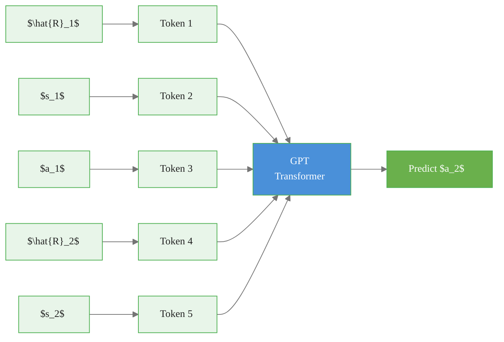

# Offline Reinforcement Learning

> **Reading time:** ~12 min | **Module:** 9 — Frontiers | **Prerequisites:** Modules 5-8

## In Brief

Offline RL (also called batch RL) learns a policy entirely from a fixed, pre-collected dataset of transitions — without any interaction with the environment during training. The agent cannot take new actions to collect new data; it must extract a good policy purely from whatever trajectories exist in the dataset.

<div class="callout-key">

<strong>Key Concept:</strong> Offline RL (also called batch RL) learns a policy entirely from a fixed, pre-collected dataset of transitions — without any interaction with the environment during training. The agent cannot take new actions to collect new data; it must extract a good policy purely from whatever trajectories exist in the dataset.

</div>


## Key Insight

The defining challenge of offline RL is **distribution shift**: a learned policy will visit states and take actions that are poorly represented in the training data, and the Q-function learned from that data will be wildly inaccurate in those regions. Naively applying standard off-policy RL to a fixed dataset leads to catastrophic overestimation of Q-values for out-of-distribution (OOD) actions.

---


<div class="callout-key">

<strong>Key Point:</strong> The defining challenge of offline RL is **distribution shift**: a learned policy will visit states and take actions that are poorly represented in the training data, and the Q-function learned from th...

</div>
## Formal Definition

Given a fixed dataset $\mathcal{D} = \{(s_t, a_t, r_t, s_{t+1})\}$ collected by some **behavior policy** $\pi_\beta$, the offline RL problem is:

<div class="callout-key">

<strong>Key Point:</strong> Given a fixed dataset $\mathcal{D} = \{(s_t, a_t, r_t, s_{t+1})\}$ collected by some **behavior policy** $\pi_\beta$, the offline RL problem is:

$$\max_\pi \; J(\pi) = \mathbb{E}_{s_0}\left[\sum_{t=0...

</div>


$$\max_\pi \; J(\pi) = \mathbb{E}_{s_0}\left[\sum_{t=0}^\infty \gamma^t R(S_t, A_t) \;\middle|\; A_t \sim \pi(\cdot \mid S_t)\right]$$

subject to the constraint that **no new environment interaction is permitted** during optimization.

The dataset coverage is characterized by $d^{\pi_\beta}(s, a)$ — the state-action visitation distribution of the behavior policy. Out-of-distribution means $(s, a) \notin \text{supp}(d^{\pi_\beta})$.

---

## Why Offline RL Matters

### Safety-Critical Domains

<div class="callout-insight">

<strong>Insight:</strong> ### Safety-Critical Domains

In healthcare, autonomous vehicles, or industrial control, deploying a partially-trained agent to collect exploration data may cause irreversible harm.

</div>


In healthcare, autonomous vehicles, or industrial control, deploying a partially-trained agent to collect exploration data may cause irreversible harm. Offline RL enables learning from historical records without risk.

| Domain | Why Online RL Fails | Available Data |
|--------|--------------------|--------------:|
| Healthcare | Cannot randomize patient treatments | EHR records, clinical trials |
| Autonomous driving | Crashes during exploration are unacceptable | Dashcam footage, driving logs |
| Robotics | Physical wear, safety incidents | Past deployment logs |
| Recommendation | A/B test costs; user experience degradation | Historical interaction logs |
| Trading | Exploration means real financial losses | Historical order flow |

### Expensive Simulators

When a simulator exists but is computationally expensive (climate models, protein folding, FEM simulations), online RL may require billions of simulator calls. Offline RL amortizes cost by learning from a fixed budget of simulator runs.

---

## The Distribution Shift Problem

This is the core challenge. Consider training Q-learning on $\mathcal{D}$ using the Bellman backup:

$$Q(s, a) \leftarrow r + \gamma \max_{a'} Q(s', a')$$

The $\max_{a'}$ operator queries Q-values at $(s', a')$ pairs that the behavior policy never visited. These Q-values are extrapolated by the function approximator in an unconstrained way.

<div class="code-window">
<div class="code-header">
<div class="dots"><span class="dot-red"></span><span class="dot-yellow"></span><span class="dot-green"></span></div>
<span class="filename">example.py</span>
</div>

The following implementation builds on the approach above:



</div>

**The death spiral:** Q-values for OOD actions are overestimated → the greedy policy selects those actions → those actions have no supporting data → Q-values get even more inaccurate through bootstrapping → the policy becomes increasingly OOD.

---

## Conservative Q-Learning (CQL)

CQL (Kumar et al., 2020) directly penalizes Q-values for actions that the dataset does not support.

### Objective

$$\min_Q \; \alpha \underbrace{\left(\mathbb{E}_{s \sim \mathcal{D}, a \sim \mu(a|s)}[Q(s,a)] - \mathbb{E}_{(s,a) \sim \mathcal{D}}[Q(s,a)]\right)}_{\text{conservative penalty}} + \underbrace{\frac{1}{2}\mathbb{E}_{(s,a,s') \sim \mathcal{D}}\left[(Q(s,a) - \mathcal{B}^\pi \hat{Q}(s,a))^2\right]}_{\text{Bellman error}}$$

where $\mu$ is a distribution that concentrates on high-Q actions (e.g., the current policy), and $\mathcal{B}^\pi$ is the Bellman operator.

**Intuition:** Push Q-values down for policy actions, push them up for dataset actions. The result is a Q-function that is pessimistic about anything the dataset does not support.

### Key Properties

- Q-values are provably lower bounds on the true value function under the behavior policy.
- The learned policy will be conservative: it prefers actions seen in the data.
- The penalty strength $\alpha$ controls how conservative the policy is.

<div class="code-window">
<div class="code-header">
<div class="dots"><span class="dot-red"></span><span class="dot-yellow"></span><span class="dot-green"></span></div>
<span class="filename">example.py</span>
</div>

The following implementation builds on the approach above:

```python
import torch
import torch.nn.functional as F


def cql_loss(q_net, target_q_net, batch: dict, alpha: float = 1.0, gamma: float = 0.99) -> torch.Tensor:
    """
    Conservative Q-Learning loss for offline RL.

    The conservative penalty pushes Q-values down for policy actions
    and up for dataset actions. Combined with standard Bellman error,
    this yields a lower-bound Q-function that avoids overestimation.

    Parameters
    ----------
    q_net        : Q-network being trained
    target_q_net : Target network for stable Bellman backup
    batch        : Dict with keys 's', 'a', 'r', 's_next', 'done'
    alpha        : Conservative penalty weight
    gamma        : Discount factor

    Returns
    -------
    Total CQL loss (Bellman error + alpha * conservative penalty)
    """
    s, a, r, s_next, done = (
        batch['s'], batch['a'], batch['r'], batch['s_next'], batch['done']
    )

    # --- Standard Bellman error ---
    with torch.no_grad():
        # Target uses behavior-cloned or current policy actions
        a_next = q_net.get_action(s_next)                        # greedy action
        q_target = r + gamma * (1 - done) * target_q_net(s_next, a_next)

    q_pred = q_net(s, a)
    bellman_error = F.mse_loss(q_pred, q_target)

    # --- Conservative penalty ---
    # Sample random actions (approximate the OOD distribution)
    a_random = torch.randint(0, q_net.action_dim, (s.shape[0],))
    q_random = q_net(s, a_random)                                 # Q for random actions
    q_dataset = q_net(s, a)                                       # Q for dataset actions

    # Penalize: push random-action Q down, pull dataset-action Q up
    conservative_penalty = q_random.mean() - q_dataset.mean()

    return bellman_error + alpha * conservative_penalty
```

</div>

---

## Decision Transformer

Decision Transformer (Chen et al., 2021) reframes offline RL as a **sequence modeling problem**, bypassing the distribution shift problem entirely by not using Bellman backups.

### Key Idea

Represent a trajectory as a sequence of (return-to-go, state, action) triples:

$$\hat{R}_t = \sum_{t'=t}^{T} r_{t'} \quad \text{(return-to-go from step } t \text{)}$$

Sequence: $(\hat{R}_1, s_1, a_1, \hat{R}_2, s_2, a_2, \ldots, \hat{R}_T, s_T, a_T)$

Train a GPT-style autoregressive Transformer to predict $a_t$ given the context $(\hat{R}_1, s_1, a_1, \ldots, \hat{R}_t, s_t)$.

At inference, condition on a desired target return $\hat{R}_1 = R_{\text{target}}$, and the model generates actions that achieve it.

<div class="code-window">
<div class="code-header">
<div class="dots"><span class="dot-red"></span><span class="dot-yellow"></span><span class="dot-green"></span></div>
<span class="filename">example.py</span>
</div>

The following implementation builds on the approach above:



</div>

**Advantages over CQL:**

- No Bellman backup → no bootstrapping → no compounding distribution shift errors
- Natural handling of long-horizon credit assignment via attention
- Scales with data and model size like standard LLM pre-training

**Disadvantages:**

- Cannot improve beyond the best trajectory in the dataset (no stitching of suboptimal trajectories)
- Requires careful specification of the target return at inference time

---

## Implicit Q-Learning (IQL)

IQL (Kostrikov et al., 2021) avoids querying OOD actions entirely during training by using **expectile regression** to learn a Q-function that represents the maximum over in-distribution actions.

### Core Idea

Standard Q-learning computes $\max_{a'} Q(s', a')$ during the Bellman backup, which requires evaluating Q on policy actions (potentially OOD). IQL replaces this with an expectile regression objective on the value function $V(s)$:

$$\mathcal{L}_V = \mathbb{E}_{(s,a) \sim \mathcal{D}}\left[\mathcal{L}_2^\tau\left(Q(s,a) - V(s)\right)\right]$$

where $\mathcal{L}_2^\tau(u) = |\tau - \mathbf{1}(u < 0)| \cdot u^2$ is the asymmetric expectile loss with $\tau \in (0.5, 1.0)$.

For $\tau \to 1$, $V(s)$ approaches $\max_{a \in \mathcal{D}(s)} Q(s, a)$ — the maximum over **dataset actions only**, not over all possible actions.

<div class="code-window">
<div class="code-header">
<div class="dots"><span class="dot-red"></span><span class="dot-yellow"></span><span class="dot-green"></span></div>
<span class="filename">example.py</span>
</div>


```python
def iql_value_loss(q_net, v_net, batch: dict, tau: float = 0.7) -> torch.Tensor:
    """
    IQL value function update via expectile regression.

    Instead of max_a' Q(s', a') which queries OOD actions,
    IQL learns V(s) ≈ max_{a in dataset} Q(s, a) via expectile regression.

    Parameters
    ----------
    q_net  : Q-network (frozen during value update)
    v_net  : Value network being trained
    batch  : Dataset batch with keys 's', 'a'
    tau    : Expectile level. Higher tau → closer to in-dataset max.
             Typical range: 0.6 to 0.9

    Returns
    -------
    Expectile regression loss for the value network
    """
    with torch.no_grad():
        q_values = q_net(batch['s'], batch['a'])     # Q for dataset (s, a) pairs

    v_values = v_net(batch['s'])
    u = q_values - v_values

    # Asymmetric L2: weight positive errors by tau, negative by (1 - tau)
    weight = torch.where(u > 0, tau * torch.ones_like(u), (1 - tau) * torch.ones_like(u))
    return (weight * u ** 2).mean()
```

</div>

---

## Algorithm Comparison

| Property | Naive Off-Policy | CQL | Decision Transformer | IQL |
|----------|:----------------:|:---:|:-------------------:|:---:|
| Handles OOD actions | No | Yes (penalty) | Yes (no Bellman) | Yes (no OOD query) |
| Trajectory stitching | Yes | Yes | No | Yes |
| Scales with model size | No | No | Yes | No |
| Requires policy gradient | Yes | Yes | No | Yes |
| Hyperparameter sensitivity | High | Medium ($\alpha$) | Low | Low ($\tau$) |
| Practical performance | Poor | Good | Good | Excellent |

---

## Applications

### Healthcare

Given EHR records of past treatments and outcomes, learn a treatment policy that generalizes better than the recorded clinician behavior. Key challenge: confounding variables (doctors treat sicker patients differently) create distribution shift even in "normal" clinical practice.

### Autonomous Driving

Learn a driving policy from dashcam footage. The challenge is that cameras only record what human drivers did — never the counterfactual of what would have happened if a different action were taken at a crucial moment.

### Recommendation Systems

Offline logs contain user interactions, but the logged policy (the old recommendation algorithm) shapes what items users saw. A new policy that recommends items users never saw cannot be evaluated accurately without returning to a distribution shift problem. Offline policy evaluation (OPE) addresses this.

---

## Common Pitfalls

<div class="callout-danger">

<strong>Danger:</strong> The pitfalls below are the most common mistakes practitioners make. Each one can silently degrade your results without obvious errors.

</div>

**Pitfall 1 — Extrapolation error from bootstrapping.**
Every Bellman backup that evaluates $\max_{a'} Q(s', a')$ on actions not in the dataset is potentially extrapolating the Q-function. In offline settings, extrapolation errors compound through multiple bootstrapping steps and lead to catastrophically overestimated Q-values. Use CQL, IQL, or avoid Bellman backups entirely (Decision Transformer).

<div class="callout-warning">

<strong>Warning:</strong> **Pitfall 1 — Extrapolation error from bootstrapping.**
Every Bellman backup that evaluates $\max_{a'} Q(s', a')$ on actions not in the dataset is potentially extrapolating the Q-function.

</div>

**Pitfall 2 — Overestimation of out-of-distribution actions.**
A neural Q-network trained on a fixed dataset will generalize beyond the support of the data. It generalizes optimistically (high Q-values for unseen actions) because standard supervised losses have no pressure to be accurate on inputs they never see. Always add an explicit pessimism mechanism.

**Pitfall 3 — Treating offline RL as supervised learning.**
Behavior cloning (BC) — directly imitating the dataset actions — is the simplest offline "policy." It ignores reward entirely. Offline RL should outperform BC significantly, especially on suboptimal datasets. If your offline RL policy only matches BC performance, the RL signal is not getting through.

**Pitfall 4 — Poor dataset coverage mistaken for poor algorithm.**
Offline RL cannot recover from completely missing data. If the optimal policy visits states or requires actions that are entirely absent from the dataset, no offline algorithm will find it. Always audit dataset coverage before debugging algorithm hyperparameters.

**Pitfall 5 — Forgetting that offline evaluation is also hard.**
You cannot evaluate a policy by running it in the environment (offline setting). Offline policy evaluation (OPE) methods (IS, DR, FQE) are needed, and they have their own estimation errors. Do not confuse OPE variance with algorithm failure.

---

## Connections


<div class="callout-info">

<strong>Info:</strong> This section maps how this guide connects to the broader course. Use these links to navigate related material.

</div>

- **Builds on:** Q-learning and temporal difference (Module 3), function approximation (Module 4), policy gradient (Module 6)
- **Leads to:** Safe RL and RLHF (Guide 03) — RLHF uses offline learning from human preference data
- **Related to:** imitation learning, inverse RL, offline policy evaluation, causal inference

---


## Practice Questions

**Question 1 — Conceptual:** Based on the concepts in this guide, explain in your own words why the core technique matters and when you would choose it over alternatives.

**Question 2 — Application:** Sketch out how you would apply the main concept from this guide to a real-world dataset or problem you have encountered. What would you need to watch out for?


## Further Reading

- Levine et al. (2020). *Offline Reinforcement Learning: Tutorial, Review, and Perspectives on Open Problems* — comprehensive survey of the field
- Kumar et al. (2020). *Conservative Q-Learning for Offline Reinforcement Learning* — CQL paper with theoretical analysis
- Chen et al. (2021). *Decision Transformer: Reinforcement Learning via Sequence Modeling* — RL as conditional sequence prediction
- Kostrikov et al. (2021). *Offline Reinforcement Learning with Implicit Q-Learning* — IQL, often the practical baseline of choice
- Fu et al. (2020). *D4RL: Datasets for Deep Data-Driven Reinforcement Learning* — standard offline RL benchmark suite


---

## Cross-References

<a class="link-card" href="./02_offline_rl_slides.md">
  <div class="link-card-title">Companion Slides</div>
  <div class="link-card-description">Interactive slide deck covering the key concepts with visual examples.</div>
</a>

<a class="link-card" href="../notebooks/01_offline_rl_basics.ipynb">
  <div class="link-card-title">Hands-on Notebook</div>
  <div class="link-card-description">15-minute micro-notebook with guided exercises and real data.</div>
</a>
