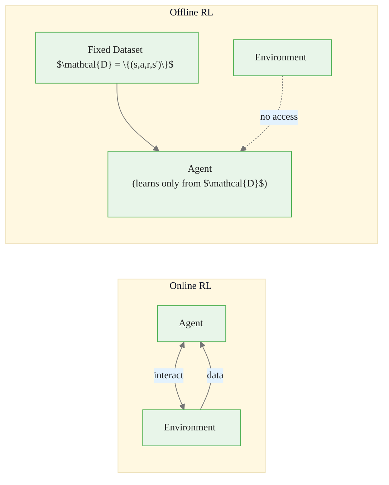
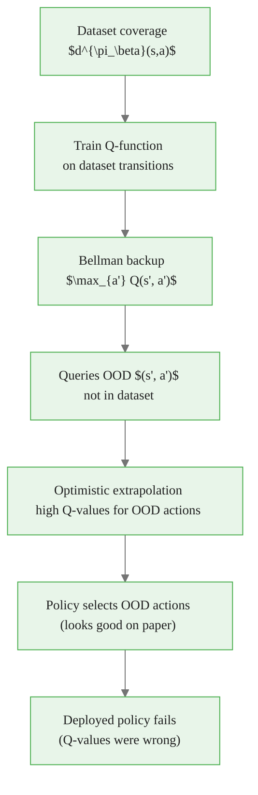
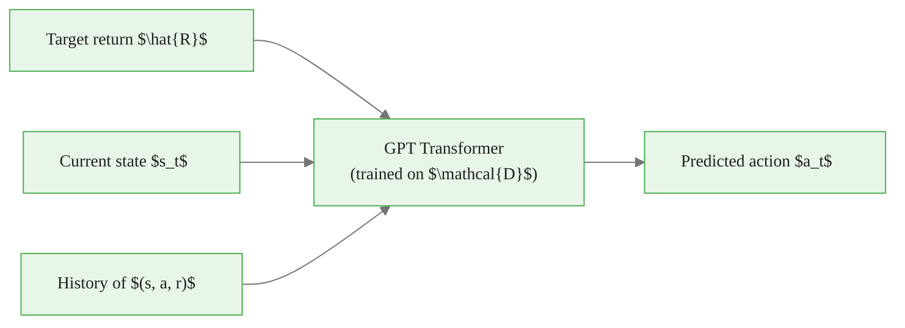
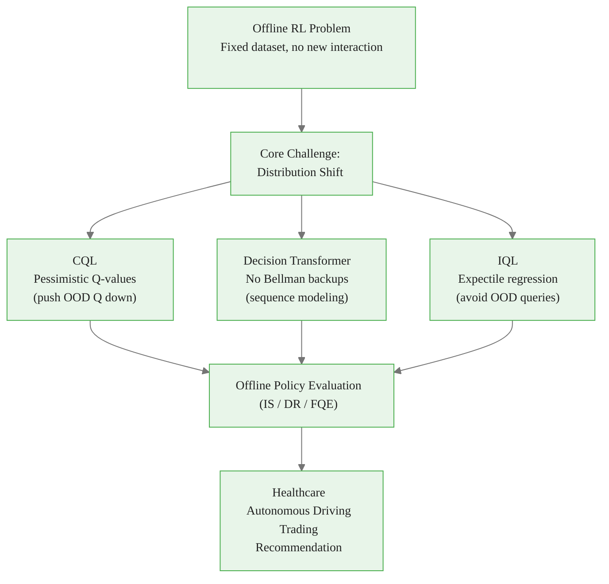

<!-- _class: lead -->

# Offline Reinforcement Learning

## Module 9: Frontiers & Applications
### Reinforcement Learning

<!-- Speaker notes: Offline RL is one of the most practically important frontiers in RL. The premise is simple: can we learn good policies from data that already exists, without interacting with the environment? This matters enormously in safety-critical domains where exploration is dangerous, expensive, or simply impossible. Set the stage by asking: how many of you have worked with historical datasets? That is the setting offline RL operates in. -->

---

## What is Offline RL?

**Online RL:** Agent interacts with environment, collects data, updates policy. Repeat.

**Offline RL:** Given a fixed dataset $\mathcal{D}$ of transitions — learn a policy. No new interaction allowed.



The dataset was collected by some **behavior policy** $\pi_\beta$ — it could be a human expert, a heuristic, a previous RL agent, or random exploration.


<div class="callout-insight">
<strong>Insight:</strong> This is a key takeaway from this section that connects to the broader course themes.
</div>

<!-- Speaker notes: Draw the contrast starkly. In online RL, data collection and learning are interleaved. In offline RL, they are completely separated. The dataset exists, it is fixed, and the agent must learn everything it needs from that fixed set of transitions. This is analogous to the difference between learning to drive by practicing (online) vs learning from a textbook and dashcam footage (offline). -->

---

## Why Offline RL Matters

| Domain | Problem with Online RL | Available Data |
|--------|------------------------|----------------|
| Healthcare | Cannot randomize patient care | EHR records |
| Autonomous driving | Crashes during exploration | Driving logs, dashcam |
| Industrial control | Equipment damage, safety incidents | Sensor logs |
| Recommendation | User experience degradation | Interaction logs |
| Trading | Real financial losses during exploration | Historical order flow |

> In these domains, **data exists but exploration is prohibited**.

Offline RL is the only RL approach that works here.


<div class="callout-key">
<strong>Key Point:</strong> Remember this concept — it appears repeatedly in later modules.
</div>

<!-- Speaker notes: The table makes the motivation concrete. In every row, the reason online RL fails is not technical — it is ethical or economic. You cannot ethically give patients random treatments to collect RL training data. You cannot financially absorb exploration losses in live trading. Offline RL is not just a technical variant — it addresses a fundamental constraint present in most real-world deployments. -->

---

## The Core Challenge: Distribution Shift

The behavior policy $\pi_\beta$ induces a state-action distribution $d^{\pi_\beta}(s, a)$.

A learned policy $\pi$ may visit $(s, a) \notin \text{supp}(d^{\pi_\beta})$.



**The death spiral:** overestimated Q-values → OOD actions selected → more OOD bootstrapping → worse overestimation.


<div class="callout-warning">
<strong>Warning:</strong> This is a common source of confusion. Pay close attention to the distinction here.
</div>

<!-- Speaker notes: This is the single most important slide in the deck. Distribution shift is not a minor technical issue — it is a fundamental obstacle that makes naive offline RL catastrophically bad. Walk through each node of the flowchart. The death spiral is real: in practice, naively applying DQN or SAC to a fixed dataset produces policies that are worse than simple behavior cloning in most settings. This motivated the entire field of offline RL algorithm design. -->

---

## Naive Off-Policy RL on Fixed Data: Why It Fails

<div class="code-window">
<div class="code-header">
<div class="dots"><span class="dot-red"></span><span class="dot-yellow"></span><span class="dot-green"></span></div>
<span class="filename">example.py</span>
</div>

```python
# Standard Q-learning Bellman backup — DANGEROUS in offline setting
def bellman_backup(q_net, s_next, r, gamma):
    # This queries Q for ALL possible actions at s_next
    # Including actions the behavior policy NEVER took
    with torch.no_grad():
        q_next = q_net(s_next)          # shape: [batch, n_actions]
        max_q_next = q_next.max(dim=-1).values  # optimistic max

    return r + gamma * max_q_next       # target: overestimated for OOD actions
```
</div>

The `max` operator selects the highest Q-value, which for OOD actions is an unconstrained extrapolation. Neural networks extrapolate optimistically — they will be overconfident in regions with no training data.

> Applying standard off-policy RL to a fixed dataset almost always produces policies worse than behavior cloning.


<div class="callout-info">
<strong>Info:</strong> This detail is useful context but not required to memorize.
</div>

<!-- Speaker notes: Show the code to make the failure mode concrete. The max operator is not inherently bad — it is essential for Q-learning. But when the Q-function has never seen the (s, a) pairs being maximized over, the max is computed over garbage values. This is a case where the algorithm is technically correct but the preconditions for its correctness are violated by the offline setting. -->

---

## Solution 1: Conservative Q-Learning (CQL)

**Idea:** Explicitly penalize Q-values for out-of-distribution actions.

$$\mathcal{L}_{\text{CQL}} = \underbrace{\alpha \Big(\mathbb{E}_{\mu}[Q(s,a)] - \mathbb{E}_{\mathcal{D}}[Q(s,a)]\Big)}_{\text{conservative penalty}} + \underbrace{\frac{1}{2}\mathbb{E}_{\mathcal{D}}\left[(Q - \mathcal{B}^\pi\hat{Q})^2\right]}_{\text{Bellman error}}$$

- Push Q **down** for policy/random actions (potentially OOD)
- Push Q **up** for dataset actions (in-distribution)
- Result: Q-function is a **pessimistic lower bound**

```python
def cql_conservative_penalty(q_net, s, a_dataset):
    a_random = torch.randint(0, q_net.action_dim, (s.shape[0],))
    q_random  = q_net(s, a_random)      # Q for random (likely OOD) actions
    q_data    = q_net(s, a_dataset)     # Q for dataset (in-distribution) actions
    return q_random.mean() - q_data.mean()  # minimize this
```

The hyperparameter $\alpha$ controls conservatism. Higher $\alpha$ → more conservative → safer but potentially suboptimal.

<!-- Speaker notes: CQL is the most widely used offline RL algorithm. The intuition is to deliberately handicap Q-values for things the agent has not seen. This is pessimism under uncertainty — a rational response to the distribution shift problem. Walk through the penalty term: we are literally subtracting the mean Q-value for random actions from the loss, which means the optimizer will push Q values for random actions down. The theory shows this makes Q a lower bound on the true value. -->

---

## Solution 2: Decision Transformer

**Reframe:** RL as conditional sequence modeling — no Bellman backups at all.

Encode trajectory as: $(\hat{R}_1, s_1, a_1, \hat{R}_2, s_2, a_2, \ldots)$

where $\hat{R}_t = \sum_{t'=t}^T r_{t'}$ is the **return-to-go**.



At inference: condition on desired target return $R_{\text{target}}$, and the model generates actions to achieve it.

**Key advantage:** No OOD Q-value queries. No bootstrapping. No distribution shift death spiral.

<!-- Speaker notes: The Decision Transformer is a conceptual breakthrough. By casting RL as sequence modeling, it sidesteps the distribution shift problem entirely — there are no Bellman backups and no OOD Q-value queries. The return-to-go token tells the model what quality of behavior to generate. This is analogous to telling a language model "write a poem at an expert level" versus "write a poem at a beginner level." The model conditions its output on the desired quality. -->

---

## Solution 3: Implicit Q-Learning (IQL)

**Idea:** Avoid querying OOD actions during Bellman backup using expectile regression.

Standard backup: $\max_{a'} Q(s', a')$ — requires evaluating Q at policy actions (potentially OOD)

IQL backup: learn $V(s) \approx \max_{a \in \mathcal{D}(s)} Q(s, a)$ via **expectile regression** — only uses dataset actions

$$\mathcal{L}_V = \mathbb{E}_{(s,a) \sim \mathcal{D}}\left[\mathcal{L}_2^\tau(Q(s,a) - V(s))\right], \quad \mathcal{L}_2^\tau(u) = |\tau - \mathbf{1}(u < 0)| \cdot u^2$$

For $\tau \to 1$: $V(s) \to \max_{a \in \mathcal{D}} Q(s, a)$ (maximum over dataset actions only)

> IQL never queries Q at OOD actions — distribution shift is avoided by construction.

<!-- Speaker notes: IQL is subtle but elegant. The expectile regression is a generalization of the quantile regression. For tau = 0.5, it recovers the mean (standard value function). For tau close to 1, it recovers something close to the maximum, but the maximum is computed using the asymmetric loss — so it only pulls V upward when Q > V, which happens at the best in-dataset actions. The result is a value function that approximates the best achievable return within the dataset support. -->

---

## Algorithm Comparison

| Property | Naive Off-Policy | CQL | Decision Transformer | IQL |
|----------|:---:|:---:|:---:|:---:|
| Handles OOD | No | Yes (penalty) | Yes (no Bellman) | Yes (no OOD query) |
| Trajectory stitching | Yes | Yes | No | Yes |
| Scales with model | No | No | Yes | No |
| Practical performance | Poor | Good | Good | Excellent |
| Hyperparameter sensitivity | High | $\alpha$ | Low | $\tau$ |

**Recommendation:** Start with IQL. Use Decision Transformer when you have large datasets and want to leverage LLM-style scaling.

<!-- Speaker notes: This comparison table is the practical takeaway. Trajectory stitching means the algorithm can combine good sub-sequences from different trajectories — this is what standard Q-learning does naturally and why it can improve over behavioral cloning. Decision Transformer cannot stitch because it generates actions based on trajectory context. IQL is currently the recommended practical starting point because it combines strong performance with relatively few hyperparameters. -->

---

## Offline Evaluation is Also Hard

You cannot evaluate a policy by running it in the environment (offline constraint!).

**Offline Policy Evaluation (OPE) methods:**

| Method | Idea | Bias | Variance |
|--------|------|------|----------|
| Importance Sampling (IS) | Reweight dataset by $\pi / \pi_\beta$ | Low | Very high |
| Doubly Robust (DR) | IS + model correction | Low | Moderate |
| Fitted Q Evaluation (FQE) | Train Q-function for target $\pi$ | Model error | Low |

> OPE estimation error is separate from policy learning error. Both matter.

<!-- Speaker notes: This slide is often omitted but is critically important. Students often assume that if they learn a policy, they can evaluate it on the training data. This is wrong for two reasons: first, the dataset was collected by a different policy; second, even if you correct for that, the policy may visit states not in the dataset. OPE is a research area in its own right. In practice, FQE (training a Q-function for the target policy on the dataset) is the most practical approach, but it inherits the distribution shift problem for OOD states. -->

---

## Application: Healthcare

**Setting:** Learn a sepsis treatment policy from ICU records.

- Dataset: 20,000 patient ICU admissions, hourly vitals and treatment decisions
- Behavior policy: recorded clinician decisions (highly variable)
- Reward: 90-day survival (sparse, terminal)
- Challenge: doctors treat sicker patients more aggressively — confounding

**Offline RL result (Komorowski et al., 2018):**

> The RL-derived policy reduced estimated 90-day mortality by 3.6% compared to average clinician behavior.

**Why not deploy immediately?** The policy may overfit to dataset biases. Offline evaluation estimates have high uncertainty. Requires prospective clinical trial before clinical use.

<!-- Speaker notes: The healthcare application is the most compelling motivating example. Emphasize the workflow: learn from historical data, evaluate offline with OPE, then design a prospective study if the OPE estimate is promising. This is not a replacement for clinical trials — offline RL narrows the search space and provides a strong starting hypothesis. The Komorowski paper is landmark work and worth assigning as further reading. -->

---

## Common Pitfalls

**Pitfall 1 — Extrapolation error from bootstrapping.**
Every Bellman backup that queries OOD actions compounds distribution shift. Use CQL, IQL, or non-Bellman methods.

**Pitfall 2 — Q-value overestimation for OOD actions.**
Neural networks extrapolate optimistically. Explicit pessimism (CQL) or avoiding OOD queries (IQL) is required.

**Pitfall 3 — Treating offline RL as supervised learning.**
Behavior cloning ignores reward. Your offline RL policy should significantly outperform BC. If it does not, the RL signal is not getting through — debug the reward structure and conservative mechanism.

**Pitfall 4 — Poor dataset coverage.**
Offline RL cannot recover optimal behavior from data that never demonstrates it. Audit dataset coverage before blaming the algorithm.

**Pitfall 5 — Confusing OPE error with algorithm error.**
Offline policy evaluation has its own variance and bias. A policy that looks bad under IS may actually be good. Use multiple OPE methods and report confidence intervals.

<!-- Speaker notes: The pitfalls section is where practical experience lives. Pitfall 3 is particularly important: behavior cloning is a strong baseline in offline settings because it directly imitates the best trajectories in the data. If your offline RL algorithm cannot beat BC on your dataset, something is wrong. Common causes: the conservative penalty is too strong (alpha too high in CQL), or the dataset has very low behavioral diversity. -->

---

## Visual Summary



**Next:** RLHF and Safe RL — when the reward function itself must be learned from humans

<!-- Speaker notes: This summary shows the full offline RL workflow. The problem and its core challenge are in red — they are constraints you cannot escape. The three algorithmic solutions are in blue — each attacks distribution shift differently. Offline policy evaluation is the bridge to real deployment. The applications are in green — where the value is realized. Emphasize that offline RL is not a finished field: all three algorithms have failure modes, and offline policy evaluation remains an open research problem. -->
