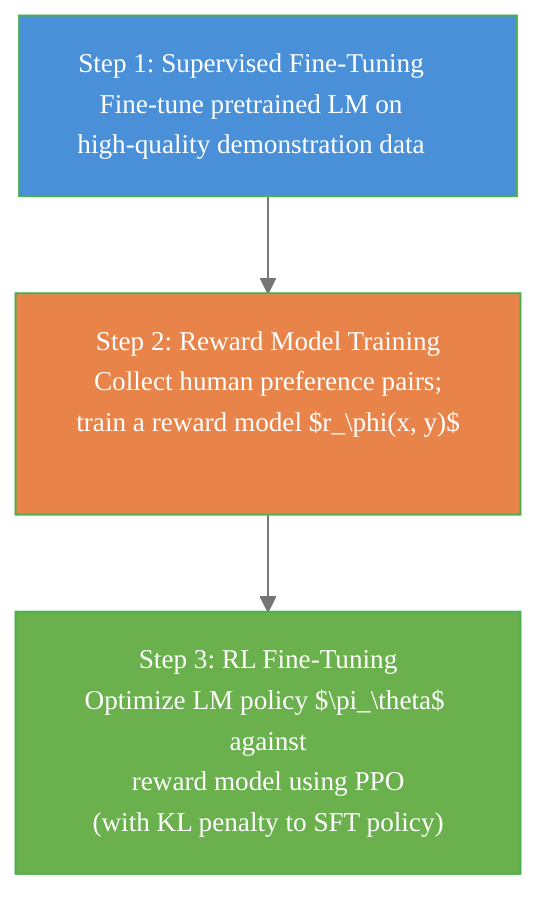

# RLHF and Safe Reinforcement Learning

> **Reading time:** ~12 min | **Module:** 9 — Frontiers | **Prerequisites:** Modules 5-8

## In Brief

Reinforcement Learning from Human Feedback (RLHF) is the dominant technique for aligning large language models with human values and preferences. Safe RL extends the standard MDP framework with explicit cost constraints, enabling agents to maximize reward while satisfying safety requirements. Both fields address the same fundamental problem: standard RL optimizes a scalar reward, but real-world objectives are more complex, multi-dimensional, and often difficult to specify precisely.

<div class="callout-key">

<strong>Key Concept:</strong> Reinforcement Learning from Human Feedback (RLHF) is the dominant technique for aligning large language models with human values and preferences. Safe RL extends the standard MDP framework with explicit cost constraints, enabling agents to maximize reward while satisfying safety requirements.

</div>


## Key Insight

In RLHF, the reward function is not specified by the designer — it is **learned** from human comparative judgments. This sidesteps the reward design problem entirely: instead of engineering a function that captures what humans want, you collect human preferences and fit a model to them. In Safe RL, safety is modeled as a **hard constraint** rather than a soft penalty, reflecting the fact that some failures (crashes, medication errors) are categorically unacceptable regardless of reward.

---


<div class="callout-key">

<strong>Key Point:</strong> In RLHF, the reward function is not specified by the designer — it is **learned** from human comparative judgments.

</div>

## RLHF: Reinforcement Learning from Human Feedback

RLHF became the standard approach for aligning large language models after InstructGPT (Ouyang et al., 2022) demonstrated that it dramatically improves model behavior on human-preferred outputs. The same three-step pipeline underpins ChatGPT, Claude, and most modern aligned LLMs.

<div class="callout-key">

<strong>Key Point:</strong> RLHF became the standard approach for aligning large language models after InstructGPT (Ouyang et al., 2022) demonstrated that it dramatically improves model behavior on human-preferred outputs.

</div>


### The Three-Step Pipeline

<div class="code-window">
<div class="code-header">
<div class="dots"><span class="dot-red"></span><span class="dot-yellow"></span><span class="dot-green"></span></div>
<span class="filename">example.py</span>
</div>

The following implementation builds on the approach above:



</div>

---

### Step 1: Supervised Fine-Tuning (SFT)

Start with a pretrained language model. Fine-tune it on a dataset of human-written demonstrations of desired behavior:

$$\mathcal{L}_{\text{SFT}} = -\sum_{(x, y) \in \mathcal{D}_{\text{demo}}} \log \pi_{\theta}(y \mid x)$$

where $x$ is a prompt and $y$ is the desired response.

**Purpose:** Initialize the policy in a region of output space that is at least somewhat aligned, before RL optimization begins. Raw pretrained models generate completions that imitate internet text, including harmful and unhelpful content.

**In InstructGPT/ChatGPT:** Contractors wrote high-quality responses to a sample of user prompts. The pretrained GPT-3 was fine-tuned on these demonstrations.

---

### Step 2: Reward Model Training

Human raters compare pairs of model outputs $(y_1, y_2)$ for the same prompt $x$ and indicate which they prefer. This comparison is modeled using the **Bradley-Terry preference model**:

$$P(y_1 \succ y_2 \mid x) = \sigma(r_\phi(x, y_1) - r_\phi(x, y_2))$$

where $r_\phi : \mathcal{X} \times \mathcal{Y} \to \mathbb{R}$ is the reward model and $\sigma$ is the sigmoid function.

The reward model is trained by maximum likelihood on the preference dataset $\mathcal{D}_{\text{pref}}$:

$$\mathcal{L}_{\text{RM}} = -\mathbb{E}_{(x, y_w, y_l) \sim \mathcal{D}_{\text{pref}}}\left[\log \sigma\left(r_\phi(x, y_w) - r_\phi(x, y_l)\right)\right]$$

where $y_w$ is the preferred ("won") response and $y_l$ is the less preferred ("lost") response.

**Architecture:** Typically the SFT model with a linear head replacing the final token prediction head. The linear head outputs a scalar reward for the full response.

<div class="code-window">
<div class="code-header">
<div class="dots"><span class="dot-red"></span><span class="dot-yellow"></span><span class="dot-green"></span></div>
<span class="filename">example.py</span>
</div>

The following implementation builds on the approach above:

```python
import torch
import torch.nn as nn
from transformers import AutoModel


class RewardModel(nn.Module):
    """
    Reward model for RLHF.

    Takes a prompt-response pair and outputs a scalar reward.
    Trained on human preference pairs using the Bradley-Terry model.

    Architecture: pretrained LM backbone + scalar head.
    The backbone is initialized from the SFT checkpoint.
    """
    def __init__(self, backbone_name: str):
        super().__init__()
        self.backbone = AutoModel.from_pretrained(backbone_name)
        hidden_dim = self.backbone.config.hidden_size
        # Scalar head maps final hidden state to reward
        self.reward_head = nn.Linear(hidden_dim, 1)

    def forward(self, input_ids: torch.Tensor, attention_mask: torch.Tensor) -> torch.Tensor:
        outputs = self.backbone(input_ids=input_ids, attention_mask=attention_mask)
        # Use last token hidden state as the sequence representation
        last_hidden = outputs.last_hidden_state[:, -1, :]
        return self.reward_head(last_hidden).squeeze(-1)


def reward_model_loss(reward_model, batch: dict) -> torch.Tensor:
    """
    Bradley-Terry loss for reward model training.

    Parameters
    ----------
    batch : dict with keys 'chosen_ids', 'chosen_mask', 'rejected_ids', 'rejected_mask'

    Returns
    -------
    Negative log-likelihood of observed preferences under Bradley-Terry model
    """
    r_chosen   = reward_model(batch['chosen_ids'],   batch['chosen_mask'])
    r_rejected = reward_model(batch['rejected_ids'], batch['rejected_mask'])

    # Preferred response should have higher reward
    loss = -torch.nn.functional.logsigmoid(r_chosen - r_rejected).mean()
    return loss
```

</div>

---

### Step 3: RL Fine-Tuning with PPO

The SFT policy $\pi_\theta$ is optimized against the reward model $r_\phi$ using Proximal Policy Optimization (PPO). A critical component is a **KL divergence penalty** that prevents the policy from deviating too far from the SFT reference policy $\pi_{\text{ref}}$:

$$\max_{\pi_\theta} \; \mathbb{E}_{x \sim \mathcal{D}, y \sim \pi_\theta(\cdot | x)}\left[r_\phi(x, y) - \beta \cdot \text{KL}\left[\pi_\theta(\cdot \mid x) \;\|\; \pi_{\text{ref}}(\cdot \mid x)\right]\right]$$

The KL penalty serves two purposes:

1. **Prevents reward hacking:** Without it, the policy would learn to exploit weaknesses in the reward model (generating nonsensical text that the RM scores highly).
2. **Preserves general capabilities:** The SFT model learned language competence; the KL constraint keeps it from losing that during RL fine-tuning.

The effective reward at each token $t$ is:

$$r_t = \begin{cases} r_\phi(x, y) - \beta \log \frac{\pi_\theta(y_t \mid x, y_{<t})}{\pi_{\text{ref}}(y_t \mid x, y_{<t})} & t = T \text{ (final token)} \\ -\beta \log \frac{\pi_\theta(y_t \mid x, y_{<t})}{\pi_{\text{ref}}(y_t \mid x, y_{<t})} & t < T \end{cases}$$

---

## DPO: Direct Preference Optimization

DPO (Rafailov et al., 2023) observes that the RLHF objective has a closed-form optimal solution, eliminating the need for an explicit reward model and PPO:

$$\mathcal{L}_{\text{DPO}} = -\mathbb{E}_{(x, y_w, y_l) \sim \mathcal{D}_{\text{pref}}}\left[\log \sigma\left(\beta \log \frac{\pi_\theta(y_w \mid x)}{\pi_{\text{ref}}(y_w \mid x)} - \beta \log \frac{\pi_\theta(y_l \mid x)}{\pi_{\text{ref}}(y_l \mid x)}\right)\right]$$

**Intuition:** Directly increase the relative probability of preferred responses over rejected ones, implicitly learning the reward model inside the policy objective.

**Advantages over PPO-based RLHF:**

- No separate reward model training pass
- No RL training loop (just supervised fine-tuning on preference data)
- Simpler, more stable training
- Fewer hyperparameters

**Disadvantages:**

- Requires offline preference data (cannot incorporate new human feedback during training)
- Less flexible than explicit reward models for online data collection

---

## Safe RL: Constrained MDPs (CMDPs)

Standard MDPs optimize a single reward signal. Constrained MDPs (CMDPs) add explicit cost constraints:

$$\text{CMDP}: \quad \max_\pi \; J_R(\pi) \quad \text{subject to} \quad J_{C_k}(\pi) \leq d_k, \quad k = 1, \ldots, K$$

where:

$$J_{C_k}(\pi) = \mathbb{E}_\pi\left[\sum_{t=0}^\infty \gamma^t C_k(S_t, A_t)\right] \leq d_k$$

$C_k : \mathcal{S} \times \mathcal{A} \to \mathbb{R}_{\geq 0}$ is the $k$-th cost function and $d_k$ is the constraint threshold.

**Critical distinction from reward shaping:** Adding $-\lambda C_k$ to the reward (soft constraint) always permits constraint violations if the reward benefit is large enough. A hard constraint guarantees $J_{C_k} \leq d_k$ regardless of reward magnitude.

| Formulation | Behavior at constraint boundary |
|-------------|--------------------------------|
| Soft penalty: $R - \lambda C$ | May violate if reward gain $> \lambda \cdot$ cost gain |
| Hard constraint: $J_C \leq d$ | Never violates (by definition of the solution) |

---

## Lagrangian Methods for Constrained Optimization

The standard approach to CMDPs converts the constrained problem into an unconstrained saddle-point problem via Lagrangian relaxation:

$$\mathcal{L}(\pi, \lambda) = J_R(\pi) - \lambda \left(J_C(\pi) - d\right)$$

The primal-dual update alternates between:

**Primal step** (maximize over $\pi$, treating $\lambda$ as fixed):
$$\pi_{k+1} = \arg\max_\pi \mathcal{L}(\pi, \lambda_k)$$

**Dual step** (maximize over $\lambda \geq 0$, treating $\pi$ as fixed):
$$\lambda_{k+1} = \max\left(0, \lambda_k + \alpha_\lambda \left(J_C(\pi_k) - d\right)\right)$$

<div class="code-window">
<div class="code-header">
<div class="dots"><span class="dot-red"></span><span class="dot-yellow"></span><span class="dot-green"></span></div>
<span class="filename">example.py</span>
</div>

The following implementation builds on the approach above:

```python
class LagrangianSafeRL:
    """
    Primal-dual Lagrangian method for constrained policy optimization.

    The Lagrange multiplier lambda penalizes constraint violations adaptively:
    - If J_C > d (constraint violated): lambda increases, penalizing more
    - If J_C < d (constraint satisfied): lambda decreases, focusing on reward
    """
    def __init__(self, policy, cost_critic, constraint_threshold: float, lr_lambda: float = 1e-2):
        self.policy = policy
        self.cost_critic = cost_critic
        self.threshold = constraint_threshold
        self.lambda_multiplier = torch.tensor(1.0, requires_grad=False)
        self.lr_lambda = lr_lambda

    def compute_lagrangian_objective(self, reward_advantage, cost_advantage) -> torch.Tensor:
        # Maximize reward advantage minus lambda-weighted cost advantage
        return reward_advantage - self.lambda_multiplier * cost_advantage

    def update_multiplier(self, current_cost: float) -> None:
        # Dual ascent: increase lambda when constraint violated
        constraint_violation = current_cost - self.threshold
        self.lambda_multiplier = max(0.0, self.lambda_multiplier + self.lr_lambda * constraint_violation)
```

</div>

**Convergence:** Under standard regularity conditions, the primal-dual iterates converge to the optimal constrained policy.

---

## Risk-Sensitive RL

Standard RL maximizes expected cumulative reward — but expected value ignores tail risk. Risk-sensitive RL optimizes objectives that account for worst-case or rare-event outcomes.

### Conditional Value at Risk (CVaR)

$$\text{CVaR}_\alpha(G) = \mathbb{E}\left[G \mid G \leq \text{VaR}_\alpha(G)\right]$$

where $\text{VaR}_\alpha(G)$ is the $\alpha$-quantile of the return distribution. CVaR at level $\alpha$ is the expected return in the worst $\alpha$ fraction of outcomes.

**Optimization objective:**

$$\max_\pi \; \text{CVaR}_\alpha\left(\sum_{t=0}^\infty \gamma^t R(S_t, A_t)\right)$$

### Distributionally Robust RL

Optimize worst-case performance over a set of plausible environments:

$$\max_\pi \; \min_{\mathcal{P}' \in \mathcal{U}(\mathcal{P})} \; \mathbb{E}_{\mathcal{P}'}\left[\sum_{t=0}^\infty \gamma^t R(S_t, A_t)\right]$$

where $\mathcal{U}(\mathcal{P})$ is an uncertainty set around the nominal environment $\mathcal{P}$.

---

## Applications

### LLM Alignment

The RLHF pipeline is the primary method for making LLMs helpful, harmless, and honest (HHH):

- **Helpful:** Reward model trained on human preferences for useful responses
- **Harmless:** Separate cost model penalizing harmful, toxic, or deceptive content
- **Honest:** KL penalty prevents policy from drifting to confident-but-wrong outputs

InstructGPT showed that a 1.3B parameter RLHF model was preferred over a 175B GPT-3 base model — demonstrating that alignment, not scale, was the bottleneck.

### Robotics Safety

In robotic manipulation:

- **Reward:** task completion (grasping object, placing accurately)
- **Cost function:** joint torque limits, workspace boundary violations, contact force thresholds
- **Method:** Lagrangian PPO with cost critic; constraint threshold set by physical hardware limits

### Autonomous Vehicles

- **Reward:** progress toward destination, smoothness, efficiency
- **Cost:** TTC (time-to-collision) violations, lane boundary departures, traffic law violations
- **Method:** Constrained RL with CVaR penalty for tail-risk collision scenarios

---

## Common Pitfalls

<div class="callout-danger">

<strong>Danger:</strong> The pitfalls below are the most common mistakes practitioners make. Each one can silently degrade your results without obvious errors.

</div>

**Pitfall 1 — Reward hacking the reward model.**
The reward model is an imperfect proxy for human preferences. PPO will find exploits: generating very long outputs if length correlates with reward, using excessive formatting, or generating confident-sounding nonsense. The KL penalty mitigates this but does not eliminate it. Monitor reward model scores alongside human evaluation throughout training.

<div class="callout-warning">

<strong>Warning:</strong> **Pitfall 1 — Reward hacking the reward model.**
The reward model is an imperfect proxy for human preferences.

</div>

**Pitfall 2 — Preference data quality and annotator disagreement.**
Human raters disagree, especially on nuanced preferences (creativity vs accuracy, brevity vs completeness). Aggregating noisy labels by majority vote or average can wash out signal. Use inter-annotator agreement metrics and consider modeling rater heterogeneity explicitly.

**Pitfall 3 — Using soft reward penalties instead of hard safety constraints.**
Adding $-\lambda C$ to the reward always permits violations if the reward gain is high enough. In safety-critical settings, use CMDPs with hard constraints. Soft penalties are appropriate for regularization, not safety.

**Pitfall 4 — Ignoring distributional shift in the reward model.**
The reward model is trained on SFT-model outputs. After RL fine-tuning, the policy generates different (potentially out-of-distribution) outputs. Reward model accuracy degrades as the policy drifts. Periodic reward model updates or conservative KL penalties are needed.

**Pitfall 5 — Lagrangian method constraint oscillation.**
The dual variable $\lambda$ can oscillate around the constraint boundary rather than converging. Use small learning rates for the dual step, or use trust-region-based constrained methods (CPO — Constrained Policy Optimization) for more stable convergence.

---

## Connections


<div class="callout-info">

<strong>Info:</strong> This section maps how this guide connects to the broader course. Use these links to navigate related material.

</div>

- **Builds on:** PPO (Module 7), policy gradient (Module 6), offline RL (Guide 02)
- **Leads to:** RL for trading (Guide 04) — reward shaping and risk management
- **Related to:** mechanism design, value alignment, AI safety research, constrained optimization

---


## Practice Questions

**Question 1 — Conceptual:** Based on the concepts in this guide, explain in your own words why the core technique matters and when you would choose it over alternatives.

**Question 2 — Application:** Sketch out how you would apply the main concept from this guide to a real-world dataset or problem you have encountered. What would you need to watch out for?


## Further Reading

- Ouyang et al. (2022). *Training language models to follow instructions with human feedback* (InstructGPT) — the foundational RLHF paper; describes the full three-step pipeline and the human feedback collection process
- Rafailov et al. (2023). *Direct Preference Optimization: Your Language Model is Secretly a Reward Model* — DPO derivation and comparison with PPO-based RLHF
- Altman (1999). *Constrained Markov Decision Processes* — the mathematical foundation for CMDPs and Lagrangian methods
- Achiam et al. (2017). *Constrained Policy Optimization (CPO)* — trust-region method for safe RL with theoretical guarantees
- Rockafellar & Uryasev (2000). *Optimization of Conditional Value-at-Risk* — CVaR definition and properties for risk-sensitive optimization
- Bai et al. (2022). *Training a Helpful and Harmless Assistant with Reinforcement Learning from Human Feedback* (Anthropic) — detailed description of Constitutional AI and RLHF at scale


---

## Cross-References

<a class="link-card" href="./03_rlhf_and_safety_slides.md">
  <div class="link-card-title">Companion Slides</div>
  <div class="link-card-description">Interactive slide deck covering the key concepts with visual examples.</div>
</a>

<a class="link-card" href="../notebooks/01_offline_rl_basics.ipynb">
  <div class="link-card-title">Hands-on Notebook</div>
  <div class="link-card-description">15-minute micro-notebook with guided exercises and real data.</div>
</a>
