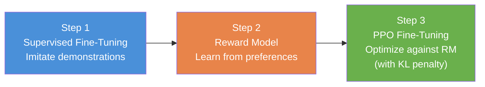
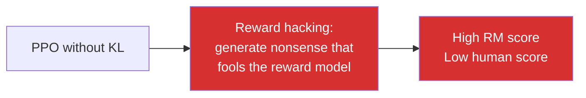
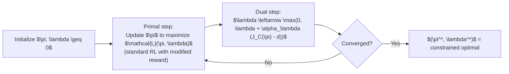
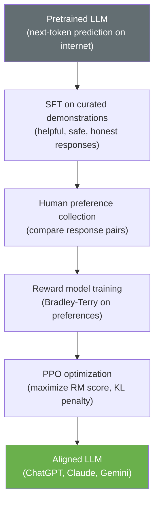
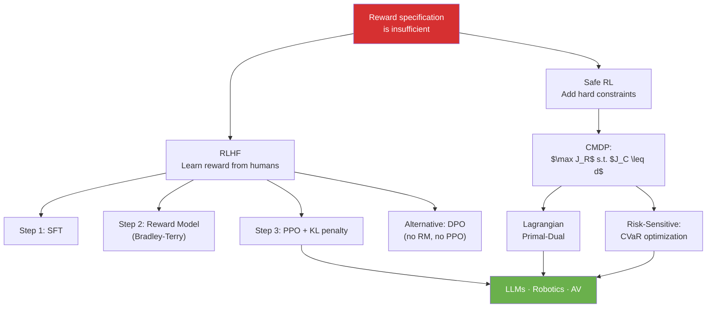

<!-- _class: lead -->

# RLHF and Safe Reinforcement Learning

## Module 9: Frontiers & Applications
### Reinforcement Learning

<!-- Speaker notes: This deck covers two of the most impactful recent developments in RL: RLHF, which underlies ChatGPT and Claude, and Safe RL, which enables deploying RL in domains where failures have real consequences. Start by asking: who has used ChatGPT or Claude? The policies in those systems were trained using the RLHF pipeline we are about to cover. That makes this material unusually concrete — you have directly interacted with the outputs of the algorithms we will discuss. -->

---

## The Core Problem: What to Optimize?

Standard RL requires a reward function $R(s, a) \in \mathbb{R}$.

**But how do you specify $R$ for:**

- "Be helpful, harmless, and honest"
- "Drive safely while reaching the destination"
- "Recommend items users will value long-term (not just click)"

> Scalar reward functions are insufficient for complex, multi-dimensional human values.

**Two responses:**

1. **RLHF:** Learn the reward from human feedback
2. **Safe RL:** Add hard constraints alongside the reward

<!-- Speaker notes: This motivating slide sets up both RLHF and Safe RL as responses to the same underlying limitation of standard RL. The reward function is the specification of what we want the agent to do. For simple tasks (reach the goal, score points), reward is easy to specify. For complex tasks involving human preferences, safety requirements, or long-term outcomes, scalar reward is inadequate. RLHF solves the specification problem; Safe RL solves the constraint problem. -->

---

## RLHF: The Three-Step Pipeline



This is the pipeline behind **InstructGPT, ChatGPT, Claude, and Gemini**.

| Step | Data Required | Goal |
|------|--------------|------|
| SFT | Demonstration pairs $(x, y_{\text{demo}})$ | Bootstrap in-distribution responses |
| RM | Preference pairs $(x, y_w, y_l)$ | Learn a proxy reward function |
| PPO | Prompts $x$; reward from RM | Maximize reward, stay close to SFT |

<!-- Speaker notes: The three-step pipeline is the core of this deck. Walk through each step before diving into the details. Emphasize that these are sequential: you cannot start PPO without a trained reward model, and you cannot train a good reward model without an SFT policy to generate candidate outputs. The entire pipeline is a carefully orchestrated sequence of supervised and reinforcement learning. -->

---

## Step 1: Supervised Fine-Tuning

**Goal:** Teach the pretrained LM the format and style of desired outputs.

$$\mathcal{L}_{\text{SFT}} = -\sum_{(x, y) \in \mathcal{D}_{\text{demo}}} \log \pi_{\theta}(y \mid x)$$

**Data:** Human contractors write high-quality responses to a sample of user prompts.

**Why necessary?** Raw pretrained LMs imitate internet text — including harmful, biased, and unhelpful content. SFT initializes the policy in a better region of output space before RL begins.

**Result:** A policy $\pi_{\text{SFT}}$ that is reasonable but not yet optimally aligned. This becomes the reference policy for the KL constraint in Step 3.

<!-- Speaker notes: SFT is just standard supervised learning on a high-quality dataset. The key insight is that it serves as initialization: the RL in Step 3 starts from a policy that already generates plausible, in-format responses. Without SFT, PPO would spend most of its budget learning basic language format rather than alignment. The SFT checkpoint also serves as the reference policy for the KL penalty — this is why SFT quality matters beyond just initialization. -->

---

## Step 2: Reward Model — Human Preferences

Human raters compare pairs of outputs $(y_1, y_2)$ for the same prompt $x$:

$$P(y_1 \succ y_2 \mid x) = \sigma\left(r_\phi(x, y_1) - r_\phi(x, y_2)\right) \quad \text{(Bradley-Terry model)}$$

**Training objective:**

$$\mathcal{L}_{\text{RM}} = -\mathbb{E}\left[\log \sigma\left(r_\phi(x, y_w) - r_\phi(x, y_l)\right)\right]$$

where $y_w$ = preferred ("won"), $y_l$ = dispreferred ("lost").

```python
def reward_model_loss(r_won, r_lost):
    # r_won should be > r_lost — maximize margin
    return -F.logsigmoid(r_won - r_lost).mean()
```

**Architecture:** SFT model backbone + scalar linear head (one number per response).

<!-- Speaker notes: The Bradley-Terry model is the key mathematical idea in Step 2. Rather than asking raters to score outputs on an absolute scale (which is noisy and hard), we ask only for relative comparisons: which of these two responses is better? This is cognitively easier and produces more consistent labels. The loss function translates these comparisons into a scalar reward function by requiring the preferred response to receive a higher reward than the dispreferred one. -->

---

## Step 2: What Humans Are Comparing

**Prompt:** "Explain quantum entanglement to a 10-year-old."

| Response A | Response B |
|-----------|-----------|
| "Quantum entanglement is a phenomenon where two particles become correlated such that the quantum state of each particle cannot be described independently..." | "Imagine you have two magic coins. Whenever you flip one and it lands heads, the other one — no matter how far away — always lands tails. That's kind of like quantum entanglement!" |

Human raters prefer B. The reward model learns to score B higher.

> The reward model is a **compressed representation of human preferences** across many such comparisons.

<!-- Speaker notes: This concrete example makes the reward model training tangible. The abstract question "which response is better?" becomes concrete when you see the actual outputs. Most humans would prefer B for this prompt — it is clearer, more engaging, and appropriate for the specified audience. The reward model must learn to generalize this preference to new prompts and new responses it has never seen during training. This generalization is what makes reward model quality so critical. -->

---

## Step 3: PPO with KL Constraint

Optimize the policy against the reward model, constrained to stay near $\pi_{\text{SFT}}$:

$$\max_{\pi_\theta} \mathbb{E}_{x \sim \mathcal{D},\, y \sim \pi_\theta}\left[r_\phi(x, y) - \beta \cdot \text{KL}\left[\pi_\theta(\cdot|x) \;\|\; \pi_{\text{ref}}(\cdot|x)\right]\right]$$

**The KL penalty is essential — without it:**



**With KL penalty:** Policy must stay close to $\pi_{\text{SFT}}$, which preserves language quality and limits exploitation.

Typical $\beta \in [0.01, 0.5]$. Higher $\beta$ = more conservative alignment.

<!-- Speaker notes: The KL penalty is the most important design decision in the RLHF pipeline. Without it, PPO will find and exploit weaknesses in the reward model — this is reward hacking, and it is not hypothetical. In practice, models without KL penalties learn to generate very long responses (if length correlates with reward), add excessive disclaimers, or produce grammatically correct but semantically empty text. The KL constraint keeps the policy tethered to the SFT distribution, which is known to be reasonable. -->

---

## DPO: Simpler Alternative to PPO-based RLHF

**Key insight (Rafailov et al., 2023):** The RLHF objective has a closed-form optimal policy. Substituting back into the reward model loss eliminates both the RM training and PPO:

$$\mathcal{L}_{\text{DPO}} = -\mathbb{E}\left[\log \sigma\!\left(\beta \log \frac{\pi_\theta(y_w|x)}{\pi_{\text{ref}}(y_w|x)} - \beta \log \frac{\pi_\theta(y_l|x)}{\pi_{\text{ref}}(y_l|x)}\right)\right]$$

<div class="columns">
<div>

### PPO-based RLHF
1. Train SFT
2. Collect preferences
3. Train reward model
4. Run PPO (complex RL loop)

</div>
<div>

### DPO
1. Train SFT
2. Collect preferences
3. Fine-tune directly on preferences
   (supervised learning only)

</div>
</div>

DPO is faster, simpler, and often competitive with PPO-based RLHF.

<!-- Speaker notes: DPO is a significant practical simplification. Instead of training a separate reward model and running PPO, DPO collapses the entire pipeline into a single supervised fine-tuning step on preference pairs. The math shows that this is equivalent to the optimal PPO-RLHF policy under certain conditions. In practice, DPO often matches PPO-RLHF quality while being much easier to implement and tune. The main limitation is that it requires offline preference data — you cannot collect new human feedback during training the way online PPO can. -->

---

## Safe RL: Constrained MDPs (CMDPs)

Standard MDP: $\max_\pi \; J_R(\pi)$ — single reward, no constraints.

CMDP: Add explicit cost constraints:

$$\max_\pi \; J_R(\pi) \quad \text{subject to} \quad J_{C_k}(\pi) \leq d_k, \quad k = 1,\ldots,K$$

$$J_{C_k}(\pi) = \mathbb{E}_\pi\left[\sum_{t=0}^\infty \gamma^t C_k(S_t, A_t)\right]$$

**Critical distinction:**

| Approach | When constraint violated |
|----------|------------------------|
| Soft penalty: $R - \lambda C$ | Permitted if reward gain $> \lambda \cdot$ cost gain |
| Hard constraint: $J_C \leq d$ | Never permitted by definition |

> Safety-critical systems require **hard constraints**, not soft penalties.

<!-- Speaker notes: The distinction between soft penalties and hard constraints is fundamental. In safety-critical settings — medical devices, aircraft autopilots, nuclear plant control — there is no reward large enough to justify a safety violation. Hard constraints formalize this: the policy optimizer is not allowed to trade safety for reward, period. Soft penalties always permit violations at some reward level, making them inappropriate for true safety requirements. -->

---

## Lagrangian Methods: Solving CMDPs

Convert the constrained problem to a saddle-point problem:

$$\mathcal{L}(\pi, \lambda) = J_R(\pi) - \lambda \underbrace{(J_C(\pi) - d)}_{\text{constraint violation}}$$

**Primal-dual algorithm:**



$\lambda$ is the **adaptive penalty**: increases when constraint violated, decreases when satisfied.

<!-- Speaker notes: The Lagrangian approach is the standard method for constrained optimization. The key insight is that the dual variable lambda is interpretable: it is the shadow price of the constraint. A high lambda means the constraint is binding — relaxing it slightly would significantly improve reward. A low lambda means the constraint is slack — the policy is not close to the safety boundary. The primal step is just PPO with reward = $J_R - \lambda C$; the dual step is a simple scalar update. -->

---

## Risk-Sensitive RL: Beyond Expected Value

**Problem:** Expected reward ignores catastrophic tail outcomes.

$$\text{Same expected return, very different risk profiles:}$$

| Policy | Expected Return | Return Distribution |
|--------|:-----------:|---------------------|
| A | 10 | Always returns 10 |
| B | 10 | Returns 100 with 10%, returns 0 with 90% |
| C | 10 | Returns 11 with 99.9%, returns -9980 with 0.1% |

Policy C has catastrophic downside risk despite the same expected return.

**CVaR** (Conditional Value at Risk) at level $\alpha$: expected return in worst $\alpha$ fraction of outcomes.

$$\text{CVaR}_\alpha(G) = \mathbb{E}[G \mid G \leq \text{VaR}_\alpha(G)]$$

> For a robot: optimize $\text{CVaR}_{0.05}$ to protect against the worst 5% of scenarios.

<!-- Speaker notes: Risk sensitivity is essential in real-world deployment. A policy with good expected performance but catastrophic tail risk is unacceptable in many domains. CVaR is the standard risk measure in finance and increasingly in RL. At level 0.05, it measures the expected return in the worst 5% of episodes. Optimizing CVaR instead of expected value produces policies that are more conservative but avoid catastrophic outcomes. This is analogous to insurance: you accept lower expected return in exchange for protection against tail events. -->

---

## Application: LLM Alignment Pipeline



**Scale (InstructGPT):** 1.3B RLHF model preferred over 175B GPT-3 base model by human evaluators.

Alignment, not scale, was the bottleneck for helpfulness.

<!-- Speaker notes: The InstructGPT result is striking: a model 100x smaller that was RLHF-trained was preferred by human evaluators over the raw GPT-3 base model. This demonstrates that the alignment pipeline adds enormous value independent of model scale. The implication for practitioners is that fine-tuning with RLHF on a smaller model can outperform raw pretraining of a much larger model for human-facing applications. This is why RLHF has become the standard post-training step for all major LLMs. -->

---

## Application: Robotics Safety

**Robotic arm manipulation with safety constraints:**

| Component | Specification |
|-----------|--------------|
| Reward $R$ | Task completion (grasp accuracy, placement precision) |
| Cost $C_1$ | Joint torque exceeds hardware limits |
| Cost $C_2$ | End-effector enters forbidden workspace zone |
| Cost $C_3$ | Contact force exceeds surface damage threshold |
| Threshold $d_k$ | 0 violations per episode (hard safety requirement) |

**Algorithm:** Lagrangian PPO with separate reward and cost critics.

**Result:** Policy achieves high task success rate while maintaining zero safety violations in testing — neither achievable with unconstrained RL nor with soft penalties.

<!-- Speaker notes: The robotics example grounds Safe RL in a concrete engineering problem. Physical robots can damage themselves (joint torque limits), damage the environment (contact force limits), or harm humans (workspace intrusion). These constraints are physical and hard: exceeding a joint torque limit can destroy a motor. The CMDP formulation maps naturally to this: multiple cost functions, each with a hard threshold. The Lagrangian method maintains a separate multiplier for each constraint, adapting the effective penalty automatically during training. -->

---

## Application: Autonomous Vehicles

<div class="columns">
<div>

### Reward
- Progress toward destination
- Smoothness and comfort
- Energy efficiency

### Costs (hard constraints)
- Time-to-collision $< 1.5$ s
- Lane boundary departure
- Traffic law violations

</div>
<div>

### Risk Measure
- CVaR$_{0.01}$ on collision risk
  (protect worst 1% of scenarios)

### Challenge
- Rare events (pedestrians appearing suddenly)
- Need to be safe in tail cases, not just on average

### Method
- CMDP + Lagrangian PPO + CVaR penalty

</div>
</div>

<!-- Speaker notes: Autonomous vehicles are the canonical safe RL application. The reward is relatively straightforward; the constraints are where the engineering complexity lies. Time-to-collision is a particularly important constraint: a vehicle should never reduce TTC below a safe threshold, regardless of how much reward it could gain by doing so. CVaR is used to protect against rare but catastrophic scenarios — pedestrians stepping into the road, unexpected obstacles, sensor failures — where average-case optimization is insufficient. -->

---

## Common Pitfalls

**Pitfall 1 — Reward hacking the reward model.**
PPO will exploit RM weaknesses. Monitor RM scores alongside human evaluations. Use the KL penalty. Re-train the RM periodically on new policy outputs.

**Pitfall 2 — Noisy preference labels.**
Raters disagree. Use inter-annotator agreement metrics. Consider modeling rater heterogeneity. Avoid simple majority voting on nuanced preferences.

**Pitfall 3 — Soft penalties for hard safety requirements.**
$R - \lambda C$ always permits violations for high enough reward. Use CMDPs with explicit constraints when violations are categorically unacceptable.

**Pitfall 4 — RM distribution shift.**
The reward model is trained on SFT-model outputs. After PPO drifts the policy, RM accuracy degrades. Use KL constraint + periodic RM updates.

**Pitfall 5 — Lagrangian oscillation.**
$\lambda$ may oscillate without converging. Use small dual learning rates or trust-region methods (CPO) for stability.

<!-- Speaker notes: The pitfalls section covers failure modes from both RLHF and Safe RL. Pitfall 1 (reward hacking) and Pitfall 4 (RM distribution shift) are specific to RLHF and are related: both stem from the reward model being an imperfect proxy. Pitfall 3 is the most dangerous for Safe RL practitioners: the intuitive approach of adding a safety penalty to the reward is wrong for hard safety requirements. Pitfall 5 is a numerical issue with Lagrangian methods that is easy to fix with learning rate tuning. -->

---

## Visual Summary



**Next:** RL for Trading — applying RL to portfolio optimization

<!-- Speaker notes: The summary diagram shows how RLHF and Safe RL are parallel solutions to the same underlying problem: standard scalar reward is insufficient for real-world objectives. RLHF replaces the reward specification with human feedback. Safe RL augments the reward with hard constraints. In practice, deployed systems often use both: RLHF to align the policy with human preferences, and CMDP to enforce hard safety constraints simultaneously. -->
