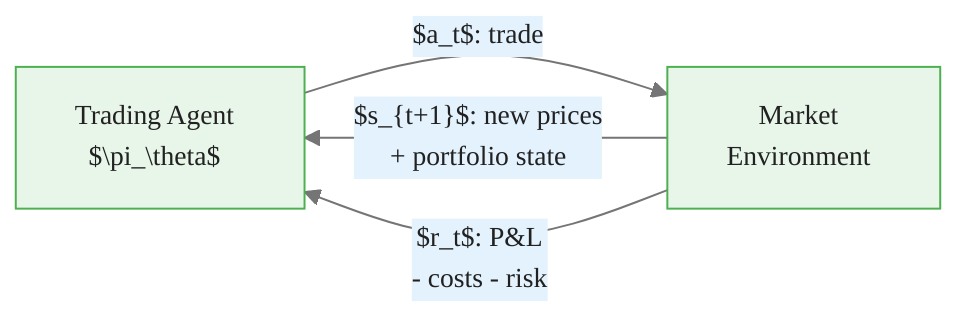
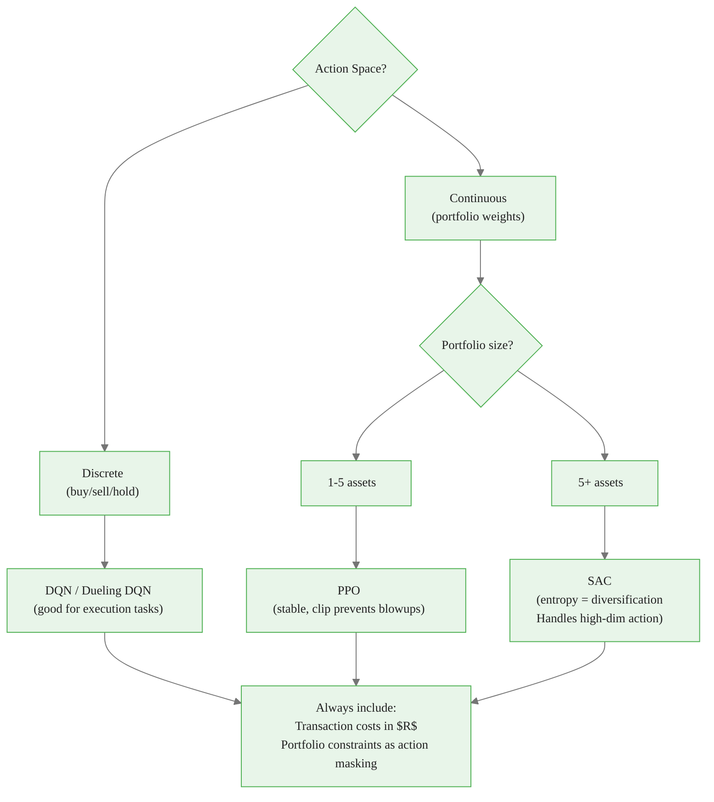
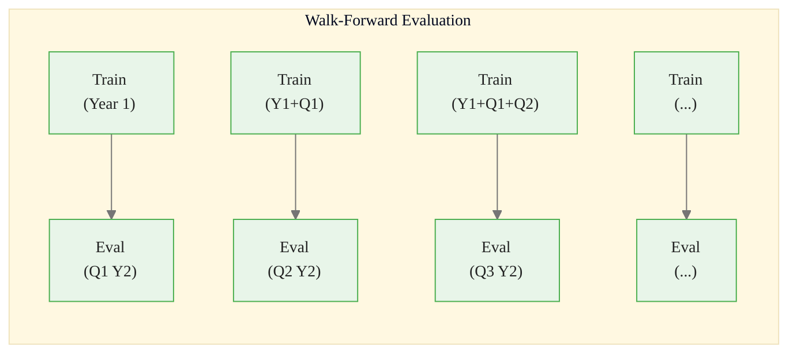
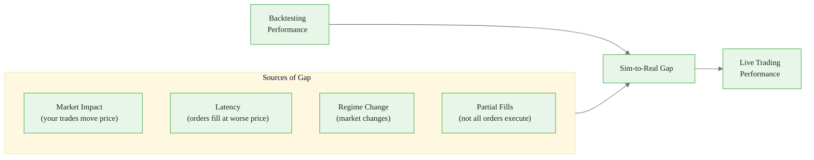
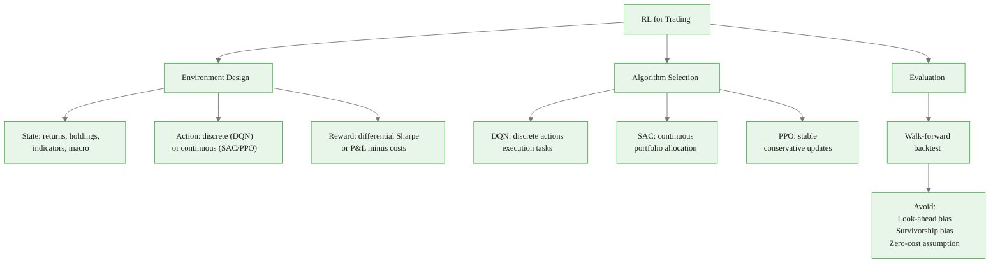

<!-- _class: lead -->

# Reinforcement Learning for Trading

## Module 9: Frontiers & Applications
### Reinforcement Learning

<!-- Speaker notes: Trading is one of the earliest and most natural applications of RL — the agent-environment-reward loop maps perfectly onto the decision-observation-return loop of financial markets. This deck covers environment design, reward engineering, algorithm selection, and the critical backtesting methodology needed to evaluate trading agents honestly. Emphasize from the start that environment design matters more than algorithm choice in this domain. -->

---

## Why RL for Trading?

**Supervised learning predicts; RL acts.**

| Approach | What it learns | What it ignores |
|----------|---------------|-----------------|
| Supervised ML | Price direction | Transaction costs, risk, position sizing |
| RL | Optimal policy | Nothing — it directly optimizes what matters |

The RL objective:

$$\max_\pi \; \mathbb{E}\left[\sum_{t=0}^T \gamma^t R(s_t, a_t, s_{t+1})\right]$$

**$R$ can directly encode Sharpe ratio, drawdown control, and transaction costs.**

> You do not predict to trade well. You trade to maximize risk-adjusted return.


<div class="callout-insight">
<strong>Insight:</strong> This is a key takeaway from this section that connects to the broader course themes.
</div>

<!-- Speaker notes: The key distinction between supervised ML and RL for trading is the objective. A supervised model that predicts price direction correctly 55% of the time may still lose money after transaction costs, or may concentrate risk in ways that are unacceptable. RL sidesteps the prediction step and directly optimizes the performance metric that matters. The RL reward function is the bridge between prediction and action — and designing it correctly is the central engineering challenge. -->

---

## The Trading MDP

| Component | Symbol | Trading Meaning |
|-----------|--------|----------------|
| State | $s \in \mathcal{S}$ | Prices, holdings, indicators, macro |
| Action | $a \in \mathcal{A}$ | Trade or portfolio weight change |
| Transition | $\mathcal{P}(s' \mid s, a)$ | Market dynamics (non-stationary) |
| Reward | $R(s, a, s')$ | Risk-adjusted return increment |
| Discount | $\gamma$ | Time preference for returns |




<div class="callout-key">
<strong>Key Point:</strong> Remember this concept — it appears repeatedly in later modules.
</div>

<!-- Speaker notes: The MDP formulation makes the trading problem concrete. Walk through each component. Note that the transition kernel — market dynamics — is non-stationary and partially observable. This is what makes the trading problem hard: the environment itself changes as market regimes shift, other market participants adapt, and macro conditions evolve. The agent must learn a policy that is robust to this non-stationarity. -->

---

## State Space Design

**Rule:** Include only information available at decision time. No look-ahead.

<div class="columns">
<div>

### Price Features
- 1-day, 5-day, 20-day returns
- 20-day realized volatility
- Volume ratio (today vs 20-day avg)
- RSI, MACD, Bollinger Bands

### Portfolio State
- Current weights per asset
- Cash fraction
- Unrealized P&L

</div>
<div>

### Macro Features
- VIX (implied volatility)
- Yield curve spread
- FX rates
- Commodity indices

### Feature Normalization
<div class="code-window">
<div class="code-header">
<div class="dots"><span class="dot-red"></span><span class="dot-yellow"></span><span class="dot-green"></span></div>
<span class="filename">example.py</span>
</div>

```python
# Rolling Z-score — no look-ahead
def zscore(series, window=252):
    mu = series.rolling(window).mean()
    sd = series.rolling(window).std()
    return (series - mu) / (sd + 1e-8)
```
</div>

</div>
</div>

> Use **returns**, not price levels. Returns are approximately stationary; prices are not.


<div class="callout-warning">
<strong>Warning:</strong> This is a common source of confusion. Pay close attention to the distinction here.
</div>

<!-- Speaker notes: State design is often the most impactful choice in building a trading RL agent. Two principles dominate: first, only use information available at decision time (look-ahead bias is a common and catastrophic mistake); second, normalize all features. Neural networks are sensitive to input scale — unnormalized price levels will cause the network to overfit to the specific price regime in the training data. Returns and rolling Z-scores are both stationary transformations that generalize better across market regimes. -->

---

## Action Space Design

<div class="columns">
<div>

### Discrete Actions (DQN)
```
{Strong Sell, Sell, Hold, Buy, Strong Buy}
{    -2,       -1,   0,   +1,      +2    }
```

- Each unit = 10% of portfolio
- Compatible with DQN, Rainbow
- Easy to interpret
- Coarse position sizing

</div>
<div>

### Continuous Actions (SAC/PPO)
$$a \in \Delta^n = \left\{w \geq 0 : \sum_i w_i = 1\right\}$$

- Target portfolio weights
- Fine-grained sizing
- SAC entropy bonus = diversification
- Harder to explore

</div>
</div>

**Recommendation:**

- Few assets, execution focus: discrete (DQN/Dueling DQN)
- Multi-asset portfolio allocation: continuous (SAC or PPO)


<div class="callout-info">
<strong>Info:</strong> This detail is useful context but not required to memorize.
</div>

<!-- Speaker notes: The choice of action space determines which algorithms you can use and how expressive the policy can be. Discrete action spaces map naturally to individual security trading decisions. Continuous action spaces are more natural for portfolio allocation where you want to express exact weight targets. SAC is particularly well-suited for continuous trading because the entropy bonus encourages action diversity, which in the portfolio context translates to position diversification — a desirable property. -->

---

## Reward Design: The Central Challenge

**Naive reward: raw P&L → Dangerous**

An agent rewarded only on P&L will:
- Maximize leverage to any level
- Ignore drawdowns
- Take 100% concentrated positions

**Better rewards:**

| Reward | Formula | Properties |
|--------|---------|------------|
| P&L minus costs | $r_t - \kappa \cdot \text{turnover}$ | Discourages churning |
| Differential Sharpe | $\frac{\bar{R}\Delta r - \frac{1}{2}r\Delta\sigma^2}{\sigma^2}$ | Risk-adjusted, step-wise |
| Risk-penalized P&L | $r_t - \lambda \sigma^2_{\text{window}}$ | Explicit variance control |

> The differential Sharpe reward: maximizing cumulative differential Sharpe = maximizing overall Sharpe ratio.

<!-- Speaker notes: Reward design is where most trading RL projects fail. The instinct is to use raw P&L as the reward, but this produces agents that take maximum possible leverage and concentrate in a single position. The differential Sharpe reward is the theoretically sound choice: it is a local approximation to the Sharpe ratio that provides a signal at every step. Walk through the formula: the numerator is the incremental return contribution; the denominator normalizes by variance. Moody and Saffell (2001) showed that maximizing the expected cumulative differential Sharpe is equivalent to maximizing the portfolio Sharpe ratio. -->

---

## Transaction Costs in the Reward

Transaction costs are not optional — they determine deployability.

<div class="code-window">
<div class="code-header">
<div class="dots"><span class="dot-red"></span><span class="dot-yellow"></span><span class="dot-green"></span></div>
<span class="filename">example.py</span>
</div>

```python
def trading_reward(
    current_weights: np.ndarray,   # weights after rebalancing
    prev_weights: np.ndarray,      # weights before rebalancing
    asset_returns: np.ndarray,     # realized returns this step
    cost_rate: float = 0.001,      # 10 bps per unit turnover
) -> float:
    portfolio_return = current_weights @ asset_returns
    turnover = np.abs(current_weights - prev_weights).sum()
    transaction_cost = cost_rate * turnover
    return portfolio_return - transaction_cost
```
</div>

**Typical transaction cost rates:**

| Market | Cost per round-trip |
|--------|-------------------|
| Large-cap equities | 5–15 bps |
| Futures | 2–5 bps |
| FX spot | 1–3 bps |
| Crypto | 10–50 bps |

> A strategy that trades daily and ignores 10 bps costs loses ~25% per year to friction.

<!-- Speaker notes: Transaction costs are the most common omission in academic RL for trading papers. A strategy that looks profitable in a zero-cost backtest may lose money in production because the gains are smaller than the friction. The code shows how to integrate costs directly into the reward — this is essential because it changes the policy's behavior: the agent learns to trade less frequently and in larger sizes, which is more realistic. The table gives real cost estimates for different asset classes. -->

---

## Algorithm Selection



<!-- Speaker notes: This decision tree gives students a starting point for algorithm selection. The key branch is action space type. For discrete actions, DQN and its variants (Dueling DQN, Rainbow) are well-suited because they explicitly compare Q-values across a small set of actions. For continuous actions, SAC is often the best choice for multi-asset portfolios because the entropy bonus naturally encourages diversification. PPO is the safer choice when stability is paramount — its clipped objective prevents catastrophically large policy updates. -->

---

## Backtesting: The Only Valid Methodology

**Walk-forward backtesting:**



The agent is **never evaluated on data it trained on**. Each evaluation window uses a freshly-trained or fine-tuned agent.

**Performance metrics per evaluation window:**

$$\text{Sharpe} = \frac{\bar{r}_{\text{test}}}{\sigma_{\text{test}}} \cdot \sqrt{252}, \quad \text{MaxDD} = \max_t \frac{V_{\text{peak}} - V_t}{V_{\text{peak}}}$$

<!-- Speaker notes: Walk-forward backtesting is the minimum bar for rigorous evaluation. The key rule is that the evaluation window must be completely out-of-sample relative to the training window. If you train on data from 2010-2019 and evaluate on 2010-2020, you have a train-test contamination problem. Walk-forward naturally prevents this: you evaluate on a window that starts after the training window ends. Report mean and standard deviation of Sharpe across all evaluation windows — a single cumulative backtest is not sufficient. -->

---

## Backtesting Pitfalls

**Pitfall 1: Look-Ahead Bias**

Using future data to make past decisions:

```python
# WRONG: uses tomorrow's close to decide today
features['return'] = prices['close'].pct_change()  # unshifted

# CORRECT: today's feature uses yesterday's data
features['return'] = prices['close'].pct_change().shift(1)
```

**Pitfall 2: Survivorship Bias**

Backtesting only on stocks that exist today — excluding bankruptcies, delistings, mergers from the historical universe.

**Pitfall 3: Transaction Cost Underestimation**

Assuming zero slippage, mid-price execution, or ignoring market impact.

**Rule:** If the strategy does not survive 10 bps/trade costs, it is not deployable.

<!-- Speaker notes: These pitfalls are not theoretical — they have caused real losses when strategies that looked great in backtesting failed in production. Look-ahead bias is the most common mistake and is easy to make in vectorized Python code: if you compute a feature on a price series without shifting, the feature at time t contains information from time t+1. Survivorship bias is more structural: if you download historical data from today's S&P 500 constituents and backtest on 2000-2010, you are selecting only companies that survived — a historically biased sample. -->

---

## The Sim-to-Real Gap in Trading



**Mitigations:**

- Model market impact (Almgren-Chriss) in the environment during training
- Add latency noise to execution prices
- Walk-forward retraining to track regime changes
- Model fill probability as part of the transition function

<!-- Speaker notes: The sim-to-real gap is the trading analog of the sim-to-real problem in robotics. Your backtest is a simulation of the market. The real market differs in ways that systematically hurt performance: your orders move the price (market impact), there is latency between decision and execution (worse fill prices), market regimes change (your trained policy becomes stale), and large orders may not fill at the desired size. Each of these can be modeled and incorporated into the training environment, narrowing the gap between simulated and live performance. -->

---

## Key Challenges

<div class="columns">
<div>

### Non-Stationarity
Market regimes change:
- Bull vs bear markets
- Liquidity crises
- Interest rate regimes

Mitigation: Walk-forward retraining, regime detection, online adaptation

### Partial Observability
True state = all participants' intentions. Agent sees only prices + public data.

Mitigation: LSTM/Transformer for memory, ensemble of indicators

</div>
<div>

### Sparse, Noisy Rewards
Sharpe of 1.0 = excellent (signal-to-noise ≈ 1).
Most steps: reward ≈ 0 regardless of action quality.

Mitigation: Differential Sharpe reward, longer episodes, reward smoothing

### Market Impact
Large orders move prices against you.

Mitigation: Market impact models in environment; trade size constraints in action space

</div>
</div>

<!-- Speaker notes: These four challenges distinguish trading RL from standard RL benchmarks. In Atari, the environment is stationary, fully observable, and rewards are dense. In financial markets, none of these hold. Non-stationarity is perhaps the most severe: a policy that performs well in one market regime may fail completely in another. The differential Sharpe reward is the key insight for addressing sparse rewards — it converts the episode-level Sharpe computation into a step-level signal that provides gradient information at every time step. -->

---

## Common Pitfalls

**Pitfall 1 — Raw P&L reward without risk adjustment.**
Encourages maximum leverage and concentration. Always use Sharpe-based or variance-penalized reward.

**Pitfall 2 — Look-ahead bias.**
Any feature using future data invalidates the backtest. Use `.shift(1)` rigorously. Audit every feature computation.

**Pitfall 3 — Ignoring transaction costs.**
A strategy trading daily with 10 bps/trade loses ~25% per year to friction. Include costs in the reward from day one of training.

**Pitfall 4 — Evaluating on training data.**
Neural networks overfit price history easily. Walk-forward evaluation is mandatory.

**Pitfall 5 — Ignoring market impact.**
Large orders do not fill at simulated prices. Model market impact when training execution strategies for meaningful size.

**Pitfall 6 — No circuit breakers in production.**
Deploy with drawdown-based position reduction: if portfolio drawdown exceeds X%, reduce all positions to zero and halt until review.

<!-- Speaker notes: The pitfalls here are ordered by how commonly they occur in practice. Pitfall 6 is often overlooked in algorithmic trading contexts: even a well-designed RL agent can encounter a market regime it has never seen and take catastrophic losses. Production trading systems must have hard circuit breakers — drawdown limits that trigger automatic position reduction or halting — independent of the RL agent's behavior. This is a form of Safe RL in practice: a hard constraint that overrides the agent when the environment is sufficiently out-of-distribution. -->

---

## Visual Summary



**Next:** Cheatsheet — quick reference for all Module 9 topics

<!-- Speaker notes: The summary diagram organizes RL for trading around three pillars: environment design, algorithm selection, and evaluation. Emphasize that environment design (especially reward design) is the dominant factor — choosing SAC over PPO matters far less than choosing a risk-adjusted reward over raw P&L. Walk-forward backtesting is the evaluation foundation; without it, you cannot trust any performance number. The pitfalls box in red is the takeaway: these mistakes have cost money in real deployments and should be treated as hard rules, not guidelines. -->
