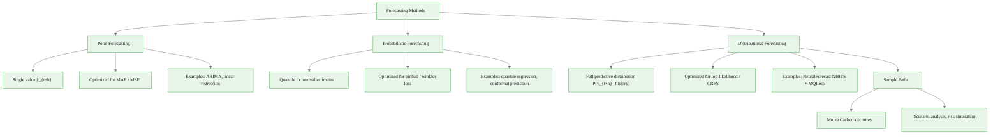

# The Forecasting Landscape: From Point Estimates to Distributional Forecasts

> **Reading time:** ~10 min | **Module:** 0 — Foundations | **Prerequisites:** Python, pandas, basic statistics

## In Brief

Modern forecasting has moved well beyond producing a single number. This guide maps the forecasting landscape — point, probabilistic, and distributional approaches — and introduces the neuralforecast ecosystem that unifies all three in a single, consistent API.

Start here: the code below installs neuralforecast and verifies the installation in under 30 seconds.


<span class="filename">example.py</span>
</div>
The following implementation builds on the approach above:

<div class="code-window">
<div class="code-header">
<div class="dots"><span class="dot-red"></span><span class="dot-yellow"></span><span class="dot-green"></span></div>

```python
# Install the full nixtla forecasting stack
# pip install neuralforecast datasetsforecast utilsforecast

import neuralforecast
import datasetsforecast
import utilsforecast

print(f"neuralforecast {neuralforecast.__version__}")
print(f"datasetsforecast {datasetsforecast.__version__}")
print(f"utilsforecast {utilsforecast.__version__}")
print("Environment ready.")
```

</div>

<div class="callout-key">

<strong>Key Concept:</strong> Modern forecasting has moved well beyond producing a single number. This guide maps the forecasting landscape — point, probabilistic, and distributional approaches — and introduces the neuralforecast ecosystem that unifies all three in a single, consistent API.

</div>


---

## 1. Why Forecasting Matters for Business Decisions

A point forecast says: "Demand tomorrow will be 142 units."

<div class="callout-insight">

<strong>Insight:</strong> A point forecast says: "Demand tomorrow will be 142 units."

A probabilistic forecast says: "Demand tomorrow will be 142 units, with a 90% interval of [118, 171]."

These two statements lead to comple...

</div>


A probabilistic forecast says: "Demand tomorrow will be 142 units, with a 90% interval of [118, 171]."

These two statements lead to completely different inventory decisions. The second statement lets a decision-maker ask: "What is the cost of stocking 118 versus 171 units, given this uncertainty?" The first statement hides that tradeoff entirely.

**The three failure modes of point forecasting:**
1. **Silent overconfidence** — the model has uncertainty but reports none; users plan as if the forecast is certain
2. **Asymmetric costs ignored** — understocking a warehouse and overstocking it carry different costs; a point forecast cannot optimize for this
3. **Cascade failures in pipelines** — upstream point forecasts feed downstream models, compounding hidden uncertainty at every step


<div class="flow">
<div class="flow-step mint">1. Silent overconfidence</div>
<div class="flow-arrow">&#8594;</div>
<div class="flow-step amber">2. Asymmetric costs ignored</div>
<div class="flow-arrow">&#8594;</div>
<div class="flow-step blue">3. Cascade failures in pipelines</div>
</div>

---

## 2. The Forecasting Taxonomy


<span class="filename">example.py</span>
</div>
<div class="callout-key">
<strong>Key Point:</strong> example.py
The following implementation builds on the approach above:
---
</div>
The following implementation builds on the approach above:

<div class="code-window">
<div class="code-header">
<div class="dots"><span class="dot-red"></span><span class="dot-yellow"></span><span class="dot-green"></span></div>



</div>

---

## 3. Point vs Probabilistic vs Distributional: A Direct Comparison

| Dimension | Point Forecasting | Probabilistic Forecasting | Distributional Forecasting |
|---|---|---|---|
| **Output** | Single value $\hat{y}_{t+h}$ | Quantiles or intervals | Full distribution $P(y_{t+h})$ |
| **Uncertainty** | None expressed | Partial (specific quantiles) | Complete |
| **Loss function** | MAE, MSE, MAPE | Pinball / quantile loss | CRPS, log-score, MQLoss |
| **Sample paths** | Not available | Not directly available | Available via `.simulate()` |
| **Typical use** | Simple reporting | Inventory, capacity planning | Risk management, pricing, simulation |
| **neuralforecast model** | `NHITS` (default) | `NHITS` + `MQLoss` quantiles | `NHITS` + `MQLoss` full distribution |
| **Calibration testable?** | No | Yes (coverage) | Yes (CRPS, reliability diagram) |

<div class="callout-info">

<strong>Info:</strong> Point


See detailed comparison in the table above.

</div>


---


<div class="compare">
<div class="compare-card">
<div class="header before">3. Point</div>
<div class="body">

See detailed comparison in the table above.

</div>
</div>
<div class="compare-card">
<div class="header after">Probabilistic vs Distributional: A Direct Comparison</div>
<div class="body">

See detailed comparison in the table above.

</div>
</div>
</div>

## 4. Calibration: The Property That Makes Probabilistic Forecasts Useful

A 90% prediction interval should contain the actual value 90% of the time. When it does, the forecast is **calibrated**. Calibration is testable — you can measure it on held-out data.

<div class="callout-warning">

<strong>Warning:</strong> A 90% prediction interval should contain the actual value 90% of the time.

</div>


**Why calibration matters:**

If your 90% interval has only 60% coverage, every downstream decision based on that interval is dangerously overconfident. Safety stock levels, risk capital buffers, and scenario plans all depend on the interval meaning what it claims to mean.

**The CRPS (Continuous Ranked Probability Score)** unifies calibration and sharpness into a single number:

$$\text{CRPS}(F, y) = \int_{-\infty}^{\infty} \left(F(z) - \mathbf{1}[z \geq y]\right)^2 dz$$

where $F$ is the forecast CDF and $y$ is the actual observation. Lower CRPS is better. A point forecast achieves CRPS equal to the MAE — distributional forecasts can only be penalized relative to that baseline.

---

## 5. The NeuralForecast Ecosystem

The nixtla stack consists of three coordinated libraries:

<div class="callout-insight">

<strong>Insight:</strong> The nixtla stack consists of three coordinated libraries:


example.py


The following implementation builds on the approach above:


**datasetsforecast** — A catalog of benchmark datasets (M4, M5...

</div>


<span class="filename">example.py</span>
</div>
The following implementation builds on the approach above:

<div class="code-window">
<div class="code-header">
<div class="dots"><span class="dot-red"></span><span class="dot-yellow"></span><span class="dot-green"></span></div>



</div>

```mermaid
%%{init: {"theme": "base", "themeVariables": {"primaryColor": "#e8f5e9", "primaryBorderColor": "#4caf50", "primaryTextColor": "#212121", "secondaryColor": "#e3f2fd", "tertiaryColor": "#fff8e1", "lineColor": "#757575", "fontFamily": "Inter, sans-serif", "fontSize": "14px"}}}%%
flowchart LR
    A[datasetsforecast] -->|"Loads & formats\ntime series data"| B[neuralforecast]
    B -->|"Trains neural\nforecasting models"| C[utilsforecast]
    C -->|"Evaluates, aggregates,\nreconciles forecasts"| D[Business Decision]

    style A fill:#e8f4f8
    style B fill:#d4edda
    style C fill:#fff3cd
    style D fill:#f8d7da
```

**datasetsforecast** — A catalog of benchmark datasets (M4, M5, ETT, French Bakery, Tourism) ready in the nixtla `(unique_id, ds, y)` format. No ETL required.

**neuralforecast** — The core library. Neural models (NHITS, NBEATS, TFT, TimesNet, iTransformer, and many more) with a unified `.fit()` / `.predict()` / `.cross_validation()` API. Every model supports probabilistic output via a loss swap.

**utilsforecast** — Evaluation metrics (MASE, CRPS, pinball), hierarchical reconciliation, and forecast aggregation utilities. Works with any forecasting library, not just neuralforecast.

---

## 6. The Nixtla Data Format

Every model in the ecosystem expects data in a three-column format:

| Column | Type | Description |
|---|---|---|
| `unique_id` | str or int | Series identifier (e.g., item SKU, store ID) |
| `ds` | datetime | Timestamp of the observation |
| `y` | float | Target variable to forecast |

This format handles thousands of series uniformly — a single `NeuralForecast` instance trains one model across all series simultaneously.


<span class="filename">example.py</span>
</div>

<div class="code-window">
<div class="code-header">
<div class="dots"><span class="dot-red"></span><span class="dot-yellow"></span><span class="dot-green"></span></div>

```python
import pandas as pd
from datasetsforecast.m4 import M4

# Load M4 hourly subset — already in (unique_id, ds, y) format
train, test, _ = M4.load(directory='/tmp/m4', group='Hourly')
print(train.head())
#    unique_id          ds      y
# 0       H1  1750-01-01  605.0
# 1       H1  1750-01-02  586.0
# 2       H1  1750-01-03  586.0
print(f"Series count: {train['unique_id'].nunique()}")
print(f"Rows: {len(train):,}")
```

</div>

---

## 7. From Point to Probabilistic in One Line

The key design insight of neuralforecast: switching from a point forecast to a full probabilistic forecast requires changing exactly **one argument** — the loss function.

```python
from neuralforecast import NeuralForecast
from neuralforecast.models import NHITS
from neuralforecast.losses.pytorch import MAE, MQLoss

# Point forecast model
point_model = NHITS(h=7, input_size=28, loss=MAE())

# Probabilistic forecast model — same architecture, different loss
prob_model = NHITS(
    h=7,
    input_size=28,
    loss=MQLoss(quantiles=[0.1, 0.25, 0.5, 0.75, 0.9]),
)

# The API is identical — .fit() and .predict() work the same way
nf_point = NeuralForecast(models=[point_model], freq='D')
nf_prob  = NeuralForecast(models=[prob_model],  freq='D')
```

The output of `nf_prob.predict()` contains columns for each quantile: `NHITS-q-0.1`, `NHITS-q-0.5`, `NHITS-q-0.9`, etc.

---

## 8. Real Example: French Bakery Daily Sales

The French Bakery dataset contains daily sales of 8 bakery items across multiple stores — a compact, realistic dataset ideal for learning.

```python
import pandas as pd
import matplotlib.pyplot as plt
from datasetsforecast.long_horizon import LongHorizon

# Alternative: load directly from the nixtla datasets repo
url = (
    "https://raw.githubusercontent.com/Nixtla/transfer-learning-time-series/"
    "main/datasets/french_bakery_daily.csv"
)
df = pd.read_csv(url, parse_dates=['ds'])

# Inspect the format
print(df.head())
print(f"\nSeries: {df['unique_id'].unique()}")
print(f"Date range: {df['ds'].min()} to {df['ds'].max()}")
print(f"Total rows: {len(df):,}")

# Quick sales visualization
fig, axes = plt.subplots(2, 2, figsize=(12, 6), sharex=True)
for ax, item in zip(axes.flat, df['unique_id'].unique()[:4]):
    subset = df[df['unique_id'] == item]
    ax.plot(subset['ds'], subset['y'], linewidth=0.8)
    ax.set_title(item)
    ax.set_ylabel('Daily sales')
plt.suptitle('French Bakery: Daily Sales by Item', y=1.02)
plt.tight_layout()
plt.show()
```

---

## 9. Key Takeaways

- **Point forecasts hide uncertainty.** Business decisions require knowing the distribution of outcomes, not just the expected value.
- **Calibration is testable.** A 90% interval that misses 40% of the time is dangerously misleading. Always check coverage on held-out data.
- **CRPS is the right metric for distributional forecasts.** It degenerates to MAE for point forecasts, making comparison fair.
- **neuralforecast makes probabilistic forecasting a one-line change.** Swap `MAE()` for `MQLoss(...)` and the API stays identical.
- **The nixtla stack is end-to-end.** datasetsforecast handles data, neuralforecast handles modeling, utilsforecast handles evaluation.

---

## What's Next

Continue to [02_neuralforecast_ecosystem.md](02_neuralforecast_ecosystem.md) for a detailed walkthrough of the neuralforecast API: fitting models, generating forecasts, running cross-validation, producing sample paths, and explaining predictions.


## Practice Questions

**Question 1 — Conceptual:** Based on the concepts in this guide, explain in your own words why the core technique matters and when you would choose it over alternatives.

**Question 2 — Application:** Sketch out how you would apply the main concept from this guide to a real-world dataset or problem you have encountered. What would you need to watch out for?


---

## Cross-References

<a class="link-card" href="./01_forecasting_landscape.md">
  <div class="link-card-title">Companion Slides</div>
  <div class="link-card-description">Interactive slide deck covering the key concepts with visual examples.</div>
</a>

<a class="link-card" href="../notebooks/01_quickstart_neuralforecast.ipynb">
  <div class="link-card-title">Hands-on Notebook</div>
  <div class="link-card-description">15-minute micro-notebook with guided exercises and real data.</div>
</a>
