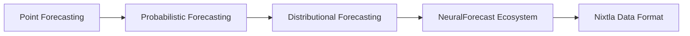
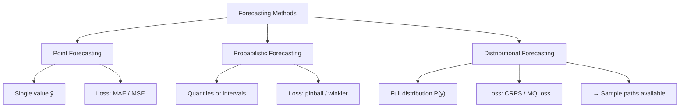
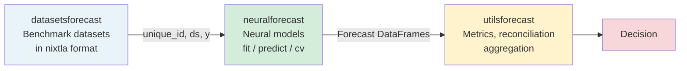

<!-- _class: lead -->

# The Forecasting Landscape

**Module 0 — Foundations & Prerequisites**

From point estimates to full predictive distributions

<!-- Speaker notes: Welcome to the forecasting landscape overview. This deck covers why probabilistic forecasting matters for real decisions, the taxonomy of forecasting approaches, and how the neuralforecast ecosystem sits within that landscape. Estimated time: 20 minutes. -->

---

## What We Cover



By the end of this deck you will be able to explain why uncertainty quantification changes decisions, distinguish the three forecasting paradigms, and describe the role of each library in the nixtla stack.

<!-- Speaker notes: Walk through the roadmap so learners know where we are going. Stress that the goal is not to memorize definitions but to understand the practical difference these paradigms make in real decisions. -->

---

<!-- _class: lead -->

# 1. Why Point Forecasts Fall Short

<!-- Speaker notes: Transition to section 1. Ask learners: have you ever seen a forecast that turned out to be right on average but caused real operational problems? That is exactly the scenario we are exploring here. -->

---

## The Hidden Overconfidence Problem

<div class="columns">
<div>

### Point forecast says:

> Demand tomorrow: **142 units**

Decision-maker plans for exactly 142.

**Result:** When actual demand is 171, stockout occurs.

</div>
<div>

### Probabilistic forecast says:

> Demand tomorrow: **142 units**
> 90% interval: **[118, 171]**

Decision-maker asks: what does understocking cost versus overstocking?

**Result:** Stocking 160 units based on explicit cost tradeoff.

</div>
</div>

<!-- Speaker notes: This side-by-side is the core message. The point forecast is not wrong — 142 is still the median. The problem is it gives no signal about downside risk. The probabilistic forecast enables explicit cost-benefit analysis. -->

---

## Three Failure Modes of Point Forecasting

**1. Silent overconfidence**
The model has uncertainty; the output hides it entirely. Users plan as if the forecast is certain.

**2. Asymmetric costs ignored**
Understocking and overstocking carry different costs. A point forecast cannot optimize for this.

$$\text{Cost}(\text{understock}) \neq \text{Cost}(\text{overstock})$$

**3. Cascade failures in pipelines**
Upstream point forecasts feed downstream models. Hidden uncertainty compounds at every step.

<!-- Speaker notes: These three failure modes come up repeatedly in industry. Emphasize cascade failures for learners working in large organizations where forecasting outputs feed into pricing models, logistics optimizers, or financial planning tools. Each hidden uncertainty multiplies. -->

---

<!-- _class: lead -->

# 2. The Forecasting Taxonomy

<!-- Speaker notes: Now we formalize the three paradigms. The diagram on the next slide is worth studying carefully — it shows not just what each approach outputs but what loss function it optimizes and what neuralforecast models implement it. -->

---

## Three Paradigms



<!-- Speaker notes: The key insight is that these are not completely different models — they are often the same architecture with a different loss function. NHITS can be a point forecaster with MAE or a distributional forecaster with MQLoss. The architecture does the heavy lifting; the loss function shapes what it learns to produce. -->

---

## Comparison Table

| | Point | Probabilistic | Distributional |
|---|---|---|---|
| Output | $\hat{y}_{t+h}$ | Quantiles | Full $P(y_{t+h})$ |
| Uncertainty | None | Partial | Complete |
| Loss | MAE, MSE | Pinball | CRPS, MQLoss |
| Sample paths | No | No | Yes |
| Calibration testable | No | Yes | Yes |
| Typical use | Reporting | Inventory | Risk, pricing |

<!-- Speaker notes: Walk through each row. The "calibration testable" row is particularly important — it is the property that lets you hold a forecast accountable. You cannot test whether a point forecast is overconfident; you can absolutely test whether a 90% interval achieves 90% coverage. -->

---

<!-- _class: lead -->

# 3. Calibration and CRPS

<!-- Speaker notes: Calibration is the property that makes probabilistic forecasts actionable. Without it, intervals are marketing numbers. This section explains what calibration means and introduces CRPS as the unified scoring rule. -->

---

## What Calibration Means

A **90% prediction interval** should contain the actual value **90% of the time**.

<div class="columns">
<div>

### Well-calibrated
- 100 intervals issued
- ~90 contain the actual value
- Intervals are as narrow as the uncertainty allows

</div>
<div>

### Miscalibrated (overconfident)
- 100 intervals issued
- Only 60 contain the actual value
- Downstream decisions based on false confidence

</div>
</div>

Calibration is **empirically measurable** on held-out data. Always check it.

<!-- Speaker notes: The word "calibration" is borrowed from meteorology, where it has a precise meaning. Weather forecasters have been calibrated for decades. Financial and business forecasters are catching up. The key point: calibration is not a property you hope for — it is something you measure and report. -->

---

## The CRPS Scoring Rule

$$\text{CRPS}(F, y) = \int_{-\infty}^{\infty} \left(F(z) - \mathbf{1}[z \geq y]\right)^2 dz$$

- $F$ = the forecast CDF
- $y$ = the actual observation
- **Lower is better**

**Key property:** For a point forecast (degenerate distribution), CRPS equals the MAE. Distributional forecasts can only improve on the point forecast — they are penalized for being unnecessarily wide.

**In practice:** `utilsforecast` computes CRPS for you.

```python
from utilsforecast.losses import crps
scores = crps(forecasts_df, actual_df)
```

<!-- Speaker notes: The integral form looks intimidating but the intuition is simple: CRPS penalizes the forecast CDF for being far from the step function that places all mass at the observed value. A sharp, well-calibrated CDF gets a low score. CRPS is to probabilistic forecasting what MAE is to point forecasting. -->

---

<!-- _class: lead -->

# 4. The NeuralForecast Ecosystem

<!-- Speaker notes: Now we move to the practical side. The nixtla stack is three coordinated libraries. Understanding what each one does — and does not do — will save you hours of confusion when building pipelines. -->

---

## Three Libraries, One Pipeline



<div class="columns">
<div>

**datasetsforecast** loads M4, M5, ETT, French Bakery, Tourism, and more — zero ETL required.

</div>
<div>

**utilsforecast** evaluates any forecasting library's output, not just neuralforecast.

</div>
</div>

<!-- Speaker notes: The arrow labels are important. datasetsforecast always outputs unique_id / ds / y — you never have to reshape the data yourself. utilsforecast accepts any forecasting library's output, which means you can use it to compare neuralforecast against statsforecast or even manual ARIMA baselines. -->

---

## The Nixtla Data Format

Every library in the ecosystem uses the same three-column schema:

| Column | Type | Example |
|---|---|---|
| `unique_id` | str / int | `"baguette"`, `"store_001"` |
| `ds` | datetime | `2024-01-15` |
| `y` | float | `142.0` |

**Why this matters:** A single `NeuralForecast` instance trains one model across **thousands of series simultaneously** — all because every series is in the same format.

```python
print(train.head(3))
#   unique_id          ds       y
# 0  baguette  2021-01-04  142.0
# 1  baguette  2021-01-05  118.0
# 2  baguette  2021-01-06   97.0
```

<!-- Speaker notes: The long format with unique_id as an identifier column is the single most important data convention in this ecosystem. If learners come from wide-format time series backgrounds (one column per series), they need to pivot before any of this code works. Mention that pandas.melt() is the tool for that conversion. -->

---

## Point to Probabilistic: One Argument

```python
from neuralforecast import NeuralForecast
from neuralforecast.models import NHITS
from neuralforecast.losses.pytorch import MAE, MQLoss

# Point forecast
point_model = NHITS(h=7, input_size=28, loss=MAE())

# Probabilistic forecast — identical architecture
prob_model = NHITS(
    h=7,
    input_size=28,
    loss=MQLoss(quantiles=[0.1, 0.25, 0.5, 0.75, 0.9]),
)

# Both use the same .fit() / .predict() API
nf = NeuralForecast(models=[prob_model], freq='D')
nf.fit(df=train)
forecasts = nf.predict()
# Columns: NHITS-q-0.1, NHITS-q-0.5, NHITS-q-0.9, ...
```

<!-- Speaker notes: This slide is the payoff of everything before it. The architecture is the same — NHITS with the same input_size and horizon. The only change is the loss. Emphasize that this is intentional API design by the nixtla team: the barrier to switching from point to probabilistic is one argument. -->

---

<!-- _class: lead -->

# 5. Real Data: French Bakery

<!-- Speaker notes: Theory lands better with a concrete dataset. The French Bakery data is small enough to load in seconds, real enough to show meaningful seasonality, and simple enough that learners can focus on the forecasting API rather than data wrangling. -->

---

## French Bakery Daily Sales

8 bakery items, multiple stores, daily sales — a compact real-world dataset.

```python
import pandas as pd

url = (
    "https://raw.githubusercontent.com/Nixtla/transfer-learning-time-series/"
    "main/datasets/french_bakery_daily.csv"
)
df = pd.read_csv(url, parse_dates=['ds'])

print(df['unique_id'].unique())
# ['baguette' 'pain au chocolat' 'croissant' ...]
print(f"Date range: {df['ds'].min()} to {df['ds'].max()}")
print(f"Total rows: {len(df):,}")
```

**Weekly seasonality is strong** — bakeries sell more on weekends. This is the kind of pattern NHITS is built to capture across multiple resolutions simultaneously.

<!-- Speaker notes: Tell learners that the French Bakery dataset comes up in multiple modules. Getting comfortable with it now pays dividends. Point out that the strong weekly seasonality makes it a good testbed for models that handle multiple seasonal periods (NHITS, NBEATS) versus those that need explicit seasonal decomposition. -->

---

## Module Summary

<div class="columns">
<div>

### Key concepts
- Point forecasts hide uncertainty
- Probabilistic forecasts are calibration-testable
- Distributional forecasts output a full CDF
- CRPS is the primary evaluation metric
- Sample paths enable scenario simulation

</div>
<div>

### The nixtla stack
- `datasetsforecast` — data loading
- `neuralforecast` — model training
- `utilsforecast` — evaluation
- Unified `(unique_id, ds, y)` format
- One argument: `MAE()` → `MQLoss()`

</div>
</div>

<!-- Speaker notes: Summarize the two parallel threads: the conceptual thread (why probabilistic forecasting matters) and the practical thread (how the nixtla stack makes it accessible). Both threads continue in the next deck on the neuralforecast API. -->

---

## What's Next

**Guide 02:** NeuralForecast Ecosystem Deep Dive
- `.fit()` → `.predict()` → `.cross_validation()` workflow
- The `.simulate()` method for sample paths
- The `.explain()` method for explainability
- Key hyperparameters: `input_size`, `h`, `max_steps`, `scaler_type`

**Notebook 01:** QuickStart — train NHITS on French Bakery in 10 minutes

<!-- Speaker notes: Close by previewing the next steps. Learners who want to run code immediately can jump to notebook 01. Those who want more conceptual grounding should read guide 02 first. Both paths are valid — the materials are designed to work either way. -->
