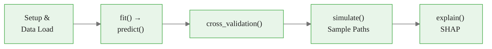

<!-- _class: lead -->

# The NeuralForecast Ecosystem

**Module 0 — Foundations & Prerequisites**

API, models, and the fit → predict → evaluate workflow

<!-- Speaker notes: This deck is a practical walkthrough of the neuralforecast API. Every slide has runnable code. By the end, learners will have seen the complete fit → predict → cross_validation cycle plus the simulate and explain methods. Estimated time: 25 minutes. -->

---

## What We Cover



Real dataset throughout: **French Bakery Daily Sales**
8 bakery items · daily frequency · ~550 observations per series


<div class="callout-insight">
<strong>Insight:</strong> This is a key takeaway from this section that connects to the broader course themes.
</div>

<!-- Speaker notes: Emphasize that we use real data throughout, not toy examples. The French Bakery dataset is small enough to train in minutes on a laptop but realistic enough to show meaningful patterns. Every code block in this deck is copy-paste ready. -->

---

<!-- _class: lead -->

# 1. Loading the Data

<!-- Speaker notes: Before any model can run, we need data in the correct format. This section shows the three-column nixtla format using real bakery sales data. -->

---

## French Bakery: Load and Inspect

<div class="code-window">
<div class="code-header">
<div class="dots"><span class="dot-red"></span><span class="dot-yellow"></span><span class="dot-green"></span></div>
<span class="filename">example.py</span>
</div>

```python
import pandas as pd

url = (
    "https://raw.githubusercontent.com/Nixtla/transfer-learning-time-series/"
    "main/datasets/french_bakery_daily.csv"
)
df = pd.read_csv(url, parse_dates=['ds'])

print(df.head())
#   unique_id          ds      y
# 0  baguette  2021-01-04  142.0
# 1  baguette  2021-01-05  118.0

print(f"Series: {df['unique_id'].nunique()}")
print(f"Date range: {df['ds'].min()} → {df['ds'].max()}")
print(f"Rows per series: {len(df) // df['unique_id'].nunique()}")
```
</div>

The format is already correct: `unique_id`, `ds`, `y`. No reshaping needed.


<div class="callout-key">
<strong>Key Point:</strong> Remember this concept — it appears repeatedly in later modules.
</div>

<!-- Speaker notes: This is intentional — datasetsforecast and the nixtla datasets repo always deliver data in this format. In production, the learner's own ETL pipeline needs to output this exact three-column structure. The most common mistake is delivering a wide-format DataFrame with one column per series. -->

---

## Train / Test Split

<div class="code-window">
<div class="code-header">
<div class="dots"><span class="dot-red"></span><span class="dot-yellow"></span><span class="dot-green"></span></div>
<span class="filename">example.py</span>
</div>

```python
horizon = 7  # forecast 7 days ahead

# Hold out last 7 days per series
train = (df.groupby('unique_id', group_keys=False)
           .apply(lambda x: x.iloc[:-horizon])
           .reset_index(drop=True))

test = (df.groupby('unique_id', group_keys=False)
          .apply(lambda x: x.iloc[-horizon:])
          .reset_index(drop=True))

print(f"Train: {len(train):,} rows")
print(f"Test:  {len(test):,} rows  ({horizon} days × {test['unique_id'].nunique()} series)")
```
</div>

Always split **before** fitting. neuralforecast respects temporal order — it never shuffles rows.


<div class="callout-warning">
<strong>Warning:</strong> This is a common source of confusion. Pay close attention to the distinction here.
</div>

<!-- Speaker notes: Stress the temporal integrity point. Unlike tabular ML where you can shuffle and split randomly, time series splits must always keep earlier dates in train and later dates in test. The groupby-apply pattern here ensures each series is split at the correct cutoff independently. -->

---

<!-- _class: lead -->

# 2. Models: NHITS and DLinear

<!-- Speaker notes: Two models cover 90% of use cases in this module. NHITS is the neural workhorse. DLinear is the baseline that must always be beaten before claiming a neural model adds value. -->

---

## NHITS: Neural Hierarchical Interpolation

<div class="columns">
<div>

**Architecture idea:**

$$\hat{y}_{t+h} = \sum_{k=1}^{K} \hat{y}^{(k)}_{t+h}$$

Each stack $k$ processes a **different temporal resolution** via hierarchical interpolation, then outputs are summed.

</div>
<div>

**Key hyperparameters:**

| Parameter | Meaning |
|---|---|
| `h` | Horizon (required) |
| `input_size` | Lookback window |
| `max_steps` | Training iterations |
| `scaler_type` | Input normalization |
| `loss` | Forecast type |

</div>
</div>


<div class="callout-info">
<strong>Info:</strong> This detail is useful context but not required to memorize.
</div>

<!-- Speaker notes: The multi-resolution decomposition is what makes NHITS outperform vanilla MLPs on seasonal data. Stack 1 might process at daily resolution, stack 2 at weekly, stack 3 at monthly. Each stack specializes in one frequency band. The sum of their outputs covers the full time series. -->

---

## DLinear: Your Baseline

```python
from neuralforecast.models import NHITS, DLinear
from neuralforecast.losses.pytorch import MQLoss
from neuralforecast import NeuralForecast

nf = NeuralForecast(
    models=[
        # Baseline: always run this first
        DLinear(h=7, input_size=28),

        # Neural model: must beat the baseline to be worth using
        NHITS(
            h=7,
            input_size=28,
            loss=MQLoss(quantiles=[0.1, 0.5, 0.9]),
            max_steps=300,
            scaler_type='standard',
        ),
    ],
    freq='D',
)
```

Running both at once produces side-by-side output columns.

<!-- Speaker notes: The discipline of always running DLinear first before NHITS is a professional habit. Many datasets that look complex are well-served by linear models. If DLinear achieves similar CRPS to NHITS, use DLinear — it is faster, more interpretable, and less likely to overfit on small datasets. -->

---

<!-- _class: lead -->

# 3. The Core Workflow

<!-- Speaker notes: Three method calls cover the entire training and evaluation lifecycle. fit, predict, and cross_validation. Let's walk through each one. -->

---

## `.fit()`: Train the Models

```python
# Train on historical data
nf.fit(df=train)

# Training progress bar appears (max_steps iterations)
# GPU automatically used if available
```

**What happens internally:**
1. Data is normalized per series (`scaler_type='standard'`)
2. Series are batched together — all 8 series train simultaneously
3. Adam optimizer runs for `max_steps` iterations
4. Best checkpoint is saved (early stopping optional)

<!-- Speaker notes: The cross-learning aspect is important: NHITS trains a single model across all series simultaneously, sharing information across baguette, croissant, pain au chocolat, etc. This is what makes it different from fitting separate ARIMA models per series. The shared model can transfer patterns from data-rich series to data-sparse series. -->

---

## `.predict()`: Generate Out-of-Sample Forecasts

```python
forecasts = nf.predict()

print(forecasts.columns.tolist())
# ['unique_id', 'ds', 'DLinear', 'NHITS-q-0.1', 'NHITS-q-0.5', 'NHITS-q-0.9']

print(forecasts.head())
#   unique_id          ds  DLinear  NHITS-q-0.1  NHITS-q-0.5  NHITS-q-0.9
# 0  baguette  2022-11-14    128.3        96.2       131.5       166.8
```

Forecasts start at the day **after the last observed date** in the training data.

<!-- Speaker notes: The column naming convention encodes both the model name and the quantile. This makes it unambiguous when you are working with multiple models and multiple quantiles simultaneously. The DLinear column has no quantile suffix because it was trained with the default MAE loss, producing a point forecast. -->

---

## `.cross_validation()`: Rolling Evaluation

```python
cv = nf.cross_validation(
    df=df,
    n_windows=3,   # 3 evaluation windows
    step_size=7,   # advance 7 days per window
)

print(cv[['unique_id', 'ds', 'cutoff', 'y', 'NHITS-q-0.5']].head())
#   unique_id          ds     cutoff      y  NHITS-q-0.5
# 0  baguette  2022-10-03  2022-09-26  138.0       141.2
```

`cutoff` = last training date for that window. The model never sees data after `cutoff` when predicting the subsequent window.

<!-- Speaker notes: The cutoff column is the audit trail that proves no data leakage. Each window's predictions are generated by a model that was trained only on data up to and including the cutoff date. Learners should always inspect the cutoff column when debugging cross-validation results to verify the temporal split is correct. -->

---

## Evaluating Cross-Validation Results

```python
from utilsforecast.losses import mqloss
from utilsforecast.evaluation import evaluate

scores = evaluate(
    df=cv,
    metrics=[mqloss],
    models=['DLinear', 'NHITS'],
    target_col='y',
)
print(scores)
#    metric      DLinear     NHITS
# 0  mqloss       18.43     14.21
```

Lower is better. If NHITS does not beat DLinear, examine whether the data has learnable nonlinear patterns.

<!-- Speaker notes: The evaluate function from utilsforecast handles the aggregation across series and windows automatically. It returns one row per metric, making it easy to add additional metrics like MASE or scaled CRPS later. -->

---

<!-- _class: lead -->

# 4. Sample Paths and Explainability

<!-- Speaker notes: Two advanced features that distinguish neuralforecast from traditional probabilistic forecasting libraries. Sample paths enable Monte Carlo simulation; explain enables model auditing. -->

---

## `.simulate()`: Monte Carlo Sample Paths

```python
import matplotlib.pyplot as plt

# 100 simulated demand trajectories for the next 7 days
paths = nf.predict(n_samples=100)  # triggers simulation mode

sample_cols = [c for c in paths.columns
               if c not in ['unique_id', 'ds']]

baguette = paths[paths['unique_id'] == 'baguette']

fig, ax = plt.subplots(figsize=(10, 5))
for col in sample_cols[:40]:
    ax.plot(baguette['ds'], baguette[col],
            alpha=0.15, color='steelblue', linewidth=0.8)
ax.set_title('40 Simulated Demand Paths — Baguette')
ax.set_xlabel('Date')
ax.set_ylabel('Daily sales')
plt.tight_layout()
plt.show()
```

Each line is a plausible future trajectory — the **spread** is the uncertainty.

<!-- Speaker notes: Sample paths answer a different question than quantile forecasts. Quantiles say "what is the 90th percentile at day t+7?" Sample paths say "given a scenario where days t+1 through t+6 were all high, what does day t+7 look like?" The conditional dependence structure is preserved in sample paths but collapsed in marginal quantiles. -->

---

## Explainability: Captum Attribution

> **Note:** NeuralForecast does not have a `.explain()` method. Use Captum with the underlying PyTorch model.

```python
from captum.attr import IntegratedGradients

# Extract trained PyTorch model
pytorch_model = nf.models[0]

# Apply Integrated Gradients
ig = IntegratedGradients(pytorch_model)
# attributions = ig.attribute(input_tensor, baselines=baseline_tensor)
# See Captum docs: https://captum.ai/
```

NHITS also provides inherently interpretable basis function decompositions for understanding which temporal scales drive the forecast.

<!-- Speaker notes: NeuralForecast does not have a native .explain() method. For post-hoc feature attribution, use Captum directly on the underlying PyTorch model. NHITS provides some built-in interpretability via its multi-rate signal decomposition — you can inspect which temporal basis functions contribute most to the forecast at each horizon. -->

---

<!-- _class: lead -->

# 5. Losses: Choosing the Forecast Type

<!-- Speaker notes: The loss function determines everything about what the model outputs. This slide is the clearest statement of the "one argument" principle. -->

---

## Loss Functions Are Forecast Types

| Loss | Module | Output | Use case |
|---|---|---|---|
| `MAE()` | `losses.pytorch` | Point | Simple reporting |
| `MSE()` | `losses.pytorch` | Point | Large-error aversion |
| `MQLoss(quantiles=[...])` | `losses.pytorch` | Quantiles | Inventory, capacity |
| `HuberMQLoss(...)` | `losses.pytorch` | Quantiles (robust) | Noisy retail data |
| `DistributionLoss(...)` | `losses.pytorch` | Parametric distribution | Full probabilistic |

```python
from neuralforecast.losses.pytorch import MQLoss, HuberMQLoss

# Robust probabilistic forecast for noisy bakery data
loss = HuberMQLoss(
    quantiles=[0.1, 0.25, 0.5, 0.75, 0.9],
    huber_delta=1.35,
)
model = NHITS(h=7, input_size=28, loss=loss, max_steps=300)
```

<!-- Speaker notes: The Huber variant is particularly useful for retail data where sales occasionally spike due to catering orders or events. Standard MQLoss gradients can be dominated by these outlier spikes. HuberMQLoss transitions from quadratic (sensitive, precise) to linear (robust) at the huber_delta threshold. -->

---

## Module Summary

<div class="columns">
<div>

### The API
- `NeuralForecast(models, freq)` — wrapper
- `.fit(df)` — train on historical data
- `.predict()` — out-of-sample forecasts
- `.cross_validation(df, n_windows, step_size)` — rolling evaluation
- `.predict(n_samples=N)` — Monte Carlo paths
- Captum — feature attribution (external)

</div>
<div>

### The Principles
- DLinear is always the baseline
- Loss = forecast type (one argument)
- Cutoff column proves no data leakage
- SHAP sanity-checks learned patterns
- Sample paths preserve conditional dependence

</div>
</div>

<!-- Speaker notes: Close by reminding learners that the 30-line pipeline in guide 02 puts all of this together end-to-end. The goal is not to memorize the API but to understand the flow: load data → choose loss → fit → evaluate → inspect. Everything else is parameter tuning. -->

---

## What's Next

**Notebook 01:** QuickStart — run the full fit → predict cycle on French Bakery in 10 minutes

**Notebook 02:** Exploring Datasets — EDA across French Bakery, ETTm1, and blog traffic

**Module 01:** Point Forecasting — NHITS and NBEATS deep dive, benchmark comparisons

<!-- Speaker notes: Learners who want to go deeper immediately can jump to Module 01. The foundation is solid: they understand the forecasting landscape, the data format, and the API. Everything from Module 01 onward builds on these three pillars. -->
