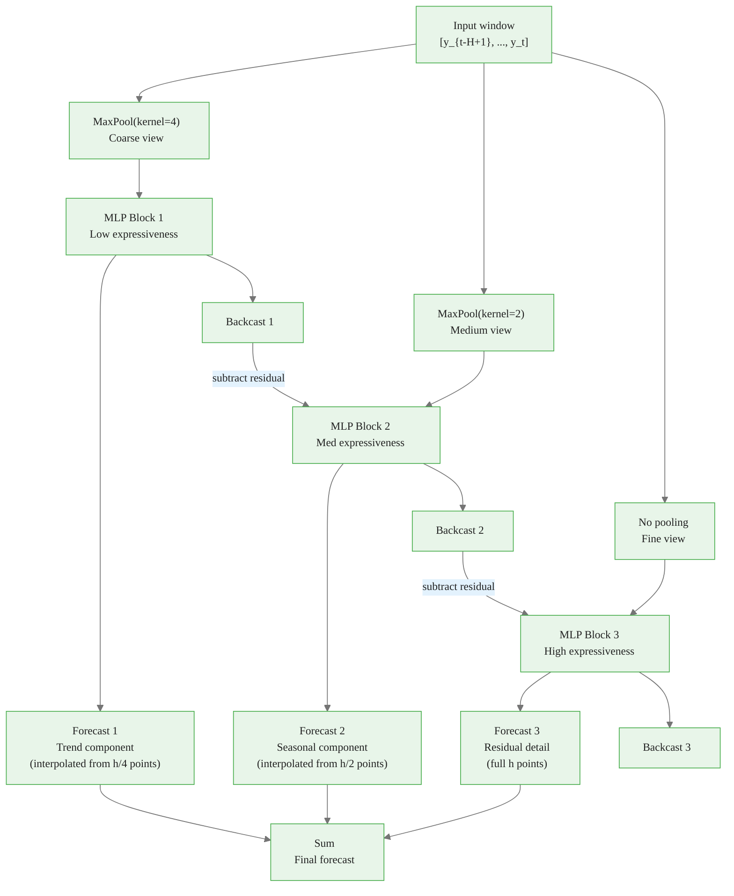
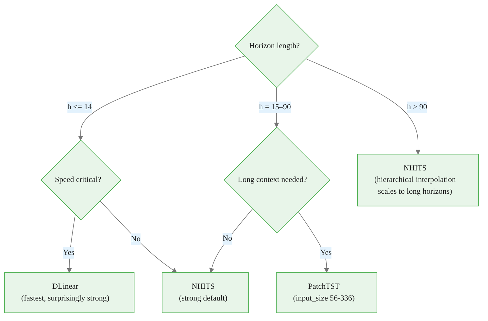

# Neural Forecasting Architectures

> **Reading time:** ~14 min | **Module:** 1 — Point Forecasting | **Prerequisites:** Module 0

## Start Here: Training NHITS in 60 Seconds


<div class="callout-insight">

The following implementation builds on the approach above:
Run this first.
</div>
The following implementation builds on the approach above:



### Why NHITS Is the Default Choice

1. **Accuracy**: +20% average improvement over Transformer-based models on long-horizon benchmarks (Challu et al. 2022).
2. **Speed**: 50x faster than the Informer Transformer.
3. **Parameter efficiency**: ~800K parameters vs 5M+ for PatchTST.
4. **Stability**: The multi-rate decomposition prevents the model from overfitting to spurious high-frequency noise.
5. **Practical**: Works well without extensive tuning. The default architecture handles most time series forecasting problems out of the box.


<div class="flow">
<div class="flow-step mint">1. Accuracy</div>
<div class="flow-arrow">&#8594;</div>
<div class="flow-step amber">2. Speed</div>
<div class="flow-arrow">&#8594;</div>
<div class="flow-step blue">3. Parameter efficiency</div>
<div class="flow-arrow">&#8594;</div>
<div class="flow-step lavender">4. Stability</div>
<div class="flow-arrow">&#8594;</div>
<div class="flow-step rose">5. Practical</div>
</div>


```python
from neuralforecast.models import NHITS

# Full NHITS configuration
model = NHITS(
    h=7,                        # forecast horizon
    input_size=28,              # 4x horizon — good rule of thumb
    stack_types=["identity"] * 3,
    n_blocks=[1, 1, 1],
    mlp_units=[[512, 512]] * 3,
    n_freq_downsample=[4, 2, 1],  # multi-rate pooling ratios
    dropout_prob_theta=0.0,
    learning_rate=1e-3,
    max_steps=1000,
    scaler_type="robust",       # handles outliers in bakery sales
    loss="MAE"                  # appropriate for counts/sales
)
```

---

## PatchTST: When to Use Transformers

PatchTST (Nie et al. 2023) divides the input time series into non-overlapping patches and treats each patch as a token in a Transformer encoder. This reduces the sequence length from `T` to `T/P` (where `P` is patch size), making attention computationally feasible.

<div class="callout-info">

<strong>Info:</strong> 2023) divides the input time series into non-overlapping patches and treats each patch as a token in a Transformer encoder.

</div>


```python
from neuralforecast.models import PatchTST

model = PatchTST(
    h=7,
    input_size=56,  # transformers benefit from longer context
    patch_len=7,    # each patch = one week
    stride=7,
    d_model=64,
    n_heads=4,
    max_steps=1000
)
```

**Use PatchTST when:**
- You have very long input sequences (120+ steps) where NHITS starts to lose signal
- You are working with multiple related series where cross-channel attention helps
- Computation budget allows for slower training

**Stick with NHITS when:**
- Horizon is 7–90 steps
- Fast iteration matters
- You want stable results without careful tuning

---

## Linear Models: The Surprising Baseline

A 2023 paper (Zeng et al.) showed that simple linear models — DLinear and NLinear — outperform many Transformer architectures on standard benchmarks. This sparked significant debate.

```python
from neuralforecast.models import DLinear

model = DLinear(
    h=7,
    input_size=28,
    max_steps=500
)
```

**Lesson**: Always benchmark against a linear model. If your neural model cannot beat DLinear on your dataset, the signal is likely not complex enough to justify the added complexity.

---

## Applying to French Bakery Data

The French Bakery dataset from Kaggle contains daily sales for multiple bakery products (Baguette, Pain au Chocolat, Croissant, etc.) from a French boulangerie over approximately 3 years. It captures:

- **Weekly seasonality**: strong weekend peaks for baguettes
- **Annual seasonality**: summer vacations, holidays
- **Trend**: gradual growth in overall sales
- **Irregularity**: weather effects, local events

This makes it ideal for testing multi-frequency models like NHITS.

```python
import pandas as pd
from neuralforecast import NeuralForecast
from neuralforecast.models import NHITS, NBEATS, DLinear

url = "https://raw.githubusercontent.com/Nixtla/transfer-learning-time-series/main/datasets/french_bakery.csv"
df = pd.read_csv(url, parse_dates=["ds"])

print(df.head())
print(f"\nUnique products: {df['unique_id'].unique()}")
print(f"Date range: {df['ds'].min()} to {df['ds'].max()}")
print(f"Rows: {len(df)}")

# Train multiple models for comparison
models = [
    DLinear(h=7, input_size=28, max_steps=500),
    NBEATS(h=7, input_size=28, max_steps=500),
    NHITS(h=7, input_size=28, max_steps=500, scaler_type="robust"),
]

nf = NeuralForecast(models=models, freq="D")
nf.fit(df)
forecasts = nf.predict()
print(forecasts)
```

---

## Architecture Selection Guide



For the bakery forecasting problem (h=7, daily data, multiple products), **NHITS is the right default**.

---

## Key Takeaways

1. Neural forecasters map a fixed input window directly to a multi-step forecast — no recursive error accumulation.
2. MLP and DLinear are fast baselines; always include them in comparisons.
3. N-BEATS adds interpretable decomposition via basis expansion and residual stacking.
4. NHITS extends N-BEATS with multi-rate pooling and hierarchical interpolation, making it the most accurate and efficient choice for most horizons.
5. PatchTST and other Transformers add cross-channel attention — useful for long sequences or multi-series problems, but at higher compute cost.
6. For French Bakery data (h=7, daily), use NHITS with `input_size=28`, `scaler_type="robust"`.

---

## Next Steps

- **Notebook 01**: Train NHITS on bakery data, evaluate with MAE and MSE
- **Guide 02**: Hyperparameter tuning — input_size, scaler_type, loss functions
- **Notebook 02**: Cross-validation for honest evaluation


## Practice Questions

**Question 1 — Conceptual:** Based on the concepts in this guide, explain in your own words why the core technique matters and when you would choose it over alternatives.

**Question 2 — Application:** Sketch out how you would apply the main concept from this guide to a real-world dataset or problem you have encountered. What would you need to watch out for?


---

## Cross-References

<a class="link-card" href="./01_neural_architectures.md">
  <div class="link-card-title">Companion Slides</div>
  <div class="link-card-description">Interactive slide deck covering the key concepts with visual examples.</div>
</a>

<a class="link-card" href="../notebooks/01_training_nhits.ipynb">
  <div class="link-card-title">Hands-on Notebook</div>
  <div class="link-card-description">15-minute micro-notebook with guided exercises and real data.</div>
</a>
