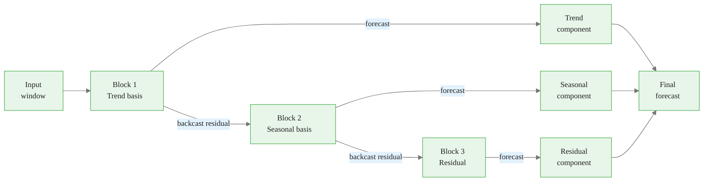
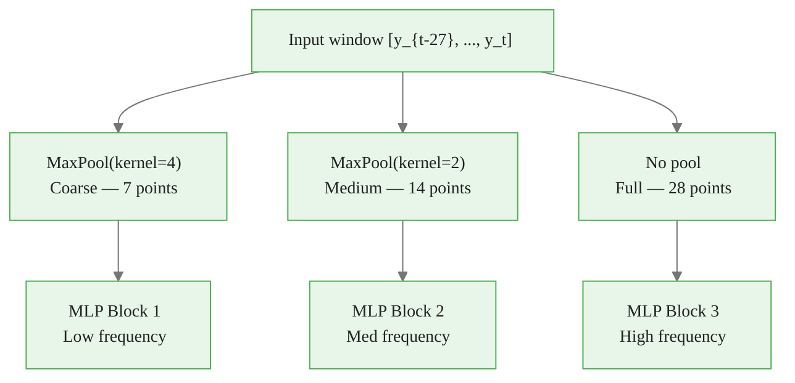
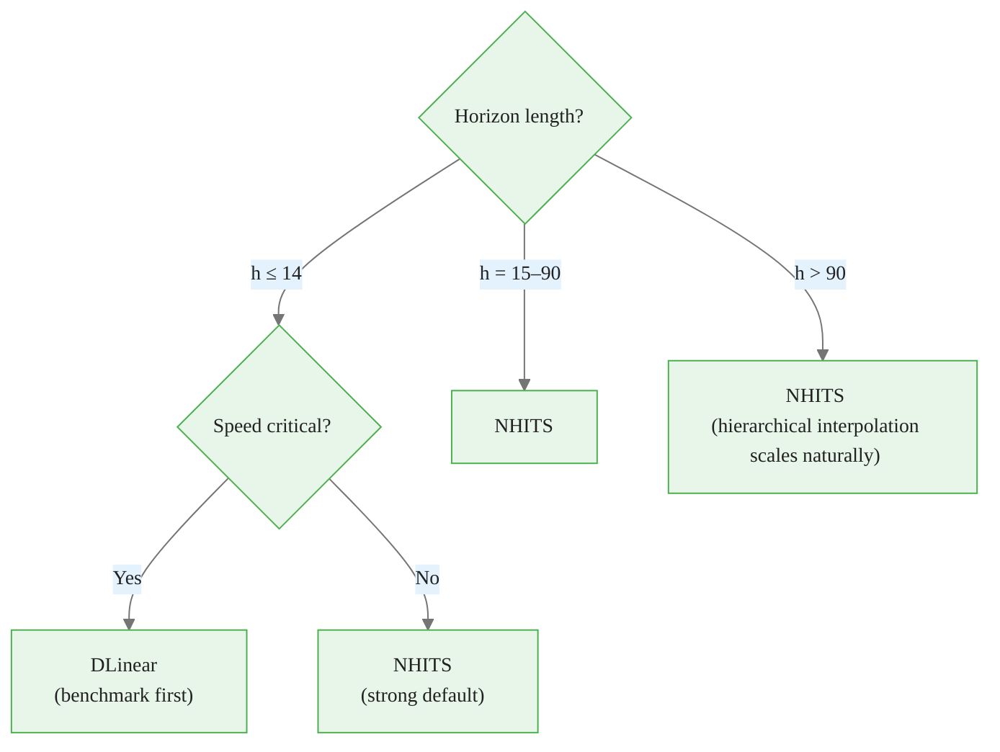

<!-- _class: lead -->

# Neural Forecasting Architectures

## Module 01 — Point Forecasting
### Modern Time Series Forecasting with NeuralForecast

<!-- Speaker notes: This deck covers the five main neural architectures available in NeuralForecast: MLP, N-BEATS, NHITS, PatchTST, and linear models. The key message is that NHITS is the right default for most problems — it achieves 20%+ accuracy improvement over Transformers while being 50x faster, due to multi-rate signal sampling and hierarchical interpolation. -->

---

# The Core Forecasting Paradigm

All neural forecasters solve one mapping:

$$\underbrace{[y_{t-H+1}, \ldots, y_t]}_{\text{input window}} \xrightarrow{\text{model}} \underbrace{[y_{t+1}, \ldots, y_{t+h}]}_{\text{forecast}}$$

<div class="columns">

**Classical methods**
- One step at a time → error compounds
- Each series modeled separately
- Struggle with non-linear interactions

**Neural methods**
- All $h$ steps predicted at once
- One model across all series
- Learns non-linear patterns from data

</div>


<div class="callout-insight">
<strong>Insight:</strong> This is a key takeaway from this section that connects to the broader course themes.
</div>

<!-- Speaker notes: This slide establishes the fundamental difference between classical and neural approaches. The direct multi-step output is key — instead of predicting one step and feeding it back recursively (which compounds errors), neural forecasters output the entire horizon in one forward pass. This is why they excel at long-horizon problems. -->

---

# Architecture Comparison

| Architecture | Family | Params | Speed | Horizon |
|---|---|---|---|---|
| **DLinear** | Linear | ~1K | Fastest | Short |
| **MLP** | Feed-forward | ~10K | Very fast | Short–Medium |
| **N-BEATS** | Residual MLP | ~2M | Fast | Short–Medium |
| **NHITS** | Hierarchical MLP | ~800K | Fast | **All horizons** |
| **PatchTST** | Transformer | ~5M | Moderate | Long |

**Key insight**: More parameters $\neq$ better accuracy. NHITS uses structured inductive biases instead of raw capacity.


<div class="callout-key">
<strong>Key Point:</strong> Remember this concept — it appears repeatedly in later modules.
</div>

<!-- Speaker notes: Walk through each row. Emphasize that NHITS sits in the sweet spot: it achieves Transformer-level accuracy at MLP-level speed. The parameter count is lower than NBEATS because hierarchical interpolation reduces the output dimension that each stack must predict directly. PatchTST should be reserved for long sequences or multi-channel problems. -->

---

# MLP: The Baseline

<div class="code-window">
<div class="code-header">
<div class="dots"><span class="dot-red"></span><span class="dot-yellow"></span><span class="dot-green"></span></div>
<span class="filename">example.py</span>
</div>

```python
from neuralforecast.models import MLP

model = MLP(
    h=7,
    input_size=28,
    num_layers=2,
    hidden_size=256,
    max_steps=500
)
```
</div>

- Flattens input window → dense layers → forecast vector
- No temporal structure assumed
- Must discover trend, seasonality from data alone

**Always benchmark against MLP first.**


<div class="callout-warning">
<strong>Warning:</strong> This is a common source of confusion. Pay close attention to the distinction here.
</div>

<!-- Speaker notes: The MLP treats each time step as an independent feature — there is no architectural prior that values are ordered in time. The model can still learn temporal patterns from data, but it requires more training examples to do so. It is fast and easy to understand, making it a useful baseline before moving to more complex architectures. -->

---

# N-BEATS: Residual Decomposition



Each block explains what previous blocks missed.


<div class="callout-info">
<strong>Info:</strong> This detail is useful context but not required to memorize.
</div>

<!-- Speaker notes: N-BEATS introduced two key innovations. First, doubly residual stacking: each block outputs a backcast (what it explains from the input) and a forecast (its contribution to output). The next block processes what the current block could not explain. Second, interpretable basis: trend stack outputs are constrained to lie in a polynomial basis; seasonality stacks use a Fourier basis. This makes N-BEATS interpretable by construction. -->

---

# NHITS: Multi-Rate Sampling

Each stack sees the input at a different resolution:



Stack 1 learns trend. Stack 2 learns weekly seasonality. Stack 3 learns day-to-day variation.

<!-- Speaker notes: This is the first of NHITS's two key innovations. The MaxPool operation downsamples the input before feeding it to each block's MLP. A large kernel forces the MLP to learn from a coarse, low-frequency view — it cannot overfit to daily noise. A small kernel (or no pool) forces the block to handle fine-grained detail. By design, each stack specializes in a different frequency band. -->

---

# NHITS: Hierarchical Interpolation

Each stack predicts a **coarser grid**, then upsamples:

$$\hat{y}_{t+1:t+h} = \sum_{s=1}^{S} \text{Interp}_s\!\left(\text{MLP}_s\!\left(\text{Pool}_s(x)\right)\right)$$

<div class="columns">

**Without hierarchical interpolation**
- Each stack predicts all $h$ steps
- High-capacity blocks can overfit
- Redundant computation

**With hierarchical interpolation**
- Stack 1 predicts $h/4$ points → interpolate to $h$
- Stack 2 predicts $h/2$ points → interpolate to $h$
- Stack 3 predicts $h$ points directly

</div>

<!-- Speaker notes: The interpolation ratio is the expressiveness ratio r_s. A stack with r=4 predicts h/4 points and interpolates up. This has two effects: first, it reduces computation; second, it enforces a smoothness constraint — interpolated outputs cannot have arbitrarily high-frequency variation, which is appropriate for the trend and seasonal components. -->

---

# Why NHITS Is the Default Choice

| Metric | NHITS vs Transformer |
|---|---|
| Accuracy (long horizon) | **+20% improvement** |
| Training speed | **50x faster** |
| Parameter count | **6x fewer** |
| Tuning sensitivity | **Lower** |

Published: Challu et al., AAAI 2023 — "NHITS: Neural Hierarchical Interpolation for Time Series Forecasting"

**Bottom line**: Start with NHITS. Switch only when you have a specific reason.

<!-- Speaker notes: These numbers are from the original NHITS paper benchmarks against the Informer and other Transformer models on the ETTh1, ETTh2, ETTm1, ETTm2, Exchange, and Weather datasets. The 50x speed advantage comes from both the smaller parameter count and the reduced sequence length from multi-rate pooling. The lower tuning sensitivity is a practical observation — NHITS with default hyperparameters is competitive, while Transformers often require careful tuning of attention heads, positional encodings, and depth. -->

---

# PatchTST: When Transformers Win

```python
from neuralforecast.models import PatchTST

model = PatchTST(
    h=7,
    input_size=56,   # longer context
    patch_len=7,     # each patch = one week
    stride=7,
    d_model=64,
    n_heads=4,
    max_steps=1000
)
```

**Use PatchTST when:**
- Input sequences > 120 time steps
- Multiple correlated channels (cross-series attention)
- Compute budget allows slower training

**Otherwise: use NHITS.**

<!-- Speaker notes: PatchTST divides the input sequence into non-overlapping patches of length patch_len, then applies a Transformer encoder treating each patch as a token. This reduces the attention matrix from T×T to (T/P)×(T/P), making attention feasible. The model shines on datasets where long-range dependencies matter — for example, annual seasonality in daily data where the model needs to attend back 365 steps. For weekly bakery forecasting, NHITS is faster and equally accurate. -->

---

# Linear Models: The Benchmark Baseline

```python
from neuralforecast.models import DLinear

model = DLinear(h=7, input_size=28, max_steps=500)
```

A 2023 paper showed DLinear beats many Transformers on standard benchmarks.

**DLinear = trend decomposition + two linear layers**

**Rule**: If NHITS cannot beat DLinear on your dataset, the signal is too simple for a neural model. Use a statistical method.

<!-- Speaker notes: The DLinear result was a landmark paper by Zeng et al. 2023 titled "Are Transformers Effective for Time Series Forecasting?" It showed that a single linear layer applied to the decomposed time series outperformed Informer, Autoformer, and FEDformer on multiple benchmarks. The lesson is not that linear models are always best — NHITS consistently beats DLinear on the same benchmarks — but that DLinear is a much stronger baseline than it looks, and Transformers are often not worth their added complexity. -->

---

# French Bakery Dataset

<div class="columns">

**Dataset**
- Source: Kaggle (matthieugimbert)
- 3 years of daily sales
- Multiple products: Baguette, Pain au Chocolat, Croissant, ...
- Nixtla long format: `unique_id`, `ds`, `y`

**Why it works for neural forecasting**
- Weekly seasonality (weekend peaks)
- Annual seasonality (holidays, summer)
- Mild trend
- Multiple interacting series

</div>

```python
url = "https://raw.githubusercontent.com/Nixtla/transfer-learning-time-series/main/datasets/french_bakery.csv"
df = pd.read_csv(url, parse_dates=["ds"])
```

<!-- Speaker notes: The French Bakery dataset is publicly available on Kaggle. The Nixtla long format (also called the "tidy" format) requires three columns: unique_id identifies which product each row belongs to, ds is the date, and y is the sales value. This format lets a single NeuralForecast model train on all products simultaneously, learning shared patterns. For bakery products, the shared weekly pattern is strong — every product peaks on weekends — so joint training helps all series. -->

---

# Architecture Selection Guide



**For bakery data (h=7, daily)**: NHITS with `input_size=28`

<!-- Speaker notes: Walk through the decision tree. For the bakery forecasting problem — h=7, daily frequency, multiple products — we land on NHITS. The input_size=28 rule of thumb (4x horizon) gives the model four full weekly cycles to learn from. In the next guide we will explore how changing input_size affects forecast quality, and when a larger value (e.g., 56 or 112) helps. -->

---

# Key Takeaways

1. Neural forecasters output all $h$ steps at once — no recursive error accumulation
2. **DLinear** is the minimum baseline — always include it
3. **N-BEATS** adds interpretable trend/seasonal decomposition
4. **NHITS** specializes stacks by frequency band via multi-rate pooling and hierarchical interpolation
5. **PatchTST** adds Transformer attention — useful for long sequences
6. For bakery data: **NHITS, h=7, input_size=28, scaler_type="robust"**

<!-- Speaker notes: Summarize the five architectures covered. The practical message is that NHITS is the default. Learners should think of it as their go-to choice and only deviate when they have a specific reason: DLinear if the signal is simple, PatchTST if they have very long sequences or multiple correlated channels. Next up: Guide 02 covers hyperparameter tuning, where we will see that input_size and scaler_type have the largest impact on NHITS forecast quality. -->

<div class="flow">
<div class="flow-step mint">DLinear</div>
<div class="flow-arrow">&#8594;</div>
<div class="flow-step amber">N-BEATS</div>
<div class="flow-arrow">&#8594;</div>
<div class="flow-step blue">NHITS</div>
<div class="flow-arrow">&#8594;</div>
<div class="flow-step lavender">PatchTST</div>
</div>

---

<!-- _class: lead -->

# Next: Guide 02
## Hyperparameter Tuning

`input_size` · `scaler_type` · loss functions · cross-validation

<!-- Speaker notes: The next guide focuses on making NHITS work well in practice. The two most impactful choices are input_size (the rule of thumb is 2-4x the horizon, but longer lookbacks help with strong annual seasonality) and scaler_type (robust handles bakery sales outliers better than standard). We will also cover loss functions and the cross_validation method for honest evaluation. -->
