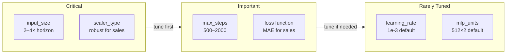

# Hyperparameter Tuning for Neural Forecasters

## Start Here: See the Impact of input_size

```python
import pandas as pd
from neuralforecast import NeuralForecast
from neuralforecast.models import NHITS
from utilsforecast.losses import mae

url = "https://raw.githubusercontent.com/Nixtla/transfer-learning-time-series/main/datasets/french_bakery.csv"
df = pd.read_csv(url, parse_dates=["ds"])

results = {}
for input_size in [7, 14, 28, 56]:
    nf = NeuralForecast(
        models=[NHITS(h=7, input_size=input_size, max_steps=500)],
        freq="D"
    )
    cv = nf.cross_validation(df, n_windows=4)
    score = mae(cv["y"], cv["NHITS"]).mean()
    results[input_size] = score
    print(f"input_size={input_size:3d}  MAE={score:.2f}")
```

Run this first. It shows the most important hyperparameter decision.

---

## The Four Key Hyperparameters

Neural forecasters expose many parameters, but four decisions drive most of the quality difference:

| Parameter | What it controls | Rule of thumb |
|---|---|---|
| `h` | Forecast horizon | Match your use case |
| `input_size` | Historical lookback window | 2–4× horizon |
| `max_steps` | Training iterations | 500–2000 |
| `learning_rate` | Gradient step size | 1e-3 (default is fine) |

The most impactful tuning decision is `input_size`. The others follow.

---

## input_size: The Most Important Choice

`input_size` is the number of historical observations the model sees when making a forecast. Too small: the model lacks context. Too large: the model overfits to irrelevant history or trains slowly.

### Rule of Thumb: 2–4× the Horizon

For `h=7`:
- Minimum: `input_size=14` (2 weeks of history)
- Default: `input_size=28` (4 weeks — 4 full weekly cycles)
- Extended: `input_size=56` or `input_size=112` if annual seasonality is strong

### Why 4× Works

With weekly data and `h=7`, an `input_size=28` gives the model four complete weekly cycles. The NHITS MaxPool layers can extract the weekly pattern at multiple scales. If you are forecasting daily bakery sales and the summer slowdown matters, extend to `input_size=112` or `input_size=365` to give the model access to annual patterns.

```python
# Short horizon — keep lookback tight
model_short = NHITS(h=7, input_size=14, max_steps=500)

# Long horizon — extend lookback proportionally
model_long = NHITS(h=30, input_size=90, max_steps=1000)

# Annual patterns — maximize lookback
model_annual = NHITS(h=7, input_size=365, max_steps=1500)
```

### The Validation Curve

```
input_size=7    MAE=23.4   (underfitting — only 1 week of context)
input_size=14   MAE=19.1   (improving)
input_size=28   MAE=16.8   (good — 4 weekly cycles)
input_size=56   MAE=16.2   (marginal improvement)
input_size=112  MAE=16.5   (slight overfit or irrelevant history)
```

There is typically a sweet spot — the model starts overfitting or spending capacity on irrelevant distant history when `input_size` is too large.

---

## scaler_type: Normalize or Not?

NeuralForecast normalizes input windows before passing them to the model, and denormalizes outputs to the original scale. The `scaler_type` controls how this normalization is computed.

| scaler_type | Formula | Use when |
|---|---|---|
| `"standard"` | $(x - \mu) / \sigma$ | Approximately Gaussian data |
| `"minmax"` | $(x - \min) / (\max - \min)$ | Bounded data, no outliers |
| `"robust"` | $(x - \text{median}) / \text{IQR}$ | Data with outliers (e.g., sales) |
| `"robust-iqr"` | Same but with IQR scaling | Heavier-tailed outliers |
| `None` | No normalization | Pre-normalized data |

### For Bakery Sales: Use "robust"

Sales data has outliers from holidays, promotions, and special events. The `"robust"` scaler uses the median and interquartile range (IQR), which are not affected by outliers:

$$x_{\text{scaled}} = \frac{x - \text{median}(x)}{\text{IQR}(x)}$$

A single Christmas surge does not distort the normalization for the entire series.

```python
# Compare scalers on bakery data
from neuralforecast import NeuralForecast
from neuralforecast.models import NHITS

scalers = ["standard", "minmax", "robust"]
for scaler in scalers:
    nf = NeuralForecast(
        models=[NHITS(h=7, input_size=28, max_steps=500, scaler_type=scaler)],
        freq="D"
    )
    cv = nf.cross_validation(df, n_windows=4)
    score = mae(cv["y"], cv["NHITS"]).mean()
    print(f"scaler={scaler:10s}  MAE={score:.2f}")
```

---

## Loss Functions: What Are You Optimizing?

The loss function determines what the model minimizes during training, which directly determines what "best forecast" means.

### Available Loss Functions

```python
from neuralforecast.losses.pytorch import MAE, MSE, MQLoss, HuberLoss

# Mean Absolute Error — robust to outliers, optimizes median
model_mae = NHITS(h=7, input_size=28, loss=MAE(), max_steps=500)

# Mean Squared Error — sensitive to outliers, optimizes mean
model_mse = NHITS(h=7, input_size=28, loss=MSE(), max_steps=500)

# Multi-Quantile Loss — trains probabilistic forecasts
model_mq = NHITS(h=7, input_size=28, loss=MQLoss(), max_steps=500)

# Huber — MSE near zero, MAE for large errors
model_huber = NHITS(h=7, input_size=28, loss=HuberLoss(delta=1.0), max_steps=500)
```

### Which Loss to Choose

| Use case | Loss | Reason |
|---|---|---|
| Sales forecasting | `MAE()` | Sales have outliers; MAE is robust |
| Financial returns | `MSE()` | Large errors matter disproportionately |
| Energy demand | `MAE()` or `HuberLoss()` | Mix of regular variation and spikes |
| Inventory planning | `MQLoss()` | Need upper/lower bounds, not just point forecast |

**For French Bakery**: `MAE()` is appropriate. Weekly sales have holiday spikes that MSE would overweight.

### MAE vs MSE: Concrete Impact

$$\text{MAE} = \frac{1}{n}\sum_{t=1}^{n} |y_t - \hat{y}_t|$$

$$\text{MSE} = \frac{1}{n}\sum_{t=1}^{n} (y_t - \hat{y}_t)^2$$

MSE squares the error — a single day with error 100 contributes 10,000 to the loss, dominating the gradient. MAE treats that same error proportionally. For bakery sales with occasional holiday anomalies, MSE would train a model that "hedges" toward the outliers.

---

## max_steps and Learning Rate

### max_steps

`max_steps` is the number of gradient descent steps during training. NeuralForecast uses the full dataset (with windowing) at each step.

```python
# Fast experimentation
model_fast = NHITS(h=7, input_size=28, max_steps=200)

# Standard training
model_standard = NHITS(h=7, input_size=28, max_steps=1000)

# Long training for complex series
model_long = NHITS(h=7, input_size=28, max_steps=2000)
```

**Rule**: Start with 500 for exploration. Use 1000–2000 for final models. Monitor validation loss — if it stops improving before `max_steps`, training has converged.

### learning_rate

The default `learning_rate=1e-3` works well for NHITS in most settings. Reduce it if:
- Training loss fluctuates wildly instead of decreasing smoothly
- You are using a very large model (`mlp_units` > 1024)

```python
# Lower lr for larger models or when default lr causes instability
model = NHITS(h=7, input_size=28, max_steps=2000, learning_rate=1e-4)
```

---

## Cross-Validation: Honest Evaluation

A train/test split on a time series is deceptive — the model never saw the "future" during training, but a single test window may be unrepresentative. Rolling window cross-validation gives a better picture.

### How .cross_validation() Works

```
Time series:  [──────────────────────────────────]
                                                  t

Window 1:  train [───────────────] | test [─────]
Window 2:   train [────────────────] | test [─────]
Window 3:    train [─────────────────] | test [─────]
Window 4:     train [──────────────────] | test [─────]
```

The model is trained on each window and evaluated on the held-out test portion. By default, it is trained once and the test windows slide forward (set `refit=True` to retrain on each window).

```python
from neuralforecast import NeuralForecast
from neuralforecast.models import NHITS

nf = NeuralForecast(
    models=[NHITS(h=7, input_size=28, max_steps=1000, scaler_type="robust")],
    freq="D"
)

# n_windows: number of test windows
# step_size: how many steps to advance between windows (default = h)
cv_df = nf.cross_validation(
    df=df,
    n_windows=4,      # evaluate on 4 rolling windows
    step_size=7,      # advance 7 days between windows
)

print(cv_df.columns.tolist())
# ['unique_id', 'ds', 'cutoff', 'y', 'NHITS']
```

### Reading the Cross-Validation Output

```python
# cv_df has one row per (series, date, window)
# 'cutoff' tells you when the training data ended for that window
# 'y' is the actual value; 'NHITS' is the predicted value

from utilsforecast.losses import mae, mse
from utilsforecast.evaluation import evaluate

# Aggregate by window to see stability across time
cv_df["abs_error"] = (cv_df["y"] - cv_df["NHITS"]).abs()

per_window = cv_df.groupby("cutoff").agg(
    mae=("abs_error", "mean")
).reset_index()
print(per_window)
```

### val_size and test_size

When calling `nf.fit()` directly (not `cross_validation`), you can hold out a validation set for early stopping and a test set for final evaluation:

```python
# val_size: number of steps held out for validation (used for early stopping)
# test_size: number of steps held out for final evaluation
nf.fit(df, val_size=14, test_size=7)
```

`val_size` is used internally by some models for learning rate scheduling and early stopping. It does not appear in the output. `test_size` removes the last `test_size` observations from training entirely.

---

## Putting It Together: Tuning Workflow

```python
import pandas as pd
from neuralforecast import NeuralForecast
from neuralforecast.models import NHITS, DLinear
from neuralforecast.losses.pytorch import MAE
from utilsforecast.losses import mae
from utilsforecast.evaluation import evaluate

url = "https://raw.githubusercontent.com/Nixtla/transfer-learning-time-series/main/datasets/french_bakery.csv"
df = pd.read_csv(url, parse_dates=["ds"])

# Step 1: Establish baseline with DLinear
nf_baseline = NeuralForecast(
    models=[DLinear(h=7, input_size=28, max_steps=500)],
    freq="D"
)
cv_base = nf_baseline.cross_validation(df, n_windows=4)
baseline_mae = mae(cv_base["y"], cv_base["DLinear"]).mean()
print(f"Baseline DLinear MAE: {baseline_mae:.2f}")

# Step 2: Try NHITS with different input_size values
for input_size in [14, 28, 56]:
    nf = NeuralForecast(
        models=[NHITS(
            h=7,
            input_size=input_size,
            max_steps=500,
            scaler_type="robust",
            loss=MAE()
        )],
        freq="D"
    )
    cv = nf.cross_validation(df, n_windows=4)
    score = mae(cv["y"], cv["NHITS"]).mean()
    improvement = (baseline_mae - score) / baseline_mae * 100
    print(f"NHITS input_size={input_size}  MAE={score:.2f}  ({improvement:+.1f}% vs baseline)")

# Step 3: Train final model with best config
nf_final = NeuralForecast(
    models=[NHITS(
        h=7,
        input_size=28,
        max_steps=1000,
        scaler_type="robust",
        loss=MAE()
    )],
    freq="D"
)
nf_final.fit(df)
forecast = nf_final.predict()
print(forecast)
```

---

## Hyperparameter Summary



---

## Key Takeaways

1. `input_size` is the most impactful hyperparameter. Start at 2× horizon; try 4× and 8×.
2. `scaler_type="robust"` is the right default for sales data with outliers.
3. `MAE()` loss is appropriate when data has spikes; `MSE()` when large errors matter disproportionately.
4. `max_steps=500` for quick exploration; 1000–2000 for final training.
5. Always use `cross_validation()` for model comparison — a single train/test split is not reliable.
6. Benchmark against `DLinear` first. Beat that, then worry about NHITS tuning.

---

## Next Steps

- **Notebook 01**: Train NHITS on bakery data, evaluate with MAE and MSE
- **Notebook 02**: Cross-validation — compare NHITS vs DLinear, visualize error distributions
- **Guide (Module 02)**: Probabilistic forecasting with MQLoss and conformal prediction
